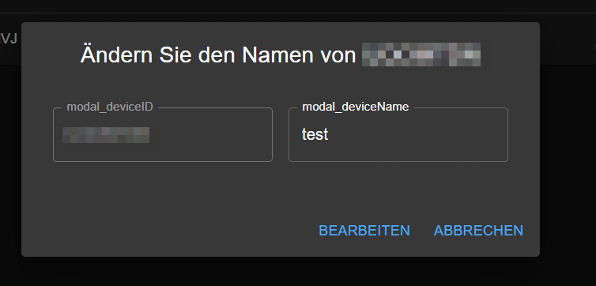

# ioBroker.tractive-gps

 

**Version:**

**Tests:**

## tractive-gps adapter for ioBroker

### DISCLAIMER

All product and company names or logos are Trademarks™ or Registered® Trademarks of their respective owners.
Their use does not imply any Affiliation or endorsement by them or associated affiliates!
This personal project is being pursued on a recreational basis and has no business objectives.
**[Tractive](https://tractive.com/de/)** is a trademark of **Tractive GmbH**.

### Sentry
**This adapter uses Sentry libraries to automatically report exceptions and code errors to the developers.**
For more details and for information on how to disable error reporting, see.
[Sentry Plugin Documentation](https://github.com/ioBroker/plugin-sentry#plugin-sentry)! Sentry reports are used starting with js-controller 3.0
are used.

### Credits
This adapter would not have been possible without the great work of @xXBJXx (https://github.com/xXBJXx), who created this adapter.

### Description
This adapter allows you to connect to the Tractive GPS service and retrieve the location of your pets.
The adapter creates a device for each pet and a status for each location.
The adapter also creates a status for the tracker's battery level and many other statuses provided by the API.

### Prerequisites
To use this adapter, you must have a Tractive account and have a tracker for your pet (see
[Tractive](https://tractive.com/de/)) (**Caution:** Monthly / Annual fee for using the Tractive service)

### Installation
The adapter is installed via the ioBroker adapter manager.
After installation, you have to log in with your Tractive account and set the polling interval.
The adapter will then fetch a token from the Tractive API and store it in the configuration.
This token has an expiration time which will be renewed automatically when it expires.

### Configuration
In the adapter configuration, there are two setting options:
* **Login**.
  1. here you can log in with your Tractive account.
  2. set the polling interval.
  3. manually reissue the token.

  

* **All devices** - A list of all devices found by the adapter is displayed here. You can change the name of the device in the list.
  this will then also be displayed in the objects.
  
  to change the name, click on the pencil icon and enter the new name.
  

### Tab
In the Tab, all found devices are displayed with a map and some information about the device.

The image can also be replaced with the animal's own image.
To do this, a PNG file with the name of the tracker (e.g., ZSDLINVD.png) must be placed in the folder **iobroker-data/files/tractive-gps**.
Or you can use the tab **files** to upload the file. (see image below)
**The recommended size for the image is 1920x1080 pixels.**

## Changelog
<!--
    Placeholder for the next version (at the beginning of the line):
    ### **WORK IN PROGRESS**
-->
### 2.1.0 (2024-11-12)
* (mcm1957) Adapter requires node 20 now.
* (mcm1957) Adapter requires js-controller 5.0.19 and admin 6.17.14 now.
* (simatec) Adapter changed to meet Responsive Design rules.
* (mcm1957) An error at jsonConfig invalidating reauthorization command has been corrected.
* (mcm1957) Dependencies have been updated.

### 2.0.1 (2024-08-20)
* (bluefox) Fixing encryption of the access token

### 2.0.0 (2024-08-18)
* (bluefox) BREAKING CHANGE: You must enter your credentials again
* (bluefox) Old code has been removed and GUI has been rewritten
* (bluefox) Dependencies have been updated

### 1.2.0 (2024-04-28)
* (mcm1957) Adapter requires node.js >= 18 and js-controller >= 5 now
* (mcm1957) Dependencies have been updated

### 1.1.0 (2023-11-05)
* (Scrounger) Bugfix: objects will be created only if necessary
* (Scrounger) Bugfix for excessive number of warnings has been added
* (Scrounger) Distance calculation between ioBroker and tracker has been added

## License
MIT License

Copyright (c) 2023-2024 ioBroker Community Developers <iobroker-community-adapters@gmx.de>  
Copyright (c) 2023 xXBJXx <issi.dev.iobroker@gmail.com>

Permission is hereby granted, free of charge, to any person obtaining a copy
of this software and associated documentation files (the "Software"), to deal
in the Software without restriction, including without limitation the rights
to use, copy, modify, merge, publish, distribute, sublicense, and/or sell
copies of the Software, and to permit persons to whom the Software is
furnished to do so, subject to the following conditions:

The above copyright notice and this permission notice shall be included in all
copies or substantial portions of the Software.

THE SOFTWARE IS PROVIDED "AS IS", WITHOUT WARRANTY OF ANY KIND, EXPRESS OR
IMPLIED, INCLUDING BUT NOT LIMITED TO THE WARRANTIES OF MERCHANTABILITY,
FITNESS FOR A PARTICULAR PURPOSE AND NONINFRINGEMENT. IN NO EVENT SHALL THE
AUTHORS OR COPYRIGHT HOLDERS BE LIABLE FOR ANY CLAIM, DAMAGES OR OTHER
LIABILITY, WHETHER IN AN ACTION OF CONTRACT, TORT OR OTHERWISE, ARISING FROM,
OUT OF OR IN CONNECTION WITH THE SOFTWARE OR THE USE OR OTHER DEALINGS IN THE
SOFTWARE.
