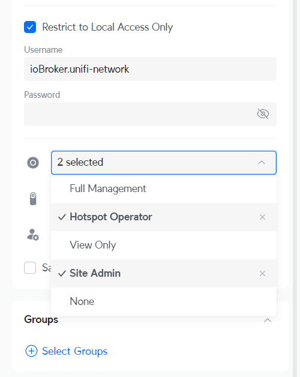

# ioBroker.unifi-network

**Tests:** 

## unifi-network adapter for ioBroker

Unifi Network uses the websocket interface to receive real-time information from the unifi-network application

## Important

1. The adapter is developed exclusively on the basis of the UniFi OS. Compatibility with a self-hosted network controller should be given, but cannot be guaranteed.

2. **This adapter can be very resource intensive!** This depends on your environment, i.e. how many unifi-devices and clients are in your network. This can be influenced somewhat via the realtime api `debounce time [s]` parameter in the adapter settings. Real-time events are not affected by this setting, only the "cyclical" real time update of devices, clients, etc.

3. **Not all states are directly available after the adapter has started** States are only created and updated when the data is sent by the network controller, this can take some time until the data is sent for the first time

## Configuration

### Local user (UniFi OS)

You will need a local user created in your UniFi OS Console to log in with. Ubiquiti SSO Cloud Users will not work. It is recommended you use the Administrator or a user with full read/write access to get the most out of the integration, but it is not required.

1. Login to your Local Portal on your UniFi OS device, and click on Users.\
   **Note**: This **must** be done from the UniFi OS by accessing it directly by IP address (e.g. 192.168.1.1), not via unifi.ui.com or within the UniFi Network app.

2. Go to **Admins & Users** from the left hand side menu and select the Admins tab or go to [IP address]/admins/ (e.g. 192.168.1.1/admins/).

3. Click on **+** in the top right corner and select **Add Admin**.

4. Select **Restrict to local access only** and enter a new username and password.

5. Select **Hotspot Operator** and **Site Admin** for the Network role.\
   **Note** This is not absolutely necessary, if the permissions are not sufficient, you will be informed via log message

## Changelog

<!--
	Placeholder for the next version (at the beginning of the line):
	### **WORK IN PROGRESS**
-->
### 1.2.2 (2025-11-14)

- (Scrounger) delete device event added
- (Scrounger) event messages improved #43

### 1.2.1 (2025-11-10)

- (Scrounger) 6 GHz interpreter bug fix #37
- (Scrounger) isOnline state icon bug fix
- (Scrounger) bug fixes

### 1.2.0 (2025-11-04)

- (Scrounger) option to set offline debounce time for single client added
- (Scrounger) dependencies updated

### 1.1.9 (2025-11-03)

- (Scrounger) client and devices IPv6 states added
- (Scrounger) start realtime api listener after adapter initialization finished
- (Scrounger) isOnline fallback method bug fix
- (Scrounger) states lastChange and timestamp bug fix
- (Scrounger) websocket ping pong bug fix
- (Scrounger) vpn client isOnline bug fix
- (Scrounger) dispatcher bug fix

### 1.1.8 (2025-10-26)

- (Scrounger) stp info's added #35
- (Scrounger) dependencies updated

### 1.1.7 (2025-10-19)

- (Scrounger) event 'UpgradeScheduled' added to ignore list
- (DEV2DEV-DE) german translation updated

### 1.1.6 (2025-10-08)

- (Scrounger) dependencies updated #22
- (Scrounger) firewall channel added #29
- (Scrounger) bug fix #28

### 1.1.5 (2025-10-06)

- (Scrounger) check site exist on self hosted controller
- (Scrounger) login bug fixes #27

### 1.1.4 (2025-10-06)

- (Scrounger) logging improved
- (Scrounger) auto detect UniFi OS or self hosted controller
- (Scrounger) auto translation bug fix
- (Scrounger) image downloading improved
- (Scrounger) bug fixes

### 1.1.3 (2025-10-03)

- (Scrounger) login bug fix for self hosted controllers v9.x.x

### 1.1.2 (2025-10-02)

- (Scrounger) login bug fix for self hosted controllers
- (Scrounger) dependencies updated
- (Scrounger) bug fixes

### 1.1.1 (2025-09-30)

- (Scrounger) bug fixes
- (Scrounger) roles added
- (Scrounger) reponsiv adapter config implemented

### 1.1.0 (2025-09-21)

- (Scrounger) dependencies updated
- (Scrounger) check adapter settings for timeout and interval implemented
- (Scrounger) translation optimized
- (Scrounger) bug fixes

### 1.1.0-beta.0 (2025-09-03)

- (Scrounger) replaced fetch with undici
- (Scrounger) firewall group added
- (Scrounger) more network events handler added
- (Scrounger) bug fixes

### 1.0.0-beta.0 (2025-04-25)

- (Scrounger) initial release

## License

MIT License

Copyright (c) 2025 Scrounger <scrounger@gmx.net>

Permission is hereby granted, free of charge, to any person obtaining a copy
of this software and associated documentation files (the "Software"), to deal
in the Software without restriction, including without limitation the rights
to use, copy, modify, merge, publish, distribute, sublicense, and/or sell
copies of the Software, and to permit persons to whom the Software is
furnished to do so, subject to the following conditions:

The above copyright notice and this permission notice shall be included in all
copies or substantial portions of the Software.

THE SOFTWARE IS PROVIDED "AS IS", WITHOUT WARRANTY OF ANY KIND, EXPRESS OR
IMPLIED, INCLUDING BUT NOT LIMITED TO THE WARRANTIES OF MERCHANTABILITY,
FITNESS FOR A PARTICULAR PURPOSE AND NONINFRINGEMENT. IN NO EVENT SHALL THE
AUTHORS OR COPYRIGHT HOLDERS BE LIABLE FOR ANY CLAIM, DAMAGES OR OTHER
LIABILITY, WHETHER IN AN ACTION OF CONTRACT, TORT OR OTHERWISE, ARISING FROM,
OUT OF OR IN CONNECTION WITH THE SOFTWARE OR THE USE OR OTHER DEALINGS IN THE
SOFTWARE.
