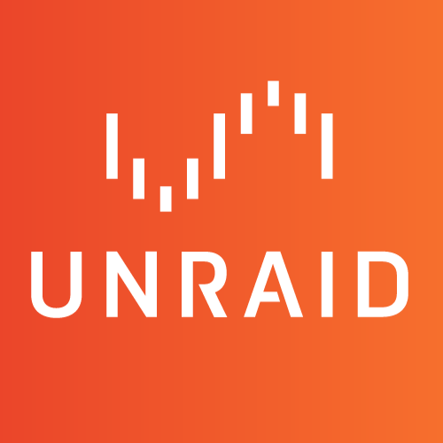
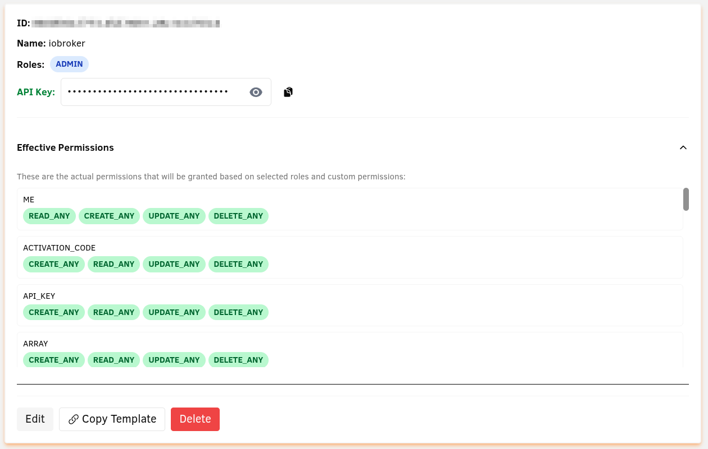
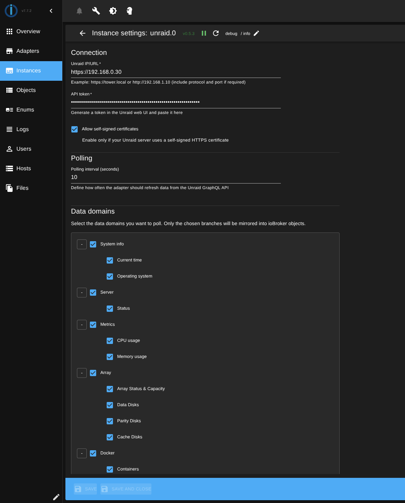
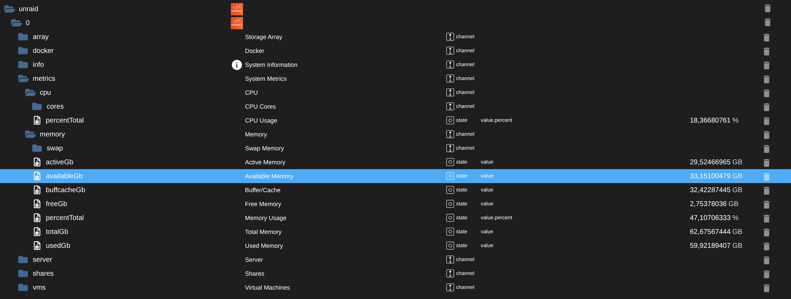
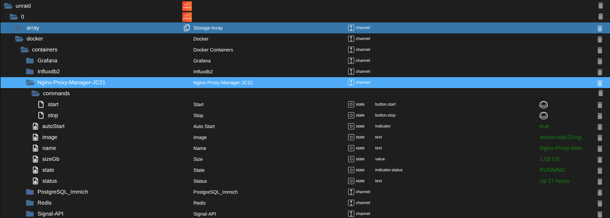
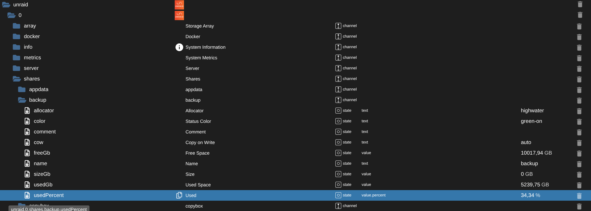

# ioBroker.unraid

> **⚠️ Work in Progress**: This adapter is under active development. Additional data points and features are planned for future releases.

**Tests:** 

## unraid adapter for ioBroker

This adapter connects ioBroker to Unraid servers via the GraphQL API to monitor system metrics and status.

## Features

- Monitor CPU and memory usage (including per-core statistics)
- Track server status and network information
- Monitor and control Docker containers (start/stop)
- View array disks (data, parity, cache) with health information
- Monitor network shares (usage, configuration, file system details)
- Monitor and control virtual machines (start/stop/pause/resume/reboot)
- Configurable polling interval

## Configuration

### Generating an API Token in Unraid

#### For Unraid versions before 7.2:

1. Install the **"Unraid Connect Plugin"** from the Unraid Community Applications store
2. After installation, navigate to: **Settings → Management Access → API Keys**

#### For Unraid 7.2 and later:

- API functionality is built-in, go directly to: **Settings → Management Access → API Keys**

#### Creating the Token:

1. Click on **"Add API Key"**
2. **Important**: Select **"Admin"** as the access level (Roles: ADMIN)
    - Currently only Admin tokens work properly (see [this forum post](https://forums.unraid.net/topic/193661-api-access-always-403-forbidden/))
3. Give the token a descriptive name (e.g., "ioBroker")
4. Copy the generated token (API Key) - you'll need it for the adapter configuration

### Adapter Settings

1. **Base URL**: Enter your Unraid server address (e.g., `https://192.168.1.10` or `https://tower.local`)
2. **API Token**: Paste the Admin token you generated in Unraid
3. **Polling Interval**: Set how often to fetch data (default: 60 seconds, minimum: 10 seconds)
4. **Self-signed Certificates**: Enable if your Unraid server uses a self-signed HTTPS certificate
5. **Data Domains**: Select which data categories to monitor (System Info, Server Status, Metrics, etc.)

### Configuration Interface

### Created Objects

The adapter creates a structured tree of objects for the monitored data:

 

 

## Requirements

- Unraid server (version 7.0.0+ recommended)
    - For versions before 7.2: Install "Unraid Connect Plugin" from Community Applications
    - For version 7.2+: API support is built-in
- Admin-level API token generated in Unraid web UI
- Network access from ioBroker to Unraid server

## Changelog

<!--
  Placeholder for the next version (at the beginning of the line):
  ### **WORK IN PROGRESS**
-->
### 0.6.2 (2025-10-19)

- (ingel81) dependencies updated

### 0.6.2-alpha.1 (2025-10-19)

- (ingel81) npm deployment adjusted pt.2

### 0.6.2-alpha.0 (2025-10-19)

- (ingel81) npm deployment adjusted

### 0.6.1 (2025-09-28)

- (ingel81) fix: Use themecolors in settings

### 0.6.0 (2025-09-24)

- (ingel81) Added VM and Docker container control functionality
- (ingel81) Code refactoring and cleanup
- (ingel81) Translation

### 0.5.3 (2025-09-23)

- (ingel81) Support for node 20, 22 and 24

### 0.5.2 (2025-09-22)

- (ingel81) Documentation
- (ingel81) Minor admin page improvements

### 0.5.1 (2025-09-22)

- (ingel81) ESLint9 Migration
- (ingel81) Code refactor

### 0.5.0 (2025-09-21)

- (ingel81) More Unraid queries: Docker containers, shares, VMs, array disks with dynamic state creation,
- (ingel81) Apollo Client migration

### 0.4.1 (2025-09-21)

- (ingel81) Documentation

### 0.4.0 (2025-09-21)

- (ingel81) Adapter renamed to iobroker.unraid

### 0.3.0 (2025-09-21)

- (ingel81) Translations
- (ingel81) Logo
- (ingel81) Readme

### 0.2.2 (2025-09-21)

- (ingel81) Release testing with npm, reloaded2

## License

MIT License

Copyright (c) 2025 ingel81 <ingel81@sgeht.net>

Permission is hereby granted, free of charge, to any person obtaining a copy
of this software and associated documentation files (the "Software"), to deal
in the Software without restriction, including without limitation the rights
to use, copy, modify, merge, publish, distribute, sublicense, and/or sell
copies of the Software, and to permit persons to whom the Software is
furnished to do so, subject to the following conditions:

The above copyright notice and this permission notice shall be included in all
copies or substantial portions of the Software.

THE SOFTWARE IS PROVIDED "AS IS", WITHOUT WARRANTY OF ANY KIND, EXPRESS OR
IMPLIED, INCLUDING BUT NOT LIMITED TO THE WARRANTIES OF MERCHANTABILITY,
FITNESS FOR A PARTICULAR PURPOSE AND NONINFRINGEMENT. IN NO EVENT SHALL THE
AUTHORS OR COPYRIGHT HOLDERS BE LIABLE FOR ANY CLAIM, DAMAGES OR OTHER
LIABILITY, WHETHER IN AN ACTION OF CONTRACT, TORT OR OTHERWISE, ARISING FROM,
OUT OF OR IN CONNECTION WITH THE SOFTWARE OR THE USE OR OTHER DEALINGS IN THE
SOFTWARE.
