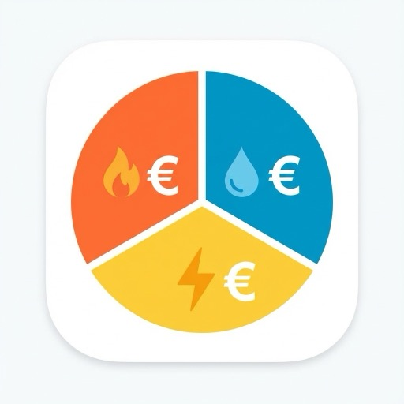

# ioBroker.utility-monitor

> 🇩🇪 **Deutsche Fassung:** [README_de.md](README_de.md)

[](https://www.npmjs.com/package/iobroker.utility-monitor)
[](https://github.com/fischi87/ioBroker.utility-monitor/releases)
[](https://github.com/fischi87/ioBroker.utility-monitor/blob/main/LICENSE)
[](https://github.com/fischi87/ioBroker.utility-monitor/actions)

## Utility Monitor Adapter for ioBroker

Monitor gas, water, and electricity consumption with automatic cost calculation, advance payment monitoring, and detailed statistics.

### ✨ Main features

- 📊 **Consumption monitoring** for gas, water, electricity and **PV/feed-in**
- 🎯 **Multi-meter support** - several meters per type (e.g. main meter + workshop)
- 💰 **Automatic cost calculation** with unit price and base fee
- ☀️ **PV & feed-in** - monitor your feed-in and its compensation
- 💳 **Advance payment monitoring** - see immediately whether an additional payment or a credit is coming
- 🔄 **Flexible sensors** - works with the sensors you already have (Shelly, Tasmota, Homematic, etc.)
- ⚡ **Peak/off-peak tariffs** - full support for day/night tariffs
- 🔄 **Gas specials** - automatic conversion from m³ to kWh
- 🕛 **Automatic resets** - daily, weekly, monthly and yearly (contract anniversary)
- 🔔 **Smart notifications** - separate reminders for the end of the billing period (meter reading) and for a contract change (tariff check), each with its own lead time
- 📈 **Weekly evaluation** - track your consumption on a weekly basis as well
- 📥 **CSV import** - import historical meter readings by drag and drop
- ⌨️ **Comma support** - the admin UI accepts `12,50` as well as `12.50` for decimals

---

## 💝 Support

Do you like this adapter? Feel free to buy me a coffee! ☕

[](https://paypal.me/bigplay87)

---

## 🚀 Quick start

### 1. Installation

1. Install the adapter through the ioBroker admin interface
2. Create an instance
3. Open the configuration

### 2. Basic configuration (example: gas)

1. ✅ **Enable gas monitoring**
2. 🔍 **Select the sensor** - your gas meter sensor (in m³)
3. 📝 **Meter reading at contract start** - e.g. 10250 m³ (needed for a correct yearly calculation)
4. 📅 **Contract start** - e.g. 01.01.2026 (needed for the yearly reset and the advance payment calculation)
5. 🔧 **Offset** _(optional)_ - in case your hardware meter does not start at 0
6. 🔥 **Calorific value & Z number** - taken from your gas bill (e.g. 11.5 and 0.95)
7. 💶 **Enter the prices**:
    - Unit price: 0.1835 €/kWh
    - Base fee: 15.03 €/month
    - Annual fee: 60.00 €/year (e.g. meter rent)
8. 💳 **Advance payment** - monthly prepayment (e.g. 150 €)

**Done!** The adapter now calculates all costs automatically. 🎉

---

## ⚠️ Breaking changes in version 1.4.6

**IMPORTANT:** Version 1.4.6 fundamentally changes the state structure.

### What has changed?

**Before (up to 1.4.5):**

```
gas.consumption.daily
gas.costs.monthly
wasser.consumption.daily
```

**Now (since 1.4.6):**

```
gas.main.consumption.daily          ← main meter named "main"
gas.main.costs.monthly
wasser.main.consumption.daily
```

### 🔧 Migration required

1. **Open the configuration**: new fields "Name of the main meter" for gas/water/electricity/PV
2. **Enter a name**: the default is "main" (recommended), or your own name such as "flat" or "house"
3. **Adjust scripts**: every reference to a state has to be updated

    ```javascript
    // Old:
    getState('utility-monitor.0.gas.consumption.daily');

    // New:
    getState('utility-monitor.0.gas.main.consumption.daily');
    ```

4. **Update visualisations**: adjust VIS, Grafana, etc. to the new paths

### 💡 Why this change?

- **Consistency**: all meters (main + additional) now use the same structure
- **Flexibility**: the main meter can be named freely (e.g. "groundfloor", "total")
- **Clarity**: no more special-case logic in the code
- **Multi-meter**: better support for several meters per type
- **CSV import**: easy way to add historical data by drag and drop in the admin interface
- **Structured statistics (v1.6.0)**: clear separation of consumption, costs and timestamps

---

## ⚠️ Breaking changes in version 1.6.0

**IMPORTANT:** Version 1.6.0 restructures the statistics object.

### What has changed?

**Before (up to 1.5.1):**

```
gas.main.statistics.lastDay
gas.main.statistics.lastMonth
gas.main.statistics.lastDayStart
```

**Now (since 1.6.0):**

```
gas.main.statistics.consumption.lastDay      ← consumption values
gas.main.statistics.cost.lastDay             ← cost values (NEW!)
gas.main.statistics.timestamps.lastDayStart   ← timestamps of the resets
```

### 🔧 Migration required

1. **Adjust scripts/VIS**: if you access statistics states directly, the paths have to be updated.
2. **Cost statistics**: you now benefit from historical cost overviews (day/week/month).

---

## 📥 CSV import

The import tab lets you upload historical meter readings comfortably.

### Supported formats

- **Generic CSV**: date (DD.MM.YYYY), meter reading
- **EhB+ app**: direct import from the EhB+ app

### How it works

1. Go to the **Import** tab
2. Select the **meter type** (gas/water/electricity) and the **meter**
3. Drag your CSV file into the upload area
4. Click **Import data**

---

## 📊 States explained

For every enabled utility type (gas/water/electricity/PV) the following folders are created:

**Important:** Since version 1.4.6 all paths contain the meter name (e.g. `gas.main.*` instead of `gas.*`).

### 🗂️ **consumption**

| State           | Description                                        | Example          |
| --------------- | -------------------------------------------------- | ---------------- |
| `daily`         | Consumption **today** (since 00:00)                | 12.02 kWh        |
| `dailyVolume`   | Consumption today in m³                            | 1.092 m³         |
| `weekly`        | Consumption **this week** (since Monday)           | 84.12 kWh        |
| `weeklyVolume`  | Weekly consumption in m³                           | 7.65 m³          |
| `monthly`       | Consumption **this month** (since the 1st)         | 117.77 kWh       |
| `monthlyVolume` | Monthly consumption in m³                          | 10.69 m³         |
| `yearly`        | Consumption **since contract start** (billing year)| 730.01 kWh       |
| `yearlyVolume`  | Yearly consumption in m³                           | 66.82 m³         |
| `dailyHT`       | Daily consumption at the **peak tariff** (HT)      | 8.40 kWh         |
| `dailyNT`       | Daily consumption at the **off-peak tariff** (NT)  | 3.62 kWh         |
| `weeklyHT`      | Weekly consumption at the peak tariff              | 58.15 kWh        |
| `weeklyNT`      | Weekly consumption at the off-peak tariff          | 25.62 kWh        |
| `monthlyHT`     | Monthly consumption at the peak tariff             | 82.15 kWh        |
| `monthlyNT`     | Monthly consumption at the off-peak tariff         | 35.62 kWh        |
| `yearlyHT`      | Yearly consumption at the peak tariff              | 511.00 kWh       |
| `yearlyNT`      | Yearly consumption at the off-peak tariff          | 219.01 kWh       |
| `lastUpdate`    | Last update                                        | 06.01.2026 14:11 |

**💡 Tip:** `yearly` is calculated automatically as `(current meter reading - offset) - initial reading`.

**📅 Important:** The yearly reset happens on the **contract start date** (e.g. 12 May), NOT on 1 January.

---

### 💰 **costs**

| State         | What is it?                                                     | Calculation                           | Example                            |
| ------------- | --------------------------------------------------------------- | ------------------------------------- | ---------------------------------- |
| `daily`       | Costs **today**                                                 | daily × unit price                    | 2.27 €                             |
| `monthly`     | Costs **this month**                                            | monthly × unit price                  | 21.61 €                            |
| `yearly`      | **Consumption costs** since contract start                      | yearly × unit price                   | 137.61 €                           |
| `totalYearly` | **Total costs of the year** (consumption + all fixed costs)     | yearly-cost + basicCharge + annualFee | 212.64 €                           |
| `basicCharge` | **Accumulated base fee**                                        | base fee × months                     | 15.03 €                            |
| `annualFee`   | **Annual fee** (fixed value per year)                           | annual fee (from the configuration)   | 60.00 €                            |
| `paidTotal`   | **Paid** through the advance payment                            | advance payment × months              | 150.00 €                           |
| `balance`     | **🎯 THE key value!**<br>Additional payment (+) or credit (-)   | totalYearly - paidTotal               | **+62.64 €**<br>→ additional payment |

#### 🔍 **balance** in detail

- **Positive (+50 €)** → ❌ **Additional payment**: you will have to pay at the end of the year
- **Negative (-24 €)** → ✅ **Credit**: you will get money back
- **Zero (0 €)** → ⚖️ **Balanced**: consumption = advance payment

**Example:**

```
Consumption costs:  137.61 € (yearly)
Base fee:          + 15.03 € (basicCharge - 1 month × 15.03 €)
Annual fee:        + 60.00 € (annualFee - fixed value)
────────────────────────────
Total costs:        212.64 € (totalYearly)

Paid (advance):     150.00 € (paidTotal - 1 month × 150 €)
────────────────────────────
Balance:            +62.64 € → additional payment
```

---

### ℹ️ **info**

| State                | Description                     | Example          |
| -------------------- | ------------------------------- | ---------------- |
| `currentPrice`       | Current unit price              | 0.1885 €/kWh     |
| `meterReading`       | Meter reading in kWh            | 112711.26 kWh    |
| `meterReadingVolume` | Meter reading in m³ (gas only)  | 10305.03 m³      |
| `monthlyInstallment` | Configured monthly advance payment | 150 €         |
| `lastSync`           | Last sensor update              | 06.01.2026 14:11 |
| `sensorActive`       | Sensor connected?               | ✅ true          |

---

### 📈 **statistics**

Since version 1.6.1 the statistics are split into three sub-channels.

#### 📊 **consumption** (consumption history)

| State            | Description                     |
| ---------------- | ------------------------------- |
| `lastDay`        | Consumption **yesterday**       |
| `lastWeek`       | Consumption **last week**       |
| `lastMonth`      | Consumption **last month**      |
| `lastYear`       | Consumption **last year**       |
| `averageDaily`   | Average daily consumption       |
| `averageMonthly` | Average monthly consumption     |

#### 💰 **cost** (cost history)

| State            | Description             |
| ---------------- | ----------------------- |
| `lastDay`        | Costs **yesterday**     |
| `lastWeek`       | Costs **last week**     |
| `lastMonth`      | Costs **last month**    |
| `lastYear`       | Costs **last year**     |
| `averageDaily`   | Average daily costs     |
| `averageMonthly` | Average monthly costs   |

#### 📅 **timestamps** (reset timestamps)

| State            | Description                                |
| ---------------- | ------------------------------------------ |
| `lastDayStart`   | Last daily reset (23:59)                   |
| `lastWeekStart`  | Last weekly reset (Sunday 23:59)           |
| `lastMonthStart` | Last monthly reset (last day of the month) |
| `lastYearStart`  | Contract start / start of the year         |

---

### 📅 **billing**

| State               | Description                                    | Example     |
| ------------------- | ---------------------------------------------- | ----------- |
| `endReading`        | Final meter reading (enter manually)           | 10316.82 m³ |
| `closePeriod`       | Close the period now (button)                  | true/false  |
| `periodEnd`         | The billing period ends on                     | 01.01.2027  |
| `daysRemaining`     | Days until the end of the billing period       | 359 days    |
| `newInitialReading` | New start value (copy it into the config!)     | 10316.82 m³ |

**💡 Workflow at the end of the year:**

1. Read the physical meter (e.g. 10316.82 m³)
2. Enter the value in `endReading`
3. Set `closePeriod` to `true`
4. ✅ The adapter archives all data automatically under `history.{YEAR}.*`
5. ⚠️ **Important:** update the configuration with the new `initialReading` (see `newInitialReading`)

---

### 📊 **history** (yearly history)

| State                       | Description                                | Example    |
| --------------------------- | ------------------------------------------ | ---------- |
| `history.2024.yearly`       | Yearly consumption 2024                    | 730.01 kWh |
| `history.2024.yearlyVolume` | Yearly consumption 2024 in m³ (gas/water)  | 66.82 m³   |
| `history.2024.totalYearly`  | Total costs 2024                           | 162.64 €   |
| `history.2024.balance`      | Balance 2024 (additional payment/credit)   | +12.64 €   |

**💡 Automatic archiving:**

- Created when the billing period is closed
- Stores all relevant yearly totals including peak/off-peak
- Makes year-over-year comparisons possible

---

### 🔧 **adjustment** (manual correction)

Correct sensor drift with a manual adjustment.

| State      | Description                                  | Example   |
| ---------- | -------------------------------------------- | --------- |
| `value`    | Correction value (difference to the meter)    | +4.2 m³   |
| `note`     | Note/reason for the adjustment (optional)     | "Outage"  |
| `applied`  | Timestamp of the last application             | 17035...  |

**💡 Workflow:**

1. Read the physical meter: **10350 m³**
2. The adapter shows: **10346 m³**
3. Enter the difference in `adjustment.value`: **+4**
4. ✅ All calculations are corrected automatically.
5. **Thanks to the peak/off-peak integration** adjustments are booked to the peak tariff (HT) automatically when dual tariffs are in use.

---

## ⚙️ Special functions

### ⚡ Gas: m³ → kWh conversion

Gas consumption is **measured in m³** but **billed in kWh**.

**Formula:** `kWh = m³ × calorific value × Z number`

💡 **Tip:** You will find the calorific value and the Z number on your gas bill.

### 🔄 Automatic resets

The adapter resets the counters automatically:

| Point in time            | What happens  | Example                     |
| ------------------------ | ------------- | --------------------------- |
| **23:59** every day      | `daily` → 0   | A new day starts            |
| **Sunday 23:59**         | `weekly` → 0  | A new week starts           |
| **End of month 23:59**   | `monthly` → 0 | A new month starts          |
| **Contract anniversary** | `yearly` → 0  | A new billing year starts   |

---

## Changelog

### 1.7.2 (2026-08-30)

- **FIX:** 🐛 **CSV import did nothing on Admin 8 (no backend call)** - the `sendTo` button used `useNative`, which delivered an empty message, so `handleImportCSV` returned before doing anything (no log, just a delayed "OK"). The button now sends the utility type and meter name via `jsonData`, and the CSV content is read from the saved config (`importCsvContent`) - avoiding multi-line escaping issues. Flow: paste CSV → **Save** → **Start import**; a success/error message is now shown.

### 1.7.1 (2026-08-30)

- **FIX:** 🐛 **CSV import button did nothing on Admin 8** - the import panel used invalid jsonConfig properties (`showProcessMessage`, `minRows`), which made the whole import tab schema-invalid, so clicking "Start import" had no effect and produced no log output. Removed the invalid properties so the import works again.

### 1.7.0 (2026-08-29)

- **FIX:** 🧩 **CSV import works on Admin 8 again (#48, #10)** - the import used a custom Module-Federation UI component that targeted "GUI API generation 1", which Admin 8 (generation 2) refuses to load. It has been replaced with **native jsonConfig controls** (utility type, meter name, CSV text field, import button), so the import works on **Admin 7 and Admin 8** without any custom component. Paste the CSV, press **Save**, then **Start import**.
- **CHORE:** 🧹 **Removed the obsolete custom frontend** (`admin/src-admin`, `admin/custom`) and the related Dependabot config for it. The CSV backend (`importManager`) is unchanged.

### 1.6.8 (2026-08-19)

- **FIX:** 🌐 **Language-aware user messages** - all user-facing text (test message, billing/contract reminders, the monthly report and the config popups) is now localized. **English is the default**, German is used automatically when the ioBroker system language is German. This follows the repository requirement that user output must be English or multilingual with English as default.

### 1.6.7 (2026-08-14)

- **FIX:** 🌐 **Multilingual object names** - object and state names are now provided as `{ en, de }` objects, so German users keep the German labels while the repository checker and other locales get an English name.
- **FIX:** 🇬🇧 **English log messages** - all log and error messages are now in English, as required for adapters in the ioBroker repository. User notifications (Telegram etc.) stay in German.
- **FIX:** 🔘 **`billing.closePeriod` button** - the button state now uses `read: false` as required for the `button` role. Existing installations are migrated automatically on startup.
- **CHORE:** 🧹 **Cleanup** - removed a redundant `*.adjustment.note` subscription that was never handled, removed the dead legacy `closeBillingPeriod` code path (which still used the non-catalogue `value.money` role), removed the unused `createUtilityStateStructure` and an orphaned translation key.

### 1.6.6 (2026-08-07)

- **FIX:** 🛠️ **Object structure corrected** - the states now pass the ioBroker object checker: the utility-type level (gas/water/electricity/pv) is created as its own object, the monetary states use the accepted role `value` instead of the non-catalogue roles `value.money`/`value.price`, and writable inputs (`billing.endReading`, `adjustment.value`) use the writable role `level`. Existing installations are migrated automatically on startup.
- **FIX:** 🛠️ **Timers are now registered with the adapter** - `setInterval` and `setTimeout` bypassed the adapter's timer management and were not cleaned up by the js-controller on unload. They now use `this.setInterval()` and `adapter.setTimeout()`.
- **DOCS:** 🌐 **English documentation** - the README is now in English, the German version moved to `README_de.md`. All configuration texts are available in English.
- **CHORE:** ⬆️ **Node 22 as the minimum version** - `engines.node` raised from `>= 20` to `>= 22`, matching the current js-controller.
- **CHORE:** 🔧 **CI and Dependabot** - applied the workflow requirements of the ioBroker checker (node versions, job dependencies, automerge action, cooldown for dependency updates).
- **CHORE:** 🧹 **Removed the unused `debounce` helper.**

### 1.6.5 (2026-08-06)

- **BREAKING:** ⚠️ **`info.monthlyInstallment` is now a number (#11)** - the advance payment used to be stored as formatted text (`"25.00 €"`), which made it unusable for history, charts and scripts. It is now a numeric state with the unit `€`. Existing installations are converted automatically on startup. **Scripts that parsed the text have to be adjusted.**
- **FIX:** 🛠️ **Info page** - the link to the GitHub repository still pointed at the former name `ioBroker.nebenkosten-monitor` and was dead.
- **FIX:** 🛠️ **Description of `daysRemaining`** - the state was described as "days until the end of the contract" although it counts down to the end of the billing period. That wording had caused misunderstandings.
- **DOCS:** 🧹 **Info page cleaned up** - removed the hard-coded version number (admin shows it anyway) and the outdated "NEW in 1.4.6" markers.
- **CHORE:** ⬆️ **Release tooling updated** - `@alcalzone/release-script` and its plugins raised to 5.x.

### 1.6.4 (2026-08-04)

- **FIX:** 🛠️ **Wrong billing period (#9)** - `daysRemaining` and `periodEnd` were only calculated when the adapter started and stayed frozen afterwards. The countdown is now refreshed continuously and rolls over into the new period at the contract anniversary.
- **FIX:** 🛠️ **Day-accurate calculation** - the remaining period no longer varies with the time of day or the daylight saving change.
- **FIX:** 🛠️ **Leap years** - a contract starting on 29 February no longer slips into March in non-leap years.
- **FIX:** 🛠️ **Monthly report was sent twice** - the marker check worked in UTC instead of local time, so the report arrived once at 00:00 and again at 02:00 (summer time). Only one report per day is sent now.
- **FIX:** 🛠️ **Formatting of the monthly report** - a literal `\n` appeared in the text instead of a line break.

### 1.6.3 (2026-02-04)

- **FIX:** 🛠️ **Daily and monthly start value reset to 0**

### 1.6.2 (2026-01-28)

- **FIX:** 🛠️ **Monthly reset logic for the last day of the month**

### 1.6.1 (2026-01-28)

- **NEW:** 📊 **Extended yearly statistics** - introduced `lastYear` states in the statistics:
    - `statistics.consumption.lastYear`: total consumption of the previous year
    - `statistics.cost.lastYear`: total costs of the previous year
    - support for peak/off-peak and gas volume in the previous-year view
- **NEW:** 🔄 **Automatic archiving** - previous-year values are written to the statistics automatically during the yearly reset
- **FIX:** 🛠️ **Syntax & units** - corrected inconsistent units (water/m³ in particular) and linter errors
- **DOCS:** 🌐 **Translations** - news entries translated into all supported languages

### 1.6.0 (2026-01-28)

- **NEW:** 📊 **Structured statistics** - introduced sub-channels for a better overview:
    - `statistics.consumption`: all historical consumption values
    - `statistics.cost`: all historical cost values (day/week/month)
    - `statistics.timestamps`: all reset timestamps in one place
- **NEW:** 💰 **Cost statistics** - track your costs for yesterday, last week and last month as well
- **REFACTORING:** 🏗️ **Modular state management**:
    - `stateManager.js` was split into dedicated modules (`lib/state/`)
    - improved maintainability and testability
- **CLEANUP:** 🧹 **Housekeeping** - outdated statistics states are removed automatically on the first start

Older versions can be found in CHANGELOG_OLD.md.

## License

MIT License

Copyright (c) 2026 fischi87 <axel.fischer@hotmail.com>

Permission is hereby granted, free of charge, to any person obtaining a copy
of this software and associated documentation files (the "Software"), to deal
in the Software without restriction, including without limitation the rights
to use, copy, modify, merge, publish, distribute, sublicense, and/or sell
copies of the Software, and to permit persons to whom the Software is
furnished to do so, subject to the following conditions:

The above copyright notice and this permission notice shall be included in all
copies or substantial portions of the Software.

THE SOFTWARE IS PROVIDED "AS IS", WITHOUT WARRANTY OF ANY KIND, EXPRESS OR
IMPLIED, INCLUDING BUT NOT LIMITED TO THE WARRANTIES OF MERCHANTABILITY,
FITNESS FOR A PARTICULAR PURPOSE AND NONINFRINGEMENT. IN NO EVENT SHALL THE
AUTHORS OR COPYRIGHT HOLDERS BE LIABLE FOR ANY CLAIM, DAMAGES OR OTHER
LIABILITY, WHETHER IN AN ACTION OF CONTRACT, TORT OR OTHERWISE, ARISING FROM,
OUT OF OR IN CONNECTION WITH THE SOFTWARE OR THE USE OR OTHER DEALINGS IN THE
SOFTWARE.