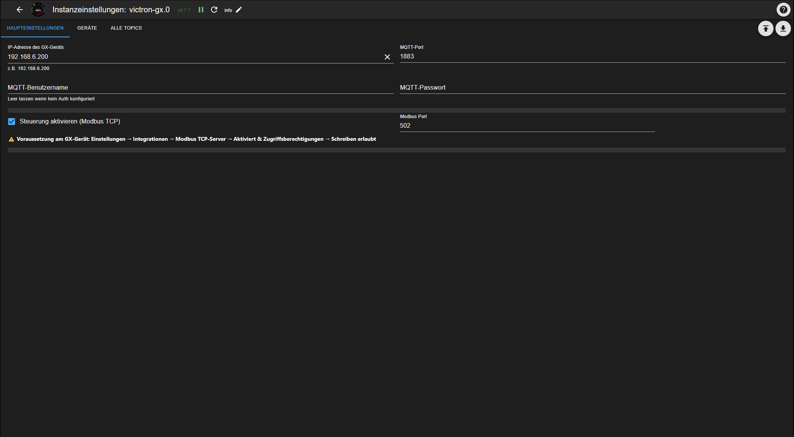
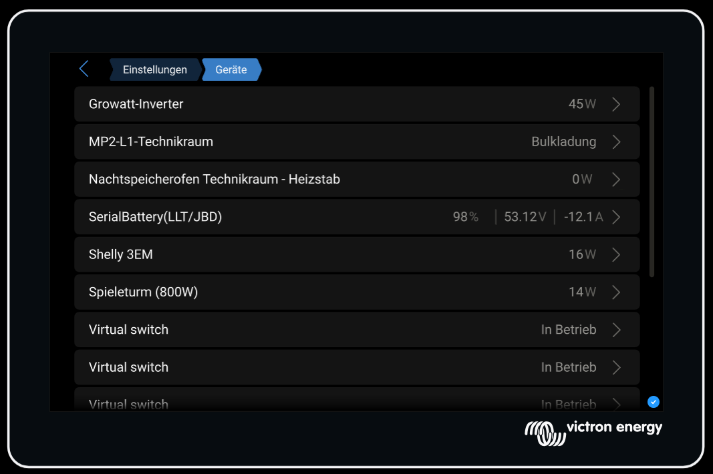
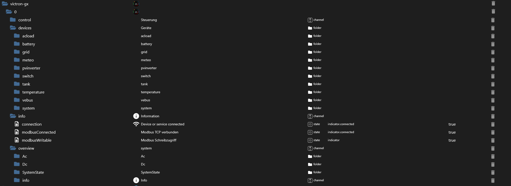
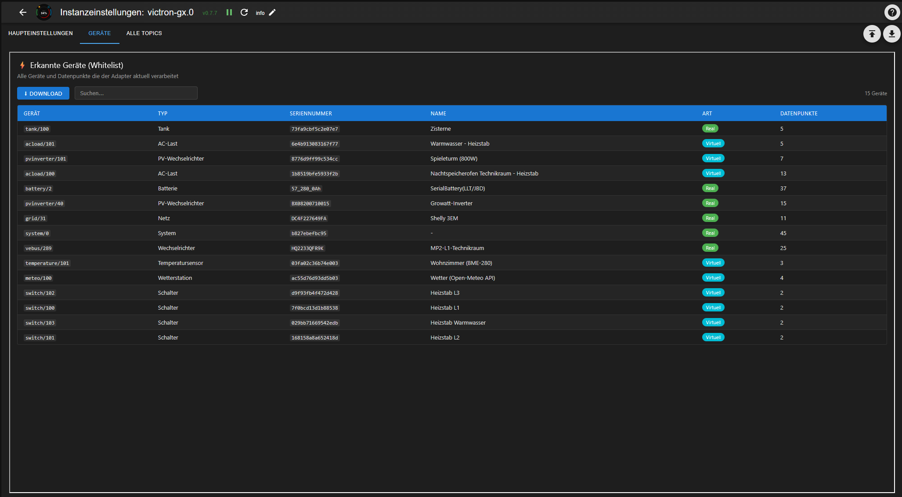
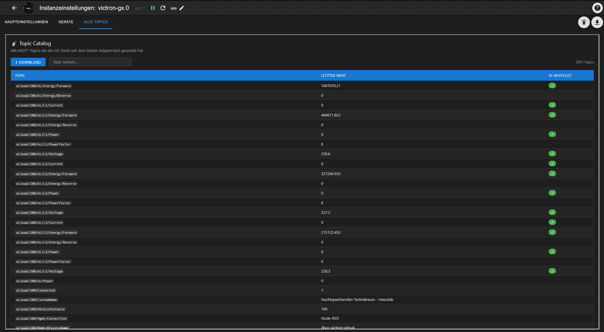

# ioBroker Victron GX Adapter


This adapter connects ioBroker **directly and locally** to [Victron Energy](https://www.victronenergy.com/) GX devices ([Cerbo GX, Venus GX, Ekrano GX](https://www.victronenergy.com/communication-centres)) – without any detour through Home Assistant or the VRM Cloud.

[](https://www.npmjs.com/package/iobroker.victron-gx)
[](https://www.npmjs.com/package/iobroker.victron-gx)
[](https://www.npmjs.com/package/iobroker.victron-gx)
[](LICENSE)
[](https://nodejs.org)

[](https://ko-fi.com/sefinads)

🇩🇪 [Deutsche Anleitung](docs/README_de.md)

---

## What does this adapter do?

Connects ioBroker directly and locally to Victron GX devices via the local MQTT protocol. Supports reading all device data and full ESS/inverter control via Modbus TCP.

- All device datapoints are **discovered automatically** and created as ioBroker states
- Writable datapoints live directly under `devices.*` – `common.write` reflects whether the matching control toggle (Modbus / MQTT) is currently enabled
- Works with single-phase and three-phase systems
- Automatic Modbus Unit ID discovery
- **Low RAM footprint**: ~130 MB stable
- Virtual devices via Node-RED (`dbus-victron-virtual`) are fully supported

---

## Requirements

**On the GX device:**
- Enable MQTT: `Settings → Integrations → MQTT access → On`
- For Modbus control: `Settings → Integrations → Modbus TCP Server → Enabled`
- Write access: `Access level → Write access allowed`

**In ioBroker:**
- Node.js >= 22
- Admin >= 7.7.28

---

## Installation

### Via ioBroker Admin (recommended)

Since this adapter is not yet in the official ioBroker repository, install it via the npm tab in the Admin interface:

1. Open ioBroker Admin
2. Go to **Adapters**
3. Click the **GitHub/Cat icon** (top right)
4. Select the **npm** tab
5. Enter `iobroker.victron-gx` and click **Install**

### After installation

1. Configure the instance:
   - Enter **IP address** of GX device
   - MQTT port: `1883` (default)
   - Optional: **Modbus control** (ESS/inverter registers become writable via Modbus TCP)
   - Optional: **MQTT control** (switches, EV charger, temperature setpoints become writable via MQTT)

> **Note:** Node.js >= 22 is required. If your ioBroker is running on Node.js 20, please update first.

---

## Configuration



| Field | Description |
|-------|-------------|
| IP address of GX device | Local IP of Cerbo/Venus/Ekrano GX |
| MQTT port | Default: 1883 |
| MQTT username / password | Only if MQTT auth is configured on GX |
| Modbus control | Makes ESS/inverter (vebus, system) datapoints writable via Modbus TCP |
| Modbus port | Default: 502 |
| MQTT control | Makes switches, EV charger and temperature setpoints writable via MQTT |

---

## Supported Devices

The adapter automatically discovers all devices connected to the GX device:



| Device type | Description |
|-------------|-------------|
| `battery` | Battery systems (e.g. SerialBattery/LLT/JBD) |
| `vebus` | MultiPlus/Quattro inverters |
| `grid` | Grid meters (e.g. Shelly 3EM, Carlo Gavazzi) |
| `pvinverter` | PV inverters |
| `acload` | AC loads (incl. Shelly 1PM, with switchable output) |
| `switch` | Switchable outputs (Node-RED virtual switches, Shelly Pro3/Pro4/1PM, GX internal relay) |
| `evcharger` | EV chargers (read + control) |
| `temperature` | Temperature sensors |
| `meteo` | Weather stations |
| `tank` | Tank level sensors |
| `system` | System overview |

---

## Object Structure



```
victron-gx.0
├── devices.*          → All discovered devices - common.write on the individual datapoint tells
│   │                     you whether it's currently writable (see "Writable Data Points" below)
│   ├── battery.*
│   ├── vebus.*                      → Mode, Ac.In1.CurrentLimit, Hub4.* writable (Modbus control)
│   ├── grid.*
│   ├── pvinverter.*
│   ├── acload.<Group>.<Serial>.
│   │   ├── Ac.*                     → measurements (unchanged)
│   │   └── outputs.<N>.             → switchable output, if the device has one (e.g. Shelly 1PM)
│   │       ├── State                    bool, writable (MQTT control)
│   │       ├── Status                   bool, read-only
│   │       ├── Name / CustomName        string
│   │       └── Group                    string
│   ├── switch.<Group>.<Serial>.
│   │   └── outputs.<N>.             → one sub-channel per output (Node-RED: one, Shelly Pro3/4: up to four)
│   │       ├── State / Status / Name / CustomName / Group   (same as above)
│   ├── evcharger.<Serial>.          → SetCurrent, StartStop, Mode writable (MQTT control)
│   ├── temperature.<Serial>.        → Offset, Scale, FilterLength writable (MQTT control)
│   ├── meteo.*
│   ├── tank.*
│   └── system.<Serial>.             → GridSetpoint, EssMode, MinimumSoc, ... writable (Modbus control);
│                                       also carries outputs.0.* for the GX internal relay (MQTT control)
├── overview.*         → System overview (from system/0), read-only
└── info.*             → Connection status
```

`<Group>` is an optional intermediate folder – only present if a group name is configured for that channel/device. See [Shelly Integration & Multi-Channel Support](#shelly-integration--multi-channel-support) below for details.

---

## Device List (Admin)



The **Devices** tab shows all discovered devices with type, serial number, name and number of datapoints. The list can be downloaded as a JSON file – useful for support requests.

---

## Topic Catalog (Admin)



The **All Topics** tab shows all MQTT topics that the GX device has sent since the last adapter start. Topics processed by the adapter are marked with ✓. The catalog can be downloaded as a JSON file.

---

## Writable Data Points

Since **0.10.0**, there is no separate `control.*` tree anymore. Every writable datapoint lives
directly under `devices.*`, right next to its read-only siblings – `common.write` on the object
itself tells you (and the Admin UI / VIS) whether it's currently writable. Two independent config
toggles gate this:

- **Modbus control** – ESS/inverter registers on `devices.vebus.*` and `devices.system.*`
- **MQTT control** – switches (`devices.switch.*`/`devices.acload.*`/`devices.system.*` outputs),
  the EV charger, and temperature-sensor calibration setpoints

If a toggle is off, the datapoint still exists (so History/Vis bindings and scripts keep working)
but `common.write` is `false` and writes are ignored with a log warning – no more silently swallowed
writes to a datapoint that looked writable but wasn't.

### Before → after (upgrading from 0.9.x)

| Old (control.\*, removed in 0.10.0) | New (devices.\*) |
|---|---|
| `control.inverter.Mode` | `devices.vebus.<Serial>.Mode` |
| `control.inverter.AcPowerSetpoint` | `devices.vebus.<Serial>.Hub4.L1.AcPowerSetpoint` |
| `control.inverter.AcIn1CurrentLimit` | `devices.vebus.<Serial>.Ac.In1.CurrentLimit` |
| `control.inverter.DisableCharge` | `devices.vebus.<Serial>.Hub4.DisableCharge` |
| `control.inverter.DisableFeedIn` | `devices.vebus.<Serial>.Hub4.DisableFeedIn` |
| `control.system.GridSetpoint` | `devices.system.<Serial>.GridSetpoint` |
| `control.system.EssMode` | `devices.system.<Serial>.EssMode` |
| `control.system.MinimumSoc` | `devices.system.<Serial>.MinimumSoc` |
| `control.system.BatteryLifeState` | `devices.system.<Serial>.BatteryLifeState` |
| `control.system.MaxFeedInPower` | `devices.system.<Serial>.MaxFeedInPower` |
| `control.system.AcFeedInEnabled` | `devices.system.<Serial>.AcFeedInEnabled` |
| `control.system.DcFeedInEnabled` | `devices.system.<Serial>.DcFeedInEnabled` |
| `control.system.DvccMaxChargeCurrent` | `devices.system.<Serial>.DvccMaxChargeCurrent` |
| `control.system.MaxDischargePower` | `devices.system.<Serial>.MaxDischargePower` |
| `control.evcharger.<Instance>.SetCurrent` | `devices.evcharger.<Serial>.SetCurrent` |
| `control.evcharger.<Instance>.StartStop` | `devices.evcharger.<Serial>.StartStop` |
| `control.evcharger.<Instance>.Mode` | `devices.evcharger.<Serial>.Mode` |

**What to do:** update any scripts, Vis widgets, or Blockly rules that reference `control.*`
directly, and make sure the matching toggle (Modbus control / MQTT control) is enabled in the
instance settings if you rely on writing to any of these. The adapter renames the config key
`controlEnabled` to `modbusControlEnabled` automatically on first 0.10.0 start (your setting is
preserved) – `mqttControlEnabled` is unchanged. A one-time cleanup removes any leftover `control.*`
objects, and a warning is logged on every start in 0.10.x/0.11.x as a reminder (removed in 0.12.0).

**Switches are now gated too:** `outputs.<N>.State` used to be writable unconditionally; it now
requires **MQTT control** to be enabled, same as everything else under this toggle.

### Examples

**ESS Grid Setpoint** (simplest approach) – write `devices.system.<Serial>.GridSetpoint` [W]:
- `0` → zero feed-in (Victron ESS algorithm keeps grid at 0W)
- `-3000` → feed 3000W into grid (battery discharges)
- `+500` → draw 500W from grid (battery charges)

No keepalive needed – value is stored persistently.

**ESS Live Setpoint** (direct control) – write `devices.vebus.<Serial>.Hub4.L1.AcPowerSetpoint` [W]:
- Requires `devices.system.<Serial>.EssMode = 3` (External control)
- The adapter resends the value every 800ms while it is ≠ 0 (Victron watchdog)
- Set to `0` to return control to the Victron ESS algorithm

**Disable Charge / Feed-In:**
- `devices.vebus.<Serial>.Hub4.DisableCharge = 1` → battery will not charge
- `devices.vebus.<Serial>.Hub4.DisableFeedIn = 1` → inverter will not feed into grid

**DVCC Limits** (requires DVCC enabled on GX):
- `devices.system.<Serial>.DvccMaxChargeCurrent` [A]: system-wide charge current limit (-1 = disabled)
- `devices.system.<Serial>.MaxDischargePower` [W]: discharge power limit

**Virtual Switches** (Node-RED) – set `outputs.<N>.State` to `true`/`false` → MQTT write → GX → Node-RED → relay

**EV Charger** – write `devices.evcharger.<Serial>.SetCurrent` [A] / `StartStop` [bool] / `Mode` (0=Manual, 1=Auto, 2=Scheduled)

**Temperature sensor calibration** – write `devices.temperature.<Serial>.Offset` [°C] / `Scale` / `FilterLength`

---

## Virtual Devices (Node-RED)

The adapter fully supports virtual devices created via Node-RED with the `dbus-victron-virtual` package:

- Virtual PV inverters
- Virtual AC loads
- Virtual switches (with group and individual name)
- Virtual temperature sensors
- Virtual weather stations
- Virtual tank sensors

---

## Shelly Integration & Multi-Channel Support

Shelly devices connected to the GX (Cerbo/Venus/Ekrano) integration are now fully supported, alongside Node-RED virtual switches:

- **Shelly Pro3 / Pro4**: each physical device reports its channels as separate MQTT device instances that share the same serial number. The adapter automatically merges them into a single object tree (`devices.switch.<Group>.<Serial>.outputs.<0..3>.*`).
- **Shelly 1PM**: measurement values (`Ac.*`) and the switchable output (`outputs.0.*`) live on the same device tree under `devices.acload.<Group>.<Serial>`.
- **GX internal relay**: the relay built into the GX device itself (`system/0`) is switchable under `devices.system.<Serial>.outputs.0.State`, once **MQTT control** is enabled (see [Writable Data Points](#writable-data-points)).

All switchable outputs – regardless of device type – share the same sub-structure, so wildcard selectors work across your whole installation:

```javascript
// Every switchable output, any device type, any group
'victron-gx.0.devices.*.*.*.outputs.*.State'

// Just the custom names, for a device overview
'victron-gx.0.devices.*.*.*.outputs.*.CustomName'
```

### ⚠️ Breaking change (v0.9.x)

Switch outputs used to live directly under the device channel; they now live under an `outputs.<N>` sub-channel. Node-RED's `output_1` is normalized to `outputs.1`:

| Old (v0.8.x) | New (v0.9.x) |
|---|---|
| `devices.switch.<Group>.<Serial>.State` | `devices.switch.<Group>.<Serial>.outputs.1.State` |
| `devices.switch.<Group>.<Serial>.Status` | `devices.switch.<Group>.<Serial>.outputs.1.Status` |

Update any scripts, Vis widgets, or Blockly rules that reference the old paths directly.

If you want to remove the leftover old objects, run this in the ioBroker CLI (the trailing loop works around the known "Invalid ID: undefined" error when deleting via the Admin UI):

```bash
iobroker object list | grep -oP 'victron-gx\.0\.devices\.switch\.[^.]+\.[^.]+\.(State|Status)$' \
  | while read id; do iobroker object del "$id"; done
```

### Auto-cleanup of orphaned channels (optional)

If you move a channel to a different group, disable a Shelly channel, or delete a Node-RED switch, its MQTT topic disappears – but the ioBroker objects stay behind. Enable **Remove orphaned channels on startup** (Main Settings tab, off by default) to have the adapter delete them automatically:

- Runs once per adapter start, only after ~30 seconds without a newly-discovered channel (so multi-channel devices like the Shelly Pro3, whose instances report in at slightly different times, aren't affected mid-startup).
- Only touches `outputs.<N>` channels. Device-level metadata, `Ac.*` measurements, and `overview.*` are never removed by this.
- Leave it off if your devices are frequently offline – a channel that hasn't reported back yet by the time the sweep runs looks orphaned and would be deleted.

---

## Changelog

### 0.10.0 (2026-08-01)
- **BREAKING:** the `control.*` branch has been removed - writable datapoints now live directly under `devices.*`, with `common.write` gated by two config toggles (Modbus control / MQTT control). See README section "Writable Data Points" for the full old→new mapping and migration steps.
- **BREAKING:** switches (`outputs.<N>.State`) now require MQTT control to stay writable (previously unconditional).
- **BREAKING:** the config key `controlEnabled` was renamed to `modbusControlEnabled` (value preserved automatically on first start).
- EV charger control is no longer experimental - treated the same as any other device type now.
- Temperature sensor calibration (`Offset`/`Scale`/`FilterLength`) is now writable.
- A migration warning with the full old→new mapping is logged on every start in 0.10.x/0.11.x and will be removed in 0.12.0.

### 0.9.4 (2026-07-29)
- Semantic change: control datapoints (control.system.*, control.inverter.*, control.evcharger.*) are now only created when the matching control switch (controlEnabled / mqttControlEnabled) is active, and are then always writable (no more silently ignored writes). Existing objects are automatically removed when the switch is disabled. If you have scripts targeting control.*, check that the matching switch is enabled in the adapter settings. Note: disabling the switch discards the last known value of the affected control state - relevant for History adapter users (gap in the log).

### 0.9.3 (2026-07-28)
- Fixed race condition during initial object creation that caused 'no existing object' warnings after fresh installs affecting all device types.

### 0.9.2 (2026-07-28)
- Fix: control.evcharger states became writable but stateChange events were never delivered (subscribe only reacted to controlEnabled, not mqttControlEnabled)

### 0.9.1 (2026-07-27)
- Added support for EV chargers (read + experimental control) and generic temperature inputs (dbus-adc). Thanks to Samson71 for the catalog. Community testing appreciated.


### 0.9.0 (2026-07-19)

**⚠️ BREAKING CHANGES**
- Switch and AC-load outputs now live under `outputs.<N>.State/Status` instead of directly at the device folder
- Node-RED virtual switches: previously `.State`, now `.outputs.1.State`
- Anyone referencing these paths in Vis or scripts needs to update them
- Migration guide: see README section "Shelly integration & multi-channel support"

**New: Shelly device integration**
- Full multi-channel support for Shelly devices connected via Cerbo/Venus/Ekrano GX (via dbus-shelly bridge, Venus OS 3.60+)
- Tested with Shelly Plus series (Plus 1/1PM/2PM/Plug S), Shelly Plugs, Shelly Pro3 as switch, Shelly 1PM as acload
- Shelly PM devices: supported from model version 3 onward (in line with Victron's own compatibility list); older models are not supported by Victron's bridge and therefore also not reachable via this adapter
- Multi-instance merging: channels of one Shelly device are automatically merged into a single object tree via their common serial
- Shelly devices with measurement (e.g. 1PM as acload): measurement values and switchable output coexist on the same object
- GX internal relay (system/0) is now switchable as well

**New: Extended AC-load datapoints**
- `Ac.Power` (total power)
- `Ac.Energy.Reverse`, `Ac.L*.Energy.Reverse`
- `Ac.L*.PowerFactor`
- Metadata: `Role`, `IsGenericEnergyMeter`, `PhaseSetting`, `ProductId`

**New: Cleanup toggle**
- New option "Remove orphaned channels on startup" (default off)
- Cleans up leftover objects after group changes or channel deactivation
- Conservative: only removes objects whose serial is still active under another group (no data loss for offline devices)
- Available in all 11 UI languages

**Fixes**
- Object store race during parallel channel/state creation (previously caused occasional invalid-type objects invisible to the sweep)
- Group migration zombies are now removed (channel moved between groups at the GX)
- Instance tile IP address and web UI link now show the configured GX IP of the respective instance (previously showed server IP or IP from instance 0)
- Various smaller log and cosmetic fixes

### 0.8.10 (2026-07-04)
- Review fixes for official repository inclusion: English-only log messages, admin tabs and state labels; sanitized serial numbers in object IDs; completed news and localLinks translations; removed unused pollingInterval; docs cleanup; updated @iobroker/types to 7.2.2

### 0.8.9 (2026-07-02)
- chore: bump @iobroker/adapter-core to 3.4.1

### 0.8.8 (2026-06-14)
- Release 0.8.8

### 0.8.6 (2026-06-14)
- Fix: add Ac.Power to RELEVANT_PATHS for pvinverter, acload and grid devices

### 0.8.5 (2026-06-12)
- docs: add Ko-fi button and improved installation instructions

### 0.8.4 (2026-06-11)
- docs: add Ko-fi support badge

### 0.8.3 (2026-06-11)
- docs: improved installation instructions, added npm download badge

### 0.8.2 (2026-06-11)
- Fix: memory leak caused by stale device timer using native clearTimeout instead of this.clearTimeout; fix: topic catalog now only stores new topics instead of re-allocating on every MQTT message

### 0.8.1 (2026-06-10)
- Fix: remove invalid nodeVersion from io-package.json; add localLinks; add i18n for admin config

### 0.8.0 (2026-06-10)
- Topic Map and Topic Catalog as Admin tabs; dynamic device discovery without timer; Switch CustomName from Node-RED; Node.js >= 22, Admin >= 7.7.28 required

### 0.7.7 (2026-06-09)
- Add localLink to instance overview for direct GX access

### 0.7.5 – 0.7.6
- Fix: remove invalid supportedMessages from io-package.json
- Add localLink to instance overview for direct GX access

### 0.7.3 – 0.7.4
- Performance: static fast-path after 60s discovery reduces RAM to ~100MB stable
- Add meteo device support
- Fix temperature device (Humidity/Pressure)
- Fix CustomName for all devices

### 0.7.0 – 0.7.2
- Performance: state object cache reduces RAM from ~660MB to ~155MB
- Full i18n support for all state names
- Fix object structure (folder/channel hierarchy)

### 0.6.0
- Breaking: `ess.*` renamed to `control.system.*`
- `control.inverter.*` added
- All device datapoints are strictly read-only
- AcPowerSetpoint keepalive every 800ms

### 0.1.0
- Complete read support for all device types

---

[Older changelogs](CHANGELOG_OLD.md)

[Older changelogs can be found there](CHANGELOG_OLD.md)

## License

MIT License

Copyright (c) 2026 Sefina-DS
