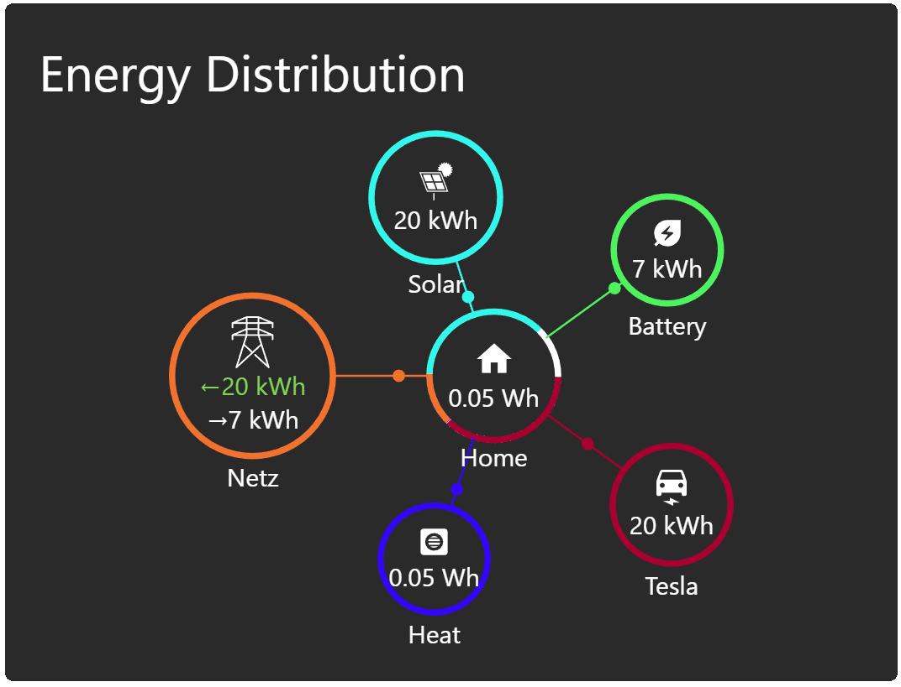
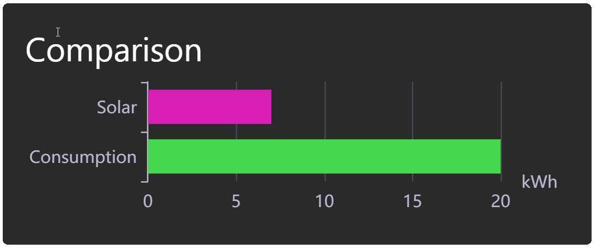
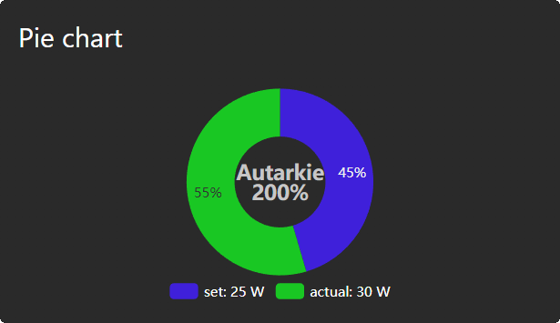
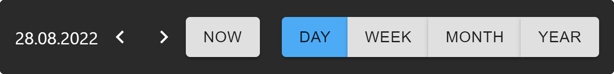
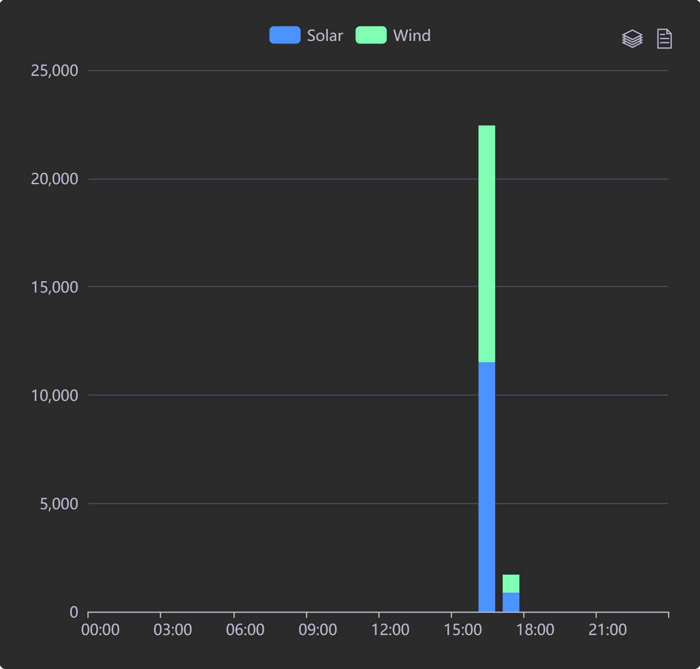

# Vis 2 Energy widgets

  

This widget set consists of the following widgets:
- Energy distribution

- Energy consumption comparison

 

- Time selector for energy consumption

- Energy consumption per day/week/month

<!--
    ### **WORK IN PROGRESS**
-->

## Changelog

### **WORK IN PROGRESS**
* (hombach) Fixed missing translation for the "default radius size" field in the distribution widget config (#527)
* (hombach) Addressed repository checker findings: added a concurrency block and a dedicated adapter-tests job to the CI workflow, dropped the custom test-command, and removed the redundant mocha/@types/mocha devDependencies (provided by @iobroker/testing) (#526)

### 2.0.1 (2026-08-13)
* (hombach) **BREAKING:** the comparison widget no longer auto-converts W→Wh / kW→kWh nor divides Wh values by 1000. It now shows the real datapoint unit and raw value; use the "factor" field for scaling (#243)
* (hombach) Comparison widget: option to disable chart animations or set their duration (#416)
* (hombach) Distribution widget: optional second value per node shown in the circle (e.g. a battery state of charge / SoC in %) (#416, #74)
* (hombach) Consumption widget: added a per-device factor and a y-axis unit label (#451)
* (hombach) Consumption widget: added a "stacked" option to preselect stacked vs grouped bars (#451)
* (hombach) Migrated the widget sources from JavaScript/JSX to TypeScript
* (hombach) Migrated the widget build from Create React App (react-scripts/craco) to Vite with module federation
* (hombach) Fixed broken `check` and `lint` scripts (added tsconfig files, repaired ESLint flat config for JSX sources)
* (hombach) Fixed duplicated "inner radius" field in the consumption comparison widget config (#393)
* (hombach) Fixed unit of the feed-back (return) value not following the power line unit in the distribution widget (#212)
* (hombach) Fixed wrong/missing Sunday data in the consumption widget (week view now starts correctly on Monday) (#270, #290)
* (hombach) The comparison widget x-axis now uses the configured/detected device unit instead of always showing "kWh" (#243)
* (hombach) Addressed repository checker findings: dependabot cooldown + @types/node major-ignore, removed self-referencing licenseInformation link, ignore .commitinfo (#512)
* (hombach) Added a check-and-lint job to the CI workflow (#512)
* (hombach) Updated echarts to v6 (#6)
* (hombach) Updated TypeScript dev dependency to v6 (v7 still blocked by typescript-eslint)
* (hombach) Updated @iobroker/adapter-react-v5 to v8 and added the @emotion/react + @emotion/styled dependencies required by MUI (#17)
* (hombach) Removed the unused legacy ESLint stack (airbnb config, deprecated eqeqeq-fix, only-warn) and the dead .eslintrc.js from src-widgets
* (hombach) Fixed copyright year (#461)
* (hombach) Removed deprecated common.noConfig from io-package.json (#499)
* (hombach) Fixed build failure by removing deprecated node-sass dependency
* (hombach) testing for node.js 24 (#383)
* (hombach) updated GitHub actions
* (hombach) updated dependencies
* (hombach) fixed repo checker warnings
* (@GermanBluefox) Refactored the code

### 1.0.2 (2024-08-06)
* (bluefox) updated packages

### 1.0.0 (2024-07-07)
* (bluefox) Removed withStyles package

### 0.3.11 (2024-02-16)
* (bluefox) show value with green color if we feed back into power line

### 0.3.9 (2023-11-10)
* (bluefox) update packages

[Older changelogs can be found there](CHANGELOG_OLD.md)

## License
The MIT License (MIT)

Copyright (c) 2022-2026 bluefox <dogafox@gmail.com>

Permission is hereby granted, free of charge, to any person obtaining a copy
of this software and associated documentation files (the "Software"), to deal
in the Software without restriction, including without limitation the rights
to use, copy, modify, merge, publish, distribute, sublicense, and/or sell
copies of the Software, and to permit persons to whom the Software is
furnished to do so, subject to the following conditions:

The above copyright notice and this permission notice shall be included in
all copies or substantial portions of the Software.

THE SOFTWARE IS PROVIDED "AS IS", WITHOUT WARRANTY OF ANY KIND, EXPRESS OR
IMPLIED, INCLUDING BUT NOT LIMITED TO THE WARRANTIES OF MERCHANTABILITY,
FITNESS FOR A PARTICULAR PURPOSE AND NONINFRINGEMENT. IN NO EVENT SHALL THE
AUTHORS OR COPYRIGHT HOLDERS BE LIABLE FOR ANY CLAIM, DAMAGES OR OTHER
LIABILITY, WHETHER IN AN ACTION OF CONTRACT, TORT OR OTHERWISE, ARISING FROM,
OUT OF OR IN CONNECTION WITH THE SOFTWARE OR THE USE OR OTHER DEALINGS IN
THE SOFTWARE.
