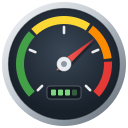

# Gauge widgets for ioBroker.vis-2

  

Ten widgets for [ioBroker.vis-2](https://github.com/ioBroker/ioBroker.vis-2) that show a value as a gauge:

| Widget        | Id                     | For example                                                 |
|---------------|------------------------|-------------------------------------------------------------|
| Color gauge   | `tplGauge2Color`       | a half circle of colored segments with a needle             |
| Water gauge   | `tplGauge2Water`       | humidity, filling in percent                                |
| Battery gauge | `tplGauge2Battery`     | battery of a sensor, phone or car, with charging indicator  |
| Radial gauge  | `tplGauge2Radial`      | power, speed, pressure - the classic instrument             |
| Arc gauge     | `tplGauge2Arc`         | any value with a set point marker, also as LED segments     |
| Linear gauge  | `tplGauge2Linear`      | horizontal or vertical bar, e.g. grid power from -3 to 6 kW |
| Thermometer   | `tplGauge2Thermometer` | inside and outside temperature                              |
| Compass       | `tplGauge2Compass`     | wind direction and speed, heading                           |
| Tank          | `tplGauge2Tank`        | heating oil, cistern, pellets                               |
| Rings         | `tplGauge2Rings`       | up to five values at once, e.g. PV, consumption, battery    |

The widgets are drawn as plain SVG with React, without chart or UI libraries, and follow the light and the dark theme
of vis-2.

## Documentation

Every widget with all its settings and screenshots: [English](/#/docs/adapterref/iobroker.vis-2-widgets-gauges/docs/en/README.md) | [Deutsch](https://github.com/ioBroker/ioBroker.vis-2-widgets-gauges/blob/master/docs/de/README.md)

<!--
    Placeholder for the next version (at the beginning of the line):
    ### **WORK IN PROGRESS**
-->
## Changelog
### **WORK IN PROGRESS**
* (bluefox) Rewrote the color, water and battery gauge as plain SVG without react-gauge-chart, react-liquid-gauge, react-battery-gauge, d3 and MUI - the widget set works with the React 19 version of vis-2 again. Projects keep all their settings
* (bluefox) Added 7 new widgets: radial gauge, arc gauge, linear gauge, thermometer, compass, tank and rings
* (bluefox) Color gauge: the value is shown below the needle, minimum and maximum can be shown, the needle length works, `0` for corner radius, padding and margin is really 0
* (bluefox) Water gauge: digits after comma and color of the liquid; the value counts up during the rise animation
* (bluefox) Battery gauge: optional medium level, stroke width of the body, percent sign can be hidden, the text stays horizontal in a vertical battery
* (bluefox) Values that are not numbers are shown as text, a missing value as `–`
* (bluefox) All widgets follow the dark theme of vis-2
* (bluefox) Added documentation with screenshots (English and German)
* (bluefox) The adapter icon is an SVG now
* (bluefox) Updated packages and the build (vite 8, React 19 types)

### 2.0.3 (2026-06-04)
* (bluefox) Updated packages

### 2.0.2 (2025-08-26)
* (bluefox) Support for older Android devices

### 2.0.1 (2025-07-01)
* (bluefox) Rewritten with TypeScript

### 1.1.1 (2024-11-25)
* (bluefox) Allowed to define digits after comma for the color gauge

### 1.1.0 (2024-07-07)
* (bluefox) Removed withStyles package

### 1.0.4 (2024-05-26)
* (bluefox) updated packages

### 1.0.3 (2024-03-13)
* (bluefox) updated packages

### 1.0.2 (2024-01-02)
* (bluefox) Allowed showing text in every widget

### 1.0.0 (2023-12-05)
* (bluefox) updated packages
* (bluefox) Allowed showing text on battery

### 0.2.2 (2023-11-10)
* (bluefox) update packages

### 0.2.0 (2023-07-28)
* (bluefox) Changed layout of widgets
* (bluefox) Added text color settings to water widget

### 0.1.14 (2023-07-01)
* (bluefox) Changed layout of widgets

### 0.1.13 (2023-06-28)
* (bluefox) Better compatibility

### 0.1.12 (2023-03-22)
* (bluefox) update packages

### 0.1.9 (2023-03-02)
* (bluefox) Packages were updated

### 0.1.5 (2023-02-23)
* (bluefox) Packages were updated

### 0.1.4 (2022-11-13)
* (bluefox) initial commit

## License
The MIT License (MIT)

Copyright (c) 2022-2026 bluefox <dogafox@gmail.com>

Permission is hereby granted, free of charge, to any person obtaining a copy
of this software and associated documentation files (the "Software"), to deal
in the Software without restriction, including without limitation the rights
to use, copy, modify, merge, publish, distribute, sublicense, and/or sell
copies of the Software, and to permit persons to whom the Software is
furnished to do so, subject to the following conditions:

The above copyright notice and this permission notice shall be included in
all copies or substantial portions of the Software.

THE SOFTWARE IS PROVIDED "AS IS", WITHOUT WARRANTY OF ANY KIND, EXPRESS OR
IMPLIED, INCLUDING BUT NOT LIMITED TO THE WARRANTIES OF MERCHANTABILITY,
FITNESS FOR A PARTICULAR PURPOSE AND NONINFRINGEMENT. IN NO EVENT SHALL THE
AUTHORS OR COPYRIGHT HOLDERS BE LIABLE FOR ANY CLAIM, DAMAGES OR OTHER
LIABILITY, WHETHER IN AN ACTION OF CONTRACT, TORT OR OTHERWISE, ARISING FROM,
OUT OF OR IN CONNECTION WITH THE SOFTWARE OR THE USE OR OTHER DEALINGS IN
THE SOFTWARE.