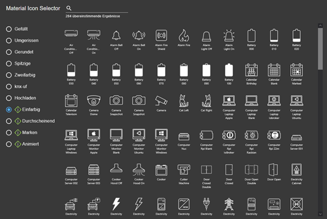
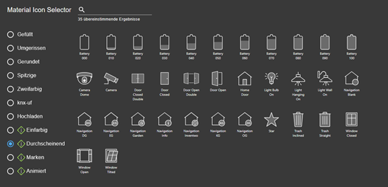
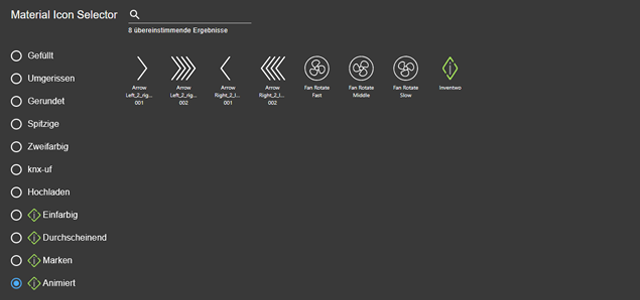

# inventwo Icons for  ioBroker.vis 2.0

 

## Icon adapter for the ioBroker.vis adapter (only for VIS-2)

### **Please note:** This icons only work with version 2.13.x (or higher) of the ioBroker.vis-2 adapter!

.... more information will follow

### Available since: v1.x.x

## Changelog

<!--
    ### **WORK IN PROGRESS**
-->
### 1.20.0 (2025-11-17)
- new icons (lights)

### 1.19.2 (2025-11-17)
- new icons (alexa)

### 1.19.1 (2025-11-16)
- bug fix

### 1.19.0 (2025-11-16)
- new icons (alexa)

### 1.18.0 (2025-10-27)
- new icons (rooms)

### 1.17.0 (2025-10-26)
- new icons (thermal-heater & weather)

### 1.16.0 (2025-10-18)
- new icons (tablets)

### 1.15.0 (2025-10-18)
- new icons (computer-usv & network-fritzbox)

### 1.14.0 (2025-10-12)
- new icons (weather)

### 1.13.0 (2025-10-12)
- new icons (diagram & network-NAS)

### 1.12.0 (2025-10-12)
- new icons (diagram)

### 1.11.0 (2025-10-12)
- new icons (weather-station)

### 1.10.0 (2025-10-12)
- new icons (weather-station & people-sleep & lights-tree & thermostat)

### 1.9.0 (2025-10-05)
- new icons (autodarts)

### 1.8.0 (2025-09-28)
- new icons (home assistant - brands & computer)

### 1.7.0 (2025-09-23)
- new icons (waterfall & sprinkler & plan-doors)

### 1.6.0 (2025-09-22)
- new icons (weather-direction & people)

### 1.5.0 (2025-09-21)
- new icons (garage & battery-storage & maps & spa)

### 1.4.0 (2025-09-20)
- new icons (network & computer & alexa)

### 1.3.0 (2025-09-16)
- new icons (plan doors)

### 1.2.3 (2025-09-16)
- fix adapter checker

### 1.2.2 (2025-09-16)
- fix adapter checker

### 1.2.1 (2025-09-16)
- fix adapter checker

### 1.2.0 (2025-09-15)
- new icons (animated attention & bell)

### 1.1.0 (2025-09-15)
- new icons (animated arrows)

### 1.0.0 (2025-09-15)
- new category animated icons (fan)

### 0.29.0 (2025-09-14)
- new icons (lights & signs & 3D-print & cooker)

### 0.28.0 (2025-09-13)
- new icons (3D & laser & fans)

### 0.27.0 (2025-09-12)
- new icons (signs & network)

### 0.26.0 (2025-09-11)
- new icons (signs & ecar)

### 0.25.0 (2025-09-10)
- new icons (heater & meter)

### 0.24.0 (2025-09-09)
- new icons (brand & water-pump & spa)

### 0.23.0 (2025-09-09)
- new icons (lights & maintenance & faucets)

### 0.22.0 (2025-09-07)
- new icons (lawn & pool robot)

### 0.21.0 (2025-09-07)
- new icons (lights)

### 0.20.0 (2025-09-07)
- new icons (alarm & lights & printer & sensor & computer & brands)

### 0.19.0 (2025-09-07)
- new icons (TV lights & computer)

### 0.18.0 (2025-09-06)
- new icons (computer)

### 0.17.0 (2025-09-06)
- new icons (network & shutter)

### 0.16.0 (2025-09-06)
- new icons (lights & machines & signs)

### 0.15.0 (2025-09-05)
- new icons (computer & hobby & sings)

### 0.14.0 (2025-09-05)
- new icons (lights)

### 0.13.1 (2025-09-05)
- fix adapter icon

### 0.13.0 (2025-09-05)
- new icons (lights & signs)

### 0.12.0 (2025-09-04)
- new icons (post)

### 0.11.1 (2025-09-03)
- fix

### 0.11.0 (2025-09-03)
- new icons (people)

### 0.10.1 (2025-09-03)
- fix

### 0.10.0 (2025-09-03)
- new icons (people)

### 0.9.0 (2025-09-03)
- new icons (alarm/bell)

### 0.8.0 (2025-09-02)
- new icons added

### 0.7.1 (2025-09-01)
- edit readme

### 0.7.0 (2025-09-01)
- new icons added

### 0.6.0 (2025-09-01)
- new icons added

### 0.5.0 (2025-09-01)
- new icons added

### 0.4.2 (2025-08-31)
- fix

### 0.4.1 (2025-08-31)
- fix

### 0.4.0 (2025-08-31)
- new icons added

### 0.3.2 (2025-08-31)
- fix

### 0.3.1 (2025-08-31)
- fix

### 0.3.0 (2025-08-31)
- new icon added

### 0.2.0 (2025-08-30)
- new icons added

### 0.1.1 (2025-08-30)
- fix repo-url

### 0.1.0 (2025-08-30)
- Release with first icons

## License

The MIT License (MIT)

Copyright (c) 2025 skvarel • <sk@inventwo.com>

Permission is hereby granted, free of charge, to any person obtaining a copy
of this software and associated documentation files (the "Software"), to deal
in the Software without restriction, including without limitation the rights
to use, copy, modify, merge, publish, distribute, sublicense, and/or sell
copies of the Software, and to permit persons to whom the Software is
furnished to do so, subject to the following conditions:

The above copyright notice and this permission notice shall be included in
all copies or substantial portions of the Software.

THE SOFTWARE IS PROVIDED "AS IS", WITHOUT WARRANTY OF ANY KIND, EXPRESS OR
IMPLIED, INCLUDING BUT NOT LIMITED TO THE WARRANTIES OF MERCHANTABILITY,
FITNESS FOR A PARTICULAR PURPOSE AND NONINFRINGEMENT. IN NO EVENT SHALL THE
AUTHORS OR COPYRIGHT HOLDERS BE LIABLE FOR ANY CLAIM, DAMAGES OR OTHER
LIABILITY, WHETHER IN AN ACTION OF CONTRACT, TORT OR OTHERWISE, ARISING FROM,
OUT OF OR IN CONNECTION WITH THE SOFTWARE OR THE USE OR OTHER DEALINGS IN
THE SOFTWARE.
