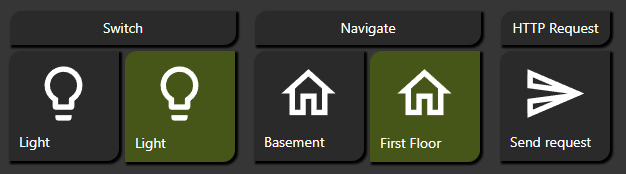
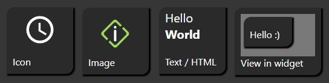
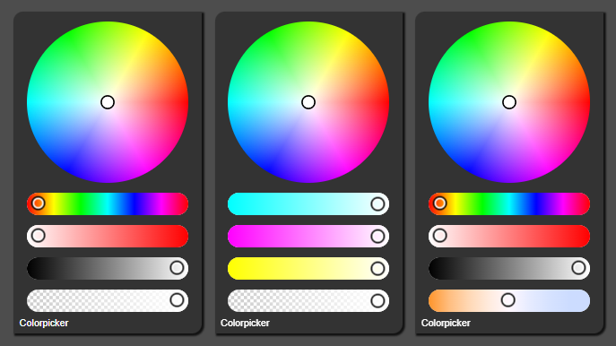
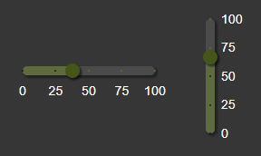
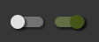
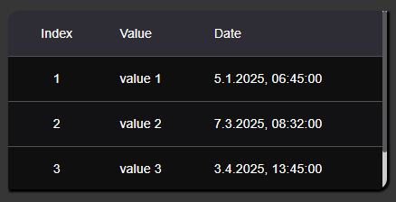
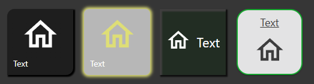

# inventwo Widgets for ioBroker.vis 2.0

 

## About
Adds switches, buttons, sliders and more as widgets for ioBroker VIS 2.0.

## Content
Various widgets for switching, navigating and more.

### Widget - Universal

#### Various content types

Color picker

### Widget - Slider

### Widget - Switches

### Widget - Checkbox

### Widget—Table

### Design
All widgets come with extensive design options to customize the look and feel to your needs.

### More will follow...

## Changelog
<!--
    Placeholder for the next version (at the beginning of the line):
    ### **WORK IN PROGRESS**
-->
### 0.6.4 (2026-03-19)
- Fixed touch triggers twice on universal state widget

### 0.6.3 (2026-03-19)
- Fixed HTML support for table widget without configured columns

### 0.6.2 (2026-03-18)
- Fixed button not working on touchscreens (#192)
- Added HTML support for table widget cells (#196)

### 0.6.1 (2026-03-04)
- Fixed background label in editor for dropdown widget
- Added sort option for table widget (#191)

### 0.6.0 (2026-03-01)
- Added new widget: Dropdown (#178)
- Fixed issue table widget width isn't applied when header is hidden (#177)

## License
The MIT License (MIT)

Copyright (c) 2025-2026 jkvarel <jk@inventwo.com>

Permission is hereby granted, free of charge, to any person obtaining a copy
of this software and associated documentation files (the "Software"), to deal
in the Software without restriction, including without limitation the rights
to use, copy, modify, merge, publish, distribute, sublicense, and/or sell
copies of the Software, and to permit persons to whom the Software is
furnished to do so, subject to the following conditions:

The above copyright notice and this permission notice shall be included in
all copies or substantial portions of the Software.

THE SOFTWARE IS PROVIDED "AS IS", WITHOUT WARRANTY OF ANY KIND, EXPRESS OR
IMPLIED, INCLUDING BUT NOT LIMITED TO THE WARRANTIES OF MERCHANTABILITY,
FITNESS FOR A PARTICULAR PURPOSE AND NONINFRINGEMENT. IN NO EVENT SHALL THE
AUTHORS OR COPYRIGHT HOLDERS BE LIABLE FOR ANY CLAIM, DAMAGES OR OTHER
LIABILITY, WHETHER IN AN ACTION OF CONTRACT, TORT OR OTHERWISE, ARISING FROM,
OUT OF OR IN CONNECTION WITH THE SOFTWARE OR THE USE OR OTHER DEALINGS IN
THE SOFTWARE.
