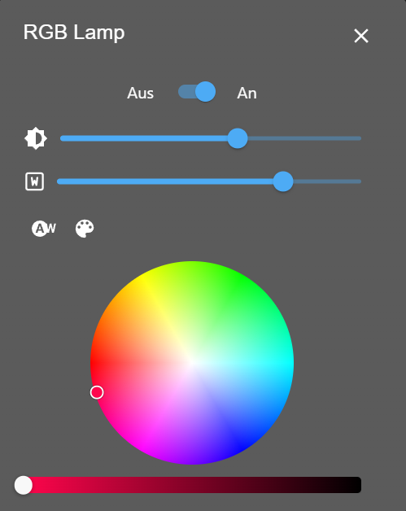
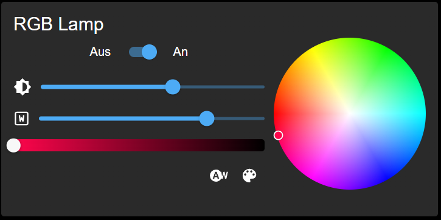

# Material widgets for ioBroker.vis 2.0

  

## Widgets
### Buttons and switches

### Clock
- Analog
 

 
- Analog variation

- Digital

- Digital2 (SVG Text)

### Simple state
With this widget, you can control one device. Boolean or number.
- Number

- Control

### View in widget

Not as button: View could be shown in full size, and you can control elements in view.

As button: You can show a small thumbnail of view, and by pressing on it, it will be shown in full size.

### Thermostat

Additionally, it can show a history if you activated it.

### Actual value with chart

### Security control

You can define the delay in seconds.

By activation, the defined ID will be written with number of the delay seconds, 
and after the delay is over, the defined ID will be set to 0, and the alarm ID be set to true.

### Player

### Map

Position could be defined as a combined state, like `9.2344;41.374652` - (longitude;latitude) or as two separate states.

### Camera

### Html Template

Html template can be used to show any html code.
Additionally, you can show image or iframe with this widget too.

### Blinds

### Color Lamp
With the RGB lamp widget, you can control different types of RGB lamps. Here are some examples:
- RGB colors are set in one state like '#RRGGBB'
- R/G/B colors are set in different states from 0 to 255
- RGBW as one variable like '#RRGGBBWW'
- R/G/B/W colors are set in different states from 0 to 255
- hue/sat/lum as 3 different states
- color temperature as one state from 2700 to 6500 or defined by min/max of the object
- White mode state can be used to switch between RGB and white mode via special state

### Door lock

### Vacuum cleaner
This widget is primary for Xiaomi vacuum cleaner. But it can be used for any other vacuum cleaner too.

The only difference is that Xiaomi supports the room cleaning.

### Time picker

## Todo
- Extend Blinds with shutter 
<!--
    Placeholder for the next version (at the beginning of the line):
    ### **WORK IN PROGRESS**
-->
## Changelog
### 1.4.10 (2024-08-09)
* (Steiger04) Corrected recursive icon search on channel, device, instance and adapter.

### 1.4.9 (2024-08-03)
* (bluefox) Corrected blinds dialog
* (bluefox) Added the invert option for blinds

### 1.4.8 (2024-07-12)
* (bluefox) Small changes for SweetHome3D

### 1.4.7 (2024-07-11)
* (bluefox) Corrected thermostat chart button

### 1.4.6 (2024-07-10)
* (bluefox) Better detection of modes for thermostat
* (bluefox) Round temperature in charts

### 1.4.1 (2024-07-07)
* (bluefox) removed withStyles package
* (bluefox) Better thermostat visualization by narrow height

### 1.3.33 (2024-06-10)
* (bluefox) Wait for data before the map is shown
* (bluefox) Round of value is possible now in the actual value widget (with chart)

### 1.3.32 (2024-05-14)
* (bluefox) Corrected error with multi-language names

### 1.3.31 (2024-04-26)
* (bluefox) Improved wizard layout

### 1.3.28 (2024-04-19)
* (bluefox) Improved resolving of icons

### 1.3.27 (2024-04-09)
* (bluefox) Updated packages
* (bluefox) improved RGB widget

### 1.3.25 (2024-03-07)
* (bluefox) Corrected filter property in the widget settings

### 1.3.23 (2024-03-05)
* (bluefox) Added possibility to change the icon size in simple widget

### 1.3.21 (2024-02-22)
* (bluefox) Corrected small input fields

### 1.3.18 (2024-01-16)
* (bluefox) Corrected long click for RGB widget on touch devices
* (bluefox) Corrected dimmer widget

### 1.3.17 (2023-12-19)
* (bluefox) Added option to hide the line in switches widget

### 1.3.15 (2023-12-17)
* (foxriver76) Added option to rotate video

### 1.3.14 (2023-12-05)
* (bluefox) Allowed with on click on the widget toggling the ON/OFF state of RGB widget
* (bluefox) Added class names to ON/OFF widgets to allow styling

### 1.3.11 (2023-11-17)
* (bluefox) Allowed opening/closing dialogs of some widgets by command

### 1.3.9 (2023-11-10)
* (bluefox) updated packages

### 1.3.8 (2023-11-08)
* (bluefox) Corrected RGB widget if minimal is equal with maximal

### 1.3.5 (2023-11-06)
* (bluefox) Corrected layout of RGB widget
* (bluefox) Added option for RGB widget to hide brightness control
* (bluefox) Added option for white mode in RGB widget

### 1.3.3 (2023-10-26)
* (bluefox) Corrected layout of RGB widget
* (bluefox) Added color settings to actual
* (bluefox) Vacuum settings were hidden

### 1.3.2 (2023-10-14)
* (bluefox) Small improvements done

### 1.3.1 (2023-10-13)
* (bluefox) Added the vacuum cleaner widget

### 1.2.1 (2023-09-18)
* (bluefox) Added door lock, rgb and thermostat to switches widget

### 1.1.3 (2023-09-10)
* (bluefox) Door lock improved

### 1.1.0 (2023-09-08)
* (bluefox) Added door lock

### 1.0.0 (2023-08-21)
* (bluefox) Added RGB widget

### 0.8.5 (2023-08-11)
* (bluefox) Improvement of the widget loading

### 0.8.4 (2023-08-10)
* (bluefox) Improvement of wizard

### 0.8.3 (2023-07-30)
* (bluefox) Font styles are applied to all buttons

### 0.8.2 (2023-07-19)
* (bluefox) Corrected small layout problems

### 0.8.0 (2023-07-18)
* (bluefox) Added wizard for widgets

### 0.7.1 (2023-07-02)
* (bluefox) Added washer widget

### 0.6.2 (2023-06-29)
* (bluefox) Allowed usage without a frame for all widgets

### 0.6.0 (2023-06-28)
* (bluefox) Added blinds to switches widget
* (bluefox) Allowed to place widgets in widgets

### 0.5.3 (2023-06-21)
* (bluefox) Corrected errors with view in widget

### 0.5.1 (2023-06-20)
* (bluefox) Added widget to switch the theme
* (bluefox) Improved HTML widget to show iframe and image

### 0.4.0 (2023-06-16)
* (bluefox) Added button texts for switches widget
* (bluefox) Removed static widget, as it was replaced by switches widget

### 0.3.1 (2023-06-14)
* (bluefox) Improved buttons widget

### 0.2.13 (2023-03-22)
* (bluefox) BREAKING CHANGE: The names of widgets must be entered anew 
* (bluefox) update packages

### 0.2.9 (2023-02-27)
* (bluefox) Made this adapter singleton

### 0.2.2 (2023-02-22)
* (bluefox) Update packages

### 0.2.1 (2022-11-26)
* (bluefox) Implemented the blinds widget

### 0.1.5 (2022-10-27)
* (bluefox) First beta version

### 0.1.2 (2022-10-21)
* (bluefox) initial commit

## License
The MIT License (MIT)

Copyright (c) 2022-2024 Denis Haev <dogafox@gmail.com>

Permission is hereby granted, free of charge, to any person obtaining a copy
of this software and associated documentation files (the "Software"), to deal
in the Software without restriction, including without limitation the rights
to use, copy, modify, merge, publish, distribute, sublicense, and/or sell
copies of the Software, and to permit persons to whom the Software is
furnished to do so, subject to the following conditions:

The above copyright notice and this permission notice shall be included in
all copies or substantial portions of the Software.

THE SOFTWARE IS PROVIDED "AS IS", WITHOUT WARRANTY OF ANY KIND, EXPRESS OR
IMPLIED, INCLUDING BUT NOT LIMITED TO THE WARRANTIES OF MERCHANTABILITY,
FITNESS FOR A PARTICULAR PURPOSE AND NONINFRINGEMENT. IN NO EVENT SHALL THE
AUTHORS OR COPYRIGHT HOLDERS BE LIABLE FOR ANY CLAIM, DAMAGES OR OTHER
LIABILITY, WHETHER IN AN ACTION OF CONTRACT, TORT OR OTHERWISE, ARISING FROM,
OUT OF OR IN CONNECTION WITH THE SOFTWARE OR THE USE OR OTHER DEALINGS IN
THE SOFTWARE.
