# Material widgets for ioBroker.vis 2.0

  

## Widgets

### Buttons and switches

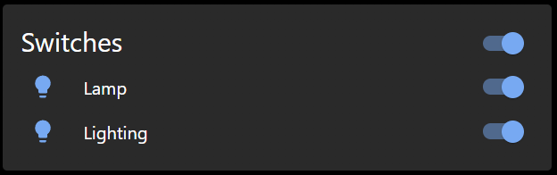

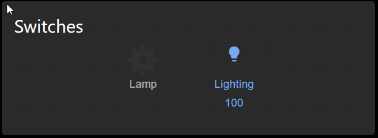

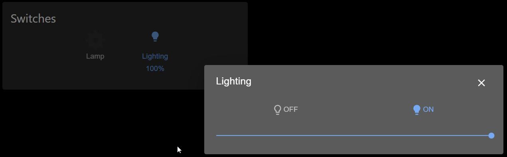

### Clock

-   Analog

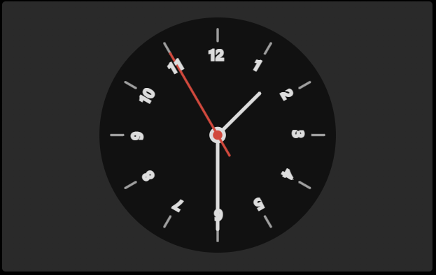

-   Analog variation

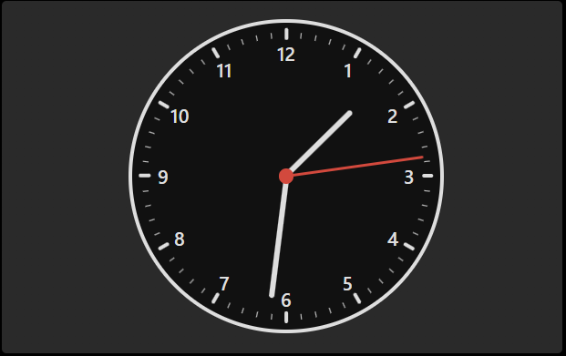

-   Digital

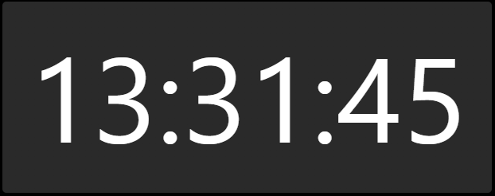

-   Digital2 (SVG Text)

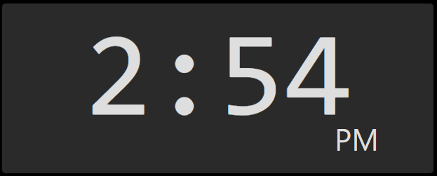

### Simple state

With this widget, you can control one device. Boolean or number.

-   Number

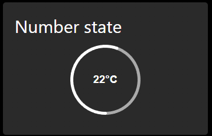

-   Control

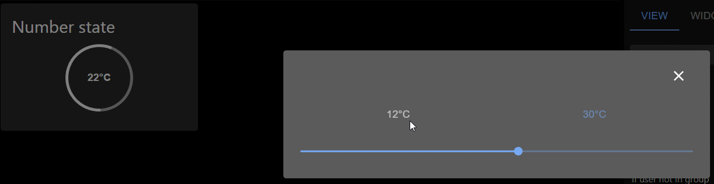

### View in widget

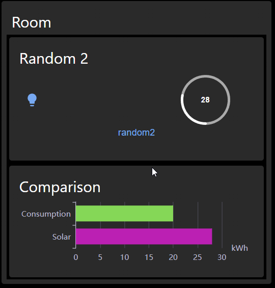

Not as a button: View could be shown in full size, and you can control elements in view.

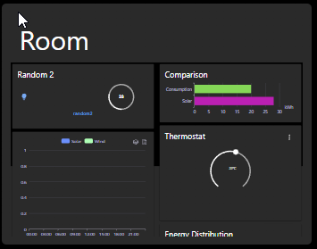

As button: You can show a small thumbnail of view, and by pressing on it, it will be shown in full size.

### Thermostat

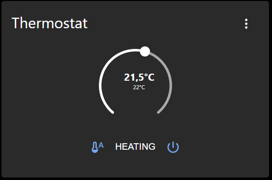

Additionally, it can show a history if you activated it.

### Actual value with chart

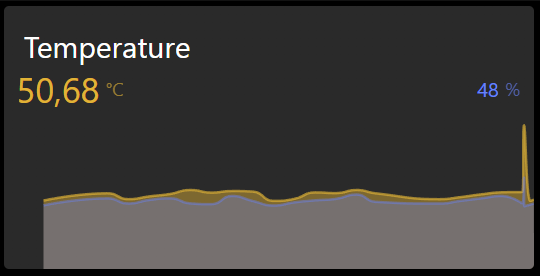

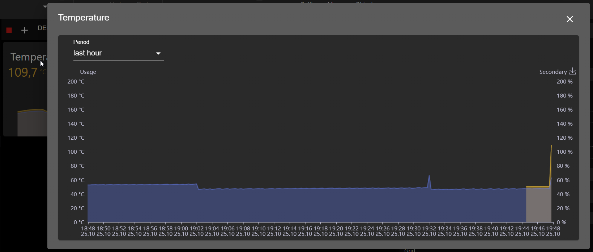

### Security control

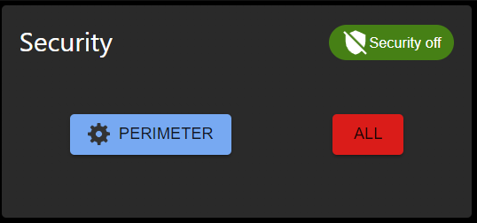

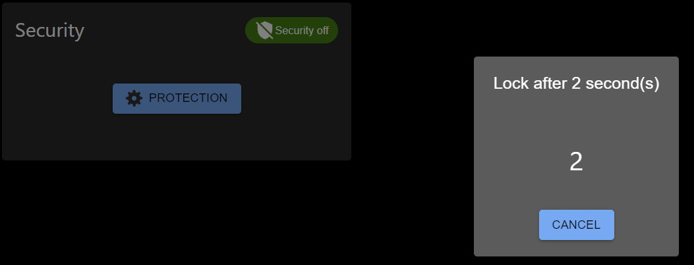

You can define the delay in seconds.

By activation, the defined ID will be written with the number of the delay seconds,
and after the delay is over, the defined ID will be set to 0, and the alarm ID will be set to true.

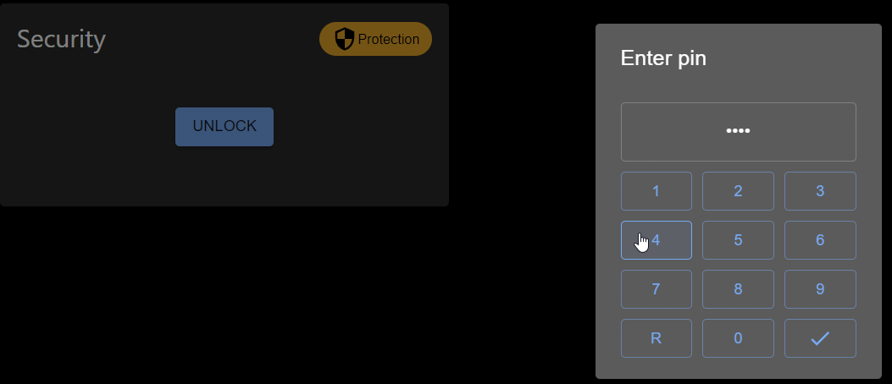

### Player

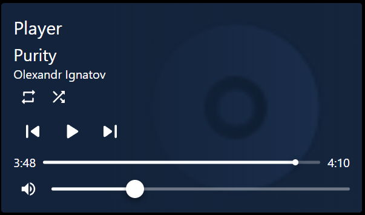

### Map

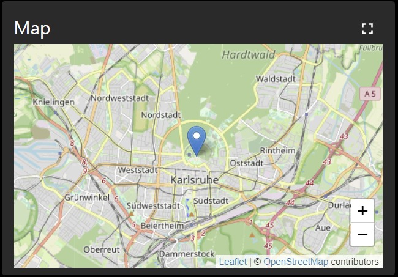

Position could be defined as a combined state, like `9.2344;41.374652` - `longitude;latitude` or as two separate states.

### Camera

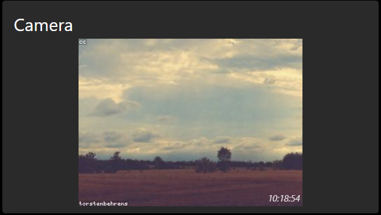

### HTML Template

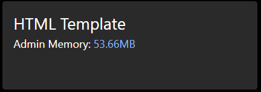

HTML template can be used to show any HTML code.
Additionally, you can show an image or iframe with this widget too.

### Blinds

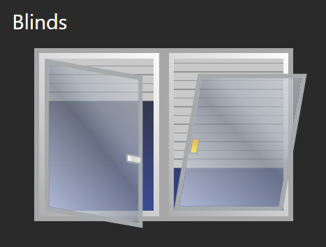

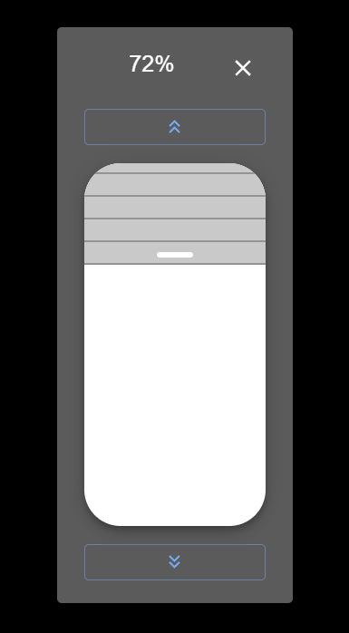

### Color Lamp

With the RGB lamp widget, you can control different types of RGB lamps. Here are some examples:

-   RGB colors are set in one state like '#RRGGBB'
-   R/G/B colors are set in different states from 0 to 255
-   RGBW as one variable like '#RRGGBBWW'
-   R/G/B/W colors are set in different states from 0 to 255
-   hue/sat/lum as 3 different states
-   color temperature as one state from 2700 to 6500 or defined by min/max of the object
-   White mode state can be used to switch between RGB and white mode via a special state

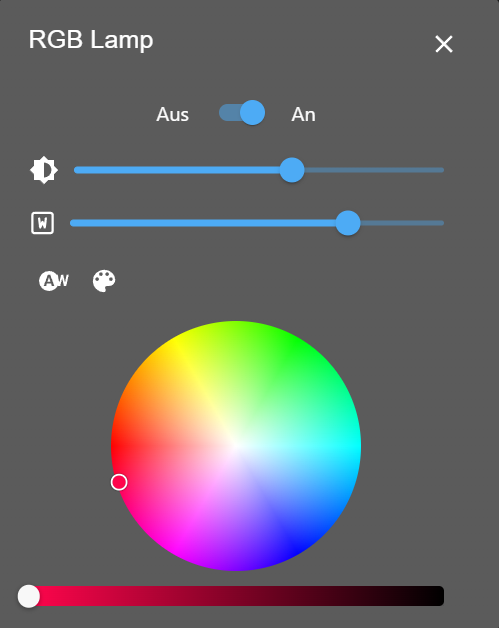

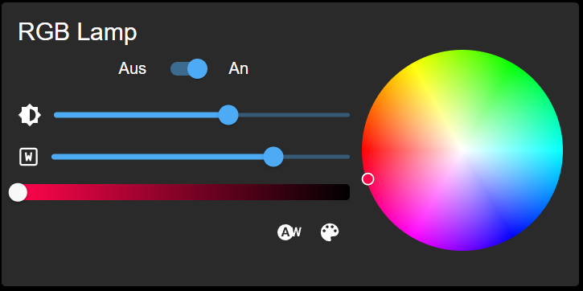

### Door lock

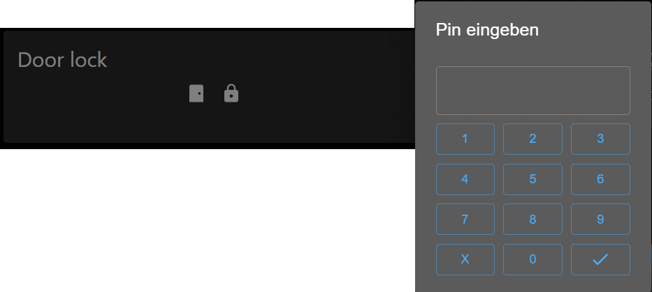

### Vacuum cleaner

This widget is primary for Xiaomi vacuum cleaner. But it can be used for any other vacuum cleaner too.

The only difference is that Xiaomi supports the room cleaning.

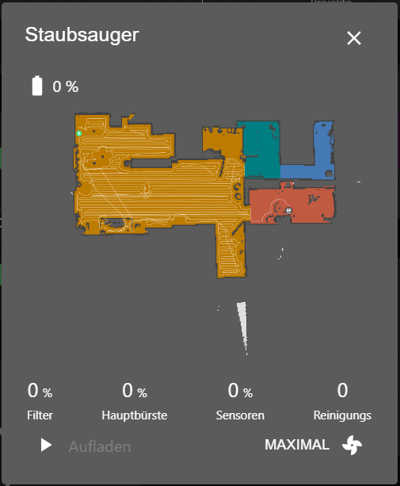

### Time picker

## Todo

-   Extend Blinds with shutter
<!--
    Placeholder for the next version (at the beginning of the line):
    ### **WORK IN PROGRESS**
-->

## Changelog
### 1.6.7 (2026-05-17)

-   (@GermanBluefox) Corrected error with button and alarm widget

### 1.6.1 (2026-03-14)

-   (@GermanBluefox) Corrected error with select value widget

### 1.6.0 (2025-09-03)

-   (@GermanBluefox) Corrected "Actual" widget

### 1.5.3 (2025-08-27)
-   (@GermanBluefox) Added support for older Android devices

### 1.5.0 (2025-05-19)

-   (bluefox) Corrected thermostat slider
-   (bluefox) Rewritten with TypeScript and vite
-   (bluefox) Corrected blinds control
-   (bluefox) Added disabled mode additionally to hidden mode in the 'switches and buttons' widget
-   (bluefox) Added `_ts=Date.now()` to camera URL to disable the browser cache
-   (bluefox) Simple state has a new option - step
-   (bluefox) Added new navigation widget: jump to view, url or list of views

[Older changelogs can be found there](CHANGELOG_OLD.md)## License

The MIT License (MIT)

Copyright (c) 2022-2026 Denis Haev <dogafox@gmail.com>

Permission is hereby granted, free of charge, to any person obtaining a copy
of this software and associated documentation files (the "Software"), to deal
in the Software without restriction, including without limitation the rights
to use, copy, modify, merge, publish, distribute, sublicense, and/or sell
copies of the Software, and to permit persons to whom the Software is
furnished to do so, subject to the following conditions:

The above copyright notice and this permission notice shall be included in
all copies or substantial portions of the Software.

THE SOFTWARE IS PROVIDED "AS IS", WITHOUT WARRANTY OF ANY KIND, EXPRESS OR
IMPLIED, INCLUDING BUT NOT LIMITED TO THE WARRANTIES OF MERCHANTABILITY,
FITNESS FOR A PARTICULAR PURPOSE AND NONINFRINGEMENT. IN NO EVENT SHALL THE
AUTHORS OR COPYRIGHT HOLDERS BE LIABLE FOR ANY CLAIM, DAMAGES OR OTHER
LIABILITY, WHETHER IN AN ACTION OF CONTRACT, TORT OR OTHERWISE, ARISING FROM,
OUT OF OR IN CONNECTION WITH THE SOFTWARE OR THE USE OR OTHER DEALINGS IN
THE SOFTWARE.
