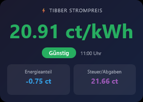
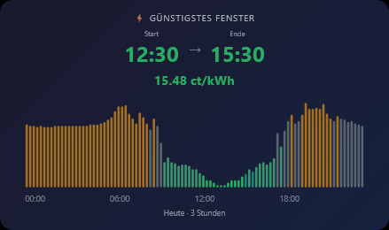
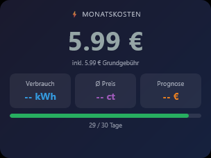

# ioBroker.vis-2-widgets-tibberlink

**Tests:** 

## vis-2-widgets-tibberlink adapter for ioBroker

VIS-2 widgets for visualizing Tibber dynamic electricity tariff data: current price, cheapest time window and monthly cost.

More information about Tibber and its dynamic tariffs: <https://tibber.com/>

## Prerequisites

This widget adapter does **not** fetch any data from Tibber itself. It reads states that are created by the data adapter [`iobroker.tibberlink`](https://github.com/hombach/ioBroker.tibberlink). Install and configure `tibberlink` before using these widgets:

1. Install `iobroker.tibberlink` and enter your Tibber API token (from <https://developer.tibber.com/settings/accesstoken>).
2. In the tibberlink settings, enable **"Historical consumption data retrieval"** and set the daily dataset count to at least 31 (required for Widget 3).
3. The price widgets (Widget 1 and 2) work automatically once tibberlink is running — no Calculator channels are needed.

Your **Home ID** is the UUID visible in the ioBroker objects tree under `tibberlink.0.Homes.<UUID>`, e.g. `xxxxxxxx-xxxx-xxxx-xxxx-xxxxxxxxxxxx`.

## Widgets

### Widget 1 — Current Tibber Price

Displays the current electricity price in large text, a colour-coded level badge (VERY_CHEAP … VERY_EXPENSIVE), the valid-from time, and an optional cost breakdown.

| Option | Default | Description |
|---|---|---|
| `oid_total` | `…CurrentPrice.total` | Total price in €/kWh |
| `oid_energy` | `…CurrentPrice.energy` | Energy component in €/kWh |
| `oid_tax` | `…CurrentPrice.tax` | Tax / surcharges in €/kWh |
| `oid_level` | `…CurrentPrice.level` | Price level string |
| `oid_startsAt` | `…CurrentPrice.startsAt` | ISO timestamp of current hour |
| `show_breakdown` | `true` | Show energy and tax tiles |
| `currency` | `ct/kWh` | Unit label shown after the price |
| `tib_darkmode` | `true` | Dark (default) or light theme |

---

### Widget 2 — Cheapest Time Window

Uses a sliding-window algorithm to find the cheapest consecutive N-hour block in today's (and optionally tomorrow's) price data. Displays start and end time, average price, and a colour-coded sparkline bar chart. Slot duration (15 min / 60 min) is auto-detected.

| Option | Default | Description |
|---|---|---|
| `oid_prices_today` | `…PricesToday.json` | JSON array of today's price slots |
| `oid_prices_tomorrow` | `…PricesTomorrow.json` | JSON array of tomorrow's price slots |
| `amount_hours` | `3` | Window size in hours |
| `future_only` | `true` | Ignore slots that have already ended |
| `show_tomorrow` | `true` | Include tomorrow's prices |
| `tib_darkmode` | `true` | Dark (default) or light theme |

---

### Widget 3 — Live Power Consumption

Shows real-time power draw in large text alongside minimum, average, and maximum values and the accumulated daily consumption and cost. Requires a **Tibber Pulse** device connected to your meter.

| Option | Default | Description |
|---|---|---|
| `oid_power` | `…LiveMeasurement.power` | Current power in W |
| `oid_minpower` | `…LiveMeasurement.minPower` | Session minimum in W |
| `oid_avgpower` | `…LiveMeasurement.averagePower` | Session average in W |
| `oid_maxpower` | `…LiveMeasurement.maxPower` | Session maximum in W |
| `oid_consumption` | `…LiveMeasurement.accumulatedConsumption` | Daily consumption in kWh |
| `oid_cost` | `…LiveMeasurement.accumulatedCost` | Daily cost in € |
| `tib_darkmode` | `true` | Dark (default) or light theme |

---

### Widget 4 — Monthly Electricity Cost

Aggregates the tibberlink `jsonDaily` consumption data for the current calendar month. Shows total cost, total consumption, average price, an end-of-month projection, and a progress bar indicating how far through the month you are. Requires **"Historical consumption data retrieval"** enabled in tibberlink with a daily dataset count of at least 31.

| Option | Default | Description |
|---|---|---|
| `oid_jsonDaily` | `…Consumption.jsonDaily` | JSON array of daily consumption records |
| `currency_symbol` | `€` | Currency symbol shown after amounts |
| `show_base_fee` | `false` | Add a fixed monthly base fee to totals |
| `base_fee_per_month` | `0` | Base fee in € (used when `show_base_fee` is on) |
| `tib_darkmode` | `true` | Dark (default) or light theme |

## Changelog
### **WORK IN PROGRESS**
- (copilot) Adapter requires node.js >= 22 now

### 0.4.5 (2026-04-29)
* (ssbingo) Fix common.news to remove unpublished versions; fix Dependabot config for src-widgets

### 0.4.4 (2026-04-29)
* (ssbingo) Fix widget build output directory so vis-2 can load customWidgets.js from the correct path

### 0.4.3 (2026-04-29)
* (ssbingo) Add widget screenshots to documentation

### 0.4.2 (2026-04-29)
* (ssbingo) Fix widget file path so vis-2 can load customWidgets.js correctly

### 0.4.1 (2026-04-29)
* (ssbingo) Fix live view widget positioning; fix monthly cost widget showing previous month instead of current month

### 0.4.0 (2026-04-28)
* (ssbingo) Migrate all widgets to React/Module Federation (proper install/uninstall lifecycle, no more widgets.html patching)

### 0.3.3 (2026-04-26)
* (ssbingo) Update documentation

### 0.3.2 (2026-04-26)
* (ssbingo) Widget 2: replace price chart with TibberCheapestWindow (cheapest N-hour sliding window with sparkline)

### 0.3.1 (2026-04-25)
* (ssbingo) Widget 1: rename oid_price→oid_total, add oid_startsAt, show_breakdown and currency options

### 0.3.0 (2026-04-24)
* (ssbingo) New widget: monthly electricity cost with consumption, avg. price and projection

Older changelog entries are in [CHANGELOG_OLD.md](CHANGELOG_OLD.md).

## Documentation

- 🇬🇧 English — this file
- 🇩🇪 [Deutsch](docs/de/README.md)
- 🇷🇺 [Русский](docs/ru/README.md)
- 🇳🇱 [Nederlands](docs/nl/README.md)
- 🇫🇷 [Français](docs/fr/README.md)
- 🇮🇹 [Italiano](docs/it/README.md)
- 🇪🇸 [Español](docs/es/README.md)
- 🇵🇱 [Polski](docs/pl/README.md)
- 🇵🇹 [Português](docs/pt/README.md)
- 🇺🇦 [Українська](docs/uk/README.md)
- 🇨🇳 [简体中文](docs/zh-cn/README.md)

## License
MIT License

Copyright (c) 2026 ssbingo <s.sternitzke@online.de>

Permission is hereby granted, free of charge, to any person obtaining a copy
of this software and associated documentation files (the "Software"), to deal
in the Software without restriction, including without limitation the rights
to use, copy, modify, merge, publish, distribute, sublicense, and/or sell
copies of the Software, and to permit persons to whom the Software is
furnished to do so, subject to the following conditions:

The above copyright notice and this permission notice shall be included in all
copies or substantial portions of the Software.

THE SOFTWARE IS PROVIDED "AS IS", WITHOUT WARRANTY OF ANY KIND, EXPRESS OR
IMPLIED, INCLUDING BUT NOT LIMITED TO THE WARRANTIES OF MERCHANTABILITY,
FITNESS FOR A PARTICULAR PURPOSE AND NONINFRINGEMENT. IN NO EVENT SHALL THE
AUTHORS OR COPYRIGHT HOLDERS BE LIABLE FOR ANY CLAIM, DAMAGES OR OTHER
LIABILITY, WHETHER IN AN ACTION OF CONTRACT, TORT OR OTHERWISE, ARISING FROM,
OUT OF OR IN CONNECTION WITH THE SOFTWARE OR THE USE OR OTHER DEALINGS IN THE
SOFTWARE.