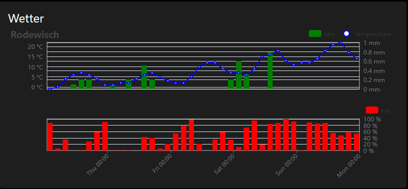
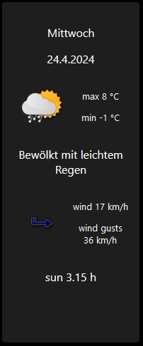
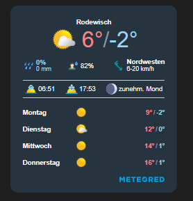
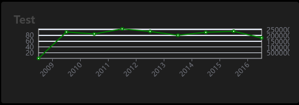
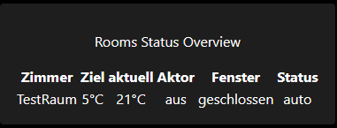
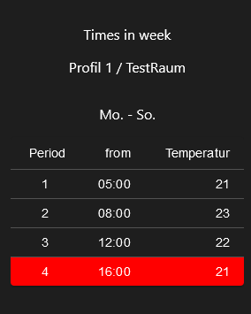
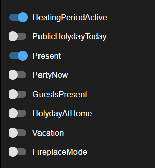
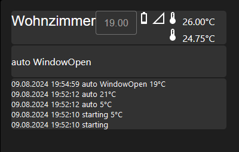
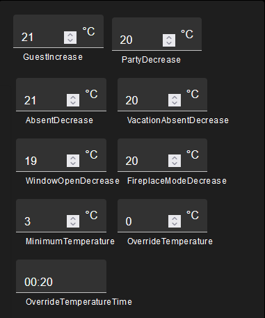
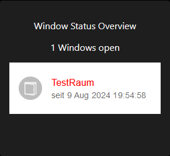

# ioBroker.vis-2-widgets-weather-and-heating

 

**If you like it, please consider a donation:**
                                                                          
 

## weather

This vis-2-widget shows weather forecast data from DasWetter.com or weatherunderground.
You need DasWetter-Adapter or weatherunderground-Adapter running on your system.

### weather

* OID's are automatically set based on general settings
* x axis labels can be configured according [momentjs docu](http://momentjs.com/docs/#/displaying/format/) 

### weather day

* OID's are automatically set based on general settings
* icon sets are changeable

### Meteored weather widget
see [METEORED](https://www.daswetter.com/users/widget) for more information.

You must create your widget on METEORED and get the ID for the widget. This ID must be set in the widget settings here.
Do not forget to whitelist your domain in METEORED settings. In my case I had to whitelist `https://192.168.xxx.xxx:8082` to get the widget running.

## general chart

### input data for general chart

* "OID data serie" should point to data point like `sbfspot.0.xxxxxxxx.history.years`
* data point should contain key / value pairs like

 [{"year":"2008","value":7000},{"year":"2009","value":2309000},{"year":"2010","value":4445000},{"year":"2011","value":7019000},{"year":"2012","value":9371000},{"year":"2013","value":11393000},{"year":"2014","value":13666000},{"year":"2015","value":16034000},{"year":"2016","value":17826790}]

* it's possible to auto calculate and show differences of values. Just tick "difference calculation" in settings.

* it supports adapter `sbfspot` and `ebus`: just select instance, and basic adjustments are done automatically

## heating (widgets for HeatingControl adapter)

Based on [Pittini's](https://github.com/Pittini/iobroker-heatingcontrol-vis) project for old VIS there are similar widgets available for VIS-2 now.

### Room Overview

### Heating Time Schedule

### General Parameter

### Room

### Room Profile Paeameter

### Window Status Overview 

<!--
    ### **WORK IN PROGRESS**
-->

## Changelog
### 1.4.0 (2026-05-26)
* (René) see #174: unused empty space in weather widget removed
* (René) dependencies updated

### 1.3.0 (2026-01-03)
* (René) dependencies updated
* (René) update echarts@6.0.
* (H5N1v2) 41 icons for DasWetter@4.x (galeria7)
* (René) optimisations based on mui@7.x in WeatherDay-widget
* (René) weather widget shows now min and max temperature (if values available)

### 1.2.1 (2025-12-30)
* (René) bug fix deployment and dependencies updated
* (René) update to support DasWetter@4.x
known issue: Icons are not updated yet.
* (René, copilot) fixes based on Lint recommendation

### 1.1.5 (2025-10-26)
* (René) dependencies updated and bug fix based on adapter checker and linter

### 1.1.3 (2025-09-06)
* (René) dependencies updated and bug fix based on adapter checker

[Older changelogs can be found there](CHANGELOG_OLD.md)## License
The MIT License (MIT)

Copyright (c) 2024-2026 rg-engineering <info@rg-engineering.eu>

Permission is hereby granted, free of charge, to any person obtaining a copy
of this software and associated documentation files (the "Software"), to deal
in the Software without restriction, including without limitation the rights
to use, copy, modify, merge, publish, distribute, sublicense, and/or sell
copies of the Software, and to permit persons to whom the Software is
furnished to do so, subject to the following conditions:

The above copyright notice and this permission notice shall be included in
all copies or substantial portions of the Software.

THE SOFTWARE IS PROVIDED "AS IS", WITHOUT WARRANTY OF ANY KIND, EXPRESS OR
IMPLIED, INCLUDING BUT NOT LIMITED TO THE WARRANTIES OF MERCHANTABILITY,
FITNESS FOR A PARTICULAR PURPOSE AND NONINFRINGEMENT. IN NO EVENT SHALL THE
AUTHORS OR COPYRIGHT HOLDERS BE LIABLE FOR ANY CLAIM, DAMAGES OR OTHER
LIABILITY, WHETHER IN AN ACTION OF CONTRACT, TORT OR OTHERWISE, ARISING FROM,
OUT OF OR IN CONNECTION WITH THE SOFTWARE OR THE USE OR OTHER DEALINGS IN
THE SOFTWARE.
