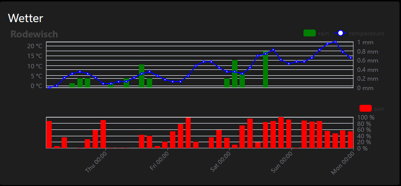
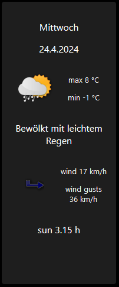
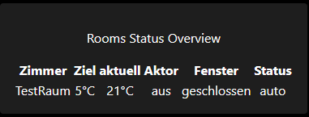
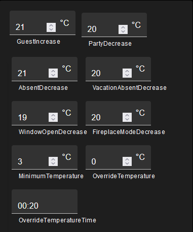
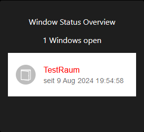

# ioBroker.vis-2-widgets-weather-and-heating

 

**If you like it, please consider a donation:**
                                                                          
 

This vis-2-widget shows weather forecast data from DasWetter.com or weatherunderground.
You need DasWetter-Adapter or weatherunderground-Adapter running on your system.

## weather

### weather

* OID's are automatically set based on general settings
* x axis labels can be configured according [momentjs docu](http://momentjs.com/docs/#/displaying/format/) 

### weather day

* OID's are automatically set based on general settings
* icon sets are changeable

## general chart

### input data for general chart

* "OID data serie" should point to data point like `sbfspot.0.xxxxxxxx.history.years`
* data point should contain key / value pairs like

 [{"year":"2008","value":7000},{"year":"2009","value":2309000},{"year":"2010","value":4445000},{"year":"2011","value":7019000},{"year":"2012","value":9371000},{"year":"2013","value":11393000},{"year":"2014","value":13666000},{"year":"2015","value":16034000},{"year":"2016","value":17826790}]

* it's possible to auto calculate and show differences of values. Just tick "difference calculation" in settings.

* it supports adapter `sbfspot` and `ebus`: just select instance, and basic adjustments are done automatically

## heating (widgets for HeatingControl adapter)

Based on [Pittini's](https://github.com/Pittini/iobroker-heatingcontrol-vis) project for old VIS there are similar widgets available for VIS-2 now.

### Room Overview

### Heating Time Schedule

### General Parameter

### Room

### Room Profile Paeameter

### Window Status Overview 

<!--
    ### **WORK IN PROGRESS**
-->

## Changelog
### 0.9.1 (2025-01-12)
 * (René) bug fix: support darkmode for time picker

### 0.9.0 (2025-01-11)
 * (René) see issue #66: Heating Time Schedule and Profile Params widget - option to use select box for temperature adjustment like Pittini vis
 * (René) see issue #66: Heating Time Schedule and Profile Paramswidget - option to use time picker for time adjustments

### 0.8.1 (2024-12-27)
 * (René) update dependencies
 * (René) see issue #66: Heating Time Schedule widget - uses minimum temperature from adapter for input value range
 * (René) see issue #66: Heating Time Schedule widget - step width for temperature adjustable (1°C or 0.5°C)
 * (René) translations

### 0.8.0 (2024-11-24)
 * (René) see issue #60: add missing module

### 0.7.7 (2024-10-27)
 * (René) show absolute / relative as info in Heating Room Profile Params widget
 * (René) Heating Time Schedule: copy periods added

### 0.7.6 (2024-10-20)
 * (René) added missing svg's
 * (René) see issue #55 and #50: in some widgets color configuration added (text and background)
 * (René) see issue #55: bug fix to show icon in Heating Window Status widget
 * (René) see issue #55: in weather widget position of y axis (left or right) adjustable

### 0.7.4 (2024-10-11)
 * (René) see issue #51: weather widget: title not shown at all, if no string available or no OID set
 * (René) see issue #51: weather widget: color for title and axis lables adjustable
 * (René) see issue #53: wrong icon (weather and wind) shown in WeatherDayWidget fixed

### 0.7.3 (2024-09-28)
 * (René) add missing translations

### 0.7.2 (2024-09-15)
 * (René) bug fix to show widgets in runtime too

### 0.7.0 (2024-08-23)
 * (René) bug fix images
 * (René) Icons and translations
 * (René) Heating General Parameter: show paramter only if OID is set
 * (René) Heating Room Profile Parameter: show paramter only if OID is set
 * (Bluefox) Typos, Refactoring, Formating

### 0.6.0 (2024-08-18)
 * (René) widget set renamed again because adapter checker doesn't accept the name
 * (René) Icons and translations
 * (René) readme update
 * (René) heating time schedule widget overworked

### 0.5.0 (2024-08-08)
 * (René) widget Heating Room Status overview overworked (works only with HeatingControl@1.12.9)
 * (René) show number of open windows in Heating Window Status Overview
 * (René) widget Heating Room overworked

### 0.4.0 (2024-07-27)
 * (René) widget set renamed to weather and heating, because two widget sets are available
 * (René) bug fix icon in weather day widget
 * (René) heating and weather widgets sets are separeted
 * (René) Heating General Params Widget get and set values fixed
 * (René) Heating Room Profile Params Widget get and set values fixed

### 0.3.3 (2024-07-12)
 * (René) Heating Rooms Overview widget completed
 * (René) Heating Windows Status Overview widget completed
 * (René) Heating Room widget completed

### 0.3.2 (2024-06-30)
* (René) Heating General Params widget added
* (René) Heating Room widget adde
* (René) Heating Rooms Overview widget added
* (René) Heating Room Profile Params widget added
* (René) Heating Windows Status Overview widget added

### 0.3.1 (2024-06-08)
* (René) translations

### 0.3.0 (2024-06-08)
* (René) Heating TimeSchedule widget added

### 0.2.10 (2024-05-24)
* (René) general diagram widget: support ebus (needs ebus version 3.3.0)
* (René) general diagram widget: auto unit calculation as an option

### 0.2.9 (2024-05-23)
* (René) general diagram widget: x axis label format adjustable
* (René) general diagram widget: support sbfspot (needs sbfspot version 4.3.1)

### 0.2.8 (2024-05-19)
* (René) X axis label format adjustable

### 0.2.7 (2024-05-19)
* (René) adaption for weatherunderground
* (René) bug fix: show legend in graph again, was missing after translations
* (René) smaller bug fixes
* (René) dependencies updated

### 0.2.4 (2024-05-04)
* (René) ready for first deployment

### 0.2.1 (2024-05-01)
* (René) translations and icons

### 0.2.0 (2024-04-26)
* (René) initial release

## License
The MIT License (MIT)

Copyright (c) 2024 - 2025 rg-engineering <info@rg-engineering.eu>

Permission is hereby granted, free of charge, to any person obtaining a copy
of this software and associated documentation files (the "Software"), to deal
in the Software without restriction, including without limitation the rights
to use, copy, modify, merge, publish, distribute, sublicense, and/or sell
copies of the Software, and to permit persons to whom the Software is
furnished to do so, subject to the following conditions:

The above copyright notice and this permission notice shall be included in
all copies or substantial portions of the Software.

THE SOFTWARE IS PROVIDED "AS IS", WITHOUT WARRANTY OF ANY KIND, EXPRESS OR
IMPLIED, INCLUDING BUT NOT LIMITED TO THE WARRANTIES OF MERCHANTABILITY,
FITNESS FOR A PARTICULAR PURPOSE AND NONINFRINGEMENT. IN NO EVENT SHALL THE
AUTHORS OR COPYRIGHT HOLDERS BE LIABLE FOR ANY CLAIM, DAMAGES OR OTHER
LIABILITY, WHETHER IN AN ACTION OF CONTRACT, TORT OR OTHERWISE, ARISING FROM,
OUT OF OR IN CONNECTION WITH THE SOFTWARE OR THE USE OR OTHER DEALINGS IN
THE SOFTWARE.
