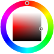

# ioBroker.vis-colorpicker

  

Color selector widgets for [ioBroker.vis](https://github.com/ioBroker/ioBroker.vis) and
[ioBroker.vis-2](https://github.com/ioBroker/ioBroker.vis-2)

Nine widgets to set and to show a colour: three general colour pickers, one for Homematic lights and five for
Philips HUE lights.

## vis and vis-2

The adapter ships every widget twice:

- **vis (vis-1)** uses the EJS/jQuery widget set in `widgets/colorpicker.html`, which loads spectrum, jscolor,
  farbtastic and the CIE helper of huepi.
- **vis-2** uses the React widget set in `widgets/vis-2-widgets-colorpicker/`, built from `src-widgets/`. It
  needs no jQuery and no third-party picker at all - the pickers are drawn with CSS and one canvas.

Both declare the same widget ids (`tplRGBSpectrum`, `tplSpectrumHomematic`, `tplRGBFarbtastic`, `tplJscolor`,
`tplHUEjscolor`, `tplHUEPickerXY`, `tplHUEIndicatorXY`, `tplHUEPickerCT`, `tplHUEIndicatorCT`) and the same
attribute names, and vis-2 prefers a React widget over an EJS one. So a project made with vis keeps working after
switching to vis-2 - the widgets simply render with the React implementation.

The React widgets need vis-2 2.12.8 or newer. With an older vis-2 the EJS widgets are used.

## Documentation

Every widget with its settings and screenshots: [English](/#/docs/adapterref/iobroker.vis-colorpicker/docs/en/README.md) | [Deutsch](https://github.com/ioBroker/ioBroker.vis-colorpicker/blob/master/docs/de/README.md)

<!--
    Placeholder for the next version (at the beginning of the line):
    ### **WORK IN PROGRESS**
-->

## Changelog
### **WORK IN PROGRESS**
* (bluefox) All nine widgets were ported to vis-2 as React widgets, without jQuery, spectrum, jscolor and farbtastic
* (bluefox) The widgets of a vis-1 project keep all their settings: same widget ids, same attribute names
* (bluefox) The CT indicator is a React widget as well, although its vis-1 template is marked with `data-vis-2-ignore`
* (bluefox) Added the setting "Picker in the widget", which shows the colour picker instead of a small colour box
* (bluefox) Added "Unit" (mired or Kelvin) and the range "Warmest"/"Coldest" to the two color temperature widgets
* (bluefox) The gamut letters A, B and C are recognized now, not only the model ids of the lamps
* (bluefox) The pickers follow touch and pen, and they no longer re-compute the whole colour field on every change
* (bluefox) The colour is only written every 200 ms while dragging, and once more when the pointer is released
* (bluefox) The widget settings are translated in eleven languages
* (bluefox) Added documentation with screenshots for every widget (English and German)
* (bluefox) Fixed the color wheel: it really writes and reads hue/saturation/brightness now
* (bluefox) Fixed the divisor of the Philips HUE widget, the rounding of saturation and lightness of the spectrum, and the hue, which was written as text
* (bluefox) "level" is only sent to a HUE lamp if a Level ID is configured, so a colour change does not set the brightness
* (bluefox) Updated the CI to the current ioBroker actions and added a CodeQL workflow

### 2.1.0 (2025-11-25)
* (oweitman) loaded an additional javascript file for the widget jscolorcie to fix

### 2.0.3 (2023-03-17)
* (bluefox) Made it work with vis-2.0

### 1.2.0 (2020-04-14)
* (bluefox) Corrected html structure

### 1.1.1 (2016-11-30)
* (Pmant) add new hue bulbs and fix gamut

### 1.1.0 (2016-05-31)
* (Pmant) add homematic colorpicker

### 1.0.2 (2016-05-20)
* (bluefox) Fix Philips HUE Colorpicker

### 1.0.0 (2016-05-19)
* (bluefox) rewrite all widgets

### 0.2.0 (2016-05-15)
* (Pmant) add hue CIE picker

### 0.1.3 (2016-01-25)
* (bluefox) add precision

### 0.1.2 (2016-01-25)
* (bluefox) enable ID Select dialog

### 0.1.1 (2015-09-27)
* (bluefox) update packets

### 0.1.0 (2015-07-09)
* (bluefox) initial checkin

## License
The MIT License (MIT)

Copyright (c) 2013-2026 Bluefox https://github.com/GermanBluefox,
              2013-2014 hobbyquaker https://github.com/hobbyquaker

Permission is hereby granted, free of charge, to any person obtaining a copy
of this software and associated documentation files (the "Software"), to deal
in the Software without restriction, including without limitation the rights
to use, copy, modify, merge, publish, distribute, sublicense, and/or sell
copies of the Software, and to permit persons to whom the Software is
furnished to do so, subject to the following conditions:

The above copyright notice and this permission notice shall be included in all
copies or substantial portions of the Software.

THE SOFTWARE IS PROVIDED "AS IS", WITHOUT WARRANTY OF ANY KIND, EXPRESS OR
IMPLIED, INCLUDING BUT NOT LIMITED TO THE WARRANTIES OF MERCHANTABILITY,
FITNESS FOR A PARTICULAR PURPOSE AND NONINFRINGEMENT. IN NO EVENT SHALL THE
AUTHORS OR COPYRIGHT HOLDERS BE LIABLE FOR ANY CLAIM, DAMAGES OR OTHER
LIABILITY, WHETHER IN AN ACTION OF CONTRACT, TORT OR OTHERWISE, ARISING FROM,
OUT OF OR IN CONNECTION WITH THE SOFTWARE OR THE USE OR OTHER DEALINGS IN THE
SOFTWARE.