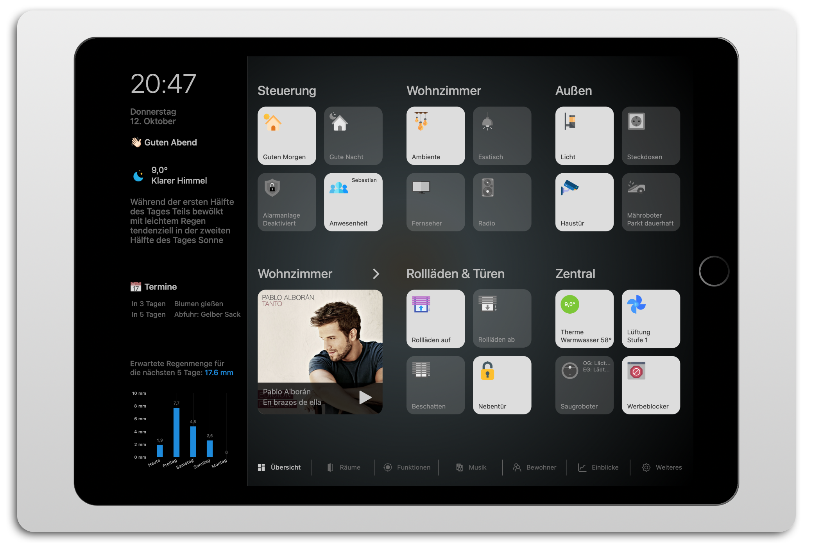

# ioBroker.vis-homekittiles



[](https://www.npmjs.com/package/iobroker.vis-homekittiles)
[](https://www.npmjs.com/package/iobroker.vis-homekittiles)


[](https://nodei.co/npm/iobroker.vis-homekittiles/)

**Tests:** 

## 🇺🇸 HomeKit-Tiles for ioBroker-VIS

Homekit Tiles is a widget set based on the design of Apple HomeKit.
The special feature of the widgets is that they do not contain any fixed style elements, but everything is formatted using CSS. As a result, there are no separate settings in the VIS editor for the position and/or size of the icons, labels, etc. The design is adjusted by changing the CSS code. For this purpose, the CSS code from the file `/widgets/homekittiles/css/style.css` can be used as a template. The code is inserted into the CSS tab in the VIS editor and can be customized as desired. It is also possible to add your own CSS classes via the VIS editor in the "General" section of the widgets.

The widgets are designed for VIS 1.x.

**Note:** For licensing reasons, no icons are included with this adapter. Very good sources for icons are:

* [https://www.flaticon.com](https://www.flaticon.com)
* [https://icons8.com](https://icons8.com)

## Widget types

### hkt-Notification


Notification can be used to display notifications (similar to the red bubbles on cell phone apps) and positioned anywhere. It is ideal for use in combination with a navigation button to indicate that there are glitches/errors/important information on the corresponding view. 5 data points are supported, along with 5 different colors for the notifications. You can use checkboxes to select whether the notifications should also be displayed with the value `0`.

### hkt-Datepicker


The date picker can be used to select a date from the calendar; the widget uses the jqui date picker for this. Because this is very complex and should not be copied/recreated, and in order not to disrupt other VIS projects on the same system, the widget does not contain any built-in formatting for the Datepicker window. To still adjust the appearance, the following CSS code can be inserted into the VIS project:

```CSS
.ui-datepicker {
     padding: 0;
     font-size: 15px;
     border-radius: 5px;
     font-family: -apple-system;
     border: unset;
     background: unset;
     color: unset;
     background-color: #888;
}
.ui-datepicker .ui-datepicker-header {
     padding: .2em 0;
     border-radius: 5px 5px 0 0;
     color: unset;
     border: unset;
     background: unset;
     background-color: var(--hkt-color-tile-on-background);
     font-weight: bold;
}
.ui-datepicker .ui-datepicker-header .ui-datepicker-prev-hover,
.ui-datepicker .ui-datepicker-header .ui-datepicker-next-hover {
     border: unset;
     background: unset;
     font-weight: unset;
     color: unset;
     top: 2px;
}
.ui-datepicker .ui-datepicker-header .ui-datepicker-prev .ui-icon-circle-triangle-w,
.ui-datepicker .ui-datepicker-header .ui-datepicker-next .ui-icon-circle-triangle-e {
     background-image: unset;
}
.ui-datepicker .ui-datepicker-header .ui-datepicker-prev .ui-icon-circle-triangle-w:before {
     content: "";
     position: relative;
     width: 20px;
     height: 20px;
     display: block;
     color: #000;
     border-width: 3px 0 0 3px;
     border-color: #000;
     border-style: solid;
     transform: rotate(-45deg);
     top: -3px;
     left: 5px;
}
.ui-datepicker .ui-datepicker-header .ui-datepicker-next .ui-icon-circle-triangle-e:before {
     content: "";
     position: relative;
     width: 20px;
     height: 20px;
     display: block;
     color: #000;
     border-width: 3px 3px 0 0;
     border-color: #000;
     border-style: solid;
     transform: rotate(45deg);
     top: -3px;
     left: -12px;
}
.ui-datepicker .ui-state-default {
     border: unset;
     background: unset;
     font-weight: unset;
     color: unset;
}
.ui-datepicker .ui-datepicker-current-day {
     color: var(--hkt-color-tile-on-foreground);
     background-color: var(--hkt-color-tile-on-background);
     font-weight: bold;
}
.ui-datepicker .ui-datepicker-today {
     color: orange;
}
```

### hkt-Radiobuttons


Radio buttons are primarily used to switch predefined values for a state. The alignment of the buttons (next to one another or one below the other) does not happen automatically, but must be specified using a checkbox. The number of buttons can be set as required and the values that should be written to the state can be freely selected. In addition, it is possible to equip each button with a label and/or an icon. More functions:

* **Confirmed change:** shows an icon if the state's ack flag is not set (=unconfirmed change). The logic can be reversed using a checkbox so that the icon appears when the ack flag is set (=confirmed change). With another checkbox the icon can rotate permanently (CSS class `spin` is added). The Ack icon is added to each button in the source code, but with the included source code it is only displayed on the active button.

### hkt-Switch-Bool


The Switch-Bool widget serves as a simple on/off switch for states of type `boolean` and shows an icon. It has two label groups and an operation lock, which work as follows with the included CSS code:

* **Label Group 1:** appears at the bottom of the widget. "Label" (line 1) is fixed text. A second line can be defined using "Label 2" and composed of several elements (an introductory static text, value of a data point, unit of the value (appended to the value without spaces), additional text at the end).
* **Label Group 2:** appears at the top right of the widget and can display up to 3 additional pieces of information, configured in the same way as "Label 2". Depending on the widget size, the space is limited, but quite sufficient to display technical information (e.g. 'U: 230V, P: 12W').
* **Increment Value:** appears at the top right of the widget and displays two additional buttons labeled (+) and (-). By pressing these buttons the value of any state can be increased or decreased. This is ideal, for example, for changing a setpoint displayed in label group 1.
* **Block operation:** This setting makes it possible to prevent operation of the widget if the value of the state is `true` or `false`, so that, for example, a device with this widget can only be switched off but not switched on ( or the other way around). By activating both checkboxes, operation can be completely prevented and the widget only serves as a status display. Optionally, an additional icon can be displayed if operation is blocked. “Lock operation” also affects “Increment value”.
* **Confirmed change:** shows an icon if the state's ack flag is not set (=unconfirmed change). The logic can be reversed using a checkbox so that the icon appears when the ack flag is set (=confirmed change). With another checkbox the icon can rotate permanently (CSS class `spin` is added).

**Note:** the included CSS code does not provide for "Label Group 2", "Increment Value", "Lock Operation" and "Confirmed Change" to be used at the same time. However, this is possible by widening the widget and/or adapting the code.

### hkt-Value


The value widget is used to display values, primarily numerical values. It has two label groups and (+)/(-) buttons that work with the included CSS code as follows:

* **Label Group 1:** appears at the bottom of the widget. "Label" (line 1) is fixed text. A second line can be defined using "Label 2" and composed of several elements (an introductory static text, value of a data point, unit of the value (appended to the value without spaces), additional text at the end).
* **Label Group 2:** appears at the top right of the widget and can display up to 3 additional pieces of information, configured in the same way as "Label 2". Depending on the widget size, the space is limited, but quite sufficient to display technical information (e.g. 'H: 64%, Y: 10%').
* **Increment Value:** appears at the top right of the widget and displays two additional buttons labeled (+) and (-). By pressing these buttons the value of any state can be increased or decreased. This is ideal, for example, for changing a setpoint displayed in label group 1.

**Note:** the included CSS code does not specify that "Label Group 2" and "Increment Value" be used at the same time. However, this is possible by widening the widget or adapting the code.

### hkt-ViewInWidget-Dialog


The widget opens a dialog window that displays a different view. The dialog window does not have its own close button. This must be inserted into the displayed view. When opening and closing, any state can be set; the values written can be freely selected. Please note, however, that the value is only set when closing if the dialog window was closed using a dialog close button, but not when the entire VIS is reloaded.

The included CSS code works as follows:

* **Label Group 1:** appears at the bottom of the widget. "Label" (line 1) is fixed text. A second line can be defined using "Label 2" and composed of several elements (an introductory static text, value of a data point, unit of the value (appended to the value without spaces), additional text at the end).
* **Label Group 2:** appears at the top right of the widget and can display up to 3 additional pieces of information, configured in the same way as "Label 2". Depending on the widget size, the space is limited, but quite sufficient to display technical information (e.g. 'H: 64%, Y: 10%').
* **Dialog:** defines the properties of the dialog window. The properties "Dialog Height" and "Dialog Width" refer to the content of the displayed view. The title line is added to the total height. With the "Show arrow on dialog" property, an arrow can be added to the edge of the dialog window, creating the impression of a speech bubble.

### hkt-Settings-Bool


The Settings Bool widget serves as a simple on/off switch for boolean states and is intended for use on pages where multiple settings options are presented. It has an operating lock that works as follows with the included CSS code:

* **Block operation:** This setting makes it possible to prevent operation of the widget if the value of the state is `true` or `false`, so that, for example, a device with this widget can only be switched off but not switched on ( or the other way around). By activating both checkboxes, operation can be completely prevented and the widget only serves as a status display. Optionally, an additional icon can be displayed if operation is blocked.

### hkt-Settings-Value


The Settings Value widget is used to display values, primarily numerical values. It has (+)/(-) buttons that work as follows using the included CSS code:

* **Increment value:** In addition to the actual display value, two additional buttons labeled (+) and (-) are displayed. By pressing these buttons the value can be increased or decreased. * **Block operation:** This setting makes it possible to prevent operation of the widget if the value of the state is `true` or `false`, so that, for example, a device with this widget can only be switched off but not switched on ( or the other way around). By activating both checkboxes, operation can be completely prevented and the widget only serves as a status display. Optionally, an additional icon can be displayed if operation is blocked.

### hkt-Button-DialogClose


This button closes an open dialog window. If the button is placed outside the window, the widget ID of the dialog window must be specified.

### hkt-Button-Set


This widget creates an adjustable number of buttons, whereby each button can control its own state. Which value is written can be set for each button. By activating the "Close dialog" checkbox, the dialog window in which it is placed will be closed when the button is pressed.
The widget can also be placed outside of a dialog window, but then "Close dialog" has no function.

### hkt-Button-Navigation


The button calls up the set view.

### hkt-Button-Set-Navigation


The widget creates an adjustable number of buttons for navigation between different views. With the included CSS code, the arrangement of the buttons can be switched between horizontal and vertical using a checkbox. When arranged horizontally, the width of each button is set to 120px; when arranged vertically, the height of each button is set to 30px.

### hkt-ViewInWidget-Swipe

The widget is a container for subviews that are switched by scrolling. With the included CSS code, only part of a subview needs to be moved into the visible area, the scroll snap function takes care of the rest.