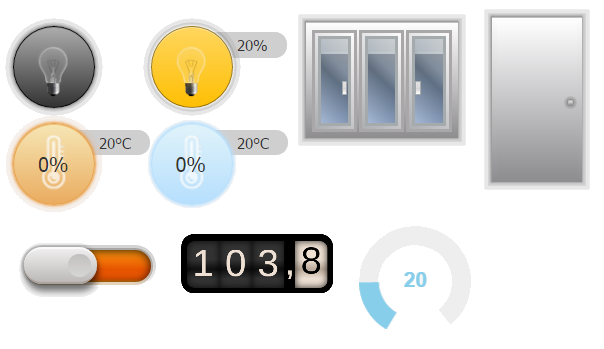

# ioBroker.vis-hqWidgets

  

`hqWidgets` - High quality widgets for [ioBroker.vis](https://github.com/ioBroker/ioBroker.vis) and
[ioBroker.vis-2](https://github.com/ioBroker/ioBroker.vis-2)

## vis and vis-2

The adapter ships every widget twice:

- **vis (vis-1)** uses the EJS/jQuery widget set in `widgets/hqwidgets.html`.
- **vis-2** uses the React widget set in `widgets/vis-2-widgets-hqwidgets/`, built from `src-widgets/`.

Both declare the same widget ids (`tplHqButton`, `tplHqDimmer`, …) and the same attribute names, and vis-2
prefers a React widget over an EJS one. So a project made with vis keeps working after switching to vis-2 - the
widgets simply render with the React implementation, without jQuery, jQuery UI, `jquery.knob` or `odometer.js`.

The React widgets need vis-2 2.12.8 or newer. With an older vis-2 the EJS widgets are used.

For one widget of the **vis-1** set the `jQuery.knob` plugin (MIT) from Anthony Terrien is used.
http://anthonyterrien.com/knob/ or https://github.com/aterrien/jQuery-Knob

## Documentation

Every widget with its settings and screenshots: [English](/#/docs/adapterref/iobroker.vis-hqwidgets/docs/en/README.md) | [Deutsch](https://github.com/ioBroker/ioBroker.vis-hqwidgets/blob/master/docs/de/README.md)

<!--
	Placeholder for the next version (at the beginning of the line):
	### **WORK IN PROGRESS**
-->

## Changelog
### **WORK IN PROGRESS**
* (bluefox) All widgets were ported to vis-2 as React widgets, without any jQuery based library
* (bluefox) The vis-2 palette shows a sharp preview and a short description for every widget
* (bluefox) Added documentation for every vis-2 widget with screenshots (English and German)
* (bluefox) Corrected spelling mistakes in the German labels of the widget settings
* (bluefox) The dimmer, the inner temperature and the circle knob now offer "Read only"
* (bluefox) The door widget now offers the signal object ID and the colour of the doorway
* (bluefox) The circle knob now shows the working, battery and signal indicators
* (bluefox) The odometer now offers the duration of the animation
* (bluefox) "Value for ON" / "Value for OFF" of the On/Off widget are used now - they were ignored before
* (bluefox) The control popup of the shutter widget is as big as in vis-1 again and stays inside the window
* (bluefox) Both sliders take the value of the position where the pointer is released
* (bluefox) The sashes of the shutter widget open like in vis-1 again, and a tilted window has a yellow handle
* (bluefox) The arc of the temperature widgets runs from blue to red now instead of through violet
* (bluefox) The frame colour of the shutter widget and the frame and leaf colour of the door widget can be set
* (bluefox) The buttons of the shutter popup got a flat, modern look
* (bluefox) Fixed the handle of an opened door, it was placed too far away from the edge
* (bluefox) The widgets follow the dark theme of vis-2: descriptions, the arc track, the signal and both popups
  adapt, the surfaces of the widgets themselves keep their colours
* (bluefox) The popups of the shutter and the lock close when clicking somewhere else in the view
* (bluefox) The adapter icon is an SVG now

### 1.6.1 (2026-04-11)
* (oweitman) Repair decimal places in odometer when leadingzeros=false

### 1.6.0 (2025-09-21)
* (bluefox) Optimization of button de-bouncing

### 1.5.1 (2024-03-07)
* (bluefox) Removed vis dependency and replaced with a message by installation or update if vis is not installed

### 1.4.0 (2023-05-03)
* (bluefox) Behavior of the dimmer was changed. If the current value is over 5% and the user clicks on dimmer, the dimmer will be set to 0%. If the current value is less than 5%, the dimmer will be set to 100%.

### 1.3.1 (2023-01-11)
* (bluefox) Added new parameter for dimmer

### 1.3.0 (2022-08-15)
* (bluefox) Made it compatible with `ioBroker.vis` v2

### 1.2.0 (2022-04-05)
* (bluefox) Removed the deprecated method `load`

### 1.1.9 (2021-10-20)
* (bluefox) Added the valve values from 0 to 1

### 1.1.7 (2020-10-31)
* (bluefox) Corrected the after comma digits for the valve

### 1.1.5 (2020-08-08)
* (mk176) Resolved the button even if the mouse is moved out

### 1.1.4 (2020-03-28)
* (bluefox) Fixed blinds widget

### 1.1.3 (2019-10-27)
* (bluefox) Preparations for js-controller 2.0. Check undefined and nulls.

### 1.1.2 (2018-06-09)
* (bluefox) Odometer was fixed while rendering in invisible state

### 1.1.1 (2017-10-18)
* (bluefox) Fix interval description for russian

### 1.0.11 (2017-09-18)
* (bluefox) Hide left description
* (Sebastian Rosenberg) added feature to select shutter popup window position.

### 1.0.10 (2017-08-12)
* (bluefox) Fix the window handle update

### 1.0.9 (2017-07-22)
* (bluefox) Small fixes for empty images

### 1.0.8 (2016-11-24)
* (bluefox) Reduce render interval

### 1.0.7 (2016-11-11)
* (bluefox) Allow setting of padding for description

### 1.0.6 (2016-10-11)
* (bluefox) Fix circle Knob if negative limits
* (bluefox) Fix first switch by checkbox

### 1.0.5 (2016-09-14)
* (bluefox) show "last action" fixed

### 1.0.4 (2016-09-13)
* (bluefox) fix problem in inner temperature if knob widget set installed
* (Jens Maus) removed all special IE5/6 CSS hacky statements with prepending asterisk (*) characters which are just producing CSS warnings on browsers like Safari.

### 1.0.3 (2016-05-30)
* (bluefox) fix initial value of shutter if inverted

### 1.0.2 (2016-05-30)
* (bluefox) change "last changed" to ms

### 1.0.1 (2016-05-26)
* (bluefox) add odometer widget

### 1.0.0 (2016-04-12)
* (bluefox) fix blinds - control z-index of widgets if a popup window opened
* (bluefox) add colorOn for checkbox

### 0.2.5 (2015-12-19)
* (bluefox) fix hqWidgets on/off

### 0.2.4 (2015-12-19)
* (bluefox) fix height of graphic dialog

### 0.2.3 (2015-12-19)
* (bluefox) add green and blue colors to checkbox
* (bluefox) working on lock
* (bluefox) add readOnly option to "on/off"

### 0.2.2 (2015-11-10)
(bluefox) fix checkbox

### 0.2.1 (2015-10-17)
(bluefox) enable description for door and shutter

### 0.2.0 (2015-10-14)
(bluefox) fix the problem with temperature if it was as string
(bluefox) make a popup window (shutter) with most z-index when showing them

### 0.1.10 (2015-10-12)
* (bluefox) fix door widget

### 0.1.9 (2015-10-05)
* (bluefox) fix update of temperature on widgets

### 0.1.8 (2015-10-03)
* (bluefox) fix On/Off Icon if changed while invisible
* (bluefox) fix error with style in OutTemp

### 0.1.7 (2015-10-02)
* (bluefox) fix "working" icon
* (bluefox) fix on/Off button

### 0.1.6 (2015-09-30)
* (bluefox) draw widgets first when the view is visible

### 0.1.5 (2015-09-26)
* (bluefox) add push-button feature to on/off

### 0.1.4 (2015-09-24)
* (bluefox) add outdoor temperature widget
* (bluefox) automatic fill of OIDs
* (bluefox) add colors for texts
* (bluefox) add door widget

### 0.1.3 (2015-09-17)
* (bluefox) try to fix feedback in hqWidgets/Dimmer

### 0.1.2 (2015-09-13)
* (bluefox) add the step for dimmer and temperature
* (bluefox) add "is comma" and "digits after comma" to circle
* (bluefox) show waves when ack=true, even if the widget itself sets the value.

### 0.1.0 (2015-07-09)
- (bluefox) initial checkin

## License
 Copyright (c) 2013-2026 bluefox <dogafox@gmail.com>
 MIT