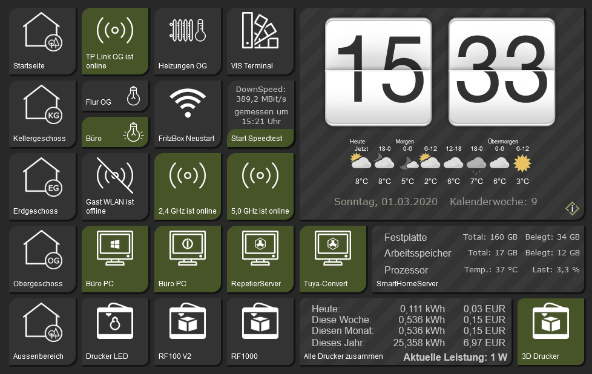

# ioBroker.vis-inventwo

 

## Widgets for the ioBroker.vis Adapter

Switches, sliders, tables, controls, checkboxes, radio buttons and more... 
With our widget set you have the freedom to easily create individual visualizations for your smart home.

### Important Note for Vis 2
This adapter was developed and tested for VIS 1. Errors may occur in Vis 2 that prevent the use of your visualization.
Seamless compatibility will not be possible. A new adapter for Vis 2 can be found here: https://github.com/inventwo/ioBroker.vis-2-widgets-inventwo

## Contents of the Adapter

Various widgets for switching, navigating and more.

Analog Clocks [More Information](https://github.com/inventwo/ioBroker.vis-inventwo/wiki/Universal-%26-Multi-Widget-Inhaltstypen)

Digital Clocks [More Information](https://github.com/inventwo/ioBroker.vis-inventwo/wiki/Universal-%26-Multi-Widget-Inhaltstypen)

Colorpicker [More Information](https://github.com/inventwo/ioBroker.vis-inventwo/wiki/Colorpicker)

For more information, check out the [Wiki](https://github.com/inventwo/ioBroker.vis-inventwo/wiki).

###### All Widgets from Version 2.0.0

<table>
   <tr>
        <td>
<b>Universal &nbsp;</b> </td>
        <td>
<b>Multi &nbsp;</b> </td>
        <td>
<b>Image &nbsp;</b> </td>
         <td>
<b>Table &nbsp;</b> </td>
    </tr>
<tr><td colspan=4></td></tr>
    <tr>
        <td>
<b>List &nbsp;</b> </td>
        <td>
<b>Marquee &nbsp;</b> </td>
        <td>
<b>Radio Button &nbsp;</b> </td>
        <td>
<b>Slider vertical</b> </td>
    </tr>
<tr><td colspan=4></td></tr>
      <tr>
        <td>
<b>Slider horizontal</b> </td>
        <td>
<b>Colorslider horizontal</b> </td>
        <td>
<b>Colorslider vertical</b> </td>
        <td>
<b>Toggle Switch &nbsp;</b> </td>
    </tr>
<tr><td colspan=4></td></tr>
      <tr>
        <td>
<b>Basic Switch &nbsp;</b> </td>
        <td>
<b>Checkbox/ Radiobutton</b> </td>
        <td>
<b>Colorpicker &nbsp;</b> </td>
    </tr>
</table>

The following projects can be realized with the help of our widgets. Currently our adapter contains ONLY the pure buttons (see above). Clock and weather come from other adapters and may need to be installed additionally.

---

## Support

If you like our work and would like to support us, we appreciate every donation.

(This link leads to our PayPal account and is not affiliated with ioBroker)

---

## Changelog

### **WORK IN PROGRESS**
- (iobroker-bot) Adapter requires node.js >= 20 now.

<!--
  Placeholder for the next version (at the beginning of the line):
  ### **WORK IN PROGRESS**
-->

### 3.3.5
- Fixed: [#688](https://github.com/inventwo/ioBroker.vis-inventwo/issues/688) Radio button cannot write a boolean value
- Fixed: [#736](https://github.com/inventwo/ioBroker.vis-inventwo/issues/736) Adapter checker errors in package.json and io-package.json resolved
- Fixed: [#678](https://github.com/inventwo/ioBroker.vis-inventwo/issues/678) Mode in io-package changed from daemon to once

### 3.3.4
- Fixed: [#455](https://github.com/inventwo/ioBroker.vis-inventwo/issues/455) Color picker widget "disappears" when selecting CIE
- Fixed: [#369](https://github.com/inventwo/ioBroker.vis-inventwo/issues/369) Simple slider step color cannot be changed
- Fixed: [#361](https://github.com/inventwo/ioBroker.vis-inventwo/issues/361) Image widget always shows the image for true
- Fixed: [#564](https://github.com/inventwo/ioBroker.vis-inventwo/issues/564) Radio button – image color for true is taken from false
- Fixed: [#461](https://github.com/inventwo/ioBroker.vis-inventwo/issues/461) Double trigger on button/state and "slider cannot be slid" with Windows Touch
- Fixed: [#474](https://github.com/inventwo/ioBroker.vis-inventwo/issues/474) JSON table with "Binding" does not work in the editor
- Fixed: [#580](https://github.com/inventwo/ioBroker.vis-inventwo/issues/580) JSON Table Widget: color change of values via threshold is only visible in the editor, not at runtime
- Fixed: [#622](https://github.com/inventwo/ioBroker.vis-inventwo/issues/622) Issues found by adapter checker

### 3.3.3
- Fixed issue with border color on Multi-Widget View in PopUp

### 3.3.2
- Bugfix

### 3.3.1
- Bugfix

---

## License

MIT License

Permission is hereby granted, free of charge, to any person obtaining a copy
of this software and associated documentation files (the "Software"), to deal
in the Software without restriction, including without limitation the rights
to use, copy, modify, merge, publish, distribute, sublicense, and/or sell
copies of the Software, and to permit persons to whom the Software is
furnished to do so, subject to the following conditions:

The above copyright notice and this permission notice shall be included in all
copies or substantial portions of the Software.

THE SOFTWARE IS PROVIDED "AS IS", WITHOUT WARRANTY OF ANY KIND, EXPRESS OR
IMPLIED, INCLUDING BUT NOT LIMITED TO THE WARRANTIES OF MERCHANTABILITY,
FITNESS FOR A PARTICULAR PURPOSE AND NONINFRINGEMENT. IN NO EVENT SHALL THE
AUTHORS OR COPYRIGHT HOLDERS BE LIABLE FOR ANY CLAIM, DAMAGES OR OTHER
LIABILITY, WHETHER IN AN ACTION OF CONTRACT, TORT OR OTHERWISE, ARISING FROM,
OUT OF OR IN CONNECTION WITH THE SOFTWARE OR THE USE OR OTHER DEALINGS IN THE
SOFTWARE.

---

Icons from Icons8 https://icons8.com/

Copyright (c) 2025-2026 [jkvarel](https://github.com/jkvarel) and [skvarel](https://github.com/skvarel) from [inventwo](https://github.com/inventwo)
