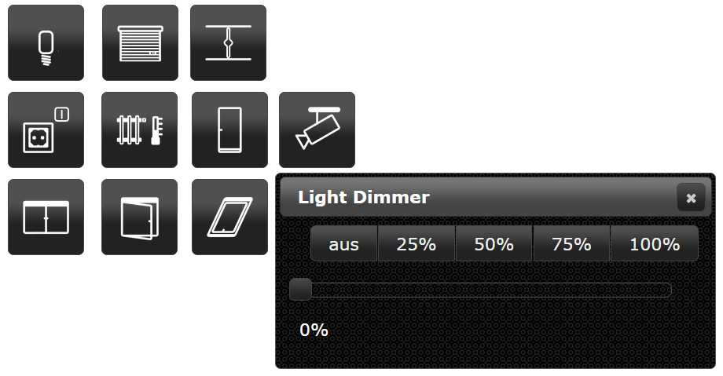

# ioBroker.vis-jqui-mfd

  

## Description
jqui-mfd widget set for [ioBroker.vis](https://github.com/ioBroker/ioBroker.vis) and
[ioBroker.vis-2](https://github.com/ioBroker/ioBroker.vis-2). The widgets are buttons in the style of the jQuery UI
theme of the view with the icons of the [OpenAutomationProject](https://github.com/OpenAutomationProject/knx-uf-iconset)
for lights, sockets, shutters, awnings, valves, windows, doors, the heating and cameras.

## vis and vis-2

The adapter ships every widget twice:

- **vis (vis-1)** uses the EJS/jQuery widget set in `widgets/jqui-mfd.html`.
- **vis-2** uses the React widget set in `widgets/vis-2-widgets-jqui-mfd/`, built from `src-widgets/`.

Both declare the same widget ids (`tplMfdLight`, `tplMfdShutterDialog`, ...) and the same attribute names, and vis-2
prefers a React widget over an EJS one. So a project made with vis keeps working after switching to vis-2 - the
widgets simply render with the React implementation, without jQuery and jQuery UI dialogs. The buttons of these
widgets are still drawn by the jQuery UI theme of the view, so they look like before. Widgets created in vis-2 follow
the theme of vis-2 instead (option "vis-2 theme").

The React widgets need vis-2 2.12.8 or newer.

## Documentation

Every widget with its settings and screenshots: [English](/#/docs/adapterref/iobroker.vis-jqui-mfd/docs/en/README.md) | [Deutsch](https://github.com/ioBroker/ioBroker.vis-jqui-mfd/blob/master/docs/de/README.md)

## Icons

The icons come from the [KNX User Forum iconset](https://github.com/OpenAutomationProject/knx-uf-iconset) by mfd and
are licensed under [CC BY-SA 3.0 DE](http://creativecommons.org/licenses/by-sa/3.0/de/).

<!--
    Placeholder for the next version (at the beginning of the line):
    ### **WORK IN PROGRESS**
-->
## Changelog
### **WORK IN PROGRESS**
* (@GermanBluefox) All widgets were ported to vis-2 as React widgets, without jQuery and jQuery UI dialogs
* (@GermanBluefox) Added documentation for every vis-2 widget with screenshots (English and German)
* (@GermanBluefox) New widgets follow the vis-2 theme (option "vis-2 theme"); widgets from vis-1 keep the jQuery UI look
* (@GermanBluefox) Lamp, shutter, blind and valve are drawn as SVG for the exact value instead of 11 (5) fixed images
* (@GermanBluefox) The dialogs follow the dark theme of vis-2, can be moved and closed with Escape
* (@GermanBluefox) The slider of the dialogs writes the value once, when it is released
* (@GermanBluefox) "Auto close" 0 keeps the dialog open; before it closed after one second
* (@GermanBluefox) "Working object ID" holds the slider while the device moves - it was ignored before
* (@GermanBluefox) Icon colors also work for the switched-off lamp and do not remove own PNG icons any more
* (@GermanBluefox) "Show active background" of shutter, blind, valve and Custom10 compares with "Max" instead of 1
* (@GermanBluefox) The window with rotary handle shows the own icons per state
* (@GermanBluefox) The adapter icon is an SVG now
* (@GermanBluefox) The widget set has its own icon, label and color in the widget palette of vis-2
* (@GermanBluefox) Every widget describes itself in the palette of the vis-2 editor

### 1.1.3 (2026-01-25)
* (@GermanBluefox) Allowed installation with vis-2 without installing vis-1

### 1.1.1 (2024-01-16)
* (bluefox) Make it compatible with ioBroker.vis 2.0

### 1.0.12 (2018-06-27)
* (bluefox) Custom10-Widget and Light-Widget are fixed if the icon color used

### 1.0.11 (2018-02-18)
* (Bjoern3003) Heating widget was extended

### 1.0.9 (2017-10-13)
* (bluefox) Fix iframes

### 1.0.8 (2017-07-12)
* (KNXBroker) Fix of ShutterDialog Labels

### 1.0.7 (2017-05-14)
* (bluefox/Apollon77) Fix size of lamp-off-svg

### 1.0.6 (2016-11-24)
* (bluefox) Add to all dialogs autoclose

### 1.0.5 (2016-09-13)
* (bluefox) add blind widget

### 1.0.4 (2016-07-28)
* (bluefox) fix custom 10 dialog

### 1.0.3 (2016-07-25)
* (jens-maus) removed left over debugger statement

### 1.0.2 (2016-07-21)
* (jens-maus) implemented color support for each separate state of the jqui-mfd wigets

### 1.0.0 (2016-06-14)
* (bluefox) increase default width of popup windows

### 0.1.0 (2015-10-31)
* (bluefox) change Light Dialog => to OnOff Dialog
* (bluefox) expand auto close with timeout

### 0.0.1 (2015-09-20)
* (bluefox) initial checkin

## License
 Copyright (c) 2014-2026 hobbyquaker https://github.com/hobbyquaker, bluefox https://github.com/GermanBluefox
 MIT

The icons are licensed under [CC BY-SA 3.0 DE](http://creativecommons.org/licenses/by-sa/3.0/de/), see
`widgets/jqui-mfd/img/license.txt`.