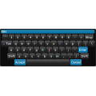
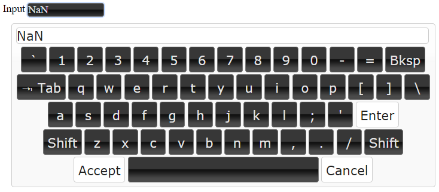
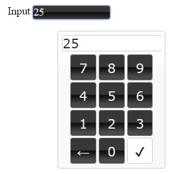

# ioBroker.vis-keyboard

 

Used very good jquery plugin from Jeremy Satterfield. (Original by Jeremy Satterfield, updated & maintained by Rob Garrison)

github - http://github.com/Mottie/Keyboard

## Usage
You can place this widget on view and all widgets with input fields will have a virtual keyboard. You must place the widget on every view.

Additionally, you can add to widget class `keyboard-num` to force using numeric keyboard or `keyboard-all` to force using full-text keyboard.

<!--
	Placeholder for the next version (at the beginning of the line):
	### **WORK IN PROGRESS**
-->
## Changelog
### 0.0.3 (2025-10-30)
- (bluefox) updated packages

### 0.0.2 (2015-10-28)
- (bluefox) update plugin

### 0.0.1 (2015-10-21)
- (smiling_Jack) initial checkin

## License
 Copyright (c) 2015-2025 smiling_Jack
 MIT
