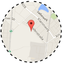

# ioBroker.vis-map

  

Widgets, that can show coordinates on a map.
Actually supported only Open Street Maps and Google. To use Google Maps you should get the API Key for Google Maps.
You can get it [here](https://developers.google.com/maps/documentation/javascript/get-api-key)

## Usage

You can bind longitude and latitude apart or just place into **longitude** the Object ID with the value like following:

- 7.0001;49.0000 (longitude ; latitude)
- 7,0001;49,0000 (longitude ; latitude)
- 7.0001,49.0000 (longitude , latitude)
- 49.0000,7.0001 (latitude , longitude + swap flag)
- 49.0000;7.0001 (latitude ; longitude + swap flag)

<!--
    Placeholder for the next version (at the beginning of the line):
    ### **WORK IN PROGRESS**
-->
## Changelog
### 1.1.2 (2024-07-12)
- fix datapoint handling for lat/lan
- Make data points in 0_userdata work again

### 1.1.0 (2024-03-07)
- (bluefox) Removed dependency to `iobroker.vis`. Only show the message if vis is not installed

### 1.0.5 (2024-01-14)
- (bluefox) Added vis-2 to the restart by installation

### 1.0.4 (2020-03-18)
- (bluefox) Small errors were fixed

### 1.0.3 (2020-01-25)
- (TA2k) Fix OSM issue with Safari

### 1.0.2 (2018-07-06)
- (bluefox) Event click on pins added

### 1.0.1 (2018-01-08)
- (bluefox) Fix error if coordinates are empty

### 1.0.0 (2017-09-26)
- (bluefox) allow to swap longitude and latitude

### 0.1.4 (2017-04-28)
- (bluefox) add traffic layer for google maps

### 0.1.3 (2016-09-04)
- (bluefox) fix google map max zoom

### 0.1.1 (2016-07-17)
- (bluefox) remove unused files

### 0.1.0 (2016-07-08)
- (bluefox) initial checkin

## License
 Copyright (c) 2016-2024 bluefox <dogafox@gmail.com>
 MIT
