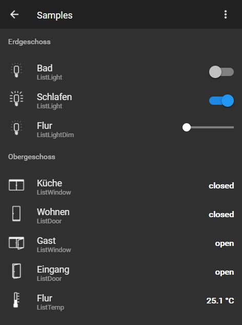

# ioBroker.vis-material

  

material - Material widgets for ioBroker.vis.

You can read instructions in material.js, material.html files

These widgets are in addition to the material design style of Uhula, which you can find here:
[https://github.com/Uhula/ioBroker-Material-Design-Style](https://github.com/Uhula/ioBroker-Material-Design-Style)

The adapter uses CSS to set a black background and white as the font color. This means that it is only suitable for dark vis layouts.

In some installations, the font in the context menu may no longer be readable. This is probably caused by cross-effects from other adapters. To analyze these, please read the following post.
[https://forum.iobroker.net/topic/79188/vis-anzeigen-zerst%C3%B6rt/27](https://forum.iobroker.net/topic/79188/vis-anzeigen-zerst%C3%B6rt/27)

<!--
    Placeholder for the next version (at the beginning of the line):
    ### **WORK IN PROGRESS**
-->

## Changelog

### 0.2.0 (2025-01-12)

- (oweitman) Some adapter settings have been fixed.
- (oweitman) Some adaption for a new release have been applied.
- (mcm1957) Dependencies have been updated.
- (pix) feat: new window shutter widget
- (pix) feat: new humidity widget added

### 0.1.3 (2018-01-21)

- (nisio) feat: new dimmer widget

### 0.1.2 (2018-01-20)

- (nisio) feat: switch added to light widget

### 0.1.1 (2018-01-14)

- (nisio) feat: temperature and light widget

### 0.1.0 (2018-01-13)

- (nisio) Initial version for public testing (includes css from material design styles V1.8)

### 0.0.1 (2018-01-01)

- (nisio) Initial version for internal testing

## License

The MIT License (MIT)

Copyright (c) 2025 iobroker-community-adapters <iobroker-community-adapters@gmx.de>  
Copyright (c) 2015-2024 nisiode <nisio.air@gmail.com>

Permission is hereby granted, free of charge, to any person obtaining a copy
of this software and associated documentation files (the "Software"), to deal
in the Software without restriction, including without limitation the rights
to use, copy, modify, merge, publish, distribute, sublicense, and/or sell
copies of the Software, and to permit persons to whom the Software is
furnished to do so, subject to the following conditions:

The above copyright notice and this permission notice shall be included in all
copies or substantial portions of the Software.

THE SOFTWARE IS PROVIDED "AS IS", WITHOUT WARRANTY OF ANY KIND, EXPRESS OR
IMPLIED, INCLUDING BUT NOT LIMITED TO THE WARRANTIES OF MERCHANTABILITY,
FITNESS FOR A PARTICULAR PURPOSE AND NONINFRINGEMENT. IN NO EVENT SHALL THE
AUTHORS OR COPYRIGHT HOLDERS BE LIABLE FOR ANY CLAIM, DAMAGES OR OTHER
LIABILITY, WHETHER IN AN ACTION OF CONTRACT, TORT OR OTHERWISE, ARISING FROM,
OUT OF OR IN CONNECTION WITH THE SOFTWARE OR THE USE OR OTHER DEALINGS IN THE
SOFTWARE.
