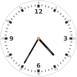
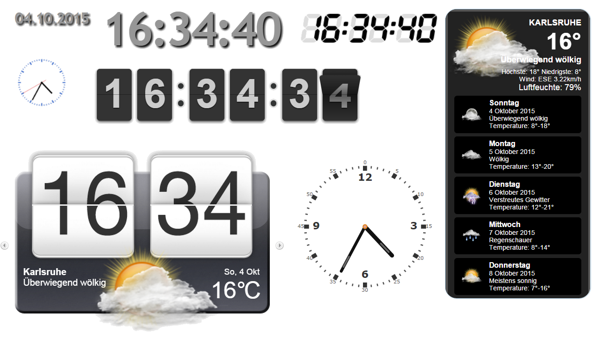

# ioBroker.vis-timeandweather

  

`timeandweather` - Time and weather widgets for [ioBroker.vis](https://github.com/ioBroker/ioBroker.vis) and
[ioBroker.vis-2](https://github.com/ioBroker/ioBroker.vis-2)

## Widgets

| Widget          | Description                                                                                   |
|-----------------|-----------------------------------------------------------------------------------------------|
| SimpleClock     | The time as text, with or without seconds, optionally with a blinking colon                   |
| SimpleDate      | The date as text, with week day, month as word, short or American format                      |
| CoolClock       | Analog canvas clock with 21 skins, optionally with a digital time                             |
| FlipClock       | Flip clock with 24 or 12 hours                                                                |
| WeatherCustom   | Current weather and a forecast of up to six days, fed from the states of any weather adapter  |
| Svg Clock       | Analog SVG clock with configurable colors and font                                            |
| Segment Clock   | 7, 14 or 16 segment display for the time, a fixed text or the value of a state                |

## vis and vis-2

The adapter ships every widget twice:

- **vis (vis-1)** uses the EJS/jQuery widget set in `widgets/timeandweather.html`.
- **vis-2** uses the React widget set in `widgets/vis-2-widgets-timeandweather/`, built from `src-widgets/`.

Both declare the same widget ids (`tplTwSimpleClock`, `tplTwCoolClock`, ...) and the same attribute names, and
vis-2 prefers a React widget over an EJS one. So a project made with vis keeps working after switching to vis-2 -
the widgets simply render with the React implementation, without jQuery and without loading the libraries below.

The React widgets need vis-2 2.12.8 or newer. With an older vis-2 the EJS widgets are used.

The widgets `HtcWeather` and `YahooWeather` of vis-1 are disabled since the Yahoo! weather service was shut down.
Use `WeatherCustom` with the states of a weather adapter instead.

## Documentation

Every widget with its settings and screenshots: [English](/#/docs/adapterref/iobroker.vis-timeandweather/docs/en/README.md) | [Deutsch](https://github.com/ioBroker/ioBroker.vis-timeandweather/blob/master/docs/de/README.md)

## Used packages (only vis-1, vis-2 uses its own code)

- **CoolClock** http://randomibis.com/coolclock/ by Simon Baird (MIT)
  https://github.com/simonbaird/CoolClock/ - the vis-2 widget uses its drawing code and skins
- **jDigiClock** http://www.radoslavdimov.com/jquery-plugins/jquery-plugin-digiclock/ by Radoslav Dimov (MIT & GPL) -
  vis-1 only
- **zWeatherFeed** http://www.zazar.net/developers/jquery/zweatherfeed/ Zazar Ltd (MIT) - vis-1; the vis-2 widget
  keeps its markup and translations
- **Segment display** http://www.3quarks.com/en/SegmentDisplay (CC-3.0) - the vis-2 widget uses its drawing code
- **flipclock** http://flipclockjs.com/ (MIT) https://github.com/objectivehtml/FlipClock - vis-1; the vis-2 widget
  keeps its markup and styles

<!--
	Placeholder for the next version (at the beginning of the line):
	### **WORK IN PROGRESS**
-->

## Changelog
### **WORK IN PROGRESS**
* (bluefox) Made widgets to be compatible with vis2
* (bluefox) All widgets were ported to vis-2 as React widgets, without jQuery and without the vis-1 libraries
* (bluefox) vis-2: the palette shows the icon of the widget set and a description of every widget in its tooltip
* (bluefox) The widgets print the names of week days and months in all languages of vis-2, not only in en/de/ru
* (bluefox) Weather: known weather conditions are translated into all languages of vis-2; a text that is not known is shown as it is instead of being replaced by a similar condition (e.g., "Rain" was shown as "Mixed rain and snow" and an empty text as "Tornado")
* (bluefox) Weather: values that are not set do not leave empty lines like "High: ° Low: °" any more
* (bluefox) Weather: the group names of the forecast days in the editor were one day off
* (bluefox) SimpleDate: English ordinal numbers are correct for the 21st, 22nd, 23rd and 31st and with a leading zero
* (bluefox) Svg Clock: several clocks on one view no longer share the tick colors of the first one
* (bluefox) Added documentation for every vis-2 widget with screenshots (English and German)
* (bluefox) The adapter icon is an SVG now
* (bluefox) Updated packages and GitHub actions

### 1.2.2 (2022-07-05)
* (bluefox) Refactoring of build process done

### 1.2.1 (2022-07-05)
* (HeadCrash78) Fixed the icon display in custom weather forecast
* (bluefox) Refactoring of build process done

### 1.1.7 (2017-01-05)
* (bluefox) add update interval for weather

### 1.1.6 (2016-07-13)
* (bluefox) support of vis APP

### 1.1.4 (2016-06-28)
* (jens-maus) improved german translation of weather terms

### 1.1.3 (2016-06-23)
* (bluefox) enable widgets for https too

### 1.1.2 (2016-06-02)
* (bluefox) add weather custom widget

### 1.1.1 (2016-05-31)
* (bluefox) fix the slide in htc weather

### 1.1.0 (2016-04-16)
* (bluefox) add city name to display

### 0.1.0 (2016-02-10)
* (bluefox) fix typo with Dienstag=>Februar

### 0.0.1 (2015-10-04)
* (bluefox) initial checkin

## License
The MIT License (MIT)

Copyright (c) 2013-2026 bluefox <dogafox@gmail.com>