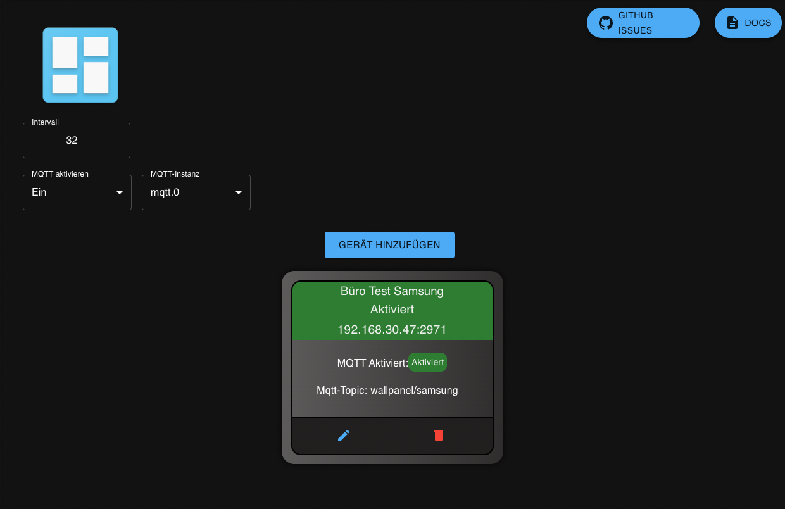

# ioBroker.wallpanel

<!---->

<!---->

**This adapter uses the service Sentry.io to automatically report exceptions and code errors and new device schemas to me as the developer.
More details see below! [Sentry](#sentry)**

## The adapter requires a Node.js version >= 16.x

## **A detailed description can be found [Adapter Documentation](https://xxbjxx.github.io/wallpanel/)**

# Adapter Description

With the adapter, you can query a few values such as brightness and about MQTT then still additionally battery level
and a few more things,   query these values written in states and are available. 
One can also send a few control commands to the tablet, it can e.g., the brightness or the current URL change.

Several tablets can be set in the adapter at the same time, which can then queried one after the other and can of course also be controlled.

The app is no longer available in the Play Store, but you can still install it from GitHub via an APK
+ original (Play Store version) ⇨ [old version](https://github.com/thecowan/wallpanel-android/releases) is not under further development
+ new version in currently only on GitHub ⇨ [new version](https://github.com/TheTimeWalker/wallpanel-android/releases) is under further development.

### **Attention, if you install an app from GitHub, then you install it "from an unknown source" this can be dangerous under certain circumstances because the app has not been checked for malware by any official source.**

Here is still the forum thread to this Adapter: [Forum Post](https://forum.iobroker.net/topic/36438/test-adapter-wallpanel)

## Sentry
### What is Sentry.io and what is reported to the servers of that company?

Sentry.io is a service for developers to get an overview about errors from their applications. And exactly this is
implemented in this adapter.

When the adapter crashes, or another Code error happens, this error message that also appears in the ioBroker log is
submitted to Sentry. When you
allowed iobroker GmbH to collect diagnostic data then also your installation ID (this is just a unique ID without any
additional infos about you, email name or such)
is included. This allows Sentry to group errors and show how many unique users are affected by such an error.
All of this helps me to provide error free adapters that basically never crashs.

For more details and information on how to disable error reporting, please refer to the
[Sentry plugin documentation](https://github.com/ioBroker/plugin-sentry#plugin-sentry)  
Sentry Reporting is used from js-controller 3.0.

## Changelog
 <!--
 Placeholder for the next version (at the beginning of the line):
 ### __WORK IN PROGRESS__ (- falls nicht benötigt löschen sonst klammern entfernen und nach dem - dein text schreiben)
 -->
### 0.3.9 (2022-10-02)
* (xXBJXx) dependencies updated 
* (xXBJXx) Moved global variable to constructor

### 0.3.8 (2022-07-02)
* (xXBJXx) removed the play Store Link and added the GitHub Link to the new version and add a Warning for the Installer from GitHub.
* (xXBJXx) optimized the code
* (xXBJXx) dependencies updated
* (xXBJXx) Leave the device switched off when creating Problem solved

### 0.3.7 (2022-06-06)
* (xXBJXx) Node version support set to >= v16.x because of new features of Node.js that are needed.
* (xXBJXx) fixed mqtt topic Display Direction

### 0.3.6 (2022-05-30)
* (xXBJXx) preparation for release in ioBroker Repo. Adapter-Check issues processed

### 0.3.5 (2022-05-30)
* (xXBJXx) update Changelog and fixed type issues

## License
MIT License

Copyright (c) 2020-2022 xXBJXx <issi.dev.iobroker@gmail.com>

Permission is hereby granted, free of charge, to any person obtaining a copy
of this software and associated documentation files (the "Software"), to deal
in the Software without restriction, including without limitation the rights
to use, copy, modify, merge, publish, distribute, sublicense, and/or sell
copies of the Software, and to permit persons to whom the Software is
furnished to do so, subject to the following conditions:

The above copyright notice and this permission notice shall be included in all
copies or substantial portions of the Software.

THE SOFTWARE IS PROVIDED "AS IS", WITHOUT WARRANTY OF ANY KIND, EXPRESS OR
IMPLIED, INCLUDING BUT NOT LIMITED TO THE WARRANTIES OF MERCHANTABILITY,
FITNESS FOR A PARTICULAR PURPOSE AND NONINFRINGEMENT. IN NO EVENT SHALL THE
AUTHORS OR COPYRIGHT HOLDERS BE LIABLE FOR ANY CLAIM, DAMAGES OR OTHER
LIABILITY, WHETHER IN AN ACTION OF CONTRACT, TORT OR OTHERWISE, ARISING FROM,
OUT OF OR IN CONNECTION WITH THE SOFTWARE OR THE USE OR OTHER DEALINGS IN THE
SOFTWARE.