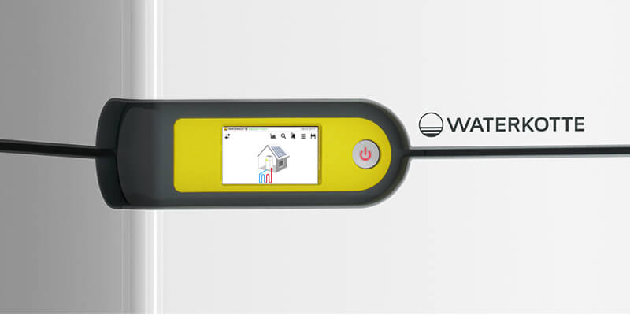
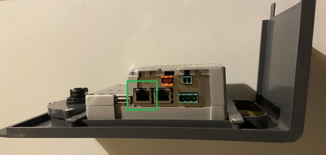

# ioBroker.waterkotte-easycon

 

## waterkotte-easycon adapter for ioBroker

Read and write parameters of Waterkotte EasyCon heat pumps via CGI requests. Tested with [Waterkotte EcoTouch Ai1 Geo](https://www.waterkotte.de/waermepumpen/ecotouch-ai1-geo-erdwaermepumpe-6-18kw) (2017 model).

## Features

### Implemented

-   automatic reading of values from heat pump dependending on the used functions (water, heating, cooling, photovoltaics, solar, ...)

### Planned

-   notify on heat pump alarms
-   write values
-   read and manage schedules
-   SG-ready like control of target values

## Usage

### Installation

Install the adapter `waterkotte-easycon` from the ioBroker repository.

### Connection to heat pump

There are two RJ45 ports on the bottom side of the touch panel. They can be accessed by removing the front cover of the heat pump using the provided tool. Looking upwards from below connect the ethernet cable to the right port.

Check your router to find out the IP address of the heat pump and enable static IP address so that the heat pump address will not change.

### Configuration

| Parameter                       | Description                                                                           |
| ------------------------------- | ------------------------------------------------------------------------------------- |
| IP address                      | IP address of the heat pump (see [Connection to heat pump](#Connection-to-heat-pump)) |
| Username                        | Default `waterkotte`                                                                  |
| Password                        | Default `waterkotte`                                                                  |
| Update interval                 | Frequency of updating the values in milliseconds (Default: 300 seconds = 5 minutes)   |
| Remove whitespace from state ID | If `State format` is `Path + Description` all whitespaces will be replaced by `_`     |

#### State format

| Value         | Beschreibung                                                                                                                                                                        |
| ------------- | ----------------------------------------------------------------------------------------------------------------------------------------------------------------------------------- |
| `Path + ID`   | All state names will use the tag id, e.g. `Heating.A32` where `A32` is the internal id of the tag `Target temperatur` of the floor heating                                          |
| `Path + Name` | All state names will use the name of the tag, e.g. `Heating.Target value`. Enable `Remove whitespace from state ID` to avoid whitespaces in state ids (e.g. `Heating.Target_value`) |

> Changing `State format` or `Remove whitespace from state ID` will delete all states of the instance and create the new structure.

## Changelog

<!--
    Placeholder for the next version (at the beginning of the line):
    ### **WORK IN PROGRESS**
-->
### 0.0.3 (2024-04-12)

-   (theknut) change update interval from milliseconds to seconds
-   (theknut) add axios timeout
-   (theknut) remove unused onStateChange handler
-   (theknut) logoff when adapter is unloaded

### 0.0.2 (2024-03-11)

-   (theknut) prepare for release

### 0.0.1 (2024-03-01)

-   (theknut) initial release

## License

MIT License

Copyright (c) 2024 theknut <theknutcoding@gmail.com>

Permission is hereby granted, free of charge, to any person obtaining a copy
of this software and associated documentation files (the "Software"), to deal
in the Software without restriction, including without limitation the rights
to use, copy, modify, merge, publish, distribute, sublicense, and/or sell
copies of the Software, and to permit persons to whom the Software is
furnished to do so, subject to the following conditions:

The above copyright notice and this permission notice shall be included in all
copies or substantial portions of the Software.

THE SOFTWARE IS PROVIDED "AS IS", WITHOUT WARRANTY OF ANY KIND, EXPRESS OR
IMPLIED, INCLUDING BUT NOT LIMITED TO THE WARRANTIES OF MERCHANTABILITY,
FITNESS FOR A PARTICULAR PURPOSE AND NONINFRINGEMENT. IN NO EVENT SHALL THE
AUTHORS OR COPYRIGHT HOLDERS BE LIABLE FOR ANY CLAIM, DAMAGES OR OTHER
LIABILITY, WHETHER IN AN ACTION OF CONTRACT, TORT OR OTHERWISE, ARISING FROM,
OUT OF OR IN CONNECTION WITH THE SOFTWARE OR THE USE OR OTHER DEALINGS IN THE
SOFTWARE.
