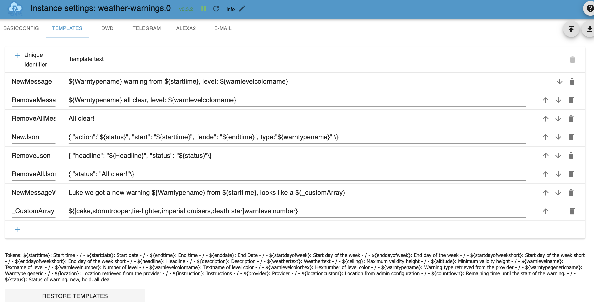

# ioBroker.weather-warnings

**Tests:** 

## weather-warnings adapter for ioBroker

[Deutsche Readme (meist aktueller)](https://github.com/ticaki/ioBroker.weather-warnings/blob/main/README_DE.md)

This adapter accesses weather warnings of different weather services and outputs them as text or voice messages. Additionally it creates States grouped by type, which can be used to react to current warnings.

Provider:
- DWD 
- ZAMG (Austria)
- UWZ

Push service
- Telegram
- Whatsapp
- Pushover
- Email
- Alexa
- Sayit

## Installation
Min. Nodejs: v18
After installation the configuration site will automatically open and will be needed to be **reloaded**. This will show the templates in the language that was set.

## Configuration

- **Activate DWD/UWZ/ZAMG:** activate the data retrieval of these service providers.
- **Activate telegram/pushover,...:** activate the output of messages to these installed adapters. 
- **Activate email:** Writes all current warnings in an E-Mail.
- **Activate history:** writes the history, which can hold up to 500 entries, into the State: .history. All data or selected data.
- **Activate json-array:** very special, puts the current warnings into an Array or - after activation - a user-specifc Json into an Array, which can be used by scripts.

- **Update interval:** the interval of data retrieval in minutes (minimum: 5)

- **Incoming warnings...:** After starting the adapter the warnings of the first data retrieval will be treated as known and will not trigger a notification.

- **Expert**: Activates additional optional settings 

- **Testing- Activate...:** Use testdata. Adapter is offline.

- **Testing- Raw data history:** For Debugging, only on request.

Here you can create own messages or edit existing ones. All available „Tokens“ and their meanings are displayed below the table. The Unique identifier is used by push notification services in order to determine which template to use for which type of notification.

Save and close after adding or deleting templates.

Signs with special meaning:
- `${}` contains tokens that are substituted by generated information. The template identifier is usable here as well.
- Template identifier that start with `_` are not offered by services.
- `${[0,1,2,3,4]token}` A string with values, token has to be a number token. The index is the same as shown in the example. 0 is the first value in the list.
- `${(value=token)result1#result2}` or `${(value=token)result1}` is the same as a javascript command: `if (value == token) result1 else result2` possible comparisons: `= < > != `
- for a Jsons template the closing bracket `}` has to be written in this way `\}`
- see examples in the adapter
- alternatively also possible: `${[0,🟢,🟡,🟠,🔴]warnlevelnumber}`

**Restore Templates:** Resets the templates back to the current system language. Existing templates will be **lost**. Afterwards save & close. Should be used after changing system language.

**DWD:** Selection from a list of 10000 places, after entry click on another tab and then return, list is too big and has to be updated.

**UWZ:** Entry using the country identifier DE AT (others possible, has to be tested) and the postal code, for example DE12345

**ZAMG:** Only for Austria. Entry of coordinates within Austria.

**Place name:** user-specific place name, can be used in warnings (useful with multiple warning cells)

**Filter:** 
- Filter Raw data: Filters out everything within X hours into the future before every following handling.
- Type: discards everything with this type.
- Level: everything lower than this level will be discarded. 

**Adapter:** If this option was activated and there is an adapter field, a valid option has to be chosen. An error message in the log indicates missing settings. 

**Activate ...:** Send warnings by this provider with this service.

**Filter:** 
1) Ignore warnings with this Type
2) Ignore warnings with equal or lower level 

**Messages:** use the following templates for:
Column 1:
1) New warnings or existing warnings
2) A warning was removed and there are **other** active warnings.
3) Warnings were removed and there are **no other** active warnings.

Column 2:
1) Manually triggered notifications
2) Use for no warning 1.3

Templates for 3) cannot contain `${}` Tokens.

**Special features**

**email:** Header is put before the Mail, followed by 1,2 or 3 + line break and then Footer. The email is sent in html format, so you can add any htmp tag you like. (additional features are being worked on, not ready yet)

**alexa:** Additionally one or multiple devices has/have to be selected. The volume only changes for voice messages and should afterwards be reset to default. Message size per warning is limited to 250 characters. Sounds are possible, activate Expert to display the options.

**title, header, footer** only ${status} works here. Other tokens contain random values or no value.

## General Behaviour
- No duplicate messages should be sent for one and the same thing. DWD is very particular about this.
- If `none` is selected as the template, no notifications are sent for it.
- States in .alerts contain arrays for start, end, warning type, now active and headline, grouped by warning type. One warning per group is displayed filtered by the following criteria: 
  1) Warning is **now** active (the one with the highest level).
  
## Icons

DWD Icon: Copyright by Deutscher Wetterdienst
ZAMG Icon: Copyright by 

others:

Creator: [Adri Ansyah](https://www.youtube.com/channel/UChLOv1L-ftAFc2ZizdEAKgw?view_as=subscriber)

Changes: In the original they are blue, other colours are changes to the original. 

Licence: [CC BY 4.0 LEGAL CODE](https://creativecommons.org/licenses/by/4.0/legalcode)

Iconpage: https://icon-icons.com/de/symbol/Wetter-wind-cloud-Blitz-Regen/189105

## Changelog
<!--
	Placeholder for the next version (at the beginning of the line):
	### **WORK IN PROGRESS**
-->
### 0.10.0 (2025-11-13)
- (ticaki) update deps
- (ticaki) fix a problem with "remove" key
- (ticaki) support added for nspanel-lovelace-ui (>= v0.8.0)

### 0.9.0 (2025-10-28)
- (ticaki) Data retrieval function changed from axios to fetch 
- (ticaki) Retrieval timeout changed from 15 seconds to 5 minutes (DWD server needs a 'little' more time)

### 0.8.0 (2025-10-02)
- (ticaki) Add configurable email recipients with correct processing of comma-separated addresses
- (ticaki) Update dependencies

### 0.7.4 (2025-02-03)
- (ticaki) change sendTo for whatsapp

### 0.7.3 (2025-01-16)
- (ticaki) fix typo

### 0.7.2 (2025-01-13)
* (ticaki) Replacing „ and “ in the json template before parsing with "
* (ticaki) Fixing activeWarning_json (adapter.0.provider.activeWarning_json)

### 0.7.1 (2025-01-10)
* (CrEaK) Fixing send to chatId in telegram

### 0.7.0 (2025-01-03)
* (ticaki) added gotify (notificationservice)

### 0.6.11 (2024-11-29)
* (ticaki) eslint 8 -> 9

### 0.6.10 (2024-11-11)
* (ticaki) fixed: warntype filter 
* (ticaki) fixed: if every provider except zamg is deactivated in the notifications - no message went out
* (ticaki) fixed: downgrade a dependency for compatibility with node 18

### 0.6.9 (2024-11-10)
* (ticaki) added missing text (settings - alexa - soundtable)
* (ticaki) fixed alerts start/end datapoints. (string -> number)
* (ticaki) dependencies up to date

### 0.6.7 (2024-02-19)
* (ticaki) Reduce history data to 80 entries around 4000 lines, because of jerks in the admin

### 0.6.6 (2024-01-14)
* (ticaki) fullday(ZAMG only): If time span is 24h +/- 5 minutes and the start hour is between 0-3, day of the week from start time, otherwise blank.

### 0.6.5 (2024-01-06)
* (ticaki) Added: ZAMG full day token
* (ticaki) fixed: Send emails asynchron
* (ticaki) fixed: dont ignore uwz activate setting
* (ticaki) update dp-objects on every start.

### 0.6.4 (2023-12-03)
* (ticaki) Optimise DWD warning cell selection. Place names are being given more and more details to make them unique.

### 0.6.3 (2023-11-30)
* (ticaki) add cleartimeout, add axios timeout

### 0.6.2 (2023-11-20)
* (ticaki) Reduce zamg spam

### 0.6.1 (2023-11-19)
* (ticaki) Optimise: DWD City names, adminconfiguration, translations

### 0.6.0 (2023-11-16)
* (ticaki) Added: global alerts.
* (ticaki) Changed: Token ...adverb - if no adverb, then day of the week.

### 0.5.6 (2023-11-15)
* (ticaki) Added: Select template for manual notification without warnings.
* (ticaki) Added: Configuration dialogue marks invalid template keys for most notification services.

### 0.5.5 (2023-11-14)
* (ticaki) Added: Missing space in emailMessage template.
* (ticaki) Fixed: wrong status for all removed.
* (ticaki) Admin: moving test options to tab general.

### 0.5.4 (2023-11-10)
* (ticaki) Fixed: Fixed randomly occurring errors in the first approx. 15 seconds.
* (ticaki) Added: max number of warnings (default 5)
* (ticaki) Fixed: not crash with the wrong uwz configuration.
* (ticaki) Fixed: small error in quiet times.

### 0.5.3 (2023-11-09)
* (ticaki) Fixed: command states (text / automode)
* (ticaki) Added: .alerts. List of warning types.
* (ticaki) Changed: .alerts. view current event with highest level or next event

### 0.5.2 (2023-11-06)
* (ticaki) Multiple Say-It instances.
* (ticaki) Some icons added.
* (ticaki) -no warning- Warning level for uwz corrected.

### 0.5.1 (2023-11-05)
* (ticaki) Fixed: Foreign languages did not work for UWZ.
* (ticaki) Fixed: clearHistory command didnt work on gloabl level.
* (ticaki) Fixed: uwz colours assigned to the correct level.

### 0.5.0 (2023-11-04)
* (ticaki) breaking changes: New UWZ configuration. reconfigure
* (ticaki) breaking changes: Rename and move manual push command states.
* (ticaki) Quiet times changed, reconfigure. 
* (ticaki) better DWD configuration.
* (ticaki) alot improvements.

### 0.4.8 (2023-10-30)
* (ticaki) Wrong level assignment for zamg fixed
* (ticaki) better set defaults

### 0.4.7 (2023-10-29)
* (ticaki) improved admin ui
* (ticaki) improved formatedKeys for vis

### 0.4.6 (2023-10-28)
* (ticaki) fix startup crash

### 0.4.5 (2023-10-28)
* (ticaki) Quiet times with profile & control states
* (ticaki) Fixed: Jumping of the data tree
* (ticaki) Bugfixing

### 0.4.4 (2023-10-25)
* (ticaki) Added Say-It
* (ticaki) User-definable icons (path)
* (ticaki) Email works, Added title for pushover and email

### 0.4.2 (2023-10-24)
* (ticaki) optimise german 22. & 28. for alexa.
* (ticaki) Quiet times for voice notifications.
* (ticaki) bugfix: now the English translation is loaded. Alexa uses the correct day of the week with DWD heading.

### 0.4.1 (2023-10-22)
* (ticaki) update german translation for alexa

### 0.4.0 (2023-10-22)
* (ticaki) Welcome to latest.
* (ticaki) zamg date convert for alexa

### 0.3.7 (2023-10-21)
* (ticaki) Alexa Sounds for warntypes
* (ticaki) more options for pushover, telegram, alexa, email html
* (ticaki) Usable urls for icons
* (ticaki) fixed error in type filter

### 0.3.6 (2023-10-20)
* (ticaki) added: icons

### 0.3.5 (2023-10-16)
* (ticaki) added: Data points for manually triggering notifications.

### 0.3.4 (2023-10-14)
* (ticaki) add translation to common.name

### 0.3.3 (2023-10-13)
* (ticaki) fixed: repeat message dwd
* (ticaki) small bugfixes

### 0.3.2 (2023-10-10)
* add alexa volumen

### 0.3.1 (2023-10-10)
* (ticaki) added alexa

### 0.3.0 (2023-10-03)
* (ticaki) added multiple warncell
* added option to remove channels
* fixed alot bugs

### 0.2.6-alpha.0 (2023-10-02)
* (ticaki) added email, json, history
* add more template key
* add mulitple dwd warncells
* fixed alot bugs

### 0.2.5-alpha.0 (2023-09-30)
* (ticaki) added telegram, whatsapp, pushover
* added remove all
* added json/array output for all current warnings.

### 0.2.4-alpha.0 (2023-09-29)
* (ticaki) add alerts

### 0.2.3-alpha.0 (2023-09-28)
* (ticaki) more translations
* filter warn type, generic warntypes
* more prebuild tests

### 0.2.2-alpha1.0 (2023-09-26)
* (ticaki) more CustomTokens,
* translations for warntypes, warnlevelcolor,
* total active warningcountshttps://github.com/ticaki/ioBroker.weather-warnings
* remove old warnings

### 0.2.1-alpha.0 (2023-09-25)
* (ticaki) initial release

## License
MIT License

Copyright (c) 2024-2026 ticaki <github@renopoint.de>

Permission is hereby granted, free of charge, to any person obtaining a copy
of this software and associated documentation files (the "Software"), to deal
in the Software without restriction, including without limitation the rights
to use, copy, modify, merge, publish, distribute, sublicense, and/or sell
copies of the Software, and to permit persons to whom the Software is
furnished to do so, subject to the following conditions:

The above copyright notice and this permission notice shall be included in all
copies or substantial portions of the Software.

THE SOFTWARE IS PROVIDED "AS IS", WITHOUT WARRANTY OF ANY KIND, EXPRESS OR
IMPLIED, INCLUDING BUT NOT LIMITED TO THE WARRANTIES OF MERCHANTABILITY,
FITNESS FOR A PARTICULAR PURPOSE AND NONINFRINGEMENT. IN NO EVENT SHALL THE
AUTHORS OR COPYRIGHT HOLDERS BE LIABLE FOR ANY CLAIM, DAMAGES OR OTHER
LIABILITY, WHETHER IN AN ACTION OF CONTRACT, TORT OR OTHERWISE, ARISING FROM,
OUT OF OR IN CONNECTION WITH THE SOFTWARE OR THE USE OR OTHER DEALINGS IN THE
SOFTWARE.