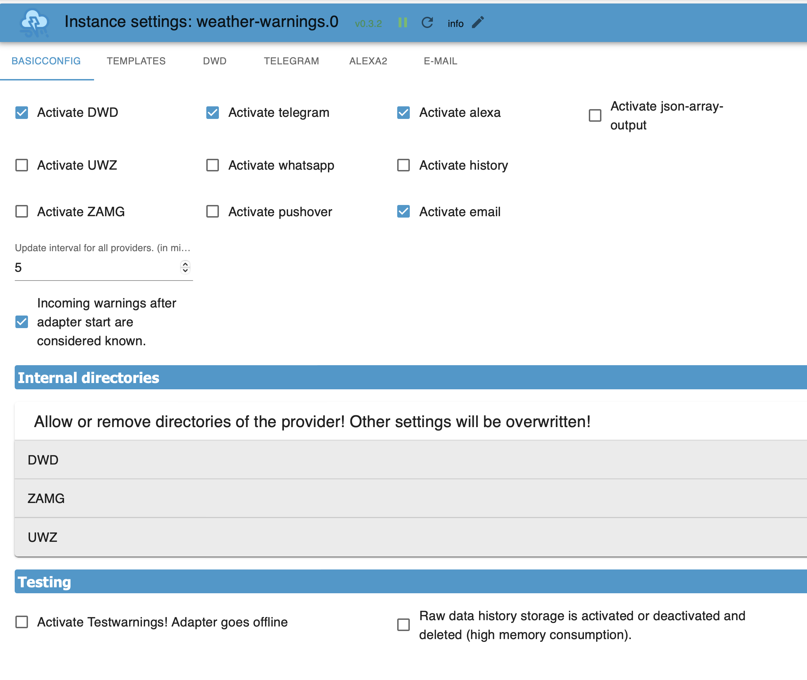
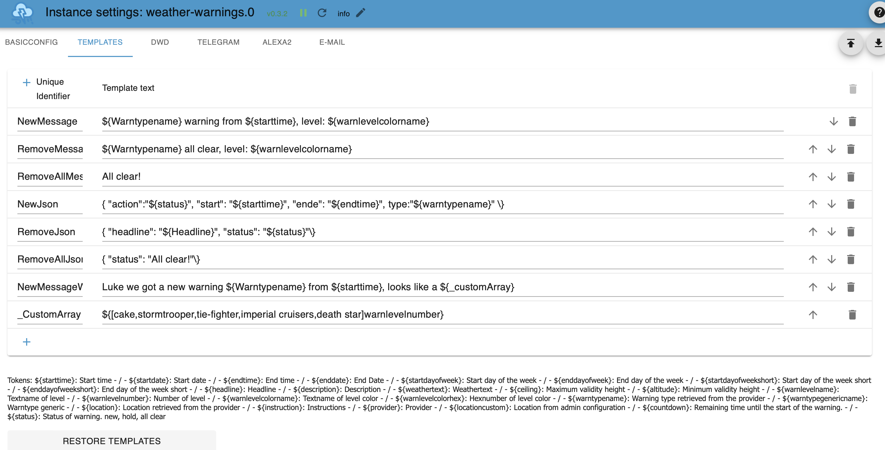
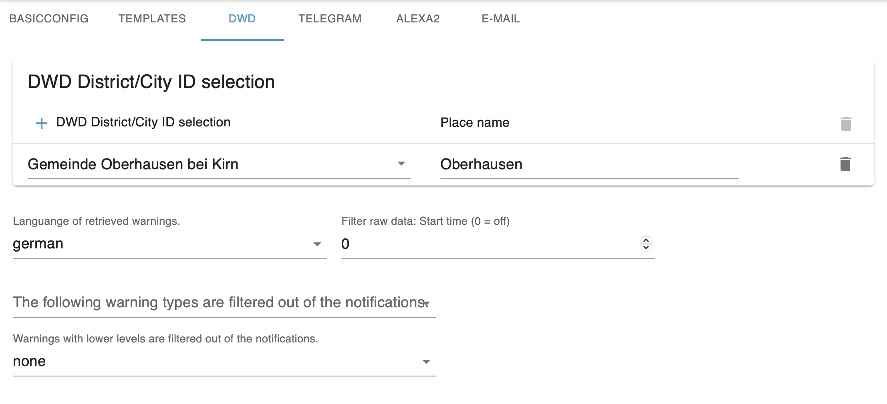
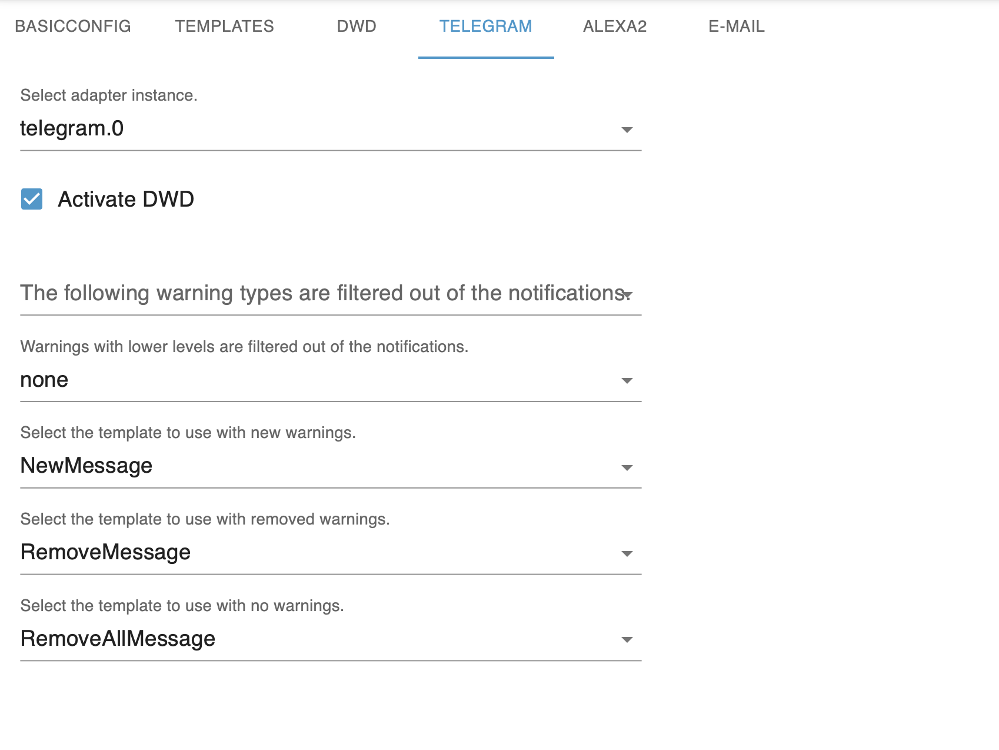

# ioBroker.weather-warnings

[](https://www.npmjs.com/package/iobroker.weather-warnings)
[](https://www.npmjs.com/package/iobroker.weather-warnings)


[](https://weblate.iobroker.net/projects/adapters/weather-warnings/)

[](https://nodei.co/npm/iobroker.weather-warnings/)

**Tests:** [](https://github.com/ticaki/ioBroker.weather-warnings/actions/workflows/test-and-release.yml)

[](https://paypal.me/ticaki)

## weather-warnings adapter for ioBroker

Dieser Adapter ruft Wetterwarnungen verschiedener optionaler Dienste ab und gibt diese als Textnachricht oder Sprachnachrichten aus. Zusätzlich werden nach Typ gruppierte States bereitgestellt, mit denen man auf aktuelle Warnlagen reagieren kann.

Provider:
- DWD 
- ZAMG (Österreich)
- UWZ

## Installation
Min. Nodejs: v22
Nach der Installation und dem automatischen öffnen der Konfigurationsseite diese **nochmals reloaden**. Damit werden die Vorlagen in der Systemsprache angezeigt.

## Konfiguration


- **DWD/UWZ/ZAMG aktivieren:** aktiviere den Datenabruf von diesen Dienstleistern
- **telegram/pushover,... aktivieren:** aktiviere die Ausgabe von Nachrichten an diese installierten Adapter. 
- **email aktivieren:** Schreibt alle aktuellen Warnungen in eine Email.
- **Verlauf aktivieren:** schreibt in den State: .history einen Verlauf der bis zu 500 Einträgen beinhalten kann. Alle Daten oder ausgewählte.
- **json-array aktivieren:** sehr speziel, schreibt die aktuellen Warnungen in ein Array oder nach Aktivierung ein benutzerdefiniertes Json in ein Array, das von Skripten ausgewertet werden kann.

- **Update interval:** Abrufinterval in Minuten zu dem Daten geladen werden. (minimum: 5)

- **Anzahl der Warnungen** Das ist die maximale Anzahl an Warnungen die verarbeitet werden pro Provider. 

- **Eingehende Warnungen ...:** Nach dem Adapterstart werden, die beim ersten Datenabruf erhaltenen Warnungen, als bekannt angesehen und lösen keine Benachrichtigung aus.

- **Testwarnungen aktivieren! Adapter ist offline:** Es werden mindestens 2 Testmeldungen pro Provider bei einem Datenabruf in das System gegeben, mit Zufälligen Stand und Endzeiten

- **Die Speicherung der Rohdatenhistorie wird aktiviert bzw. deaktiviert und gelöscht (hoher Speicherverbrauch).:** Für Debugging, nur nach Aufforderung.
- **Intervall verkürzt, Testdaten abwechselnd aktiviert und deaktiviert:** Geänderte Funktion: Interval wird auf 1 Minute gestellt. Im ersten Durchlauf werden 2 neue Warnungen gefunden. Im zweiten wird die Hälfte aufgehoben. Im letzten werden alle aufgehoben und dann gehts wieder von vorne los. 

**Zusätzliche Einstellungen(Expert)**

**Spracheinstellungen:**

**Ruhezeiten für die Sprachausgabe:** Stelle hier die Ruhezeiten ein in der keine Sprachausgabe stattfinden soll. Zeiten werden als 15:30 oder 15 oder 15:00 definiert. Bitte einen Profilnamen vergeben

**Iconeinstellungen (Alternativ):** Wenn der Prefix ausgefüllt wird ersetz dieses die Standardicons. Dort wo der Prefix hinführt müssen Dateien mit einem der gelisteten Warntypen und der Endung die in Suffix steht befinden.



Hier kannst du eigenen Vorlagen erstellen, oder vorhandene anpassen. Unterhalb der Tabelle stehen alle verfügbare "Tokens" und was sie bedeuten. Die eindeutige Kennung(Vorlagenbezeichner) wird in den Pushdiensten verwendet, um einzustellen welche Vorlage mit welcher Meldungsart verwendet werden soll.

Zeichen mit besonderer Bedeutung:
- `${}` umfasst Tokens, die durch generierte Infomationen ersetzt werden. Der Vorlagenbezeichner kann hier ebenfalls eingesetzt werden.
- Vorlagenbezeichner die mit `_` beginnen, werden bei Diensten nicht angeboten, jedoch werden diese in States geschrieben.
- `${[0,1,2,3,4]token}` Eine Zeichenkette mit Werten, token muß ein Zahlentoken sein. Index ist wie im Beispiel. 0 ist der erste Wert in der Liste
- bei einer Vorlage für Jsons muß das abschließende `}` so geschrieben werden `\}`
- siehe Beispiele im Adapter.
- es ist ebenfalls sowas möglich: `${[0,🟢,🟡,🟠,🔴]warnlevelnumber}`

Ein Beispiel:
```
Luke, wir haben eine neue Warnung ${Warntypename} ab ${starttime} erhalten, sieht aus wie ein ${_customArray}
```
Das Warntypename wird z.B. durch `Gewitter`ersetzt. `startime` durch 20:15 und `_customArray` durch das Ergebnis der entsprechenden Vorlage.  

**Restore Templates:** Setzt die Vorlagen auf die aktuelle Systemsprache zurück. Vorhandene Vorlagen gehen **verloren**. Anschließend speichern & schließen. Sollte ebenfalls verwendet werden, wenn die Systemsprache geändert wurde.

**Add Templates** fügt die Standardvorlagen hinzu, solange die eindeutige Kennung nicht verwendet wird. 



**DWD:** Die Auswahl erfolgt nach einer Liste von 10000 Orten, bis ein bug im Admin behoben ist, am besten den Ortsnamen schreiben, mehrere Leerzeichen anfügen und dann wieder entfernen. Jetzt sollte die Liste richtig gefilter sein.

**UWZ:** Eingabe erfolgt über Koordinaten, die ID wird vom Adapter selbst ermittelt.

**ZAMG:** Nur für Österreich. Eingabe von Koordinaten die in Österreich liegen.

**Place name:** benutzerdefinierte Ortsbezeichnung, kann in Warnungen verwendet werden. (Nützlich bei mehreren Warncellen)

**Filter:** 
- Filter Stunden: Filtert vor jeder weiteren Auswertung alles aus das X Stunden in der Zukunft liegt.
- Type: alles mit diesem Type wird verworfen. 
- Level: alles kleiner dieses Levels wird verworfen.


**Adapter:** Wenn diese Möglichkeit aktiviert wurde und es ein Adapterfeld gibt muß dort einen gültige Auswahl getroffen werden. Eine Fehlermeldung im Log weißt auf fehlende Einstellungen hin. 

**Activate ...:** Versende Warnungen von diesem Anbieter mit diesem Dienst.

**Filter:** 
1) Ignoriere Warnungen mit diesem Type
2) Ignoriere Warnungen mit einem gleichen oder geringeren Level

**Messages:** verwende folgende Vorlagen für:
1) Neue Warnungen oder bestehende Warnungen
2) Eine Warnung wurde entfernt und es gibt **noch** weitere Aktive.
3) Warnungen wurden entfernt und es gibt **keine** weiteren Aktiven.
Wird keine Vorlagen ausgewählt, wird nicht versendet.

**Manuell**
1) Auswahl einer Vorlage die für bestehende Warnungen verwendet werden soll
3) Auswahl einer Vorlage die für keine Warnung verwendet werden soll

Wird keine Vorlagen ausgewählt, wird nicht versendet.

Vorlagen für 3) können keine ${} Tokens enthalten, da für diese Nachricht mehrere Warnungen in Frage kommen.

**Special features**

**email:** Header wird vor die Mail gestellt, dann kommt wiederholt: 1,2 oder 3 +  Zeilenumbruch und anschließend Footer.(weitere Funktionen in Arbeit)

**alexa:** Zusätzlich muß hier noch ein/mehrere Geräte ausgewählt werden. Die Lautstärke wird nur für die Sprachnachrichten verändert und sollte anschließend wieder zurück gesetzt werden. Nachrichtengröße pro Warnung ist maximal 250 Zeichen.

###Datenpunkte:

**warning**: Enthält die Rohdaten die vom Provider geliefert werden, nur der Stundenfilter hat einfluß hierauf
**formatedKeys**: Enthält die in Vorlagen verwendbaren Tokens und deren aktueller Wert.
**alerts**: Die Benachrichtigungsdatenpunkte siehe unten
**command**: Datenpunkte mit denen etwas ausgelöst oder eingestellt werden kann.

## General Behaviour
- No duplicate messages should be sent for one and the same thing. DWD is very particular about this.
- If `none` is selected as the template, no notifications are sent for it.
- States unter `.alerts` enthalten nach Warntypen guppierte Felder für Start, Ende, Warntyp, **jetzt** aktiv und Schlagzeile. Angezeigt wird 1 Warnung pro Gruppe gefiltert nach folgenden Kriterien: 
  1) Warnung ist **jetzt** aktiv, die mit dem höchsten Level.
 

## Icons
Creator: [Adri Ansyah](https://www.youtube.com/channel/UChLOv1L-ftAFc2ZizdEAKgw?view_as=subscriber)

Licence: [CC BY 4.0 LEGAL CODE](https://creativecommons.org/licenses/by/4.0/legalcode)

Iconpage: https://icon-icons.com/de/symbol/Wetter-wind-cloud-Blitz-Regen/189105