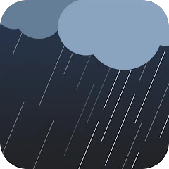

# ioBroker.weathersense

**Tests:** 

## WeatherSense adapter for ioBroker

WeatherSense is a cloud for weather stations. This adapter reads data from the WeatherSense server.

See: https://play.google.com/store/apps/details?id=com.emax.weahter&hl=de_CH

Some WiFi weather stations use the WeatherSense Cloud.

For example, this WiFi weather stations from Ideoon (Pearl):

## Use:

Simply enter your WeatherSense account login details (email and password).
The weather station data is stored in the weathersense data point.
The data can also be sent via MQTT.

## Handling Multiple Weather Stations (Multi-Instance Support)

The original WeatherSense cloud server has a software limitation/bug: if you register two or more identical weather stations within the same smartphone account, they will overwrite each other and disappear from your device list.

To successfully read data from multiple stations simultaneously without any conflicts, you can leverage ioBroker's native multi-instance architecture.

### Step-by-Step Setup:

1. **Create Separate Cloud Accounts:** Register a unique, free account for **each** of your weather stations inside the WeatherSense mobile app (e.g., *email A* for Station 1 and *email B* for Station 2).
2. **Bind One Station Per Account:** Pair your first station strictly with Account A and your second station strictly with Account B.
3. **Add Multiple Instances in ioBroker:**
   * Go to the `Instances` tab in ioBroker and add a second instance of the WeatherSense adapter (this creates `weathersense.0` and `weathersense.1`).
4. **Configure the Instances:**
   * Open the configuration for **`weathersense.0`** and enter the credentials for **Account A**. Set the `Sensor ID` to `1`.
   * Open the configuration for **`weathersense.1`** and enter the credentials for **Account B**. Set the `Sensor ID` to `2`.

### Benefits of this Setup:
* **No Data Conflicts:** ioBroker will spin up two completely separate processes.
* **Separated Objects:** Your data points are neatly separated into `weathersense.0.*` and `weathersense.1.*`.
* **Clean MQTT Routing:** If you use the integrated MQTT feature, your topics will be cleanly separated by the Sensor ID (e.g., `weathersense/1/...` and `weathersense/2/...`), preventing data from overwriting on your broker.

## Changelog
### 5.2.2 (2026-07-09)

- Typo corrected

### 5.2.1 (2026-07-09)

- Typo corrected

### 5.2.0 (2026-07-09)

- Invert PowerStatus flag added

### 5.1.1 (2026-07-05)

- Bugfix: Unit windDirection km/h → °

### 5.1.0 (2026-07-04)

- Now filenames of JSON files beginning with weathersense.{sensor_id}...

[Older changelogs can be found there](CHANGELOG_OLD.md)

## License

MIT License

Copyright (c) 2025-2026 Daniel Luginbühl <webmaster@ltspiceusers.ch>

Permission is hereby granted, free of charge, to any person obtaining a copy
of this software and associated documentation files (the "Software"), to deal
in the Software without restriction, including without limitation the rights
to use, copy, modify, merge, publish, distribute, sublicense, and/or sell
copies of the Software, and to permit persons to whom the Software is
furnished to do so, subject to the following conditions:

The above copyright notice and this permission notice shall be included in all
copies or substantial portions of the Software.

THE SOFTWARE IS PROVIDED "AS IS", WITHOUT WARRANTY OF ANY KIND, EXPRESS OR
IMPLIED, INCLUDING BUT NOT LIMITED TO THE WARRANTIES OF MERCHANTABILITY,
FITNESS FOR A PARTICULAR PURPOSE AND NONINFRINGEMENT. IN NO EVENT SHALL THE
AUTHORS OR COPYRIGHT HOLDERS BE LIABLE FOR ANY CLAIM, DAMAGES OR OTHER
LIABILITY, WHETHER IN AN ACTION OF CONTRACT, TORT OR OTHERWISE, ARISING FROM,
OUT OF OR IN CONNECTION WITH THE SOFTWARE OR THE USE OR OTHER DEALINGS IN THE
SOFTWARE.
