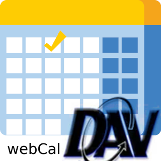

# ioBroker.webcal

[](https://www.npmjs.com/package/iobroker.webcal)
[](https://www.npmjs.com/package/iobroker.webcal)


[](https://nodei.co/npm/iobroker.webcal/)

**Tests:** 

## webcal adapter for ioBroker

with this ioBroker adapter you can 
- fetch events from WEBDAV, CALDAV, CARDDAV or Google Calendar.
- add new Calendar items based on events

### Calendar Accounts
**Nextcloud**   
use basic auth and following Url (you can get it by shared link)

`https://<domain>/<optional basePath>/remote.php/dav/calendars/<username>/<optional displaName>`

**Google**   
  see [using Google API](doc/google.md)
- Use the following settings in ioBroker
    - name = internal name, if this matches google-calendar name, this will used
	- auth Methold = google
	- Secret = Client Secret
	- refresh token = which you get from above
	- client ID = your clientID

**Download iCal**
  you can download an ical calendar for calendar, which not support dav. But this is than readonly, means no Calendar items could be added
  
### Datapoints
**add new Event**

you can add a new Calender Entry based on the Event. Please use the following Syntax:

`relDays[@calendar] | date|datetime[ - date|datetime][@calendar]`

	relDays - number of days from today
	or date/datetime as parsable date or datetime
	@calendar is optional the name of the calendar, default is first defined calendar

also possible via Script:
```
sendTo("webcal.0", "addEvents", {
    calendar: "smarthome",
    events: [
      {
        summary: "test",
        start: "9.8.23 23:00",
        end: "10.08.2023 14:00"
      },	  
      {
        summary: "failed test",
		description: "long description",
        start: "9.8"
      }
    ]
  },function(events){
    /* callback function 
	   object events will be repeat from input, 
	   with additional status or error field, 
	   also startDate and endDate are provided as Object data   
	*/
	log(events);	
  })
```
output from log will be:
```
[
  {
    "summary": "test",
    "start": "9.8.23 23:00",
    "end": "10.08.2023 14:00",
    "startDate": {
      "year": 2023,
      "month": 8,
      "day": 9,
      "hour": 23,
      "minute": 0,
      "second": 0,
      "isDate": false
    },
    "endDate": {
      "year": 2023,
      "month": 8,
      "day": 10,
      "hour": 14,
      "minute": 0,
      "second": 0,
      "isDate": false
    },
    "status": "successfully added"
  },
  {
    "summary": "failed test",
    "description": "long description",
    "start": "9.8",
    "startDate": {
      "year": 0,
      "month": 1,
      "day": 2,
      "hour": 0,
      "minute": 0,
      "second": 0,
      "isDate": false
    },
    "error": "start: invalid date"
  }
]
```

if `calendar` not given, defaultCalender will used

on `event` field `end` and `description` is optional 

**delete Event**
possible via Script:
```
sendTo("webcal.0", "deleteEvents", {
    calendar: "smarthome",
    events: [
      {
        id: "e3fcbf3b-651c-470f-b307-9d20be5902eb"
      },	  
      {
        id: "failed test"
      }
    ]
  },function(events){
    /* callback function 
	   object events will be repeat from input, 
	   with additional status or error field,   
	*/
	log(events);	
  })
```
output from log will be:
```
[
  {
    "id": "e3fcbf3b-651c-470f-b307-9d20be5902eb
    "status": "successfully deleted"
  },
  {
    "id": "failed test",
    "error": "not found"
  }
]
```

### Visualization 
if you want to use iobroker [vis-material-design](https://github.com/Scrounger/ioBroker.vis-materialdesign#calendar), you can use [this](doc/vis-material-design.js) script

### known errors
breaking (exception) a serie of events will be ignored 
### DISCLAIMER
This project uses the following components:
- [tsDav](https://github.com/natelindev/tsdav)
- [ical](https://github.com/kewisch/ical.js)
- [dayJS](https://github.com/iamkun/dayjs)


## Changelog
<!--
	Placeholder for the next version (at the beginning of the line):
	### **WORK IN PROGRESS**
  * ()

-->
### 1.3.7 (2024-05-20)
  * (dirkhe) improve logging
  * (dirkhe) fix passort was not stored

### 1.3.6 (2024-05-18)
  * (dirkhe) fix bug in repeated events

### 1.3.5 (2024-05-05)
* (dirkhe) increase dependecy adapter-core
* (dirkhe) fix json config
* (dirkhe) update dependecies

### 1.3.3 (2024-04-07)	
* (dirkhe) fix config validation
* (dirkhe) update dependecies
* (dirkhe) update year for copyright #56
* (dirkhe) increase to node 18 for CI Pipeline

### 1.3.2 (2024-02-23)
* (dirkhe) update dependecies
* (dirkhe) linting

### 1.3.0 (2023-10-31)	
* (dirkhe) add choose calendar for events
* (dirkhe) add example script for vis-material-designmaterial
* (dirkhe) add event id to JSON data
* (dirkhe) add event delete function
* (dirkhe) fix endtime
* (dirkhe) fix missing upate of iQontrol States

### 1.2.0 (2023-08-15)	
* (dirkhe) add description for sendTo-addEvent
* (dirkhe) fix calculating events
* (dirkhe) add log which google calendar is used 
* (dirkhe) add datefilter for readonly 
* (dirkhe) add readonly client for ical

### 1.1.0 (2023-08-09)
* (dirkhe) add addEvent-command to sendTo
* (dirkhe) fix date parsing, if day only one digit
* (dirkhe) update dependecies

### 1.0.7 (2023-08-06)	
* (dirkhe) change event state type from group to folder

### 1.0.6 (2023-08-06)	
* (dirkhe) add pictured Google API documentation
* (dirkhe) fix property of button
* (dirkhe) add housekeeping for setInterval/setTimeout
* (dirkhe) check updateinterval for minimum of 10 minutes

### 1.0.5 (2023-04-26)	
* (dirkhe) set update addEvent-states to 00:10
* (dirkhe) fix timeframe for JSON data
* (dirkhe) fix layout for config

### 1.0.4 (2023-04-08)
* (dirkhe) fix environment setup

### 1.0.2 (2023-04-07)
* (dirkhe) publish to npm

### 1.0.0 (2023-04-07)
* (dirkhe) rework i18n

### 0.4.0 (2023-03-05)
* (dirkhe) add Event default Calendar
* (dirkhe) add iQontrol options for addEvent

### 0.3.0 (2023-02-22)
* (dirkhe) add Calendar Inactive
* (dirkhe) fix calc for jsonEvent and next
* (dirkhe) add dateText to jsonEvent

#### 0.2.0 (2023-02-21)
* (dirkhe) add next event and json data
* (dirkhe) add Iqontrol format to addEvent DP

### 0.1.0 (2023-02-16)
* (dirkhe) initial release
* (dirkhe) fix not shown times with daysPast 
* (dirkhe) complete rework and implement Google

## License
MIT License

Copyright (c) 2024 dirkhe 

Permission is hereby granted, free of charge, to any person obtaining a copy
of this software and associated documentation files (the "Software"), to deal
in the Software without restriction, including without limitation the rights
to use, copy, modify, merge, publish, distribute, sublicense, and/or sell
copies of the Software, and to permit persons to whom the Software is
furnished to do so, subject to the following conditions:

The above copyright notice and this permission notice shall be included in all
copies or substantial portions of the Software.

THE SOFTWARE IS PROVIDED "AS IS", WITHOUT WARRANTY OF ANY KIND, EXPRESS OR
IMPLIED, INCLUDING BUT NOT LIMITED TO THE WARRANTIES OF MERCHANTABILITY,
FITNESS FOR A PARTICULAR PURPOSE AND NONINFRINGEMENT. IN NO EVENT SHALL THE
AUTHORS OR COPYRIGHT HOLDERS BE LIABLE FOR ANY CLAIM, DAMAGES OR OTHER
LIABILITY, WHETHER IN AN ACTION OF CONTRACT, TORT OR OTHERWISE, ARISING FROM,
OUT OF OR IN CONNECTION WITH THE SOFTWARE OR THE USE OR OTHER DEALINGS IN THE
SOFTWARE.