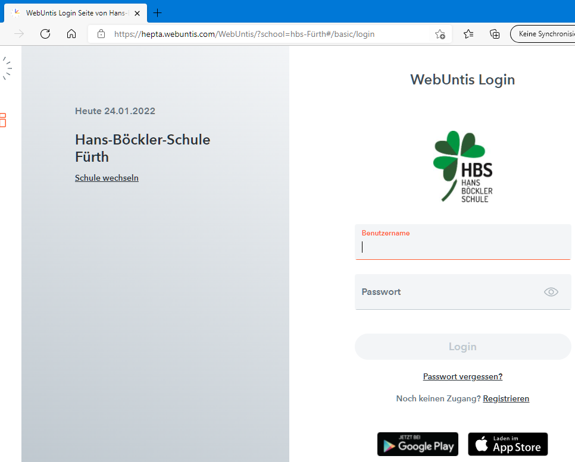

# ioBroker.webuntis

**Tests:** 

## webuntis adapter for ioBroker

Adapter to get data from WebUntis

Dieser Adapter bezieht Daten aus Webuntis. 
Für eine deutsche Anleitung 

## Getting started
After the install of the adapter in iobroker, automatically opens the Configuration-Window.

Now go to https://webuntis.com and take the schoolname in the searchfield.

now you need to strings from the internet-adress of the schoolwebsite from webuntis:
- the base-url 
- the school-secret

see the example below the previous screenshot:
https://hepta.webuntis.com/WebUntis/?school=hbs-F%C3%BCrth#/basic/login

- hepta.webuntis.com    => the schoolbase-URL
- hbs-F%C3%BCrth        => the school-secret

**If in school-secret is a __+__ , then you must replace this character with a blank space**

now go to the configuration-window in iobroker

after the insert of your Username (child or parent) and the password for this account, you can take 
the school-secret and the school-basr-Url to the configuration.

Save and at this moment you will become the lessons for the next day.

please feel free, to make a proposal for recommend versions.

## Changelog
<!--
    Placeholder for the next version (at the beginning of the line):
    ### **WORK IN PROGRESS**
-->
### 0.3.1 (2022-01-30)
* Bug fixes in timetable

### 0.3.0 (2022-01-29)
* Add Inbox peview data

### 0.2.0 (2022-01-27)
* Add anonymous login

### 0.1.0 (2022-01-25)
* Add nextDay
* Add code element

### 0.0.1 (2022-01-25)
* (Newan) initial release

## License
MIT License

Copyright (c) 2022 Newan <info@newan.de>

Permission is hereby granted, free of charge, to any person obtaining a copy
of this software and associated documentation files (the "Software"), to deal
in the Software without restriction, including without limitation the rights
to use, copy, modify, merge, publish, distribute, sublicense, and/or sell
copies of the Software, and to permit persons to whom the Software is
furnished to do so, subject to the following conditions:

The above copyright notice and this permission notice shall be included in all
copies or substantial portions of the Software.

THE SOFTWARE IS PROVIDED "AS IS", WITHOUT WARRANTY OF ANY KIND, EXPRESS OR
IMPLIED, INCLUDING BUT NOT LIMITED TO THE WARRANTIES OF MERCHANTABILITY,
FITNESS FOR A PARTICULAR PURPOSE AND NONINFRINGEMENT. IN NO EVENT SHALL THE
AUTHORS OR COPYRIGHT HOLDERS BE LIABLE FOR ANY CLAIM, DAMAGES OR OTHER
LIABILITY, WHETHER IN AN ACTION OF CONTRACT, TORT OR OTHERWISE, ARISING FROM,
OUT OF OR IN CONNECTION WITH THE SOFTWARE OR THE USE OR OTHER DEALINGS IN THE
SOFTWARE.