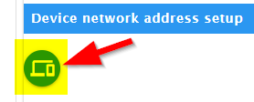
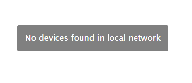
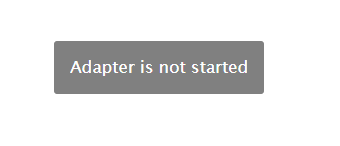
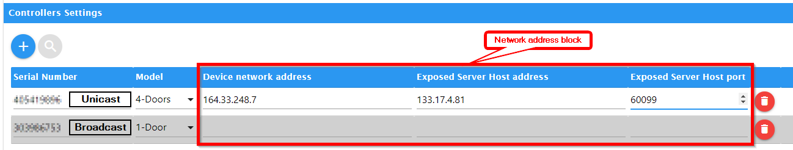

# **Setup**
- [Initial start-up](#initial-start-up) Fist time access to the Device
- [Setup the adapter](#door-access-controllers-settings) Setup the ioBroker Adapter
  - [TCP/IP Network Settings](#tcpip-network-settings) Setup the adapter network
  - [Controllers Settings](#controllers-settings) Device setup
    - [Broadcast](#broadcast)
      - [Serial Number](#serial-number)
    - [Dedicated network setup](#dedicated-network-setup)
      - [Serial Number](#serial-number)
      - [Device network address](#device-network-address)
      - [Exposed Server Host address](#exposed-server-host-address)
      - [Exposed Server Host port](#exposed-server-host-port)

## **Initial start-up**
When you connect the device for the first time, it may be useful to enter the network data.

These steps are optional and only required to use the device on another, remote network outside of the local network of the ioBroker instance
* To do this...
  - Connect the device to the same network in which ioBroker is also located. No Docker, VPN or other subnet. [^1]
  - Install and start the adapter with default settings.
  - Got to the Configuration and switch to the "Device Remote Setup" tab
  - Run the device scan.
    
    There are two possible error messages that result in no devices being found[^3], [^4]
  - If you have more than one device active, select the one you want in the "Device Id" dropdown box.
  - Put the desired address data in the appropriate input fields[^2]
  - Now install the device in the target network

## **Door Access Controllers Settings**

### **TCP/IP Network Settings**

#### **Network interface**
From the list, select the network host adapter to which you have connected your device. [^2]
- Special addresses
  - `0.0.0.0` All available interfaces (Default)
  - `127.0.0.1` Only local host network (for the [simulator](https://github.com/uhppoted/uhppote-simulator))
  - All others can be used if you know what you want. e.g. VPN, Docker etc...

#### **Sender-Port**
Default is 60000. Without error message from the network there is no need the change that.

#### **Receiver-Port**
Default is 60001. Without error message from the network there is no need the change that.
I redefined port 60099 for the adapter. If something doesn't work, change this back to the default.

#### **Connection Timeout in milli seconds**
Default is 2500 (2,5 seconds).
Timeout for any communication over the network.
Do not change without consultation.
Values below 1000 and above 10000 can work for the time being,
 but always lead to errors in real operation.

#### **Heartbeat Interval in milli seconds**
Default is 300000 (300 seconds == 5 minutes).
Time in between two attempts to establish a standard connection to the device to decide if it's alive.
Values below 60000 and above 900000 can cause unwanted side effects that are difficult to analyze.

#### **Maximum time deviation in milliseconds**
Default is 60000 (60 seconds == 1 minute)
Maximum time deviation in milliseconds.
If the deviation is larger, the controller clock is recalibrated.
Values below 1200 milliseconds are ignored and the calibration is switched off.

#### **Low Level Debug**
Default off. If enabled the raw network communication was logged to the debug log.
No need to change without a request from a developer.

### **Controllers Settings**
Device setup for forward and reverse channel via the network.
Use the **+ / add** and the **trash** per available device.
There are two options for communication between the host (ioBroker) and the device.
Limited Broadcast and dedicated network setup (Unicast & Directed Broadcast). [^7]

#### **Serial Number**
The serial number of your device.

#### **Model Type**
Enter the Door Model

#### **Limited Broadcast** [^7]
Add only the serial number and the Model-Type and no other address / network data.
  >In this case, all components must be in the same subnet.
  >This includes both the sender (controller) and the receiver (ioBroker).
  >This can be recognized by the same gateway address and network mask on both components.

>In all other cases, ALWAYS use "dedicated network setup".

#### **Dedicated network setup (Unicast & Directed Broadcast)** [^7]
Please enter all address data...

#### **Device network address** [^7]
The publicly known IP address (Unicast) of the device on the remote network. [^2] [^8]

#### **Exposed Server Host address** [^7]
The publicly known IP address (Unicast) of the ioBroker instance on the remote network. [^2] [^8]

#### **Exposed Server Host port** [^7]
The publicly known IP port of the ioBroker instance on the remote network after NAT [^5] and Docker-Exposed [^6] .

[^1]: If you are unable to connect the device to the same local network as the ioBroker instance,
  you must set the IP addresses in another alternative way

[^2]: The device only allows IPv4 addresses.

[^3]: 

[^4]: 

[^5]: [NAT RFC#2663](https://datatracker.ietf.org/doc/html/rfc2663)

[^6]: [Docker CLI: Port](https://docs.docker.com/engine/reference/commandline/port/)

[^7]: 

[^8]: You can replace the "Unicast Address" with the "Directed Broadcast Address" in the configuration.

## Changelog
### 0.4.7 (2024-11-05)
* Fix for ioBroker.BOT see issues
* Changes to new dependencies Node 22.x, Admin 5 and JS-Controler 5.0.19...

### 0.4.6 (2022-03-18)
* Documentation
* Translations
* Cosmetic improvements
* Fix for [Repository PR1720](https://github.com/ioBroker/ioBroker.repositories/pull/1720).

#### [History](CHANGELOG.md)

## License
GPL-3.0-only

Copyright (c) 2024 kbrausew <kbrausew@magenta.de>