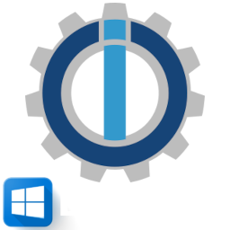

# ioBroker.winsipbrowser

## Info
control of a Windows full-screen browser with sipclient

Adapter for ioBroker

This adapter connects to winsipbrowser via tcp.socket to control it.

winsipbrowser is a Windows fullscreen browser wit sipclient that can be controlled via ioBroker, it displays individual websites or a website slideshow that can be set in the adapter. Information is also transmitted to the adapter:
+ CPU load
+ free memory
+ current battery discharge on tablet or notebook
+ hostname
+ IP

He can also control:
+ Screen on/off
+ exit app
+ volume +/-
+ Mute on/off
+ brightness +/-
+ Run programs with switches e.g. C:\ClickMonitorDDC\ClickMonitorDDC_7_2.exe b 100
+ Text Messages
+ Speak Messages

## Link
* [ioBroker Forum Adapter Thread](https://forum.iobroker.net/topic/53162/neuer-adapter-winsipbrowser-f%C3%BCr-windows)
* [ioBroker Forum Programm Thread](https://forum.iobroker.net/topic/53032/sprechanlagen-innenstation-browser-mit-sip-client?_=1646732403727)

## Changelog
### 0.1.1
* (bettman66) stop slideshow by touchevent

### 0.1.0
* (bettman66) tcpclient2tcpserver

### 0.0.5
* (bettman66) add messages

### 0.0.4
* (bettman66) add siphungup

### 0.0.3
* (bettman66) add sipring

### 0.0.2
* (bettman66) add sipcall

### 0.0.1
* (bettman66) first commit

## License
The MIT License (MIT)

Copyright (c) 2022 Walter Zengel <w.zengel@gmx.de>

Permission is hereby granted, free of charge, to any person obtaining a copy
of this software and associated documentation files (the "Software"), to deal
in the Software without restriction, including without limitation the rights
to use, copy, modify, merge, publish, distribute, sublicense, and/or sell
copies of the Software, and to permit persons to whom the Software is
furnished to do so, subject to the following conditions:

The above copyright notice and this permission notice shall be included in
all copies or substantial portions of the Software.

THE SOFTWARE IS PROVIDED "AS IS", WITHOUT WARRANTY OF ANY KIND, EXPRESS OR
IMPLIED, INCLUDING BUT NOT LIMITED TO THE WARRANTIES OF MERCHANTABILITY,
FITNESS FOR A PARTICULAR PURPOSE AND NONINFRINGEMENT. IN NO EVENT SHALL THE
AUTHORS OR COPYRIGHT HOLDERS BE LIABLE FOR ANY CLAIM, DAMAGES OR OTHER
LIABILITY, WHETHER IN AN ACTION OF CONTRACT, TORT OR OTHERWISE, ARISING FROM,
OUT OF OR IN CONNECTION WITH THE SOFTWARE OR THE USE OR OTHER DEALINGS IN
THE SOFTWARE.
