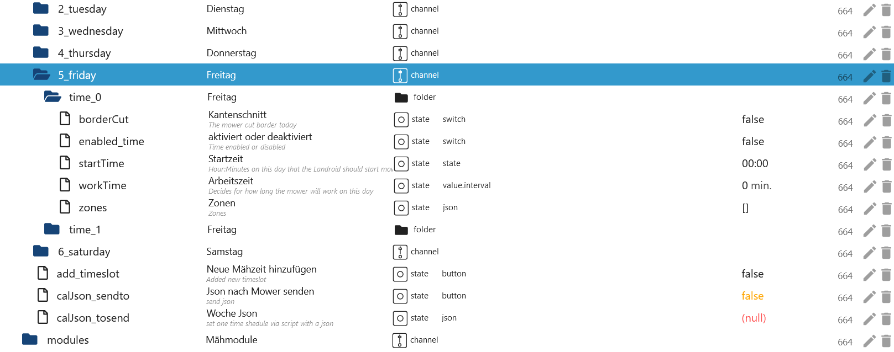

# ioBroker.worx Adapter

## Description

### Instance settings

-   `App Email`: Your APP Username (eMail)
-   `App Password`: Your APP Password
-   `App Name`: Choose your device
-   `Delay for EdgeCut`: When should EdgeCut start (example 5 seconds to lawn)


-   `Distance and time in min and m`: Default h and km
-   `Ping MQTT Connection every 10 minutes.`: Just to test. Please no longer than 1 hour!
-   `Updating MQTT data after token update.`: Loads the Worx data after the refresh token. 24 additional queries per day/devices.


### Folder

-   `activityLog`: Your activity log (control possible)
-   `areas`: Areas (control possible)
-   `calendar`: Time schedule (control possible)
-   `Modules`: Your module(s) (control possible)
-   `mower`: Your mower (control possible)
-   `product`: All properties of your devices (readonly)
-   `rawMqtt`: All data from the cloud (readonly)


### activityLog (Wire and Vision)

-   `last_update`: Last update as timestamp
-   `manuell_update`: Loads the current activity log (automatically after status changes)
-   `payload`: Activity log as JSON Table (for VIS or Blockly)


### areas (without Vision)

-   `actualArea`: Current
-   `actualAreaIndicator`: Next array zone start
-   `area_0`: Start of zone 1 in meters (array=0) (changeable)
-   `area_1`: Start of zone 2 in meters (array=1) (changeable)
-   `area_2`: Start of zone 3 in meters (array=2) (changeable)
-   `area_3`: Start of zone 4 in meters (array=3) (changeable)
-   `startSequence`: Array zone start (0-9 events) e.g. Start in Zone 3 only [2,2,2,2,2,2,2,2,2,2] (changeable)
-   `zoneKeeper`: Safe driving in narrow zone crossings (Areas must be created) (as of Firmware 3.30) (changeable)


### calendar (Wire)

-   E.g. time setting for wednesday

    -   `wednesday.borderCut`: With or without bordercut (Change value without delay) (changeable)
    -   `wednesday.startTime`: Starttime hh:mm (0-23/0-59) e.g. 09:00 (Change value without delay) (changeable)
    -   `wednesday.workTime`: Working time in minutes (180 min = 3h) e.g. 30 = Endzeit 09:30 (Change value without delay) (changeable)
    -   `calJson_sendto`: If all States are set, then press button to send (with a 1,1 second delay). The mower will now mow for 30 minutes (changeable)
    -   `calJson_tosend`: This data is sent to Mqtt (Both mowing schedule/is set automatically). You can also create this JSON yourself. (changeable)
    -   `calendar.calJson`: Array for the weekly mowing plan. You can also create this ARRAY yourself. (mowing schedule 1/is set automatically - for wire only) (changeable)
    -   `calendar.calJson2`: Array for the weekly mowing plan. You can also create this ARRAY yourself. (mowing schedule 2/is set automatically - for wire only) (changeable)


### calendar (Vision)

-   E.g. time setting for friday
-   As standard, 2 timeslots are created. If 3 slots are created in the APP, 3 will also be created in ioBroker. If it is reduced again to 2, these slots will be deleted in ioBroker. The day with the most slots is used as a reference for all days.

    -   `friday.time_0.borderCut`: With or without bordercut (Change value without delay) (changeable)
    -   `friday.time_0.startTime`: Starttime hh:mm (0-23/0-59) e.g. 09:00 (Change value without delay) (changeable)
    -   `friday.time_0.workTime`: Working time in minutes (180 min = 3h) e.g. 30 = Endzeit 09:30 (Change value without delay) (changeable)
    -   `friday.time_0.enabled_time`: Activate or deactivate time. When deactivated, the timeslot is deleted (set without delay) (can be changed)
    -   `friday.time_0.zones`: Which zones should be approached, e.g. Example [1,2,3] (set without delay) (can be changed)
    -   `calJson_sendto`: If all States are set then set this button to true (with a delay of 1.1). The mower will now mow for 30 minutes! (changeable)
    -   `calJson_tosend`: This JSON is automatically filled and then sent to Mqtt. Of course you can also create it yourself. (changeable)
    -   `add_timeslot`: An additional timeslot is added. Unused timeslots are removed after a restart. (changeable)




### Example Timeslot (Vision)

-   `calJson_tosend` This JSON would enter 1 time on Sunday and delete all other days. The entire week must always be submitted.

```json
[
    {
        "e": 1, // 0=deactivated/1=activated - Set 0 for deactivated this slot
        "d": 0, // Days 0=sunday, 1=monday, 2=tuesday, 3=wednesday, 4=thursday, 5=friday, 6=saturday
        "s": 360, // Start time in minutes 06:00 (360/60) - (320/60 = 5 hours and 20 minutes)
        "t": 180, // Mowing time in minutes = End time 09:00 (180/60) - (200/60 = 3 hours and 20 minutes)
        "cfg": {
            "cut": {
                "b": 1, // 0=without BorderCut/1=with BorderCut
                "z": [1] // Which zones [1,2,6]
            }
        }
    }
]
```

### modules (Wire and Vision)

-   Off Limit Module (Wire and Vision)

    -   `DF.OLMSwitch_Cutting`: Prevents magnetic tape from being run over - true-on/false-off
    -   `DF.OLMSwitch_FastHoming`: Fast return to the charging station - true-on/false-off

-   ACS Module (Wire only)

    -   `US.ACS`: Enable or disable ACS - 1-on/0-off
    -   `US.ACS_Status`: Status from ACS Module

-   EA Module (Vision only)

    -   `EA.height`: Height adjustment of mower deck from 30-60 in 5 mm increments

-   HL Module (Vision only)
    -   `HL.status`: Status head light
    -   `HL.enabled`: Head light installed yes = 1/no = 0
    -   `HL.on`: Daylight = 0/Darkness = 1


### mower (Wire and Vision)

-   `AutoLock`: Auto lock true-on/false-off (wire & Vision/changeable)
-   `AutoLockTimer`: Timer auto lock max. 10 minutes in 30 second steps (wire & Vision/changeable)
-   `batteryChargeCycle`: Battery charge cycle (wire & Vision/readonly)
-   `batteryCharging`: Battery charging false->no/true->yes (wire & Vision/readonly)
-   `batteryState`: Battery state in % (wire & Vision/readonly)
-   `batteryTemperature`: Battery temperature in celsius (wire & Vision/readonly)
-   `batteryVoltage`: Battery voltage in Volt (wire & Vision/readonly)
-   `cutOverSlabs`: Cut over slabs on = true / off = false (Vision/changeable)
-   `direction`: Direction in grad (wire & Vision/readonly)
-   `edgecut`: Start EdgeCut (wire & Vision/changeable)
-   `error`: Error message from mower (wire & Vision/readonly)

```json
{
    "states": {
        "0": "No error", //(wire & Vision)
        "1": "Trapped", //(wire & Vision unknown)
        "2": "Lifted", //(wire & Vision)
        "3": "Wire missing", //(wire & Vision unknown)
        "4": "Outside wire", //(wire & Vision unknown)
        "5": "Raining", //(wire & Vision)
        "6": "Close door to mow", //(wire & Vision)
        "7": "Close door to go home", //(wire & Vision)
        "8": "Blade motor blocked", //(wire & Vision)
        "9": "Wheel motor blocked", //(wire & Vision)
        "10": "Trapped timeout", //(wire & Vision)
        "11": "Upside down", //(wire & Vision)
        "12": "Battery low", //(wire & Vision)
        "13": "Reverse wire", //(wire & Vision unknown)
        "14": "Charge error", //(wire & Vision)
        "15": "Timeout finding home", //(wire & Vision)
        "16": "Mower locked", //(wire & Vision)
        "17": "Battery over temperature", //(wire & Vision)
        "18": "dummy model", //(wire & Vision)
        "19": "Battery trunk open timeout", //(wire & Vision)
        "20": "wire sync", //(wire & Vision unknown)
        "21": "msg num", //(wire & Vision)
        "110": "Camera error" //(Vision)
    }
}
```


-   `firmware`: Current installed firmware (wire & Vision/readonly)
-   `firmware_available`: Available firmware (wire & Vision/readonly)
-   `firmware_available_all`: Last available firmware as JSON - This JSON will be updated when a new update is available (wire & Vision/readonly)

```json
{
    "mandatory": false,
    "product": {
        "uuid": "1236ll8d-0000-0000-9999-07ff6690003f",
        "version": "3.30.0+1",
        "released_at": "2023-05-24",
        "changelog": "•\tSupport for new models \tWR166E and WR184E\n•\tImproved Grass cutting coverage\n•\tImproved ACS\n•\tAdded Zone Keeper function (need to be enabled by app)\n•\tImproved wheel torque algorithm\n• \tNew FML firmware\n•\tFixed \"FML\" and \"Radiolink\" Activation problem\n•\tFixed some translations error\n•\tRain delay can now be cleared pressing START / HOME button, (1 minute after countdown has started)\n•\tImproved PRO Battery management\n• \tImproved boundary wire recognition\n• \tFixed border cut when zones are active\n• \tNew wifi firmware for board HW REV > 7\n\nThe Worx Landroid team would like to thank our amazing beta testers, with hundreds of hours of their own free time to make this firmware possible."
    }
}
```

-   `firmware_available_date`: Date available firmware - Dummy 1970-01-01 when the adapter is reinstalled and no update is available (wire & Vision/readonly)
-   `firmware_body` Value from dat.fw (Vision/readonly)
-   `firmware_head` Value from dat.head.fw (Vision/readonly)
-   `firmware_update_start`: Start firmware update in 2 steps - see below `firmware_update_start_approved` (wire & Vision/changeable)
-   `firmware_update_start_approved`: Start firmware update - `firmware_update_start` must be set to true (wire & Vision/changeable)
-   `gradient`: Gradient in grad (wire & Vision/readonly)
-   `inclination`: Inclination in grad (wire & Vision/readonly)
-   `last_command`: Last Request from iobroker or APP as JSON Table (wire & Vision/readonly)
-   `mowTimeExtend`: Mow time extend in % Range: -100%->100% (wire/changeable)
-   `mowerActive`: Pause mowing plan (wire/changeable)
-   `mqtt_update`: Update Mqtt data max. 150/day (wire & Vision/changeable)
-   `mqtt_update_count`: Counter Update Mqtt data (wire & Vision/readonly)


-   `oneTimeJson`: One-time mowing as JSON (wire & Vision/changeable)

```json
{
    "wtm": 60, //Minutes
    "bc": 0 //0=w/o bordercut 1=with bordercut or use the next State
}
```

-   `oneTimeStart`: One-time mowing start “First set oneTimeWithBorder, oneTimeWorkTime and oneTimeZones for Vision” - with a 1,1 second delay (wire & Vision/changeable)
-   `oneTimeWithBorder`: With bordercut - Change value without delay (wire & Vision/changeable)
-   `oneTimeWorkTime`: Worktime max. 8h in 30 minute steps - Change value without delay (wire & Vision/changeable)
-   `oneTimeZones`: Set zones [1,2,4] (Vision/changeable)
-   `online`: Mower online (wire & Vision/readonly)
-   `partyModus`: Partymodus turn on/off (wire & Vision/changeable)
-   `pause`: Mower break turn on/off (wire & Vision/changeable)
-   `reset_battery_time`: reset battery charges in 2 steps (wire & vision/changeable)
-   `reset_battery_time_approved`: Confirm reset battery charges - `reset_battery_time` must be set to true (wire & vision/modifiable)
-   `reset_blade_time`: reset blade working time in 2 steps (wire & vision/changeable)
-   `reset_blade_time_approved`: confirm reset blade working time - `reset_battery_time` must be set to true (wire & vision/changeable)


-   `sendCommand`: Send cmd command (wire & Vision/changeable)

```json
{
    "states": {
        "1": "Start", //(wire & Vision)
        "2": "Stop", //(wire & Vision)
        "3": "Home", //(wire & Vision)
        "4": "Start Zone Taining", //(wire & Vision unknown)
        "5": "Lock", //(wire & Vision unknown)
        "6": "Unlock", //(wire & Vision)
        "7": "Restart Robot", //(wire & Vision)
        "8": "pause when follow wire", //(wire & Vision unknown)
        "9": "safe homing" //(wire & Vision unknown)
    }
}
```

-   `state`: True for start mower and False for stop mower (wire & Vision/changeable)
-   `status`: Status mower (wire & Vision/readonly)

```json
{
    "states": {
        "0": "IDLE", //(wire & Vision)
        "1": "Home", //(wire & Vision)
        "2": "Start sequence", //(wire & Vision)
        "3": "Leaving home", //(wire & Vision)
        "4": "Follow wire", //(wire & Vision unknown)
        "5": "Searching home", //(wire & Vision)
        "6": "Searching wire", //(wire & Vision unknown)
        "7": "Mowing", //(wire & Vision)
        "8": "Lifted", //(wire & Vision)
        "9": "Trapped", //(wire & Vision)
        "10": "Blade blocked", //(wire & Vision)
        "11": "Debug", //(wire & Vision)
        "12": "Remote control", //(wire & Vision)
        "13": "escape from off limits", //(wire & Vision)
        "30": "Going home", //(wire & Vision)
        "31": "Zone training", //(wire & Vision)
        "32": "Border Cut", //(wire & Vision)
        "33": "Searching zone", //(wire & Vision)
        "34": "Pause" //(wire & Vision)
    }
}
```

-   `torque`: Wheel torque Range -50->50 (wire & Vision/changeable)
-   `totalBladeTime`: Total blade time (wire & Vision/readonly)
-   `totalDistance`: Total distance (wire & Vision/readonly)
-   `totalTime`: Total working time (wire & Vision/readonly)
-   `waitRain`: Rain delay max. 12h in 30 minute steps (wire & Vision/changeable)
-   `waitRainCountdown` Start countdown when the sensor changes from wet to dry (wire & Vision/readonly)
-   `waitRainSensor` Status 0 for dry and 1 for wet (wire & Vision/readonly)
-   `wifiQuality`: Wifi quality (wire & Vision/readonly)

```json
{
    "rain": {
        "s": 0, // 0 for dry and 1 for wet (Wire & Vision)
        "cnt": 59 // Start countdown when changing from s=1 wet to s=0 dry - rain was detected (Wire & Vision)
    }
}
```


### Additionally for vision

-   MultiZone
    -   `multiZone.passages.passage_01.tagIdFrom`: RFID id of z1 - Set with Blockly without delay - Change is written to `multiZone.multiZone` (vision/changeable)
    -   `multiZone.passages.passage_01.tagIdTo`: RFID id of z2 - Set with Blockly without delay - Change is written to `multiZone.multiZone` (vision/changeable)
    -   `multiZone.passages.passage_01.zoneIdFrom`: Zone from (must z1 < z2) - Set with Blockly without delay - Change is written to `multiZone.multiZone` (vision/changeable)
    -   `multiZone.passages.passage_01.zoneIdTo`: Zone closed (must z2 > z1) - Set with Blockly without delay - Change is written to `multiZone.multiZone` (vision/changeable)
    -   `multiZone.zones.zone_1.borderDistance`: Edge cut in mm - allowed 50mm, 100mm, 150mm and 20mm - Set with Blockly without delay - Change is written in `multiZone.multiZone` (vision/changeable)
    -   `multiZone.zones.zone_1.chargingStation`: 1 If the charging station is found in this zone. 0 for no charging station - Set with Blockly without delay - Change is written to `multiZone.multiZone` (vision/changeable)
    -   `multiZone.zones.zone_1.cutOverBorder`: 1 to drive over plates if they are detected, otherwise 0. Different values ​​per zone are not permitted - Set with Blockly without delay - Change is written to `multiZone.multiZone` (Vision /changeable)
    -   `multiZone.zones.zone_1.zone_id`: Numbering - Start with 1 - (vision/readonly)
    -   `multiZone.rfid`: Total RF (readonly)
    -   `multiZone.multiZone`: Multizone JSON (Vision/changeable) [Example](#example-blockly-startsequence-vision)
    -   `multiZone.sendMultiZoneJson`: Send changes to Worx with a delay of 1.1 seconds (vision/changeable)

Example:

```json
{
    "mz": {
        "p": [
            // Passages between zones
            {
                "z1": 1, // Zone from (must z1 < z2)
                "z2": 2, // Zone to (must z2 > z1)
                "t1": "E000000000000000", // RFID id from z1
                "t2": "E0000000KKKKKKKK" // RFID id from z2
            }
        ],
        "s": [
            // The zones themselves
            {
                "id": 1, // Numbering - Start with 1
                "c": 1, // 1 if the charging station is in this zone. 0 for no charging station.
                "cfg": {
                    "cut": {
                        "bd": 100, // bordercut in mm - allowed 10mm, 15mm und 20mm
                        "ob": 0 // 1 for driving over slabs if they are detected, otherwise 0. Different per-zone is not allowed
                    }
                }
            },
            {
                "id": 2, // Numbering
                "c": 0, // 1 if the charging station is in this zone. 0 for no charging station.
                "cfg": {
                    "cut": {
                        "bd": 100, // bordercut in mm
                        "ob": 0 // 1 for driving over slabs if they are detected, otherwise 0. Different per-zone is not allowed
                    }
                }
            }
        ]
    }
}
```

Default without zone:

```json
{
    "mz": {
        "p": [],
        "s": [
            {
                "id": 1,
                "c": 1,
                "cfg": {
                    "cut": {
                        "bd": 150,
                        "ob": 0
                    }
                }
            }
        ]
    }
}
```


-   Mower
    -   `log_improvement`: Send improvement log to worx disable/enable (changeable)
    -   `log_troubleshooting`: Send troubleshooting log to worx disable/enable (changeable)


-   Mower
    -   `paused`: Paused schedule in minutes (changeable)


### info_mqtt (Wire and Vision)

-   `incompleteOperationCount`: Total number of operations submitted to the connection that have not yet been completed. Unacked operations are a subset of this.
-   `incompleteOperationSize`: Total packet size of operations submitted to the connection that have not yet been completed. Unacked operations are a subset of this.
-   `unackedOperationCount`: Total number of operations that have been sent to the server and are waiting for a corresponding ACK before they can be completed.
-   `unackedOperationSize`: Total packet size of operations that have been sent to the server and are waiting for a corresponding ACK before they can be completed.
-   `last_update`: Last update from token
-   `next_update`: Next update from token
-   `online`: Status MQTT Connection (false=offline/true=online)


### Example Blockly startsequence Vision

```
<xml xmlns="https://developers.google.com/blockly/xml">
  <variables>
    <variable id="${]4s$w?n24Az}=7iAIY">mz</variable>
    <variable id="o.FQ]_Xa!tHn2T7Ak{Pt">value</variable>
    <variable id="/@E4iFRMr:x+u?{7yFlB">test</variable>
    <variable id="jxTInS{}mk_)WJa[:,fA">i</variable>
  </variables>
  <block type="procedures_defcustomnoreturn" id="u:w*aBH!92nydG0Mu.1-" x="-87" y="-87">
    <mutation statements="false">
      <arg name="mz" varid="${]4s$w?n24Az}=7iAIY"></arg>
      <arg name="value" varid="o.FQ]_Xa!tHn2T7Ak{Pt"></arg>
    </mutation>
    <field name="NAME">set_bd</field>
    <field name="SCRIPT">bXouY2ZnLmN1dC5iZCA9IDE1MA==</field>
    <comment pinned="false" h="80" w="160">Beschreibe diese Funktion …</comment>
  </block>
  <block type="variables_set" id="jiP0218}2,Y]B]RdKD~`" x="-87" y="-35">
    <field name="VAR" id="/@E4iFRMr:x+u?{7yFlB">test</field>
    <value name="VALUE">
      <block type="convert_json2object" id=";Ef{FHk_~heeozyHFxci">
        <value name="VALUE">
          <block type="get_value" id="LMfldD:[D4%}yWE8,N0y">
            <field name="ATTR">val</field>
            <field name="OID">worx.0.xxxxxxxxxxxxxxxxxxxx.areas.startSequence</field>
          </block>
        </value>
      </block>
    </value>
    <next>
      <block type="controls_forEach" id="D{XG==q$flbH?32eX%D(">
        <field name="VAR" id="jxTInS{}mk_)WJa[:,fA">i</field>
        <value name="LIST">
          <block type="get_attr" id="b~2/cb$WhEj*9i6,(ey5">
            <value name="PATH">
              <shadow type="text" id="+n~;GfHf{,#D!5D}H+m=">
                <field name="TEXT">s</field>
              </shadow>
            </value>
            <value name="OBJECT">
              <block type="variables_get" id="YloS$N%I=6[yk;loD*1O">
                <field name="VAR" id="/@E4iFRMr:x+u?{7yFlB">test</field>
              </block>
            </value>
          </block>
        </value>
        <statement name="DO">
          <block type="procedures_callcustomnoreturn" id="er{Pwq:Y7n_I|CQoup,|">
            <mutation name="set_bd">
              <arg name="mz"></arg>
              <arg name="value"></arg>
            </mutation>
            <value name="ARG0">
              <block type="variables_get" id="(-_i0(y:W}U_x?s(7k%4">
                <field name="VAR" id="jxTInS{}mk_)WJa[:,fA">i</field>
              </block>
            </value>
            <value name="ARG1">
              <block type="math_number" id="{2u/=v!k|yJsOesq[CU^">
                <field name="NUM">150</field>
              </block>
            </value>
            <next>
              <block type="debug" id="b1}}DmS-[_W:+Y+$|%)r">
                <field name="Severity">log</field>
                <value name="TEXT">
                  <shadow type="text" id="7wx?ca_U[S~8DA4}*RXx">
                    <field name="TEXT">test</field>
                  </shadow>
                  <block type="variables_get" id="_zz;w64g-!E$zX$]pvyI">
                    <field name="VAR" id="/@E4iFRMr:x+u?{7yFlB">test</field>
                  </block>
                </value>
              </block>
            </next>
          </block>
        </statement>
        <next>
          <block type="debug" id="o[S0+1%{oLU+r:03tz7=">
            <field name="Severity">log</field>
            <value name="TEXT">
              <shadow type="text" id="7wx?ca_U[S~8DA4}*RXx">
                <field name="TEXT">test</field>
              </shadow>
              <block type="variables_get" id="tjqxQ(MO|CR~/Xq5;Pm[">
                <field name="VAR" id="/@E4iFRMr:x+u?{7yFlB">test</field>
              </block>
            </value>
            <next>
              <block type="control" id="C^lZ^SNIQ#,vh}?hSG_O">
                <mutation xmlns="http://www.w3.org/1999/xhtml" delay_input="false"></mutation>
                <field name="OID">worx.0.xxxxxxxxxxxxxxxxxxxx.areas.startSequence</field>
                <field name="WITH_DELAY">FALSE</field>
                <value name="VALUE">
                  <block type="convert_object2json" id="z)EXA+%8lB4K#7!Hp1V%">
                    <field name="PRETTIFY">FALSE</field>
                    <value name="VALUE">
                      <block type="variables_get" id="C4np)gS@^Y*?-0I+R6+r">
                        <field name="VAR" id="/@E4iFRMr:x+u?{7yFlB">test</field>
                      </block>
                    </value>
                  </block>
                </value>
              </block>
            </next>
          </block>
        </next>
      </block>
    </next>
  </block>
</xml>

<xml xmlns="https://developers.google.com/blockly/xml">
  <variables>
    <variable id="${]4s$w?n24Az}=7iAIY">mz</variable>
    <variable id="o.FQ]_Xa!tHn2T7Ak{Pt">value</variable>
    <variable id="/@E4iFRMr:x+u?{7yFlB">test</variable>
    <variable id="jxTInS{}mk_)WJa[:,fA">i</variable>
  </variables>
  <block type="procedures_defcustomnoreturn" id="u:w*aBH!92nydG0Mu.1-" x="-87" y="-87">
    <mutation statements="false">
      <arg name="mz" varid="${]4s$w?n24Az}=7iAIY"></arg>
      <arg name="value" varid="o.FQ]_Xa!tHn2T7Ak{Pt"></arg>
    </mutation>
    <field name="NAME">set_bd</field>
    <field name="SCRIPT">bXouY2ZnLmN1dC5iZCA9IDE1MA==</field>
    <comment pinned="false" h="80" w="160">Beschreibe diese Funktion …</comment>
  </block>
  <block type="variables_set" id="jiP0218}2,Y]B]RdKD~`" x="-87" y="-35">
    <field name="VAR" id="/@E4iFRMr:x+u?{7yFlB">test</field>
    <value name="VALUE">
      <block type="convert_json2object" id=";Ef{FHk_~heeozyHFxci">
        <value name="VALUE">
          <block type="get_value" id="LMfldD:[D4%}yWE8,N0y">
            <field name="ATTR">val</field>
            <field name="OID">worx.0.xxxxxxxxxxxxxxxxxxxx.areas.startSequence</field>
          </block>
        </value>
      </block>
    </value>
    <next>
      <block type="controls_forEach" id="D{XG==q$flbH?32eX%D(">
        <field name="VAR" id="jxTInS{}mk_)WJa[:,fA">i</field>
        <value name="LIST">
          <block type="get_attr" id="b~2/cb$WhEj*9i6,(ey5">
            <value name="PATH">
              <shadow type="text" id="+n~;GfHf{,#D!5D}H+m=">
                <field name="TEXT">s</field>
              </shadow>
            </value>
            <value name="OBJECT">
              <block type="variables_get" id="YloS$N%I=6[yk;loD*1O">
                <field name="VAR" id="/@E4iFRMr:x+u?{7yFlB">test</field>
              </block>
            </value>
          </block>
        </value>
        <statement name="DO">
          <block type="procedures_callcustomnoreturn" id="er{Pwq:Y7n_I|CQoup,|">
            <mutation name="set_bd">
              <arg name="mz"></arg>
              <arg name="value"></arg>
            </mutation>
            <value name="ARG0">
              <block type="variables_get" id="(-_i0(y:W}U_x?s(7k%4">
                <field name="VAR" id="jxTInS{}mk_)WJa[:,fA">i</field>
              </block>
            </value>
            <value name="ARG1">
              <block type="math_number" id="{2u/=v!k|yJsOesq[CU^">
                <field name="NUM">150</field>
              </block>
            </value>
            <next>
              <block type="debug" id="b1}}DmS-[_W:+Y+$|%)r">
                <field name="Severity">log</field>
                <value name="TEXT">
                  <shadow type="text" id="7wx?ca_U[S~8DA4}*RXx">
                    <field name="TEXT">test</field>
                  </shadow>
                  <block type="variables_get" id="_zz;w64g-!E$zX$]pvyI">
                    <field name="VAR" id="/@E4iFRMr:x+u?{7yFlB">test</field>
                  </block>
                </value>
              </block>
            </next>
          </block>
        </statement>
        <next>
          <block type="debug" id="o[S0+1%{oLU+r:03tz7=">
            <field name="Severity">log</field>
            <value name="TEXT">
              <shadow type="text" id="7wx?ca_U[S~8DA4}*RXx">
                <field name="TEXT">test</field>
              </shadow>
              <block type="variables_get" id="tjqxQ(MO|CR~/Xq5;Pm[">
                <field name="VAR" id="/@E4iFRMr:x+u?{7yFlB">test</field>
              </block>
            </value>
            <next>
              <block type="control" id="C^lZ^SNIQ#,vh}?hSG_O">
                <mutation xmlns="http://www.w3.org/1999/xhtml" delay_input="false"></mutation>
                <field name="OID">worx.0.xxxxxxxxxxxxxxxxxxxx.areas.startSequence</field>
                <field name="WITH_DELAY">FALSE</field>
                <value name="VALUE">
                  <block type="convert_object2json" id="z)EXA+%8lB4K#7!Hp1V%">
                    <field name="PRETTIFY">FALSE</field>
                    <value name="VALUE">
                      <block type="variables_get" id="C4np)gS@^Y*?-0I+R6+r">
                        <field name="VAR" id="/@E4iFRMr:x+u?{7yFlB">test</field>
                      </block>
                    </value>
                  </block>
                </value>
              </block>
            </next>
          </block>
        </next>
      </block>
    </next>
  </block>
</xml>
```

### or

```
<xml xmlns="https://developers.google.com/blockly/xml">
  <variables>
    <variable id="2#Mf$#JFCN9Nw2F2L[?=">x</variable>
    <variable id="fNt-C|86(glunJ:-t=dK">p</variable>
    <variable id="Rci4:iMYXzjoI2k]P^X)">s</variable>
    <variable id="[t-srB,I/UkXaWBk4*A*">list</variable>
    <variable id="]WA|%5f=H9^9uiLc;KS[">new_json</variable>
  </variables>
  <block type="procedures_defcustomreturn" id="@Y/LobsPw4k!jQb)fI!." x="88" y="13">
    <mutation statements="false">
      <arg name="x" varid="2#Mf$#JFCN9Nw2F2L[?="></arg>
      <arg name="p" varid="fNt-C|86(glunJ:-t=dK"></arg>
      <arg name="s" varid="Rci4:iMYXzjoI2k]P^X)"></arg>
    </mutation>
    <field name="NAME">json</field>
    <field name="SCRIPT">eFsicCJdID0gcDsNCnhbInMiXSA9IHM7DQpyZXR1cm4geA==</field>
    <comment pinned="false" h="80" w="160">Describe this function...</comment>
  </block>
  <block type="variables_set" id="WAsPqIMv;bh95{7~Y!D!" x="88" y="63">
    <field name="VAR" id="[t-srB,I/UkXaWBk4*A*">list</field>
    <value name="VALUE">
      <block type="convert_json2object" id="S5uRAnpcGp/7*1b,aum~">
        <value name="VALUE">
          <block type="text" id="}n3]_HIP*7y5GMEo-!c3">
            <field name="TEXT">{p:[],s:[]}</field>
          </block>
        </value>
      </block>
    </value>
    <next>
      <block type="variables_set" id="Kf#KkskB7l|uDiI!(fjq">
        <field name="VAR" id="]WA|%5f=H9^9uiLc;KS[">new_json</field>
        <value name="VALUE">
          <block type="procedures_callcustomreturn" id="K;OJHrji~09PeJ33q.gl">
            <mutation name="json">
              <arg name="x"></arg>
              <arg name="p"></arg>
              <arg name="s"></arg>
            </mutation>
            <value name="ARG0">
              <block type="variables_get" id="ipM^e+~#-hoo0(047Ybo">
                <field name="VAR" id="[t-srB,I/UkXaWBk4*A*">list</field>
              </block>
            </value>
            <value name="ARG1">
              <block type="lists_create_with" id="HJIZHLc]lL0Tgqe$E~Ul">
                <mutation items="0"></mutation>
              </block>
            </value>
            <value name="ARG2">
              <block type="lists_create_with" id="JH=jADj%lYJ(:7%v[o+3">
                <mutation items="1"></mutation>
                <value name="ADD0">
                  <block type="convert_json2object" id="@5BT0}WJ`srV89LD5h?D">
                    <value name="VALUE">
                      <block type="text" id="=.e.D[I2IQ{u!4;(-D-,">
                        <field name="TEXT">{"id":1,"c":1,"cfg":{"cut":{"bd":150,"ob":1}}}</field>
                      </block>
                    </value>
                  </block>
                </value>
              </block>
            </value>
          </block>
        </value>
        <next>
          <block type="control" id="k$;?LM/[x-TbZ^m=F4}i">
            <mutation xmlns="http://www.w3.org/1999/xhtml" delay_input="false"></mutation>
            <field name="OID">worx.0.xxxxxxxxxx.areas.startSequence</field>
            <field name="WITH_DELAY">FALSE</field>
            <value name="VALUE">
              <block type="convert_object2json" id="b~2Bz}OiNg{V]!QgN^J7">
                <field name="PRETTIFY">FALSE</field>
                <value name="VALUE">
                  <block type="variables_get" id="b|+SOSd+ZD@*XHPGu*I(">
                    <field name="VAR" id="]WA|%5f=H9^9uiLc;KS[">new_json</field>
                  </block>
                </value>
              </block>
            </value>
          </block>
        </next>
      </block>
    </next>
  </block>
</xml>
```

### or direct

```
{"p": [],"s": [{"id": 1, "c": 1, "cfg": {"cut": {"bd": 100, "ob": 1}}}]}
```


### not allowed


## Changelog

### **WORK IN PROGRESS**

-   (Lucky-ESA) Fixed Sentry messages
-   (Lucky-ESA) Catch publish crash
-   (Lucky-ESA) Added for Vision electric height adjustment
-   (Lucky-ESA) Added for Vision new calendar
-   (Lucky-ESA) Added Vision head light
-   (Lucky-ESA) Added Vision cut over slabs
-   (Lucky-ESA) Node 18 required
-   (Lucky-ESA) Catch aws_cer error and use old mqtt connection
-   (Lucky-ESA) Added Vision Multi Zone

### 2.3.4 (2023-10-19)

-   (Lucky-ESA) Fixed folder without raw
-   (Lucky-ESA) Changed Loglevel at refresh token
-   (Lucky-ESA) Fixed restriction vision bordercut
-   (Lucky-ESA) Fixed check json vision startsequence

### 2.3.3 (2023-09-25)

-   (Lucky-ESA) Added cmd wifi lock for Vision
-   (Lucky-ESA) Fixed [#761](https://github.com/iobroker-community-adapters/ioBroker.worx/issues/761)
-   (Lucky-ESA) Added sequence for Vision
-   (Lucky-ESA) Checking working hours and locktime
-   (Lucky-ESA) Fixed incorrect log message for firmware update

### 2.3.2 (2023-07-21)

-   (Lucky-ESA) Wrong folder for areas
-   (Lucky-ESA) New data points can only be read

### 2.3.1 (2023-07-20)

-   (Lucky-ESA) Added Firmware Update
-   (Lucky-ESA) Deleted board info request - Worx disabled endpoint
-   (Lucky-ESA) Added reset blade time and battery time
-   (Lucky-ESA) Added ping after refresh token
-   (Lucky-ESA) Added german description
-   (TA2k) Changed firmware request
-   (Lucky-ESA) Changed auth-endpoint
-   (Lucky-ESA) Some bug fixes
-   (Lucky-ESA) Fix unique mqtt clientid
-   (Lucky-ESA) Fix [#704](https://github.com/iobroker-community-adapters/ioBroker.worx/issues/704)
-   (Lucky-ESA) readme.md translated [#703](https://github.com/iobroker-community-adapters/ioBroker.worx/issues/703)
-   (Lucky-ESA) New Mqtt connection Fix [#590](https://github.com/iobroker-community-adapters/ioBroker.worx/issues/590)

### 2.2.0 (2023-06-27)

-   (Lucky-ESA) Removed mowerActive for Vision
-   (Lucky-ESA) Add Vision paused schedule
-   (Lucky-ESA) Add Vision partyModus
-   (Lucky-ESA) Fix ping request Vision
-   (Lucky-ESA) Fix send message inheritance
-   (Lucky-ESA) Fix [#684](https://github.com/iobroker-community-adapters/ioBroker.worx/issues/684)
-   (Lucky-ESA) Fix deviceArray inheritance
-   (Lucky-ESA) Add Vision mowers w/o Status & Error message
-   (Lucky-ESA) Add ZoneKeeper for previous mowers

### 2.1.3

-   (TA2k) Add ping option in the instance settings

### 2.1.2

-   (TA2k) Improve reconnection for multiple mower

### 2.1.1

-   (TA2k) Change reconnection times

### 2.1.0

-   (TA2k) Move Calendar setState to one Json and other fixes to prevent blocking because of too many sending requests

### 2.0.3

-   (TA2k) Add manual refresh. Fix empty status and firmware format. Reduce info logs.

### 2.0.1

-   (TA2k) Adapter rewritten. Added product info and activity log. rawMqtt values improved and compatible with Node v18.

### 1.7.0 (2022-09-28)

-   (TA2k) fix login

### 1.6.6 (2022-06-25)

-   (MeisterTR) fix edgecut

### 1.6.5 (2022-06-19)

-   (Apollon77) Remove logic to set a 0/0/0 nutrition level when deactivated again as it was in pre 1.6 versions also on second place

### 1.6.4 (2022-06-18)

-   (Apollon77) Remove logic to set a 0/0/0 nutrition level when deactivated again as it was in pre 1.6 versions
-   (Apollon77) fix error cases reported by Sentry

### 1.6.3 (2022-06-17)

-   (Apollon77) fix some error cases reported by Sentry

### 1.6.2 (2022-06-17)

-   (TA2k) fix issues introduced in 1.6.0

### 1.6.1 (2022-06-17)

-   (Apollon77) fix some error cases reported by Sentry

### 1.6.0 (2022-06-16)

-   (Apollon77) fix some error cases reported by Sentry

### 1.5.5 (2021-09-29)

-   (MeisterTR) fix error

### 1.5.0 (2021-09-26)

-   (MeisterTR) many fixes
-   (MeisterTR) add torque control
-   (MeisterTR) fixed States

### 1.4.3 (2021-07-25)

-   (MeisterTR) fix Partymode detection

### 1.4.2 (2021-07-24)

-   (MeisterTR) fix bug with OLMSwitch_Cutting
-   (MeisterTR) fix bug with PartyMode
-   (TA2k) fix error with wrong serialnumber (please delete all objects manually)
-   (MeisterTR) fix bug in autolock function

### 1.4.1 (2021-07-06)

-   (MeisterTR) fix bug in sendCommand (please remove state manually)

### 1.4.0 (2021-07-05)

-   (TA2k) update testing
-   (TA2k) add gps coordinates
-   (TA2k) add new status states
-   (TA2k) add new Autolock states
-   (TA2k) add new OffLinits states

### 1.3.7 (03.06.2021)

-   (TA2k) type fixes

### 1.3.6 (27.05.2021)

-   (MeisterTR) bugfixes
-   (MeisterTR) better errorhandling

### 1.2.9 (02.12.2020)

-   (MeisterTR) add sentry
-   (MeisterTR) Bugfix (error type of sc... again) (IOBROKER-WORX-3)

### 1.2.4 (15.11.2020)

-   (MeisterTR) Bugfix (error type of sc...)
-   (MeisterTR) change Testing to git

### 1.2.3 (29.08.2020)

-   (MeisterTR) add option to crate a Json Obj to set mowtime with scripts
-   (MeisterTR) add option to disable weather
-   (MeisterTR) add double Shedule, oneTimeShedule, PartyMode
-   (MeisterTR) fix setIntervall => setTimeout
-   (MeisterTR) fix error with Meter and Min. in Config
-   (MeisterTR) add Kress and Landxcape

### 1.0.0 (03.12.2019)

-   (MeisterTR) bump Version
-   (MeisterTR) transfer to community

### 0.4.0 (03.08.2019)

-   (MeisterTR) fix multimower
-   (MeisterTR) change loglevel
-   (MeisterTR) fix online Status

### 0.3.1 (12.06.2019)

-   (MeisterTR) add delay for edgecut in config
-   (MeisterTR) fix mowtime error

### 0.2.0 (01.06.2019)

-   (MeisterTR) add border
-   (MeisterTR) fix small errors
-   (MeisterTR) code cleanup

### 0.0.1

-   (MeisterTR) initial release

## License

MIT License

Copyright (c) 2023-2024 TA2k <tombox2020@gmail.com>

Permission is hereby granted, free of charge, to any person obtaining a copy
of this software and associated documentation files (the "Software"), to deal
in the Software without restriction, including without limitation the rights
to use, copy, modify, merge, publish, distribute, sublicense, and/or sell
copies of the Software, and to permit persons to whom the Software is
furnished to do so, subject to the following conditions:

The above copyright notice and this permission notice shall be included in all
copies or substantial portions of the Software.

THE SOFTWARE IS PROVIDED "AS IS", WITHOUT WARRANTY OF ANY KIND, EXPRESS OR
IMPLIED, INCLUDING BUT NOT LIMITED TO THE WARRANTIES OF MERCHANTABILITY,
FITNESS FOR A PARTICULAR PURPOSE AND NONINFRINGEMENT. IN NO EVENT SHALL THE
AUTHORS OR COPYRIGHT HOLDERS BE LIABLE FOR ANY CLAIM, DAMAGES OR OTHER
LIABILITY, WHETHER IN AN ACTION OF CONTRACT, TORT OR OTHERWISE, ARISING FROM,
OUT OF OR IN CONNECTION WITH THE SOFTWARE OR THE USE OR OTHER DEALINGS IN THE
SOFTWARE.