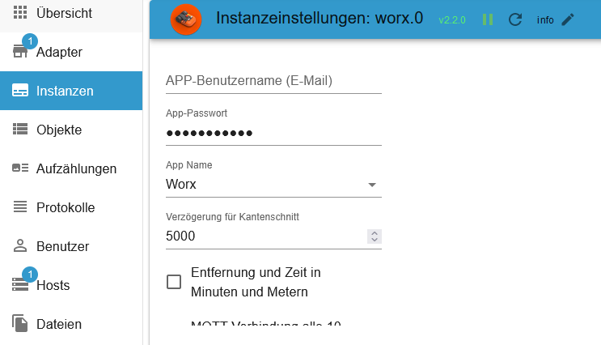

# ioBroker.worx Adapter

# Summary

- [Instance Settings](#instance-settings)
- [Login Infos JSON](#login-infos-worx0logininfo)
- [All folders](#folder)
    - [activityLog (Wire and Vision)](#activitylog-wire-and-vision)
    - [areas (wire)](#areas-wire)
    - [calendar (wire)](#calendar-wire)
    - [calendar (Vision)](#calendar-vision)
    - [modules (Wire and Vision)](#modules-wire-and-vision)
    - [mower (Wire and Vision)](#mower-wire-and-vision)
    - [info_mqtt (Draht und Vision)](#info_mqtt-wire-and-vision)
- [Additionally Vision Infos](#additionally-for-vision)
- [Rate Limiting](#rate-limiting)
- [Example Blockly sendMultiZonesJson Vision](#example-blockly-sendmultizonesjson-vision)

## Important information

🟢 1.1 second pause between 2 active switching operations</br>
🔴 No delay and the next active also without a delay

invalid</br>
🟢🟢🟢

valid</br>
🟢1,1🟢1,1🟢

invalid</br>
🔴🔴🟢🟢

valid</br>
🔴🔴🟢1,1🟢

invalid</br>
🔴🟢🔴🟢

valid</br>
🔴🟢1,1🔴🟢

## Description

### Instance settings

[Summary](#summary)

- `App Email`: Your APP Username (eMail)
- `App Password`: Your APP Password
- `App Name`: Choose your device
- `Update interval in minutes` Interval to update all data (Range from 10 to 1440 possible)
- `Delay for EdgeCut`: When should EdgeCut start (example 5 seconds to lawn)
- `Distance and time in min and m`: Default h and km
- `Updating MQTT data after token update.`: Loads the Worx data after the refresh token.
- `Display errors via notifications (for all devices)`: Turn notification on/off for all devices (can be turned on/off for each device under Objects)
- `Delete session data` If you have problems logging in, delete the current session
- `Reset Login counter` Reset Login counter
- `Requests limit per day (50-180)`: Limit the number of requests per day. These are API queries, such as the set interval and updates after a refresh token (in the instance settings). Each restart generates 4 requests. Additionally, 1 query for the firmware status and the activity log queries (every status/error change from the mower). Set this to 100 digits and check how many queries were sent at 11:55 PM. Then enter this number + 10.
- `Requests limit per 10 minutes (4-15)`: API Requests Limitierung - Sollte auf 4 stehen da sonst ein Neustart nicht möglich wäre.
- `MQTT limit per day (1-250 pro device)`: Request Limitierung über MQTT. Die Auswahl ist pro Geräte.
- `Restart limitation per day (1-10)`: Protects against unknown and unwanted adapter reboots.
- `MQTT-Verbindung auswählen`:
    - `Alte AWS-Verbindung`: The old MQTT connection is used. Disadvantage: There is a forced disconnect every 20 minutes, and re-establishing the connection takes 1 second.
    - `Neue AWS-Verbindung`: A new MQTT connection is used. Disadvantage: The connection is disconnected and re-established every hour due to the token. If the module encounters an error, the old connection is automatically used.
    - `MQTT5-Verbindung (derzeit nicht verfügbar)`: Not currently available. The old connection will then be used.

</br>
</br>


### Login Infos `worx.0.loginInfo`

[Summary](#summary)

```json
{
    "loginCounter": 1, // Login counter
    "loginDiff": [1741458177709], // Time difference of the last 10 logins
    "lastLoginTimestamp": 1741458177709, // Last login as timestamp
    "lastLoginDate": "2025-03-08T18:22:57.710Z", // Last login as ISO string WITHOUT time zone
    "refreshCounter": 1, // Counter for refreshToken (reset on restart)
    "refreshHistory": [1741516809807], // History refreshToken as timestamp
    "lastRefreshTimestamp": 1741459690942, // Last refreshToken as timestamp
    "lastRefreshDate": "2025-03-08T18:48:10.942Z", // Last refreshToken as ISO String WITHOUT time zone
    "nextRefreshTimestamp": 1743548215943, // Next refreshToken as timestamp
    "nextRefreshDate": "2025-04-01T22:56:55.943Z", // Next refreshToken as ISO String WITHOUT time zone
    "lastError": "", // Last error message
    "errorHistory": [], // History errors as timestamp
    "errorCounter": 0, // Counter of error messages (reset on restart)
    "lastErrorTimestamp": 0, // Last error message as timestamp
    "lastErrorDate": "" // Last error message as ISO string WITHOUT time zone
}
```

### Folder

[Summary](#summary)

- `activityLog`: Your activity log (Wire & Vision / control possible)
- `areas`: Areas (Wire / control possible)
- `multiZones`: Multizones (Vision / control possible)
- `calendar`: Time schedule (Wire & Vision / control possible)
- `Modules`: Your module(s) (Wire & Vision / control possible)
- `mower`: Your mower (Wire & Vision / control possible)
- `product`: All properties of device (Wire & Vision / readonly)
- `rawMqtt`: All data from the cloud (Wire & Vision / readonly)


### activityLog (Wire and Vision)

[Summary](#summary)

- `last_update`: Last update as timestamp (Wire & Vision / readonly)
- `manuell_update`: Loads the current activity log (automatically after status changes - Wire & Vision / control possible)
- `payload`: Activity log as JSON Table (for VIS or Blockly)


### areas (wire)

[Summary](#summary)

- `actualArea`: Current
- `actualAreaIndicator`: Next array zone start
- `area_0`: Start of zone 1 in meters (array=0) (changeable) 🟢
- `area_1`: Start of zone 2 in meters (array=1) (changeable) 🟢
- `area_2`: Start of zone 3 in meters (array=2) (changeable) 🟢
- `area_3`: Start of zone 4 in meters (array=3) (changeable) 🟢
- `startSequence`: Array zone start (0-9 events) e.g. Start in Zone 3 only [2,2,2,2,2,2,2,2,2,2] (changeable) 🟢
- `zoneKeeper`: Safe driving in narrow zone crossings (Areas must be created) (as of Firmware 3.30) (changeable) 🟢


### calendar (Wire)

[Summary](#summary)

- E.g. time setting for wednesday
    - `wednesday.borderCut`: With or without bordercut (Change value without delay) (changeable) 🔴
    - `wednesday.startTime`: Starttime hh:mm (0-23/0-59) e.g. 09:00 (Change value without delay) (changeable) 🔴
    - `wednesday.workTime`: Working time in minutes (180 min = 3h) e.g. 30 = endtime 09:30 (Change value without delay) (changeable) 🔴
    - `calJson_sendto`: If all States are set, then press button to send (with a 1,1 second delay). The mower will now mow for 30 minutes (changeable) 🟢
    - `calJson_tosend`: This data is sent to Mqtt (Both mowing schedule/is set automatically). You can also create this JSON yourself. (changeable) 🟢
    - `calendar.calJson`: Array for the weekly mowing plan. You can also create this ARRAY yourself. (mowing schedule 1/is set automatically - for wire only) (changeable) 🔴
    - `calendar.calJson2`: Array for the weekly mowing plan. You can also create this ARRAY yourself. (mowing schedule 2/is set automatically - for wire only) (changeable) 🔴


### calendar (Vision)

[Summary](#summary)

- E.g. time setting for friday
- As standard, 2 timeslots are created. If 3 slots are created in the APP, 3 will also be created in ioBroker. If it is reduced again to 2, these slots will be deleted in ioBroker. The day with the most slots is used as a reference for all days.
    - `friday.time_0.borderCut`: With or without bordercut (Change value without delay) (changeable) 🔴
    - `friday.time_0.startTime`: Starttime hh:mm (0-23/0-59) e.g. 09:00 (Change value without delay) (changeable) 🔴
    - `friday.time_0.workTime`: Working time in minutes (180 min = 3h) e.g. 30 = Endtime 09:30 (Change value without delay) (changeable) 🔴
    - `friday.time_0.enabled_time`: Activate or deactivate time. (set without delay) (can be changed) 🔴
    - `friday.time_0.zones`: Which zones should be approached, e.g. Example [1,2,3] (set without delay) (can be changed) 🔴
    - `calJson_sendto`: If all States are set then set this button to true. The mower will now mow for 30 minutes! (changeable) 🟢
    - `calJson_tosend`: This JSON is automatically filled and then sent to Mqtt. Of course you can also create it yourself. (changeable) 🔴
    - `add_timeslot`: An additional timeslot is added. Unused timeslots are removed after a restart. (changeable) 🔴


### Example Timeslot (Vision)

- `calJson_tosend` This JSON would enter 1 time on Sunday and delete all other days. The entire week must always be submitted. 🔴

```json
[
    {
        "e": 1, // 0=deactivated/1=activated - Set 0 for deactivated this slot
        "d": 0, // Days 0=sunday, 1=monday, 2=tuesday, 3=wednesday, 4=thursday, 5=friday, 6=saturday
        "s": 360, // Start time in minutes 06:00 (360/60) - (320/60 = 5 hours and 20 minutes)
        "t": 180, // Mowing time in minutes = End time 09:00 (180/60) - (200/60 = 3 hours and 20 minutes)
        "cfg": {
            "cut": {
                "b": 1, // 0=without BorderCut/1=with BorderCut
                "z": [1] // Which zones [1,2,6]
            }
        }
    }
]
```

### modules (Wire and Vision)

[Summary](#summary)

- Off Limit Module (Wire and Vision)
    - `DF.OLMSwitch_Cutting`: Prevents magnetic tape from being run over - true-on/false-off
    - `DF.OLMSwitch_FastHoming`: Fast return to the charging station - using shortcuts made from magnetic strips - true-on/false-off

- ACS Module (Wire only)
    - `US.ACS`: Enable or disable ACS - 1-on/0-off 🟢
    - `US.ACS_Status`: Status from ACS Module (readonly)

- EA Module (Vision only)
    - `EA.height`: Height adjustment of mower deck from 30-60 in 5 mm increments 🟢

- HL Module (Vision only)
    - `HL.status`: Status head light (readonly)
    - `HL.enabled`: Head light installed yes = 1/no = 0 🟢
    - `HL.on`: Daylight = 0/Darkness = 1 🟢


### mower (Wire and Vision)

[Summary](#summary)

- `AutoLock`: Auto lock true-on/false-off (wire & Vision/changeable) 🟢
- `AutoLockTimer`: Timer auto lock max. 10 minutes in 30 second steps (wire & Vision/changeable) 🟢
- `batteryChargeCycle`: Battery charge cycle (wire & Vision/readonly)
- `batteryCharging`: Battery charging false->no/true->yes (wire & Vision/readonly)
- `batteryState`: Battery state in % (wire & Vision/readonly)
- `batteryTemperature`: Battery temperature in celsius (wire & Vision/readonly)
- `batteryVoltage`: Battery voltage in Volt (wire & Vision/readonly)
- `cameraStatus`: Status Camera 0=OK/1=Error (Vision/readonly)
- `cameraError`: Camera error 0=OK/1=Error (Vision/readonly)
- `cutOverSlabs`: Cut over slabs on = true / off = false (Vision/changeable) 🟢
- `direction`: Direction in degrees (wire & Vision/readonly)
- `edgecut`: Start EdgeCut (wire & Vision/changeable) 🟢
- `error`: Error message from mower (wire & Vision/readonly)

```json
{
    "states": {
        "0": "No error", //(Draht & Vision & RTK)
        "1": "Trapped", //(Draht & Vision & RTK-Body)
        "2": "Lifted", //(Draht & Vision & RTK-Body)
        "3": "Wire missing", //(Draht)
        "4": "Outside boundary", //(Draht & Vision & RTK-Body)
        "5": "Rain delay", //(Draht & Vision & RTK-Body)
        "6": "Close door to cut grass", //(Draht)
        "7": "Close door to go home", //(Draht)
        "8": "Blade motor fault", //(Draht & Vision & RTK-Body)
        "9": "Wheel motor fault", //(Draht & Vision & RTK-Body)
        "10": "Trapped timeout fault", //(Draht & Vision & RTK-Body)
        "11": "Upside down", //(Draht & Vision & RTK-Body)
        "12": "Battery low", //(Draht & Vision & RTK)
        "13": "Wire reversed", //(Draht)
        "14": "Charge error", //(Draht & Vision & RTK-Body)
        "15": "Home search timeout", //(Draht & Vision)
        "16": "Wifi locked", //(Draht & Vision)
        "17": "Battery over temperature", //(Draht & Vision & RTK)
        "18": "Dummy model", //(Draht)
        "19": "Battery trunk open timeout", //(Draht & Vision)
        "20": "Wire signal out of sync", //(Draht)
        "100": "Charging station docking error", //(RTK-Body)
        "101": "HBI error", //(RTK-Body)
        "102": "OTA upgrade error", //(Vision & RTK)
        "103": "Map error", //(RTK)
        "104": "Excessive slope", //(RTK-Body)
        "105": "Unreachable zone", //(RTK-Body)
        "106": "Unreachable charging station", //(RTK-Body)
        "107": "Calibration needed", //(RTK-Head)
        "108": "Insufficient sensor data", //(RTK)
        "109": "Training start disallowed", //(RTK)
        "110": "Camera error", //(Vision)
        "111": "Lawn exploration required", //(Vision)
        "112": "Mapping exploration failed", //(Vision)
        "113": "RFID reader error", //(Vision)
        "114": "Headlight error", //(Vision)
        "115": "Missing charging station", //(RTK-Body)
        "116": "Blade height adjustment blocked", //(Vision & RTK-Body)
        "117": "Unsupported blade height", //(Vision & RTK-Body)
        "118": "Manual firrnware upgrade required", //(Vision & RTK-Body)
        "119": "Area limit exceeded", //(RTK-Body)
        "120": "Charging station undocking error" //(RTK-Body)
    }
}
```


- `firmware`: Current installed firmware (wire & Vision/readonly)
- `firmware_available`: Available firmware (wire & Vision/readonly)
- `firmware_available_all`: Last available firmware as JSON - This JSON will be updated when a new update is available (wire & Vision/readonly)

```json
{
    "mandatory": false,
    "product": {
        "uuid": "1236ll8d-0000-0000-9999-07ff6690003f",
        "version": "3.30.0+1",
        "released_at": "2023-05-24",
        "changelog": "•\tSupport for new models \tWR166E and WR184E\n•\tImproved Grass cutting coverage\n•\tImproved ACS\n•\tAdded Zone Keeper function (need to be enabled by app)\n•\tImproved wheel torque algorithm\n• \tNew FML firmware\n•\tFixed \"FML\" and \"Radiolink\" Activation problem\n•\tFixed some translations error\n•\tRain delay can now be cleared pressing START / HOME button, (1 minute after countdown has started)\n•\tImproved PRO Battery management\n• \tImproved boundary wire recognition\n• \tFixed border cut when zones are active\n• \tNew wifi firmware for board HW REV > 7\n\nThe Worx Landroid team would like to thank our amazing beta testers, with hundreds of hours of their own free time to make this firmware possible."
    }
}
```

- `firmware_available_date`: Date available firmware - Dummy 1970-01-01 when the adapter is reinstalled and no update is available (wire & Vision/readonly)
- `firmware_body` Value from dat.fw (Vision/readonly)
- `firmware_head` Value from dat.head.fw (Vision/readonly)
- `firmware_update_start`: Start firmware update in 2 steps - see below `firmware_update_start_approved` (wire & Vision/changeable) 🔴
- `firmware_update_start_approved`: Start firmware update - `firmware_update_start` must be set to true (wire & Vision/changeable) 🟢
- `gradient`: Gradient in degrees (wire & Vision/readonly)
- `inclination`: Inclination in degrees (wire & Vision/readonly)
- `last_command`: Last Request from iobroker or APP as JSON Table (wire & Vision/readonly)
- `last_update` Last update (wire & Vision/readonly)
- `last_update_connection` Which connection (Mqtt or Cloud / wire & Vision/readonly)
- `mowTimeExtend`: Mow time extend in % Range: -100%->100% (wire/changeable) 🟢
- `mowerActive`: false for pause mowing plan for 60 minutes and true for stop mowing pause and party mode (wire/changeable) 🟢
- `mqtt_update`: Update Mqtt data max. 150/day (wire & Vision/changeable) 🟢
- `mqtt_update_count`: Counter Update Mqtt data (wire & Vision/readonly)
- `notification`: Enable or disable notification via JS controller. Offline and error messages are output. (Design & Vision/changeable) 🔴
- `notification_excluded`: Which error IDs should not be displayed (separate IDs with commas [IDS](#error-ids)) 🔴

</br>


- `oneTimeJson`: One-time mowing as JSON (wire & Vision/changeable)

```json
{
    "wtm": 60, //Minutes
    "bc": 0 //0=w/o bordercut 1=with bordercut or use the next State
}
```

- `oneTimeStart`: One-time mowing start “First set oneTimeWithBorder, oneTimeWorkTime and oneTimeZones for Vision” - with a 1,1 second delay (wire & Vision/changeable) 🟢
- `oneTimeWithBorder`: With bordercut - Change value without delay (wire & Vision/changeable) 🔴
- `oneTimeWorkTime`: Worktime max. 8h in 30 minute steps - Change value without delay (wire & Vision/changeable) 🔴
- `oneTimeZones`: Set zones [1,2,4] (Vision/changeable) 🔴
- `online`: Mower online (wire & Vision/readonly)
- `partyModus`: Partymodus turn on/off (wire & Vision/changeable) 🟢
- `partyModeTimer`: Limit party mode to a certain time. Possible 1 - 1440 minutes - Deactivate again by setting `partyMode` to "false". The party mode is not displayed in the app but the timer counts down. (Wire/changeable) 🟢
- `pause`: Mower break turn on/off (wire & Vision/changeable) 🟢
- `reset_battery_time`: reset battery charges in 2 steps (wire & vision/changeable) 🔴
- `reset_battery_time_approved`: Confirm reset battery charges - `reset_battery_time` must be set to true (wire & vision/modifiable) 🔴
- `reset_blade_time`: reset blade working time in 2 steps (wire & vision/changeable) 🔴
- `reset_blade_time_approved`: confirm reset blade working time - `reset_battery_time` must be set to true (wire & vision/changeable) 🔴


- `rfidStatus`: Status RF sensor 0=OK/1=Error (vision/read only)
- `sendCommand`: Send cmd command (wire & Vision/changeable) 🟢

### Send Commands

```json
{
    "states": {
        "1": "Start", //(wire & Vision & RTK)
        "2": "Stop", //(wire & Vision & RTK)
        "3": "Home", //(wire & Vision & RTK)
        "4": "Follow border", //(wire & Vision & RTK)
        "5": "Wi-Fi Lock", //(wire & Vision unknown)
        "6": "Wi-Fi Unlock", //(wire & Vision)
        "7": "Reset Log", //(wire & Vision & RTK)
        "8": "Pause over border", //(wire & Vision)
        "9": "Safe go home", //(wire & Vision unknown)
        "10": "Start once", //(Vision)
        "100": "Pairing command", //(Vision)
        "101": "Border Cut", //(Vision & RTK)
        "102": "Resume cutting", //(RTK)
        "103": "Start driving", //(Draht & Vision & RTK)
        "104": "Stop driving" //(Draht & Vision & RTK)
    }
}
```

- `state`: True for start mower and False for stop mower (wire & Vision/changeable)
- `status`: Status mower (wire & Vision/readonly)

### Status ID`s

```json
{
    "states": {
        "0": "IDLE", //(wire & Vision & RTK-Body)
        "1": "Home", //(wire & Vision & RTK-Body)
        "2": "Start sequence", //(wire)
        "3": "Leaving home", //(wire & Vision & RTK-Body)
        "4": "Following border", //(wire)
        "5": "Searching home", //(wire & Vision & RTK-Body)
        "6": "Searching border", //(wire & Vision)
        "7": "Mowing", //(wire & Vision & RTK-Body)
        "8": "Lifted", //(wire & Vision & RTK-Body)
        "9": "Trapped", //(wire & Vision & RTK-Body)
        "10": "Blade blocked", //(wire & Vision & RTK-Body)
        "11": "Debug", //(wire)
        "12": "Driving", //(wire & Vision)
        "13": "Digital fence escape", //(wire & Vision)
        "30": "Going home", //(wire & Vision)
        "31": "Zone training", //(wire & Vision)
        "32": "Border Cut", //(wire & Vision)
        "33": "Searching zone", //(wire & Vision)
        "34": "Pause", //(wire & Vision)
        "100": "Map training (completable)", //(RTK-Head)
        "101": "Map processing", //(RTK)
        "102": "Upgrading firmware", //(RTK)
        "103": "Moving to zone", //(RTK-Body)
        "104": "Going home", //(RTK-Body)
        "105": "Ready for training", //(RTK-Head)
        "106": "Map download in progress", //(RTK)
        "107": "Map upload in progress", //(RTK-Head)
        "108": "Map training paused", //(RTK-Head)
        "109": "Map training (not completable)", //(RTK-Head)
        "110": "Border crossing", //(Vision)
        "111": "Exploring lawn", //(Vision)
        "112": "Moving to recovery point", //(RTK-Body)
        "113": "Waiting for position", //(RTK-Body)
        "114": "Map training (driving)", //(Vision & RTK-Body)
        "115": "Map training (rolling back)" //(Vision)
    }
}
```

- `torque`: Wheel torque Range -50->50 (wire & Vision/changeable) 🟢
- `totalBladeTime`: Total blade time (wire & Vision/readonly)
- `totalDistance`: Total distance (wire & Vision/readonly)
- `totalTime`: Total working time (wire & Vision/readonly)
- `waitRain`: Rain delay max. 12h in 30 minute steps and 0 for off (wire & Vision/changeable) 🟢
- `waitRainCountdown` Start countdown when the sensor changes from wet to dry (wire/readonly) (Vision disabled)
- `waitRainSensor` Status 0 for dry and 1 for wet (wire/readonly) (Vision disabled)
- `wifiQuality`: Wifi quality (wire & Vision/readonly)

```json
{
    "rain": {
        "s": 0, // 0 for dry and 1 for wet (Wire & Vision)
        "cnt": 59 // Start countdown when changing from s=1 wet to s=0 dry - rain was detected (Wire & Vision)
    }
}
```


### Additionally for vision

[Summary](#summary)

- MultiZones
    - `multiZones.zones.zone_1.borderDistance`: When boarder cutting, the distance to the edge in mm - allowed 50mm, 100mm, 150mm and 200mm - Set with Blockly without delay - Change is written in `multiZones.multiZones` (vision/changeable) 🔴
    - `multiZones.zones.zone_1.chargingStation`: 1 If the charging station is found in this zone. 0 for no charging station - Set with Blockly without delay - Change is written to `multiZones.multiZones` (vision/changeable) 🔴
    - `multiZones.zones.zone_1.cutOverBorder`: 1 to drive over slabs if they are detected, otherwise 0. Set with Blockly without delay - Change is written to `multiZones.multiZones` (Vision /changeable) 🔴
    - `multiZones.zones.zone_1.zone_id`: Numbering - Start with 1 - (vision/readonly) 🔴
    - `multiZones.passages.passage_01.tagIdFrom`: RFID id of zoneIdFrom - Set with Blockly without delay - Change is written to `multiZones.multiZones` (vision/changeable) 🔴
    - `multiZones.passages.passage_01.tagIdTo`: RFID id of zoneIdTo - Set with Blockly without delay - Change is written to `multiZones.multiZones` (vision/changeable) 🔴
    - `multiZones.passages.passage_01.zoneIdFrom`: Zone from (must zoneIdFrom < zoneIdTo) - Set with Blockly without delay - Change is written to `multiZones.multiZones` (vision/changeable) 🔴
    - `multiZones.passages.passage_01.zoneIdTo`: Zone closed (must zoneIdTo > zoneIdFrom) - Set with Blockly without delay - Change is written to `multiZones.multiZones` (vision/changeable) 🔴
    - `multiZones.multiZones`: Multizones JSON (Vision/changeable) [Example](#example-blockly-sendMultiZonesJson-vision) 🔴
    - `multiZones.sendMultiZonesJson`: Send changes to Worx with a delay of 1.1 seconds (vision/changeable) 🟢

Example:

```json
{
    "mz": {
        "p": [
            // Passages between zones
            {
                "z1": 1, // Zone from (must z1 < z2)
                "z2": 2, // Zone to (must z2 > z1)
                "t1": "E000000000000000", // RFID id from z1
                "t2": "E0000000KKKKKKKK" // RFID id from z2
            }
        ],
        "s": [
            // The zones themselves
            {
                "id": 1, // Numbering - Start with 1
                "c": 1, // 1 if the charging station is in this zone. 0 for no charging station.
                "cfg": {
                    "cut": {
                        "bd": 100, // Edge cut the distance to the edge in mm - allowed 50mm, 100mm, 150mm and 200mm
                        "ob": 0 // 1 for driving over slabs if they are detected, otherwise 0. Different per-zone is not allowed
                    }
                }
            },
            {
                "id": 2, // Numbering
                "c": 0, // 1 if the charging station is in this zone. 0 for no charging station.
                "cfg": {
                    "cut": {
                        "bd": 100, // Edge cut the distance to the edge in mm - allowed 50mm, 100mm, 150mm and 200mm
                        "ob": 0 // 1 for driving over slabs if they are detected, otherwise 0. Different per-zone is not allowed
                    }
                }
            }
        ]
    }
}
```

Default without zone:

```json
{
    "mz": {
        "p": [],
        "s": [
            {
                "id": 1,
                "c": 1,
                "cfg": {
                    "cut": {
                        "bd": 150,
                        "ob": 0
                    }
                }
            }
        ]
    }
}
```


- Mower
    - `log_improvement`: Send improvement log to worx disable/enable (changeable) 🟢
    - `log_troubleshooting`: Send troubleshooting log to worx disable/enable (changeable) 🟢


- Mower
    - `paused`: Paused schedule in minutes (changeable) 🟢


### info_mqtt (Wire and Vision)

[Summary](#summary)

- `incompleteOperationCount`: Total number of operations submitted to the connection that have not yet been completed. Unacked operations are a subset of this.
- `incompleteOperationSize`: Total packet size of operations submitted to the connection that have not yet been completed. Unacked operations are a subset of this.
- `unackedOperationCount`: Total number of operations that have been sent to the server and are waiting for a corresponding ACK before they can be completed.
- `unackedOperationSize`: Total packet size of operations that have been sent to the server and are waiting for a corresponding ACK before they can be completed.
- `last_update`: Last update from token
- `next_update`: Next update from token
- `online`: Status MQTT Connection (false=offline/true=online)


### Rate Limiting

[Summary](#summary)

- Value worx.0.blocking
  The lock will be automatically lifted after 24 hours. The next time the token is updated, everything will be reset.

```json
{
    "block": false, // true = 429 too many request is activ
    "start": 0, // Start of the blocking as a timestamp
    "time": "", // With time zone
    "retry-after": 0 // How long you are blocked
}
```

- Value worx.0.requestsrateLimit
  The counters can be changed manually to remove any premature locks.

```json
{
    "apiCounter": 6, // API request per day
    "apiLast": 1751483518418, // Last API request as timestamp
    "apiTime": "2025-07-02T19:11:58.418Z", // Last API request with time zone
    "apiRequest": [
        // All API requests
        {
            "count": 1,
            "request": "https://api.worxlandroid.com/api/v2/product-items?status=1&gps_status=1",
            "time": "2025-07-02T19:11:58.418Z"
        },
        {
            "count": 2,
            "request": "https://api.worxlandroid.com/api/v2/product-items/xxx/firmware-upgrade",
            "time": "2025-07-02T19:11:58.895Z"
        },
        {
            "count": 3,
            "request": "https://api.worxlandroid.com/api/v2/product-items/xxx/activity-log",
            "time": "2025-07-02T19:11:59.130Z"
        },
        {
            "count": 4,
            "request": "https://api.worxlandroid.com/api/v2/products",
            "time": "2025-07-02T19:11:59.364Z"
        },
        {
            "count": 5,
            "request": "https://api.worxlandroid.com/api/v2/users/me",
            "time": "2025-07-02T19:12:00.318Z"
        },
        {
            "count": 6,
            "request": "https://id.worx.com/oauth/token?",
            "time": "2025-07-03T18:12:46.628Z"
        }
    ],
    "mqttDevice": {
        // MQTT Counter per device
        "xxxF3": {
            "mqttCount": 6, // Counter MQTT commands
            "mqttLast": 1751651797646, // Last command with time zone
            "mqttTime": "2025-07-04T17:56:37.646Z", // Letzter Kommando mit Zeitzone
            "mqttBlock": true, // true = Kommandos deaktiviert / false = Kommandos aktiv
            "mqttRequest": [
                // Last commands
                {
                    "count": 1,
                    "message": "{\"id\":23210,\"cmd\":0,\"lg\":\"de\",\"sn\":\"xxx\",\"tm\":\"21:12:00\",\"dt\":\"02/07/2025\"}",
                    "time": "2025-07-02T19:12:00.811Z"
                },
                {
                    "count": 2,
                    "message": "{\"id\":58731,\"cmd\":0,\"lg\":\"de\",\"sn\":\"xxx\",\"tm\":\"20:12:49\",\"dt\":\"03/07/2025\"}",
                    "time": "2025-07-03T18:12:49.586Z"
                },
                {
                    "count": 3,
                    "message": "{\"id\":3925,\"cmd\":0,\"lg\":\"de\",\"sn\":\"xxx\",\"tm\":\"20:20:41\",\"dt\":\"03/07/2025\"}",
                    "time": "2025-07-03T18:20:41.579Z"
                },
                {
                    "count": 4,
                    "message": "{\"id\":3265,\"cmd\":0,\"lg\":\"de\",\"sn\":\"xxx\",\"tm\":\"21:10:19\",\"dt\":\"03/07/2025\"}",
                    "time": "2025-07-03T19:10:19.292Z"
                },
                {
                    "count": 5,
                    "message": "{\"id\":28606,\"cmd\":0,\"lg\":\"de\",\"sn\":\"xxx\",\"tm\":\"21:11:20\",\"dt\":\"03/07/2025\"}",
                    "time": "2025-07-03T19:11:20.634Z"
                },
                {
                    "count": 6,
                    "message": "{\"id\":12891,\"cmd\":0,\"lg\":\"de\",\"sn\":\"xxx\",\"tm\":\"19:56:37\",\"dt\":\"04/07/2025\"}",
                    "time": "2025-07-04T17:56:37.646Z"
                }
            ]
        },
        "xxxE2": {
            "mqttCount": 0,
            "mqttLast": 0,
            "mqttBlock": false,
            "mqttRequest": []
        },
        "xxxC5": {
            "mqttCount": 0,
            "mqttLast": 0,
            "mqttBlock": false,
            "mqttRequest": []
        },
        "xxx2F": {
            "mqttCount": 0,
            "mqttLast": 0,
            "mqttBlock": false,
            "mqttRequest": []
        }
    },
    "mqttDay": "27-4", // calendar week-day. When changing everything is reset
    "restartCount": 6, // Counter restart adapter
    "restartLast": 1751569817003, // Last restart
    "restartTime": "2025-07-03T19:10:17.003Z", // Last restart with time zone
    "day": "27-4" // calendar week-day. When changing everything is reset
}
```


### Example Blockly sendMultiZonesJson Vision

[Summary](#summary)

```
<xml xmlns="https://developers.google.com/blockly/xml">
  <variables>
    <variable id="${]4s$w?n24Az}=7iAIY">mz</variable>
    <variable id="o.FQ]_Xa!tHn2T7Ak{Pt">value</variable>
    <variable id="/@E4iFRMr:x+u?{7yFlB">test</variable>
    <variable id="jxTInS{}mk_)WJa[:,fA">i</variable>
  </variables>
  <block type="procedures_defcustomnoreturn" id="u:w*aBH!92nydG0Mu.1-" x="-87" y="-87">
    <mutation statements="false">
      <arg name="mz" varid="${]4s$w?n24Az}=7iAIY"></arg>
      <arg name="value" varid="o.FQ]_Xa!tHn2T7Ak{Pt"></arg>
    </mutation>
    <field name="NAME">set_bd</field>
    <field name="SCRIPT">bXouY2ZnLmN1dC5iZCA9IDE1MA==</field>
    <comment pinned="false" h="80" w="160">Beschreibe diese Funktion …</comment>
  </block>
  <block type="variables_set" id="jiP0218}2,Y]B]RdKD~`" x="-87" y="-35">
    <field name="VAR" id="/@E4iFRMr:x+u?{7yFlB">test</field>
    <value name="VALUE">
      <block type="convert_json2object" id=";Ef{FHk_~heeozyHFxci">
        <value name="VALUE">
          <block type="get_value" id="LMfldD:[D4%}yWE8,N0y">
            <field name="ATTR">val</field>
            <field name="OID">worx.0.xxxxxxxxxxxxxxxxxxxx.multiZones.sendMultiZonesJson</field>
          </block>
        </value>
      </block>
    </value>
    <next>
      <block type="controls_forEach" id="D{XG==q$flbH?32eX%D(">
        <field name="VAR" id="jxTInS{}mk_)WJa[:,fA">i</field>
        <value name="LIST">
          <block type="get_attr" id="b~2/cb$WhEj*9i6,(ey5">
            <value name="PATH">
              <shadow type="text" id="+n~;GfHf{,#D!5D}H+m=">
                <field name="TEXT">s</field>
              </shadow>
            </value>
            <value name="OBJECT">
              <block type="variables_get" id="YloS$N%I=6[yk;loD*1O">
                <field name="VAR" id="/@E4iFRMr:x+u?{7yFlB">test</field>
              </block>
            </value>
          </block>
        </value>
        <statement name="DO">
          <block type="procedures_callcustomnoreturn" id="er{Pwq:Y7n_I|CQoup,|">
            <mutation name="set_bd">
              <arg name="mz"></arg>
              <arg name="value"></arg>
            </mutation>
            <value name="ARG0">
              <block type="variables_get" id="(-_i0(y:W}U_x?s(7k%4">
                <field name="VAR" id="jxTInS{}mk_)WJa[:,fA">i</field>
              </block>
            </value>
            <value name="ARG1">
              <block type="math_number" id="{2u/=v!k|yJsOesq[CU^">
                <field name="NUM">150</field>
              </block>
            </value>
            <next>
              <block type="debug" id="b1}}DmS-[_W:+Y+$|%)r">
                <field name="Severity">log</field>
                <value name="TEXT">
                  <shadow type="text" id="7wx?ca_U[S~8DA4}*RXx">
                    <field name="TEXT">test</field>
                  </shadow>
                  <block type="variables_get" id="_zz;w64g-!E$zX$]pvyI">
                    <field name="VAR" id="/@E4iFRMr:x+u?{7yFlB">test</field>
                  </block>
                </value>
              </block>
            </next>
          </block>
        </statement>
        <next>
          <block type="debug" id="o[S0+1%{oLU+r:03tz7=">
            <field name="Severity">log</field>
            <value name="TEXT">
              <shadow type="text" id="7wx?ca_U[S~8DA4}*RXx">
                <field name="TEXT">test</field>
              </shadow>
              <block type="variables_get" id="tjqxQ(MO|CR~/Xq5;Pm[">
                <field name="VAR" id="/@E4iFRMr:x+u?{7yFlB">test</field>
              </block>
            </value>
            <next>
              <block type="control" id="C^lZ^SNIQ#,vh}?hSG_O">
                <mutation xmlns="http://www.w3.org/1999/xhtml" delay_input="false"></mutation>
                <field name="OID">worx.0.xxxxxxxxxxxxxxxxxxxx.multiZones.sendMultiZonesJson</field>
                <field name="WITH_DELAY">FALSE</field>
                <value name="VALUE">
                  <block type="convert_object2json" id="z)EXA+%8lB4K#7!Hp1V%">
                    <field name="PRETTIFY">FALSE</field>
                    <value name="VALUE">
                      <block type="variables_get" id="C4np)gS@^Y*?-0I+R6+r">
                        <field name="VAR" id="/@E4iFRMr:x+u?{7yFlB">test</field>
                      </block>
                    </value>
                  </block>
                </value>
              </block>
            </next>
          </block>
        </next>
      </block>
    </next>
  </block>
</xml>

<xml xmlns="https://developers.google.com/blockly/xml">
  <variables>
    <variable id="${]4s$w?n24Az}=7iAIY">mz</variable>
    <variable id="o.FQ]_Xa!tHn2T7Ak{Pt">value</variable>
    <variable id="/@E4iFRMr:x+u?{7yFlB">test</variable>
    <variable id="jxTInS{}mk_)WJa[:,fA">i</variable>
  </variables>
  <block type="procedures_defcustomnoreturn" id="u:w*aBH!92nydG0Mu.1-" x="-87" y="-87">
    <mutation statements="false">
      <arg name="mz" varid="${]4s$w?n24Az}=7iAIY"></arg>
      <arg name="value" varid="o.FQ]_Xa!tHn2T7Ak{Pt"></arg>
    </mutation>
    <field name="NAME">set_bd</field>
    <field name="SCRIPT">bXouY2ZnLmN1dC5iZCA9IDE1MA==</field>
    <comment pinned="false" h="80" w="160">Beschreibe diese Funktion …</comment>
  </block>
  <block type="variables_set" id="jiP0218}2,Y]B]RdKD~`" x="-87" y="-35">
    <field name="VAR" id="/@E4iFRMr:x+u?{7yFlB">test</field>
    <value name="VALUE">
      <block type="convert_json2object" id=";Ef{FHk_~heeozyHFxci">
        <value name="VALUE">
          <block type="get_value" id="LMfldD:[D4%}yWE8,N0y">
            <field name="ATTR">val</field>
            <field name="OID">worx.0.xxxxxxxxxxxxxxxxxxxx.multiZones.sendMultiZonesJson</field>
          </block>
        </value>
      </block>
    </value>
    <next>
      <block type="controls_forEach" id="D{XG==q$flbH?32eX%D(">
        <field name="VAR" id="jxTInS{}mk_)WJa[:,fA">i</field>
        <value name="LIST">
          <block type="get_attr" id="b~2/cb$WhEj*9i6,(ey5">
            <value name="PATH">
              <shadow type="text" id="+n~;GfHf{,#D!5D}H+m=">
                <field name="TEXT">s</field>
              </shadow>
            </value>
            <value name="OBJECT">
              <block type="variables_get" id="YloS$N%I=6[yk;loD*1O">
                <field name="VAR" id="/@E4iFRMr:x+u?{7yFlB">test</field>
              </block>
            </value>
          </block>
        </value>
        <statement name="DO">
          <block type="procedures_callcustomnoreturn" id="er{Pwq:Y7n_I|CQoup,|">
            <mutation name="set_bd">
              <arg name="mz"></arg>
              <arg name="value"></arg>
            </mutation>
            <value name="ARG0">
              <block type="variables_get" id="(-_i0(y:W}U_x?s(7k%4">
                <field name="VAR" id="jxTInS{}mk_)WJa[:,fA">i</field>
              </block>
            </value>
            <value name="ARG1">
              <block type="math_number" id="{2u/=v!k|yJsOesq[CU^">
                <field name="NUM">150</field>
              </block>
            </value>
            <next>
              <block type="debug" id="b1}}DmS-[_W:+Y+$|%)r">
                <field name="Severity">log</field>
                <value name="TEXT">
                  <shadow type="text" id="7wx?ca_U[S~8DA4}*RXx">
                    <field name="TEXT">test</field>
                  </shadow>
                  <block type="variables_get" id="_zz;w64g-!E$zX$]pvyI">
                    <field name="VAR" id="/@E4iFRMr:x+u?{7yFlB">test</field>
                  </block>
                </value>
              </block>
            </next>
          </block>
        </statement>
        <next>
          <block type="debug" id="o[S0+1%{oLU+r:03tz7=">
            <field name="Severity">log</field>
            <value name="TEXT">
              <shadow type="text" id="7wx?ca_U[S~8DA4}*RXx">
                <field name="TEXT">test</field>
              </shadow>
              <block type="variables_get" id="tjqxQ(MO|CR~/Xq5;Pm[">
                <field name="VAR" id="/@E4iFRMr:x+u?{7yFlB">test</field>
              </block>
            </value>
            <next>
              <block type="control" id="C^lZ^SNIQ#,vh}?hSG_O">
                <mutation xmlns="http://www.w3.org/1999/xhtml" delay_input="false"></mutation>
                <field name="OID">worx.0.xxxxxxxxxxxxxxxxxxxx.multiZones.sendMultiZonesJson</field>
                <field name="WITH_DELAY">FALSE</field>
                <value name="VALUE">
                  <block type="convert_object2json" id="z)EXA+%8lB4K#7!Hp1V%">
                    <field name="PRETTIFY">FALSE</field>
                    <value name="VALUE">
                      <block type="variables_get" id="C4np)gS@^Y*?-0I+R6+r">
                        <field name="VAR" id="/@E4iFRMr:x+u?{7yFlB">test</field>
                      </block>
                    </value>
                  </block>
                </value>
              </block>
            </next>
          </block>
        </next>
      </block>
    </next>
  </block>
</xml>
```

### or

```
<xml xmlns="https://developers.google.com/blockly/xml">
  <variables>
    <variable id="2#Mf$#JFCN9Nw2F2L[?=">x</variable>
    <variable id="fNt-C|86(glunJ:-t=dK">p</variable>
    <variable id="Rci4:iMYXzjoI2k]P^X)">s</variable>
    <variable id="[t-srB,I/UkXaWBk4*A*">list</variable>
    <variable id="]WA|%5f=H9^9uiLc;KS[">new_json</variable>
  </variables>
  <block type="procedures_defcustomreturn" id="@Y/LobsPw4k!jQb)fI!." x="88" y="13">
    <mutation statements="false">
      <arg name="x" varid="2#Mf$#JFCN9Nw2F2L[?="></arg>
      <arg name="p" varid="fNt-C|86(glunJ:-t=dK"></arg>
      <arg name="s" varid="Rci4:iMYXzjoI2k]P^X)"></arg>
    </mutation>
    <field name="NAME">json</field>
    <field name="SCRIPT">eFsicCJdID0gcDsNCnhbInMiXSA9IHM7DQpyZXR1cm4geA==</field>
    <comment pinned="false" h="80" w="160">Describe this function...</comment>
  </block>
  <block type="variables_set" id="WAsPqIMv;bh95{7~Y!D!" x="88" y="63">
    <field name="VAR" id="[t-srB,I/UkXaWBk4*A*">list</field>
    <value name="VALUE">
      <block type="convert_json2object" id="S5uRAnpcGp/7*1b,aum~">
        <value name="VALUE">
          <block type="text" id="}n3]_HIP*7y5GMEo-!c3">
            <field name="TEXT">{p:[],s:[]}</field>
          </block>
        </value>
      </block>
    </value>
    <next>
      <block type="variables_set" id="Kf#KkskB7l|uDiI!(fjq">
        <field name="VAR" id="]WA|%5f=H9^9uiLc;KS[">new_json</field>
        <value name="VALUE">
          <block type="procedures_callcustomreturn" id="K;OJHrji~09PeJ33q.gl">
            <mutation name="json">
              <arg name="x"></arg>
              <arg name="p"></arg>
              <arg name="s"></arg>
            </mutation>
            <value name="ARG0">
              <block type="variables_get" id="ipM^e+~#-hoo0(047Ybo">
                <field name="VAR" id="[t-srB,I/UkXaWBk4*A*">list</field>
              </block>
            </value>
            <value name="ARG1">
              <block type="lists_create_with" id="HJIZHLc]lL0Tgqe$E~Ul">
                <mutation items="0"></mutation>
              </block>
            </value>
            <value name="ARG2">
              <block type="lists_create_with" id="JH=jADj%lYJ(:7%v[o+3">
                <mutation items="1"></mutation>
                <value name="ADD0">
                  <block type="convert_json2object" id="@5BT0}WJ`srV89LD5h?D">
                    <value name="VALUE">
                      <block type="text" id="=.e.D[I2IQ{u!4;(-D-,">
                        <field name="TEXT">{"id":1,"c":1,"cfg":{"cut":{"bd":150,"ob":1}}}</field>
                      </block>
                    </value>
                  </block>
                </value>
              </block>
            </value>
          </block>
        </value>
        <next>
          <block type="control" id="k$;?LM/[x-TbZ^m=F4}i">
            <mutation xmlns="http://www.w3.org/1999/xhtml" delay_input="false"></mutation>
            <field name="OID">worx.0.xxxxxxxxxx.multiZones.sendMultiZonesJson</field>
            <field name="WITH_DELAY">FALSE</field>
            <value name="VALUE">
              <block type="convert_object2json" id="b~2Bz}OiNg{V]!QgN^J7">
                <field name="PRETTIFY">FALSE</field>
                <value name="VALUE">
                  <block type="variables_get" id="b|+SOSd+ZD@*XHPGu*I(">
                    <field name="VAR" id="]WA|%5f=H9^9uiLc;KS[">new_json</field>
                  </block>
                </value>
              </block>
            </value>
          </block>
        </next>
      </block>
    </next>
  </block>
</xml>
```

### or direct

```
{"p": [],"s": [{"id": 1, "c": 1, "cfg": {"cut": {"bd": 100, "ob": 1}}}]}
```


### not allowed


## Changelog
### 3.2.7 (2025-08-16)

- (Lucky-ESA) MQTT connection selection added
- (Lucky-ESA) Rate limit selection added in instance settings
- (Lucky-ESA) Admin 7.6.17 required

### 3.2.6 (2025-06-29)

- (Lucky-ESA) Added rate limit for API request

### 3.2.5 (2025-06-25)

- (Lucky-ESA) MQTT connection changed

### 3.2.4 (2025-06-14)

- (Lucky-ESA) TypeError native_excluded fixed

### 3.2.3 (2025-06-05)

- (Lucky-ESA) All Sentry issues fixed
- (Lucky-ESA) Add new mowers without adapter restart

## License

MIT License


Copyright (c) 2026 iobroker-community-adapters <iobroker-community-adapters@gmx.de>  
Copyright (c) 2023-2025 TA2k <tombox2020@gmail.com>

Permission is hereby granted, free of charge, to any person obtaining a copy
of this software and associated documentation files (the "Software"), to deal
in the Software without restriction, including without limitation the rights
to use, copy, modify, merge, publish, distribute, sublicense, and/or sell
copies of the Software, and to permit persons to whom the Software is
furnished to do so, subject to the following conditions:

The above copyright notice and this permission notice shall be included in all
copies or substantial portions of the Software.

THE SOFTWARE IS PROVIDED "AS IS", WITHOUT WARRANTY OF ANY KIND, EXPRESS OR
IMPLIED, INCLUDING BUT NOT LIMITED TO THE WARRANTIES OF MERCHANTABILITY,
FITNESS FOR A PARTICULAR PURPOSE AND NONINFRINGEMENT. IN NO EVENT SHALL THE
AUTHORS OR COPYRIGHT HOLDERS BE LIABLE FOR ANY CLAIM, DAMAGES OR OTHER
LIABILITY, WHETHER IN AN ACTION OF CONTRACT, TORT OR OTHERWISE, ARISING FROM,
OUT OF OR IN CONNECTION WITH THE SOFTWARE OR THE USE OR OTHER DEALINGS IN THE
SOFTWARE.