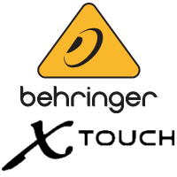

# ioBroker.x-touch

## x-touch adapter for ioBroker

Communicate with a Behringer X-Touch Control Surface (DAW Controller)

## ToDo
- Add the encoders and their LEDs -> done, left is sync_global and checks on database changes
- Add the timecode display
- Add the functionality of bank and fader channel switches -> done, needs additional testing
- Add the syncGlobal functionality

## Changelog

### 0.0.1
* (Bannsaenger) initial release

### 0.0.2
* (Bannsaenger) prepared for checkin to iobroker.latest

### 0.1.0
* (Bannsaenger) introduced channel and page switching

### 0.2.0
* (Bannsaenger) introduced encoders

### 0.2.1
* (Bannsaenger) changed the way to send data. Added sendDelay

### 0.2.2
* (Bannsaenger) fixed fader handling and data distribution to the device group

### 0.2.3
* (Bannsaenger) fixed setting of display inverted

### 0.2.4
* (Bannsaenger) fixed disabling of encoder display

## License
MIT License

Copyright (c) 2021 Bannsaenger <bannsaenger@gmx.de>

Permission is hereby granted, free of charge, to any person obtaining a copy
of this software and associated documentation files (the "Software"), to deal
in the Software without restriction, including without limitation the rights
to use, copy, modify, merge, publish, distribute, sublicense, and/or sell
copies of the Software, and to permit persons to whom the Software is
furnished to do so, subject to the following conditions:

The above copyright notice and this permission notice shall be included in all
copies or substantial portions of the Software.

THE SOFTWARE IS PROVIDED "AS IS", WITHOUT WARRANTY OF ANY KIND, EXPRESS OR
IMPLIED, INCLUDING BUT NOT LIMITED TO THE WARRANTIES OF MERCHANTABILITY,
FITNESS FOR A PARTICULAR PURPOSE AND NONINFRINGEMENT. IN NO EVENT SHALL THE
AUTHORS OR COPYRIGHT HOLDERS BE LIABLE FOR ANY CLAIM, DAMAGES OR OTHER
LIABILITY, WHETHER IN AN ACTION OF CONTRACT, TORT OR OTHERWISE, ARISING FROM,
OUT OF OR IN CONNECTION WITH THE SOFTWARE OR THE USE OR OTHER DEALINGS IN THE
SOFTWARE.