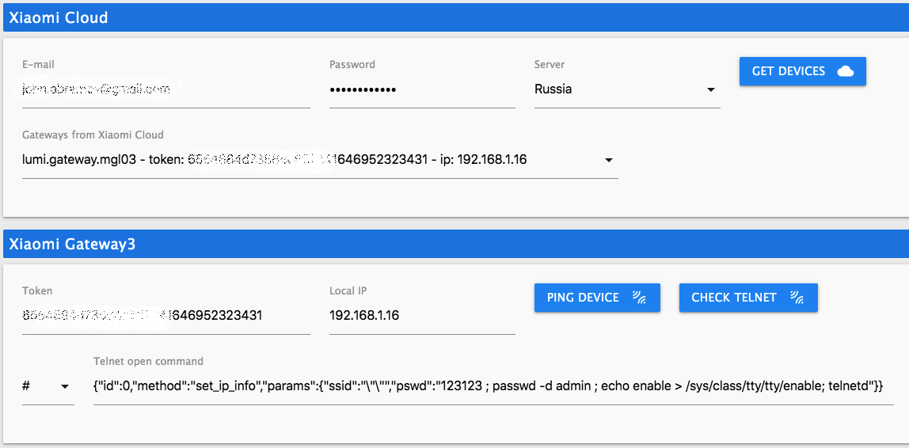

# ioBroker.xiaomi-gateway3

<!--  -->

<!--  -->

## Xiaomi-gateway3 ioBroker adapter

This adapter allow ioBroker to communicate with Xiaomi Gateway 3 and use it to control Xiaomi devices.
Adapter communicates with gateway over MQTT protocol (it connects to build-in MQTT broker). However you have to pair your gateway and devices by Mi Home (Cloud).

## Early version

Adapter is in development stage, for now. But already has ready to go functionality.

For successful adapter development it needs community help mostly in tests adapter and devices.

## Thanks

Big part of code is based on and rewrote from [AlexxIT](https://github.com/AlexxIT) project [XiaomiGateway3](https://github.com/AlexxIT/XiaomiGateway3)

## How you can help?

First of all, you can simply install adapter, use it and report of any issues.

Besides, if you have a lot of different devices you can help to improve they support by enable option `Debug output (to state)`  (see below) and give me debug output after few days collecting debug data.

## Hardware and limits

Adapter supports `Xiaomi Gateway 3 (ZNDMWG03LM and ZNDMWG02LM)` running on original firmware these versions:
- `v1.5.0_0026` (developed on it)
- `v1.5.0_0102` (similar to `1.5.0_0026`, but not tested)

You can flash gateway with custom or stock firmware these versions: [wiki](https://github.com/AlexxIT/XiaomiGateway3/wiki).

__*!!Attantion:*__ Firmware versions lower than `1.4.7_0000` adapter not support and will not. Support of versions lower than `v1.5.0_0026` not guaranteed.

## Supported devices

- [x] Tested
- [ ] Not tested

### Zigbee devices

- [ ] Aqara Bulb (ZNLDP12LM)
- [ ] Aqara Button (WXKG11LM)
- [ ] Aqara Cube (MFKZQ01LM)
- [ ] Aqara Curtain (ZNCLDJ11LM)
- [ ] Aqara Curtain B1 (ZNCLDJ12LM)
- [ ] Aqara Door Lock S1 (ZNMS11LM)
- [ ] Aqara Door Lock S2 (ZNMS12LM)
- [ ] Aqara Door Lock S2 Pro (ZNMS12LM)
- [x] Aqara Door Sensor (MCCGQ11LM)
- [ ] Aqara Double Wall Button (WXKG02LM)
- [ ] Aqara Double Wall Button D1 (WXKG07LM)
- [ ] Aqara Double Wall Switch (QBKG03LM,QBKG12LM)
- [ ] Aqara Double Wall Switch D1 (QBKG22LM,QBKG24LM)
- [ ] Aqara Double Wall Switch E1 (QBKG39LM,QBKG41LM)
- [ ] Aqara Double Wall Switch H1 (WS-EUK02)
- [ ] Aqara Double Wall Switch US (WS-USC04)
- [x] Aqara Motion Sensor (RTCGQ11LM)
- [ ] Aqara Opple Four Button (WXCJKG12LM)
- [ ] Aqara Opple MX480 (XDD13LM)
- [ ] Aqara Opple MX650 (XDD12LM)
- [ ] Aqara Opple Six Button (WXCJKG13LM)
- [ ] Aqara Opple Two Button (WXCJKG11LM)
- [ ] Aqara Plug (SP-EUC01)
- [ ] Aqara Precision Motion Sensor (RTCGQ13LM)
- [ ] Aqara Relay (LLKZMK11LM)
- [ ] Aqara Relay T1 (DLKZMK11LM,SSM-U01,SSM-U02)
- [ ] Aqara Roller Shade (ZNGZDJ11LM)
- [ ] Aqara Roller Shade E1 (ZNJLBL01LM)
- [ ] Aqara Shake Button (WXKG12LM)
- [ ] Aqara Single Wall Button (WXKG03LM)
- [ ] Aqara Single Wall Button D1 (WXKG06LM)
- [ ] Aqara Single Wall Switch (QBKG04LM,QBKG11LM)
- [ ] Aqara Single Wall Switch D1 (QBKG21LM,QBKG23LM)
- [ ] Aqara Single Wall Switch E1 (QBKG38LM,QBKG40LM)
- [ ] Aqara Single Wall Switch H1 (WS-EUK01)
- [ ] Aqara Socket (QBCZ11LM)
- [x] Aqara TH Sensor (WSDCGQ11LM,WSDCGQ12LM)
- [ ] Aqara TVOC Air Quality Monitor (VOCKQJK11LM)
- [ ] Aqara Thermostat S2 (KTWKQ03ES)
- [ ] Aqara Triple Wall Switch D1 (QBKG25LM,QBKG26LM)
- [ ] Aqara Vibration Sensor (DJT11LM)
- [ ] Aqara Water Leak Sensor (SJCGQ11LM)
- [ ] Honeywell Gas Sensor (JTQJ-BF-01LM/BW)
- [ ] Honeywell Smoke Sensor (JTYJ-GD-01LM/BW)
- [ ] IKEA Bulb E14 (LED1649C5)
- [ ] IKEA Bulb E14 400 lm (LED1536G5)
- [ ] IKEA Bulb E27 1000 lm (LED1623G12)
- [ ] IKEA Bulb E27 950 lm (LED1546G12)
- [ ] IKEA Bulb E27 980 lm (LED1545G12)
- [ ] IKEA Bulb GU10 400 lm (LED1537R6,LED1650R5)
- [ ] Xiaomi Button (WXKG01LM)
- [x] Xiaomi Door Sensor (MCCGQ01LM)
- [ ] Xiaomi Light Sensor (GZCGQ01LM)
- [ ] Xiaomi Motion Sensor (RTCGQ01LM)
- [x] Xiaomi Plug (ZNCZ02LM)
- [ ] Xiaomi Plug EU (ZNCZ04LM)
- [ ] Xiaomi Plug TW (ZNCZ03LM)
- [ ] Xiaomi Plug US (ZNCZ12LM)
- [ ] Xiaomi TH Sensor (WSDCGQ01LM) 

### BLE devices

- [ ] Aqara Door Lock N100 (ZNMS16LM)
- [ ] Aqara Door Lock N200 (ZNMS17LM)
- [ ] Honeywell Smoke Alarm (JTYJ-GD-03MI)
- [ ] Xiaomi Alarm Clock (CGD1)
- [ ] Xiaomi Door Lock (MJZNMS02LM,XMZNMST02YD)
- [ ] Xiaomi Door Sensor 2 (MCCGQ02HL)
- [ ] Xiaomi Flower Care (HHCCJCY01)
- [ ] Xiaomi Flower Pot (HHCCPOT002)
- [ ] Xiaomi Magic Cube (XMMF01JQD)
- [ ] Xiaomi Mosquito Repellent (WX08ZM)
- [x] Xiaomi Motion Sensor 2 (RTCGQ02LM)
- [ ] Xiaomi Night Light 2 (MJYD02YL-A)
- [ ] Xiaomi Qingping Door Sensor (CGH1)
- [ ] Xiaomi Qingping Motion Sensor (CGPR1)
- [ ] Xiaomi Qingping TH Lite (CGDK2)
- [ ] Xiaomi Qingping TH Sensor (CGG1)
- [ ] Xiaomi Safe Box (BGX-5/X1-3001)
- [x] Xiaomi TH Clock (LYWSD02MMC)
- [ ] Xiaomi TH Sensor (LYWSDCGQ/01ZM)
- [x] Xiaomi TH Sensor 2 (LYWSD03MMC)
- [ ] Xiaomi Toothbrush T500 (MES601)
- [ ] Xiaomi Water Leak Sensor (SJWS01LM)
- [ ] Xiaomi ZenMeasure Clock (MHO-C303)
- [ ] Xiaomi ZenMeasure TH (MHO-C401)
- [ ] Yeelight Button S1 (YLAI003)

_**Note:** BLE devices may not have states at first time after pairing because i don't know specs for devices and didn't define properties for all devices for now. States will added when device will update correponding propertie. I hope I will fix this over time with your help._

## Configuration

To connect a gateway you need get IP and TOKEN of gateway. You can do this manually or from cloud.

_**Attantion:** There is issue with getting devices from cloud. I don't get yet is this issue with code or with cloud, however you should try to get (press button) devices several times (until you finally get), for now._

Also you have to chose telnet open command (in most cases option #2). You can test connection and telnet by buttons.

*Ping here not actually ping. It is more check of device availability.*

 

You have several options to configure adapter and gatewey.

### Adapter settings

- [x] __Collect statistic__ 
Adapter collect statistic about zigbee devices messages: how much received, how much missed and etc. Statistic stored to state at each device and can be viewed in 'tab' page (from sidebar menu).  
_**Note:** Adapter do reset statistic on restart._

- [x] __Debug output (to state)__ 
Adapter will doing output some debug info into state for each device.

### Basic Gateway3 settings

- [x] __Telnet enabled__ 
Enabled by default and have to stay enabled. Here just for info.

- [x] __Public MQTT enabled__ 
Enabled by default and have to stay enabled. Here just for info.

- [x] __Lock firmware__ 
Set true (or false) to disable (or enable) possibility to upgrade gateway firmware.

- [x] __Disable buzzer__ 
Set true to disable annoying buzzer signals or false to enable all signals.

### Advanced Gateway3 settings

- [x] __Storage in memory (Beta)__  
Move devices DB files to memory. This can improve work zigbee and bluetooth devices. __*But can occur losing some data. Use on your own risk.*__

### Logging settings

- [x] __Debug log__ 
Enable debug logging. If disabled other logging options has no effect.

- [x] __Lumi MQTT messages__ 
Enable MQTT messages logging of Lumi (zigbee) devices.

- [x] __Ble MQTT messages__ 
Enable MQTT messages logging of BLE devices.

- [x] __All the rest__ 
Enable all other adapter messages.

## Tab page

### Statistic

- Statistics are not loaded by default. You have to use button `RELOAD` to update statistic on page.

- Also you can clear statistic with button `CLEAR`. This does not clean statistic actually as it is. You just clear states which hold statistic. This can be useful in case adapter restart because ioBroker states don't clear on restart.

_**Attantion:** You should to keep in mind this is not really statistic of zigbee messages between gateway and device (zigbee protocol statistic). This is statistic of messages  which get adapter. What does it means? No differences for adapter is gateway don't get message from device or adapter himself don't get message from gateway (by MQTT). And if by any cases (Wi-Fi connection problem, for example) adapter don't get messages from gateway it interpritate this messages as missed, but actualy zigbee is ok._

## Changelog
<!--
    Placeholder for the next version (at the beginning of the line):
    ### **WORK IN PROGRESS**
-->
### 0.3.1 (2022-01-17)
* Bug fixes and code improvements
* Improved support firmware 1.5.1_0032 and some devices

### 0.3.0 (2021-12-10)
* Improved adapter logging

### 0.2.0 (2021-12-07)
* Added states classes and rewrote code with using them
* Added tab-page of adapter
* Added zigbee (lumi) devices statistic
* A lot of code improvements

### 0.1.0 (2021-11-09)
* (Evgenii Abramov) Added support for BLE devices (needed tests)
* (Evgenii Abramov) Improvements for zigbee and BLE support
* (Evgenii Abramov) Added output for debug purpose
* (Evgenii Abramov) A lot of code improvements

### 0.0.1-alpha.0 (2021-10-13)
* (Evgenii Abramov) Initial release

## License
MIT License

Copyright (c) 2022 Evgenii Abramov <john.abramov@gmail.com>

Permission is hereby granted, free of charge, to any person obtaining a copy
of this software and associated documentation files (the "Software"), to deal
in the Software without restriction, including without limitation the rights
to use, copy, modify, merge, publish, distribute, sublicense, and/or sell
copies of the Software, and to permit persons to whom the Software is
furnished to do so, subject to the following conditions:

The above copyright notice and this permission notice shall be included in all
copies or substantial portions of the Software.

THE SOFTWARE IS PROVIDED "AS IS", WITHOUT WARRANTY OF ANY KIND, EXPRESS OR
IMPLIED, INCLUDING BUT NOT LIMITED TO THE WARRANTIES OF MERCHANTABILITY,
FITNESS FOR A PARTICULAR PURPOSE AND NONINFRINGEMENT. IN NO EVENT SHALL THE
AUTHORS OR COPYRIGHT HOLDERS BE LIABLE FOR ANY CLAIM, DAMAGES OR OTHER
LIABILITY, WHETHER IN AN ACTION OF CONTRACT, TORT OR OTHERWISE, ARISING FROM,
OUT OF OR IN CONNECTION WITH THE SOFTWARE OR THE USE OR OTHER DEALINGS IN THE
SOFTWARE.