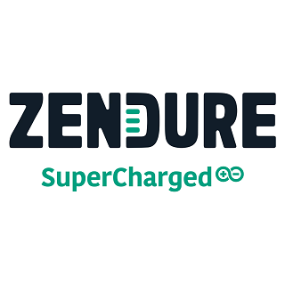

# ioBroker.zendure-solarflow

**Tests:** 

## Zendure Solarflow adapter for ioBroker

This project is an ioBroker Adapter to read data from the Zendure Solarflow Cloud API.

## Donate

If you find the adapter useful for you and want to support my work, feel free to donate by Paypal. Thank You!
(this is an personal Donate link for Nograx, in no relation to the ioBroker Project!) 

## Features

- Get all telemetry data from your Solarflow devices, also those not visible in the offical app - like battery voltage
- Control your Solarflow devices like in the offical app. Most of the settings are available.
- Control the output and input limit - you are not limited to use a Shelly Pro EM to realize a zero feed-in. You can also design more complex scenarios via script or blockly in ioBroker.
- Stop input if one battery drops into low voltage (battery protect). Works only when setting the output limit via the adapter
- Control more than one Solarflow at the same time!
- Get more precise calculations!
- Works with all Zendure SolarFlow devices!
- **zenSDK Integration**: Advanced communication for compatible devices via local HTTP communication
- **Relay MQTT messages to cloud**: The device has full local control and data is relayed to the Zendure MQTT. You won't lose control if internet if broken or Zendure servers are offline.

## Supported Devices

Currently all Zendure Solarflow devices are supported via cloud.

## Modes

- **Authentication Cloud Key** Official method supported by Zendure. Obtain a Cloud key from the official app. By default the zenSDK is used (the device has to be on the same network as the ioBroker instance). **This is the recommended way to control "new" (zenSDK compatible) devices, as it is the method officially recommended by Zendure themselves** - it gives you full local control while still relaying data to the cloud. You can opt out to use only cloud mode. For older devices with mqtt set to a local server, it's now possible to relay data to the cloud without any disadvantages!

- **Local MQTT** It's also possible to use the local only mode. Currently there is no known way for the new Solarflow devices to set the MQTT server directly on the device, so for these you have to use a DNS relay.

### mDNS Discovery

When zenSDK is enabled, the adapter also briefly browses the local network via mDNS/Bonjour after startup to discover Zendure devices announcing themselves as `Zendure-<model>-<serialNumber>`. This is used to:

- **Fill in or correct IP addresses**: If a device known from the cloud device list has no IP address, or the IP address in the cloud device list no longer matches the address the device actually announces on the network, it is corrected automatically.
- **Auto-create zenSDK-only accessories**: The Mix series devices and both Smart Meters (see below) have no known cloud productKey and can't be created from the cloud device list at all. The adapter creates them directly from their mDNS announcement instead, using their serial number as the internal device key.

Devices are always matched by their full serial number (parsed from the mDNS service name), not by IP address or a shortened suffix, since some Zendure serial numbers only differ in their first few characters.

This behavior can be disabled with the "Add devices found via mDNS discovery" setting.

### zenSDK Compatible Devices ✅

> **Recommended by Zendure:** For all "new" devices listed below, using the zenSDK (via the Authentication Cloud Key mode above) is the way officially recommended by Zendure themselves to control your devices. It gives you full local control over http while the cloud connection is kept for convenience - there is no need to disconnect these devices from the cloud.

These devices support the advanced zenSDK automation features with full **local** control over http:

- **Solarflow 1600 AC Plus** - Full zenSDK support
- **Solarflow 2400 AC** - Full zenSDK support
- **Solarflow 2400 AC Plus** - Full zenSDK support
- **Solarflow 2400 Pro** - Full zenSDK support
- **Solarflow 800** - Full zenSDK support
- **Solarflow 800 Plus** - Full zenSDK support
- **Solarflow 800 Pro** - Full zenSDK support
- **Solarflow 3000 Mix AC+** - Full zenSDK support (no cloud productKey known yet, added via [mDNS discovery](#mdns-discovery) only)
- **Solarflow 4000 Mix AC+** - Full zenSDK support (no cloud productKey known yet, added via [mDNS discovery](#mdns-discovery) only)
- **Solarflow 4000 Mix Pro** - Full zenSDK support (no cloud productKey known yet, added via [mDNS discovery](#mdns-discovery) only)

### Smart Meter Accessories 📊

These are read-only zenSDK accessories with no control states and no battery packs - they only ever report live measurements. Like the Mix series, they have no known cloud productKey and are added via [mDNS discovery](#mdns-discovery) only:

- **Smart Meter 3CT** - Reports apparent power per phase (A/B/C) and total, measured via three current transformers
- **Smart Meter D0** - Reports live measurements read from the utility meter via its IEC 62056-21 optical interface

### Legacy Devices 🔄

These devices are supported via **local** MQTT mode (Zendure Cloud Disconnector):

- **HUB 1200** - Local mode support, can relay messages to cloud
- **HUB 2000** - Local mode support, can relay messages to cloud
- **Hyper 2000** - Local mode support, can relay messages to cloud
- **AIO 2400** - Local mode support, can relay messages to cloud
- **ACE 1500** - Local mode support, can relay messages to cloud

### Local Mode Benefits 🏠

"Legacy" devices can be completely disconnected from Zendure Cloud while maintaining full functionality:

- **Privacy**: No data sent to Zendure servers
- **Reliability**: Direct local MQTT communication
- **Speed**: Faster response times without cloud latency
- **Flexibility**: Can relay messages to cloud when needed
- **Control**: Full local automation without internet dependency
- **Updates**: You can still do firmware updates with the official Zendure app via bluetooth

## Offline-Mode (Disconnect from Zendure Cloud)

As a new feature you can disconnect the Zendure device from the Cloud. You can either use the [Solarflow Bluetooth Manager](https://github.com/reinhard-brandstaedter/solarflow-bt-manager) from Reinhard Brandstätter or my own Windows Tool [Zendure Cloud Disconnector](https://github.com/nograx/zendure-cloud-disconnector) to disconnect the device from the cloud. It's also possible to redirect DNS requests with your router from "mq.zen-iot.com" to your own MQTT server!

**Note:** The Solarflow Bluetooth Manager and the Zendure Cloud Disconnector only work for **Legacy Devices**. For **zenSDK** devices you have to use the DNS redirect instead, as these devices don't expose the MQTT server setting via bluetooth.

Both tools connect to the Zendure device via bluetooth and simply sets the internal MQTT url to a new url/ip you have to provide. Currently you are forced to use the default MQTT port 1883 (or 8883 with SSL) on your server. You are also forced to deactivate authentication on the MQTT server as the Zendure device use a hardcoded password.

You can use this in combination with your cloud authentication key or use the full local mode.

## Important

If you plan to control the charging and feed in of your device with a script/blockly, I recommend using the control parameter '**setDeviceAutomationInOutLimit**', as this controls the device without writing to the flash memory of the device. You can use negative values to trigger charging from grid.

## Notes

This adapter will use the Cloud Authorization Code for authentication on the official mqtt servers, which you can generate in the Zendure app!

<!--
    Placeholder for the next version (at the beginning of the line):
    ### **WORK IN PROGRESS**
-->

## Changelog
### 5.3.0 (2026-09-02)

- Add folder "settings" for zenSDK devices. Here you can turn device polling on/off and control the polling interval for individual devices.
- Round hyperTmp to nearest int.
- Adjust checkVoltage function to take account of the 24V architecture of the new Mix series.
- Start mDNS discovery start after fetching deviceList from Zendure cloud.
- Fix lower case bug in comparing product keys for new mDNS device creation

### 5.2.1 (2026-08-30)

- BREAKING: `setDeviceAutomationInOutLimit` on Hyper 2000 uses simulated HEMS now and requires `hemsState = 1` and `autoModel = 0` to control the device (automatically set by the adapter). Please check your control parameters (e.g. inverseMaxPower) after updating if you use setDeviceAutomationInOutLimit.
- Add support for Solarflow 3000/4000 Mix AC+ and 4000 Mix Pro via mDNS auto-discovery
- Add support for Smart Meter 3CT and Smart Meter D0 (read-only zenSDK accessories, with proper power state names/units and no control or packData states)
- Correct a device's IP via mDNS if it no longer matches the (stale or wrong) IP from the cloud device list
- Process zenSDK measurements reported directly on the response instead of nested under "properties" (affects Smart Meter 3CT/D0)
- Enable "mDNS discovery" by default, including for existing instances that never had this setting saved - you must disable this option in settings if not desired

### 5.1.0 (2026-08-20)

- Fix batCur Reading
- Add control state for inverseMaxPower and gridOffMode (Control AC outlet on 'Plus' Devices)

### 5.0.4 (2026-08-19)

- Fix flickering Save button in Settings.
- Add function to detect zenSDK devices with mDNS and fill missing IP-address if found.

### 5.0.3 (2026-08-18)

- Fix `wifiState` not being created/updated correctly for devices using local zenSDK polling (Solarflow 2400 AC/AC Plus/Pro, 1600 AC Plus), as their local status payload does not report a `wifiState` property

For older changes see [CHANGELOG_OLD.md](CHANGELOG_OLD.md).

## License

MIT License

Copyright (c) 2026 Peter Frommert

Permission is hereby granted, free of charge, to any person obtaining a copy
of this software and associated documentation files (the "Software"), to deal
in the Software without restriction, including without limitation the rights
to use, copy, modify, merge, publish, distribute, sublicense, and/or sell
copies of the Software, and to permit persons to whom the Software is
furnished to do so, subject to the following conditions:

The above copyright notice and this permission notice shall be included in all
copies or substantial portions of the Software.

THE SOFTWARE IS PROVIDED "AS IS", WITHOUT WARRANTY OF ANY KIND, EXPRESS OR
IMPLIED, INCLUDING BUT NOT LIMITED TO THE WARRANTIES OF MERCHANTABILITY,
FITNESS FOR A PARTICULAR PURPOSE AND NONINFRINGEMENT. IN NO EVENT SHALL THE
AUTHORS OR COPYRIGHT HOLDERS BE LIABLE FOR ANY CLAIM, DAMAGES OR OTHER
LIABILITY, WHETHER IN AN ACTION OF CONTRACT, TORT OR OTHERWISE, ARISING FROM,
OUT OF OR IN CONNECTION WITH THE SOFTWARE OR THE USE OR OTHER DEALINGS IN THE
SOFTWARE.
