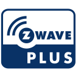

# ioBroker.zwave2

<h2 align="center">Z-Wave for ioBroker. But better.</h3>

Z-Wave 2 is a brand new Z-Wave implementation for ioBroker. It is based on [`zwave-js`](https://github.com/AlCalzone/node-zwave-js), which was written from the ground up for your benefit.

Unless [`ioBroker.zwave`](https://github.com/ioBroker/ioBroker.zwave/) it does not require `OpenZWave`. This means that the installation and updates are fast, and no compilation of static libraries and other complicated steps are necessary.

Furthermore, some devices just don't work in the original adapter, e.g. the Fibaro Roller Shutter 3.

Easy usage in ioBroker was kept in mind during the whole development. For example, some devices reuse configuration parameters to configure many different things. In this adapter, most of them are split into separate states and no complicated math is necessary:
| Config params in ioBroker.zwave2 | vs | Config params in ioBroker.zwave |
| --- | --- | --- |
|  | vs |  |

---

## Documentation and usage
* [FAQ](docs/en/FAQ.md)
* [Troubleshooting](docs/en/troubleshooting.md) · [bei Problemen](docs/de/bei-problemen.md)

---

## Changelog
[Older changes](CHANGELOG_OLD.md)
<!--
	Placeholder for next versions:
	### __WORK IN PROGRESS__
-->
### 1.10.2 (2021-06-10)
Upgraded to `zwave-js` version `7.7.3`. Notable changes include:
* Improved how dropped invalid messages are logged in the Z-Wave logfile
* Improved handling of the legacy `alarmType` and `alarmLevel` values under some circumstances
* Improved handling of notification values for devices that support `Notification CC` version 2
* Improved how some devices with incorrect capability reports are queried
* Endpoints of multi channel devices should now always be queried with the correct CC version
* Throttled some automatic queries
* Avoid a situation where multiple instances of the adapter try to access the same cache files, potentially corrupting them
* Improved behavior of secure communication when transmission failures are involved
* Several new and improved config files

### 1.10.1 (2021-05-24)
Removed some warnings about wrong state value types in JS-Controller 3.3
Upgraded to `zwave-js` version `7.5.1`. Notable changes include:
* Improved stability
* Improved healing strategy
* Several config file changes

### 1.10.0 (2021-04-29)
* The associations tab now shows the name of devices along with their node ID
* Associations can now also be managed on the endpoints of a node
* Experimental support for updating the embedded configuration files from the adapter configuration
* Support firmware updates with `*.hec` files
* Reduced traffic after controlling devices that report automatically
* Fixed an issue where `Basic CC` values were not stored correctly
* Added and updated many device configuration files
* Stability improvements
* Dependency updates

### 1.9.3 (2021-04-10)
* Restored the old behavior for devices that report their values via the root endpoint
* Some minor config file changes

### 1.9.2 (2021-04-05)
Upgraded to `zwave-js` version `7.1.0`. Notable changes include:
* Added reporting of usage statistics. For details, refer to the `node-zwave-js` documentation.
* Better support for 700-series Z-Wave sticks
* Notification values are no longer auto-reset to idle after 5 minutes by default. This behavior can now be enabled per device if necessary.
* Several stability improvements

For a full list of changes, check out https://github.com/zwave-js/node-zwave-js/blob/master/CHANGELOG.md

## License

MIT License

Copyright (c) 2019-2021 AlCalzone

Permission is hereby granted, free of charge, to any person obtaining a copy
of this software and associated documentation files (the "Software"), to deal
in the Software without restriction, including without limitation the rights
to use, copy, modify, merge, publish, distribute, sublicense, and/or sell
copies of the Software, and to permit persons to whom the Software is
furnished to do so, subject to the following conditions:

The above copyright notice and this permission notice shall be included in all
copies or substantial portions of the Software.

THE SOFTWARE IS PROVIDED "AS IS", WITHOUT WARRANTY OF ANY KIND, EXPRESS OR
IMPLIED, INCLUDING BUT NOT LIMITED TO THE WARRANTIES OF MERCHANTABILITY,
FITNESS FOR A PARTICULAR PURPOSE AND NONINFRINGEMENT. IN NO EVENT SHALL THE
AUTHORS OR COPYRIGHT HOLDERS BE LIABLE FOR ANY CLAIM, DAMAGES OR OTHER
LIABILITY, WHETHER IN AN ACTION OF CONTRACT, TORT OR OTHERWISE, ARISING FROM,
OUT OF OR IN CONNECTION WITH THE SOFTWARE OR THE USE OR OTHER DEALINGS IN THE
SOFTWARE.
