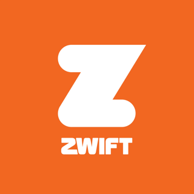

# ioBroker.zwift

**Tests:** 

## Zwift Adapter for ioBroker

Polls the Zwift API for live workout data and makes it available as ioBroker states. See your power, heart rate, cadence, speed, and more in real time while riding on Zwift.

### Features

- Live rider data updated every 5 seconds (configurable)
- Real-time power zone calculation (Coggan 6-zone model, FTP read automatically from your Zwift profile)
- Comprehensive Zwift profile data: identity, cycling stats, running stats, jerseys, Drops, streaks
- Connection status indicator (`info.connection`)
- Automatic token refresh with re-authentication fallback
- Encrypted credential storage
- Metadata updates applied automatically on adapter restart (unit corrections, new fields)

### Configuration

| Setting | Description | Default |
|---------|-------------|---------|
| **Zwift Email** | Your Zwift account email | — |
| **Zwift Password** | Your Zwift account password (stored encrypted) | — |
| **Polling Interval** | How often to fetch data, in seconds (3–300) | 5 |

### States

#### Rider Data (updated every poll cycle)

| State | Unit | Description |
|-------|------|-------------|
| `isRiding` | — | `true` when actively in a Zwift world |
| `power` | W | Current power output |
| `powerZone` | — | Current power zone (1-6, Coggan model, see below) |
| `heartrate` | bpm | Current heart rate |
| `cadence` | rpm | Current cadence |
| `speed` | km/h | Current speed |
| `distance` | km | Distance covered in current activity |
| `altitude` | m | Current altitude |
| `climbing` | m | Total elevation gain in current activity |
| `calories` | kJ | Calories burned (matches Zwift in-game display) |
| `time` | s | Elapsed ride time |
| `laps` | — | Laps completed |
| `progress` | — | Route progress (raw value from Zwift) |
| `sport` | — | Sport type (0 = cycling) |
| `groupId` | — | Group/event ID (0 = no group) |
| `x`, `y` | — | World position coordinates |
| `heading` | — | Direction of travel |
| `lean` | — | Lean angle |
| `watchingRiderId` | — | ID of the rider being watched |
| `rideOns` | — | Ride On count |
| `courseId` | — | Current course ID |
| `roadId` | — | Current road ID |

#### Power Zones

The `powerZone` state uses the Coggan 6-zone model and is calculated automatically from your current power and FTP. The FTP value is read from your Zwift profile -- no manual configuration is needed.

| Zone | Name | % of FTP |
|------|------|----------|
| 1 | Active Recovery | < 55% |
| 2 | Endurance | 55-75% |
| 3 | Tempo | 76-90% |
| 4 | Lactate Threshold | 91-105% |
| 5 | VO2 Max | 106-120% |
| 6 | Anaerobic Capacity | > 120% |

If no FTP is set in your Zwift profile, the `powerZone` state will not be updated.

#### Profile Data (fetched once on connect)

| State | Unit | Description |
|-------|------|-------------|
| `profile.id` | — | Zwift player ID |
| `profile.firstName` | — | First name |
| `profile.lastName` | — | Last name |
| `profile.weight` | kg | Weight |
| `profile.height` | cm | Height |
| `profile.age` | — | Age |
| `profile.male` | — | Gender indicator |
| `profile.countryCode` | — | Country code |
| `profile.ftp` | W | Functional Threshold Power |
| `profile.totalDistance` | km | All-time distance |
| `profile.totalDistanceClimbed` | m | All-time elevation gain |
| `profile.totalTimeInMinutes` | min | All-time ride time |
| `profile.totalWattHours` | Wh | All-time watt hours |
| `profile.totalExperiencePoints` | — | Total XP |
| `profile.targetExperiencePoints` | — | XP needed for next level |
| `profile.achievementLevel` | — | Current level |
| `profile.totalGold` | — | Total Drops (in-game currency) |
| `profile.totalInKomJersey` | — | Times worn KOM jersey |
| `profile.totalInSprintersJersey` | — | Times worn Sprinters jersey |
| `profile.totalInOrangeJersey` | — | Times worn Orange jersey |
| `profile.runAchievementLevel` | — | Current run level |
| `profile.totalRunDistance` | km | All-time run distance |
| `profile.totalRunTimeInMinutes` | min | All-time run time |
| `profile.totalRunExperiencePoints` | — | Total run XP |
| `profile.targetRunExperiencePoints` | — | Run XP needed for next level |
| `profile.totalRunCalories` | kJ | All-time run calories |
| `profile.streaksCurrentLength` | — | Current activity streak length |
| `profile.streaksMaxLength` | — | Longest activity streak |
| `profile.streaksLastRideTimestamp` | — | Timestamp of last ride in streak |
| `profile.currentActivityId` | — | Current activity ID |
| `profile.powerSource` | — | Power source type |

### How It Works

The adapter authenticates with the Zwift API using the same endpoint as the Zwift Companion app (`client_id=Zwift_Mobile_Link`). On startup it fetches your Zwift profile (including FTP) and then polls the rider status via the game relay server, decodes the protobuf response, converts raw values to human-readable units, and updates the ioBroker state tree.

If your profile has an FTP value set, the adapter calculates a live `powerZone` (1-6) on every poll cycle using the Coggan power zone model. No manual FTP configuration is needed.

When you are not actively riding in Zwift, the adapter sets `isRiding` to `false` and continues polling without errors.

**Technical note:** State objects are created using `extendObjectAsync` rather than `setObjectNotExistsAsync`. This means that metadata changes (corrected units, renamed states, new fields) are applied automatically whenever the adapter restarts. You do not need to delete and recreate objects after an update.

### Smart Home Ideas

With your Zwift data available as ioBroker states, you can create automations that bring your indoor training to life throughout your entire home.

**Immersive lighting**
- Change your LED strips or Hue lights based on heart rate zones — blue for recovery, green for endurance, yellow for tempo, red for threshold, flashing red for VO2max
- Use the `powerZone` state (1-6) to drive color schemes directly — no scripting needed to calculate zones yourself
- Shift light color with your power output — the harder you push, the more intense the glow
- Simulate altitude with light brightness — dim as you climb, brighten on descents
- Flash your room lights when you receive a Ride On

**Adaptive audio**
- Automatically switch playlists based on your heart rate zone or power — chill beats for warmup, high BPM for intervals
- Play a sound effect when you cross a lap or hit a calorie milestone
- Announce your current stats via text-to-speech at regular intervals

**Dashboards and displays**
- Show live power, heart rate, speed, and cadence on a wall-mounted tablet or smart display
- Display distance, climbing, and calories on an info panel in your pain cave
- Build a VIS dashboard with your all-time stats from the profile data — total kilometers, total elevation, XP level

**Climate control**
- Turn on a smart fan when your heart rate exceeds a threshold and turn it off during rest intervals
- Increase fan speed proportionally to your power output
- Activate the AC when calories burned pass a certain number

**DIY hardware**
- Use the altitude/gradient data to drive a DIY trainer rocker or tilt mechanism — build your own climbing simulator similar to the Wahoo KICKR CLIMB
- Control a servo or linear actuator via ioBroker to tilt your bike frame in real time as the in-game gradient changes

**Motivation and gamification**
- Trigger a confetti machine or party lights when you complete a ride or hit a personal best
- Send yourself a Telegram or Pushover notification with your ride summary when `isRiding` switches to `false`
- Track your weekly distance on a seven-segment display or e-ink screen in the hallway
- Light up a progress bar (LED strip) showing your route completion percentage

**Family and household**
- Set a "Do Not Disturb" indicator light outside your room whenever `isRiding` is `true`
- Automatically mute your doorbell during a Zwift session
- Send a message to your family's smart speaker: "Dad is Zwifting, estimated finish in X minutes"

## Changelog
<!--
	Placeholder for the next version (at the beginning of the line):
	### **WORK IN PROGRESS**
-->
### **WORK IN PROGRESS**

### 0.1.2 (2026-03-03)
* Set up trusted publishing via OIDC for GitHub Actions deploy

### 0.1.1 (2026-03-03)
* Fix ESLint curly and prettier errors for CI

### 0.1.0 (2026-03-03)
* Poll Zwift API for live ride data (power, heartrate, cadence, speed, distance, altitude, climbing)
* Zwift profile data (FTP, weight, height, level, total stats)
* Power zone calculation based on FTP (Coggan 6-zone model)
* Configurable polling interval

### 0.0.1 (2026-03-02)
* (Flixhummel) initial release

## License
MIT License

Copyright (c) 2026 Flixhummel <hummelimages@googlemail.com>

Permission is hereby granted, free of charge, to any person obtaining a copy
of this software and associated documentation files (the "Software"), to deal
in the Software without restriction, including without limitation the rights
to use, copy, modify, merge, publish, distribute, sublicense, and/or sell
copies of the Software, and to permit persons to whom the Software is
furnished to do so, subject to the following conditions:

The above copyright notice and this permission notice shall be included in all
copies or substantial portions of the Software.

THE SOFTWARE IS PROVIDED "AS IS", WITHOUT WARRANTY OF ANY KIND, EXPRESS OR
IMPLIED, INCLUDING BUT NOT LIMITED TO THE WARRANTIES OF MERCHANTABILITY,
FITNESS FOR A PARTICULAR PURPOSE AND NONINFRINGEMENT. IN NO EVENT SHALL THE
AUTHORS OR COPYRIGHT HOLDERS BE LIABLE FOR ANY CLAIM, DAMAGES OR OTHER
LIABILITY, WHETHER IN AN ACTION OF CONTRACT, TORT OR OTHERWISE, ARISING FROM,
OUT OF OR IN CONNECTION WITH THE SOFTWARE OR THE USE OR OTHER DEALINGS IN THE
SOFTWARE.
