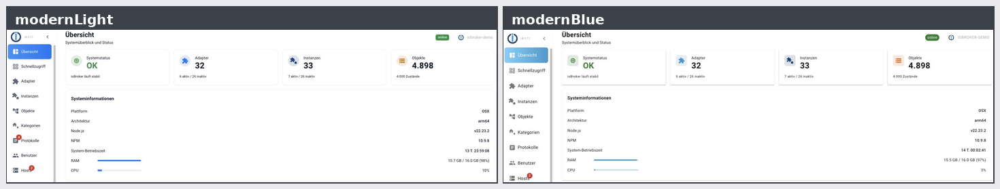

# The user interface

The adapter **admin** This is the basic adapter and is used to operate the entire ioBroker installation. It provides a web interface, which is located at
`http://<IP-Adresse des Servers>:8081` is called up.

This adapter is created during the ioBroker installation; manual installation is not necessary.

This page is an overview. Detailed descriptions can be found on the pages linked in the individual sections.

## Construction

The surface is divided into three areas: **1** the menu bar, **2** the main window and **3** the toolbar at the bottom of the menu bar.

## 1 Menu bar

The menu bar leads to the individual pages of the admin panel. In a fresh installation, these are:

| Menu item                               | Contents                                                                                                     |
| --------------------------------------- | ------------------------------------------------------------------------------------------------------------ |
| [Overview](/docs/admin/overview.md)     | System status, host hardware data, active adapters, and the last log lines.                                  |
| [Quick access](/docs/admin/overview.md) | Tiles for all adapters with their own web interface as well as for the hosts.                                |
| [adapter](/docs/admin/adapter.md)       | Available and installed adapters, installation and update.                                                   |
| [Instance](/docs/admin/instances.md)    | Start and stop the created instances with their configuration.                                               |
| [objects](/docs/admin/objects.md)       | The object tree with all devices, channels, and data points.                                                 |
| [Categories](/docs/admin/enums.md)      | Rooms, trades, and favorites. This section used to be called "Lists".                                        |
| [Protocols](/docs/admin/log.md)         | The log file. If an error occurs, the menu item is highlighted in red.                                       |
| [user](/docs/admin/users.md)            | Users and groups, including their rights.                                                                    |
| [Hosts](/docs/admin/hosts.md)           | The computers running ioBroker. A notification will appear here if a new js-controller version is available. |
| [files](/docs/admin/files.md)           | The file manager for files managed by ioBroker.                                                              |
| [Backup](/docs/config/backup.md)        | Create, view, and restore backups.                                                                           |

Additional menu items are added with the installed adapters, for example: _Scripts_
(javascript), _calendar_ (fullcalendar) _Devices_ (devices) or _events_ (eventlist). At the very bottom it says **system**: there the
[System settings](/docs/admin/settings.md)
carried out.

### Reduce menu size

The menu bar can be toggled using the arrow in the upper left corner. It has three states: with labels, with icons only, and completely hidden. When hidden, it can be brought back using the icon with the three lines. This leaves more space for the main window on small screens.

## 2 main windows

The main window displays the content of the currently selected menu item. Details of what is shown there can be found on the pages linked in the table above.

Values are stored in the object tree in **red lettering** displayed as long as they have not yet been confirmed by the recipient (`ack = false`).

## 3 Toolbar

At the bottom of the menu bar are four buttons:

| symbol            | function                                                                                                              |
| ----------------- | --------------------------------------------------------------------------------------------------------------------- |
| bell              | **Notifications** of the system. The number next to it indicates the number of unread messages.                       |
| contrast          | **Change color theme**: switches between color themes (see below).                                                    |
| Magic Hat         | **Switch expert mode**It displays additional objects, settings, and columns and only applies to this browser session. |
| Connected windows | **Synchronize settings between all open browser windows**.                                                            |

Many descriptions in this documentation assume expert mode. If a described button is missing, it's worth checking that switch first.

Expert mode only applies to the current browser session. It can be permanently enabled in the...
[System settings](/docs/admin/settings.md).

### Color themes

The contrast switch changes the color theme. The following options are available: **modernLight** and
**modernBlue**Both display the same content; they only differ in color.

The color theme applies per browser, not per user. Users accessing the admin panel from multiple devices must configure it individually on each device.