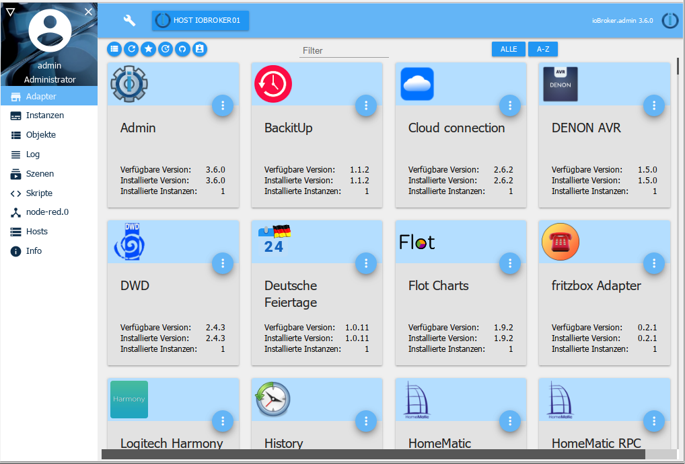
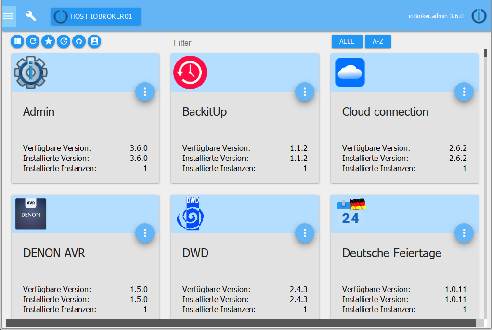

# The admin interface
!> **Due to the scope of the documentation, this is only an overview; detailed information is provided on the pages that are linked to the tabs via the headings of the sections. Please click on the headings.**

The Adapter Admin is used to operate the entire ioBroker installation.
He provides a web interface. This is called up under ``<IP-Adresse des Servers>:8081``.

This adapter is created directly when ioBroker is installed - manual installation is not necessary

The following functions, among others, can be called up via the GUI provided by the adapter:

* Entry of system-wide settings
* Installation of further adapters and instances
* Access to the configuration of the instances
* Access to property overview
* Access to the status overview of the objects
* Access to the administration of users and groups
* Access to the log file
* Management of the hosts

The adapter view is divided into three areas:

### 1 - [Menu sidebar](#Menüpunkte)
### 3 - [System settings](#Systemeinstellungen)
### 3 - [System Settings] (# System Settings)
## Menu items
The menu bar contains several menu items. In the basic installation, these points are displayed as shown in the figure. After installing additional adapters, additional points can be added or deactivated using the triangle icon at the top left (1) in order to obtain a better overview.

The menu bar with the tabs can be hidden via the **X** (2) in order to create more space on mobile devices.

The menu bar can be displayed again via the "burger icon"

## The main window
The main window shows the content belonging to the selected menu item.

Detailed information on this content is available on the pages linked via the headings.

### [Overview][]
All pages with their own web interface and information about the hosts are displayed here.

### [adapter] []
The available and installed adapters are displayed and managed here.

### [instances] []
The instances already installed on the Adapter tab are listed here and can be configured accordingly.

### [objects] []
The managed objects, structures and data points of the devices that are integrated via adapters. Objects can be created and deleted here. Entire object structures can be uploaded or downloaded using the "arrow up" and "arrow down" buttons.

If values are displayed in red, they have not yet been confirmed by the recipient (ack = false).

### [lists] []
The favorites, trades and rooms from the Homematic-CCU are listed here.

### [Log] []
The log is displayed here

In the Instances tab, the log level to be logged can be set for the individual instances. The minimum log level to be displayed is selected in the selection menu. If an error occurs, the label on the tab appears in red.

### [events] []
A list of the current status updates.

### [user] []
Here users can be created and added to the existing groups.

### [Scripts](scripts.md)
On this page you can create your own scripts with javascript, blocly or typescript.

### [hosts] []
Information about the computer on which ioBroker is installed. If a new version is available, a message appears in this entry in the menu bar.

## [System Settings] []
In the menu that opens here, settings such as language, time and date format and other system-wide settings are made.

The repositories and security settings can also be set here.

[Übersicht]: https://www.iobroker.net/#de/documentation/admin/overview.md

[Adapter]: https://www.iobroker.net/#de/documentation/admin/adapter.md

[Instanzen]: https://www.iobroker.net/#de/documentation/admin/instances.md

[Objekte]: https://www.iobroker.net/#de/documentation/admin/objects.md

[Aufzählungen]: https://www.iobroker.net/#de/documentation/admin/enums.md

[Log]: https://www.iobroker.net/#de/documentation/admin/log.md

[Ereignisse]: https://www.iobroker.net/#de/documentation/admin/events.md

[Benutzer]: https://www.iobroker.net/#de/documentation/admin/users.md

[Hosts]: https://www.iobroker.net/#de/documentation/admin/hosts.md

[Systemeinstellungen]: https://www.iobroker.net/#de/documentation/admin/settings.md