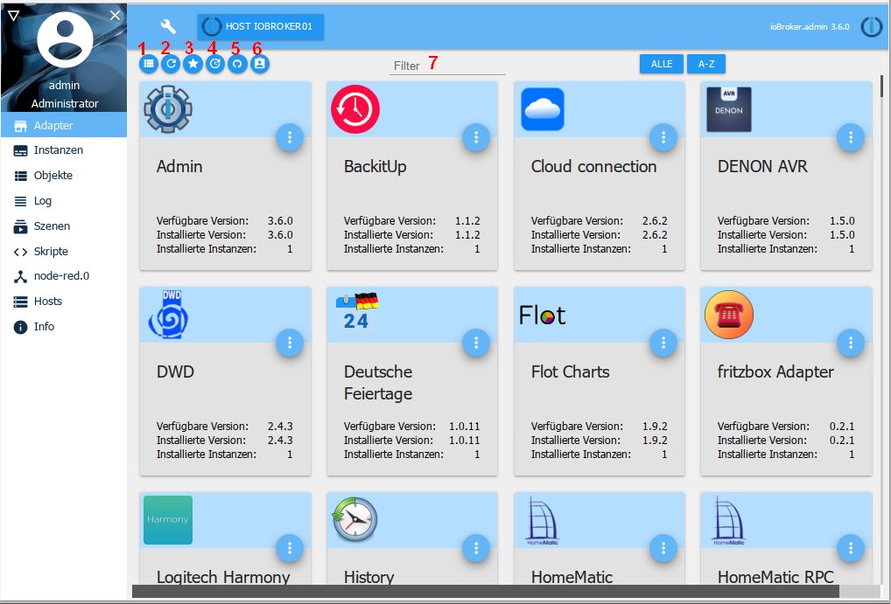

# The Adapter tab
The available and installed adapters are displayed and managed here.

## The title line
In the title bar there are icons for the most important processes. There is context help for each icon. Simply hold the mouse over the icon for a while.

### 1 - Switch view
This button can be used to switch between the tile view and the table view (toggle function)

### 2 - Refresh display
Every time you restart the system, the system automatically searches for updates. You can use this button to start the search manually or to refresh the page.

### 3 - show only installed adapters
When you select this icon, only adapters with already installed instances are displayed (toggle function)

### 4 - Show adapters with updates
When you select this icon, only adapters for which an update is available are displayed (toggle function). The tiles of the adapters that can be updated have a green header. If there is no update for an adapter, a corresponding message appears.

In addition, another icon appears in the title bar:

Clicking this icon (8) updates all available adapters.

### 5 - Install adapter from own URL
!> **ATTENTION: Using this option can lead to problems with the ioBroker installation.** Adapters from GitHub may still be under development and therefore may not work properly! These should only be used with caution in a productive system. It is recommended to wait for a stable version!

Using the Octocat icon, adapters can be installed from custom paths (URL or file paths) or pre-release versions from GitHub.

After clicking on this icon, a corresponding selection window opens:

Under the ***FROM GITHUB*** tab, simply select the desired adapter from the pull-down menu and the latest pre-release version will be installed.

If you select the ***ANY*** tab, you can enter any file path or any URL (e.g. a URL to an external adapter developer) in the field and install the corresponding adapter.

### 6 - Enable expert mode
The expert mode also allows you to install older versions of an adapter. If this button (9) is selected, an additional icon appears in the tile that can be used to install earlier versions.

### 7 - Filter
Here you can search for specific adapters using a filter term.