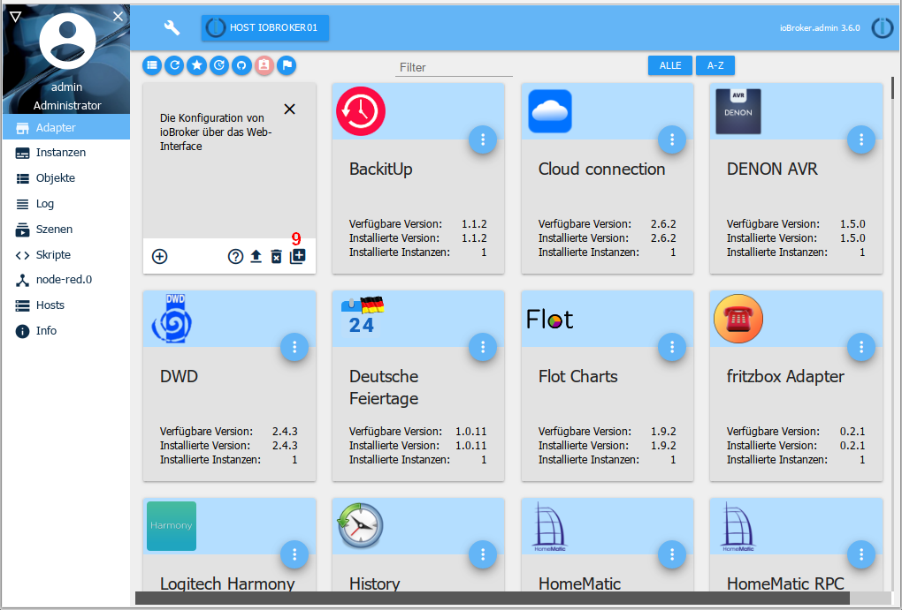

# The Adapter tab
The available and installed adapters are displayed and managed here.

## The title line
in the title line there are icons for the most important processes. There is context help for each icon. Simply stay on the icon with the mouse for a while.

### 1 - Toggle view
This button can be used to switch between the tile view and the table view (toggle function)

### 2 - update the display
Updates are automatically checked for each restart. This button can be used to start the search manually or to refresh the page.

### 3 - show only installed adapters
When this icon is selected, only adapters with instances that have already been installed are displayed (toggle function)

### 4 - Show adapter with updates
When this icon is selected, only adapters for which an update is available are displayed (toggle function). The tiles of the updateable adapters have a green header. If there is no update for an adapter, a corresponding message appears.

Another icon also appears in the title bar:

Clicking this icon (8) updates all available adapters.

### 5 - Install adapter from its own URL
!> **ATTENTION: The use of this option can lead to problems with the ioBroker installation.** Adapters from GitHub may still be under development and therefore not work properly! These should only be used with caution in a productive system. It is recommended to wait for a stable version!

Using the Octocat icon, adapters can be installed from their own paths (URL or file paths) or pre-release versions from GitHub.

After clicking this icon, a corresponding selection window opens:

Under the ***FROM GITHUB*** tab, simply select the desired adapter in the pull-down menu and the latest preliminary version will be installed.

When selecting the ***ANY*** tab, any file path or URL (e.g. a URL to an external adapter developer) can be entered in the field and the corresponding adapter installed.

### 6 - Switch on expert mode
The expert mode also enables older versions of an adapter to be installed. If this button (9) is selected, an additional icon appears in the tile via which earlier versions can be installed.

### 7 - filter
Here you can search for specific adapters using a filter term.