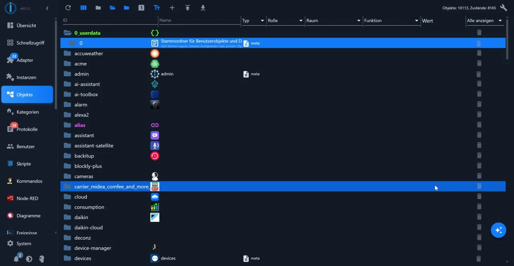
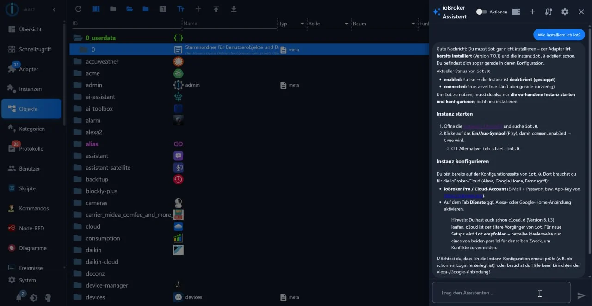

# The AI Assistant in the Admin
Since Admin 8, a floating button has appeared in the bottom right corner, behind which an assistant is located. It answers questions about your system, suggests adapters for a device or service, and can also make changes if desired.

*The button in the bottom right corner, above the object list: clicking it opens the wizard.*

!> **The language model is not from ioBroker.** The administrator provides the user interface; access to a model is provided by each individual user: either through an account with a provider or by having a model on their own network. The requirements for this access are determined by the respective provider. The assistant is **disabled** by default.

## Turn on
The assistant relies on the administrator's MCP access, which is disabled by default.

Two steps are required:

1. In the **Admin's instance settings**, uncheck the box next to *Wizards in the

Disable* remove user interface.

2. Open the button in the bottom right corner and under *Settings of the

AI Assistant* **Provider**, **Access Data** and **Model**. The administrator retrieves the list from the provider via *Load Models*; they report "Connection OK" along with the number of models found.

Until that is set up, the assistant responds with a note to first configure the provider, access data and model.

If you don't want to see the button without disabling access, you can hide it using *Hide Assistant Button*.

*The open assistant: it responds in the column on the right, while the interface remains open next to it. The action button is located at the top of the window.*

## Read only or act
The assistant has two operating modes. In **Read-only** mode, it examines the system and responds. In the "Actions" mode, it can also perform actions, such as installing an adapter or changing a setting. It doesn't execute these actions silently: it first displays which actions it intends to perform and waits for confirmation.

## Without its own key: an external client
Users who don't want to enter a provider in ioBroker can control the assistant externally. The administrator includes a built-in MCP server for this purpose; MCP is the interface through which an AI client uses the tools of an application.

The dialog box *Use without API key (external MCP client)* contains the following three steps:

1. **Deploy the MCP server.** The admin has a built-in one; for him, it is

Nothing needs to be installed. Alternatively, there is the adapter `iobroker.mcp`, ideally as a web extension of a web instance.

2. **Enter the server in your own client**, for example in Claude Desktop, Codex

or Gemini CLI. The dialog displays the address in the form `http(s)://<host>:<port>/mcp`; it can be copied from there.

3. **Accept the system prompt.** The same dialog displays the text with which the

The built-in assistant is working. Anyone who uses it as an instruction in their client will get the same behavior.

## What goes outwards
The assistant works with the data contained in the system: objects, states, and logs are passed to the selected provider for processing. This is also stated in the dialog box. Users who do not want this should operate a model on their own network or simply disable the assistant.

## Further
* [System settings](/docs/admin/settings.md)
* [Adapter](/docs/admin/adapter.md)