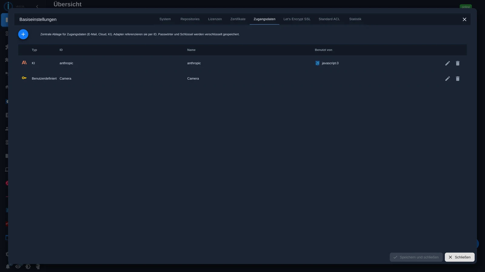
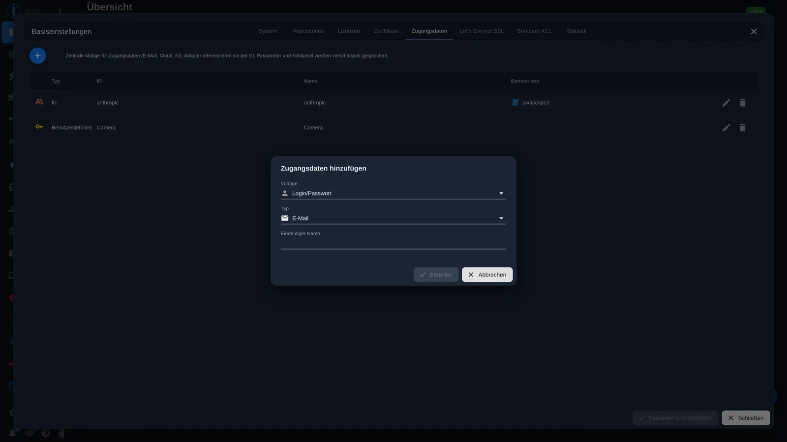
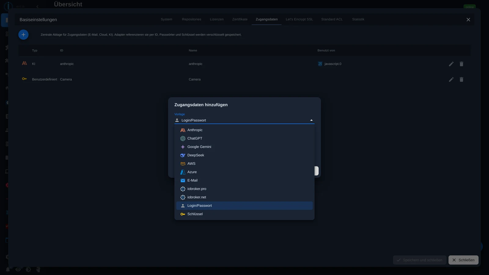
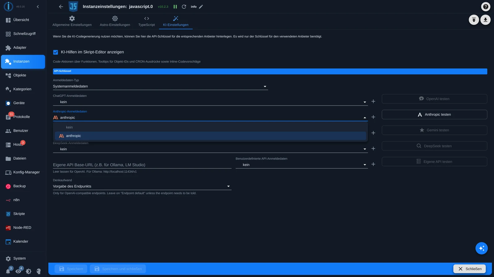

# Access data

Many adapters and scripts require a password or API key: login credentials for a camera, the key of an AI provider, or email account login details. Previously, this information had to be stored individually at each point, either in the respective instance configuration or directly in the script.

Since Admin 8, there's a central repository for this. Passwords and keys are stored there encrypted, and everything she needs only refers to it via an ID.

This has three advantages:

- A key is stored in only one location. If it changes, change it once instead of in every instance and every script.
- Scripts can be shared or shown in the forum without revealing any secrets.
- You can see at a glance which instance uses which entry.

There's also a video about this: [Managing access data centrally](https://youtu.be/mwOQPv-5n24)

## Where to find them

In the admin area under **System** , then in the **Access Data** tab.



The table displays the type, ID, name, and " **Used by** " column for each entry. This column indicates which instance is currently using the entry. Therefore, before modifying or deleting an entry, you can see what will be affected.

## Create an entry

Via the plus sign in the top left corner.



There are three pieces of information:

**Template.** It determines which fields the entry will have. Templates are included for major AI providers (Anthropic, ChatGPT, Google Gemini, DeepSeek), for AWS and Azure, for email, and for iobroker.pro and iobroker.net. In addition, there are two general templates: **Login/Password** for anything with a username and password, and **Key** for a single value.



**Type.** The general classification, such as AI, email, or user-defined. It serves to improve clarity in the table.

**Unique name.** You will use this name to refer to the entry later, both in the instance configuration and in the script. Choose a descriptive name, for example: `Kamera` or `anthropic`.

After **creating** the template, fill in the fields. Passwords and keys are stored encrypted and are not displayed in plain text in the interface.

## In instance configuration, use

The most common use. Adapters that support memory display a selection list of matching entries instead of an input field.



This example shows the AI settings of the JavaScript adapter. Under **Credential Type,** select... `Systemanmeldedaten`, including the desired entry for each provider. Use the plus sign next to it to create a new entry directly, without leaving the page.

The [AI assistant](/docs/admin/assistant.md) works the same way in the admin adapter settings.

## Use in the JavaScript adapter

From JavaScript adapter version **10.1.1** onwards, all entries in the script are stored as a global object. `SECRETS` ready.

```javascript
const user = SECRETS.Kamera.user;
const pass = SECRETS.Kamera.password;
const key  = SECRETS.anthropic.key;
```

After `SECRETS` The unique name of the entry follows, then the desired field. Which fields are available depends on the template.

Three characteristics are important:

- The values arrive **already decrypted** ; you don't need to decrypt anything yourself.
- `SECRETS` is **read-only** . A script can read an entry, but not modify it.
- Changes in the admin panel take effect **immediately** . The script does not need to be restarted.

The script editor is aware of the existing entries. After `SECRETS.` He suggests the names, and after the next point, exactly the fields that this entry has.

More information about the adapter itself can be found under [JavaScript](/docs/logic/javascript.md) .

## Use in Blockly

For [Blockly,](/docs/logic/blockly.md) there is a block called " **Access Data"** in the **"System"** category.

They drag it to the position where the password would normally be, and select the entry and field from the two drop-down menus. Again, the key is nowhere to be found in the project.

## Good to know

- The login credential storage doesn't replace the existing input fields everywhere. Adapters must support it. Where it's not yet offered, everything remains as usual.
- The unique name can be changed later, but then you must update all instances that use it. The " **Used by"** column shows you the instances; you must check scripts yourself.

The entries are encrypted within this installation's configuration. Therefore, they should also be included in the backup: see [Backup](/docs/config/backup.md) .