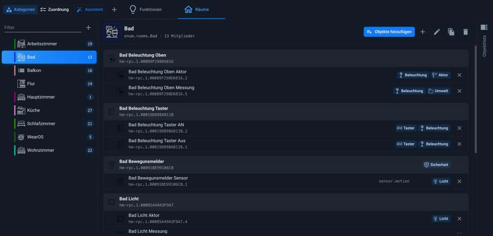
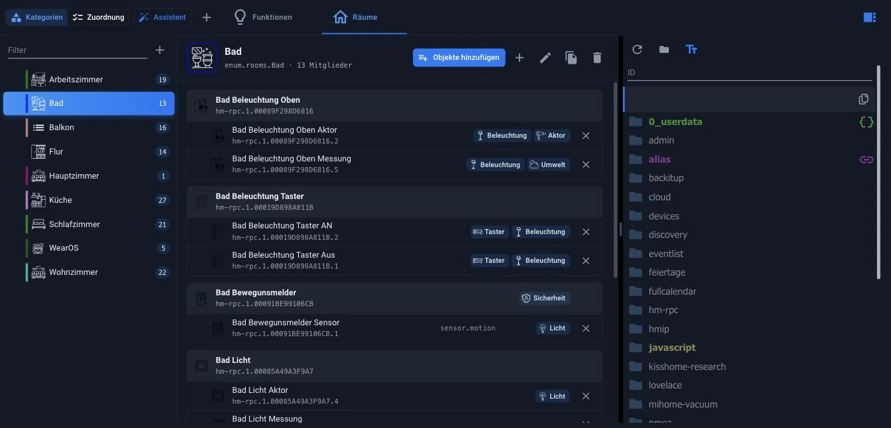

# Tab Categories

Categories organize data points by **room** and **function** . A data point can belong to both: the ceiling light in the living room belongs to the room _"living room"_ and the function _"light"_ .

This tab was formerly called **"Enumerations** ". Internally, the objects are still called...`enum.rooms.*` and`enum.functions.*` .

The benefit lies in everything that builds upon it: visualizations, voice control via Alexa or Google Home, and scripts accessing groups of devices through it. "Turn off the living room lights" only works if the room and its function are properly defined.

At the top of the tab are three sections:

| Area           | For what                                                          |
| -------------- | ----------------------------------------------------------------- |
| **Categories** | Create and rename spaces and functions, and manage their members. |
| **Assignment** | a table of all detected devices to fill in gaps                   |
| **assistant**  | Initial setup in five steps                                       |

## Categories

### functions

On the left is the list of categories; the number next to each category indicates the number of members. On the right are the members of the selected category: at the top is the device or channel, and below it, indented, are the data points. Small icons on the right edge of each row indicate which other categories the entry belongs to; an **X** removes it from the current category.

Above the list are a **filter** and a **"+"** button, which creates a new category. Above the members is the category's internal name, for example:`enum.functions.Aktor` , and the buttons:

| button          | Effect                                                         |
| --------------- | -------------------------------------------------------------- |
| **Add objects** | opens the selection and captures multiple data points at once. |
| **+**           | creates a subordinate category                                 |
| Pen             | changes name, symbol, and color                                |
| leaves          | duplicates the category                                        |
| Wastebasket     | They delete them, but the data points themselves remain.       |

### Rooms

The rooms work the same way. The colored bar on the left of the entry is the category color; it makes long lists easier to read.

Rooms can be nested: _the ground floor_ can contain _a living room_ and _a kitchen_ . The indented entries in the list indicate these levels.

### The object list

The **object list** is located on the right-hand side, displayed as a drawer. Clicking the vertical text expands it to show the object tree. From there, an entry can be dragged and dropped into a category. For those who want to assign many data points at once, the **"Add Objects"** function is faster.

## Assignment

This section reverses the approach: Instead of starting with the category, it lists all devices and channels and shows in two columns which room and function are associated with each. An assignment is added via the **+ button** , and removed via the **X** on a label.

The tools to find the gaps are listed above:

- a **filter** for the name
- a selection of the **instance** , for example only`alias.0`
- The switches: **All** , **Without Room** and **Without Function** , each with quantity
- **Only recognized devices** , which limits the list to what ioBroker has recognized as a device.

The fastest way to a fully maintained system is via **"No space"** and **"No function"** : the list is processed until the number reaches zero.

## assistant

The assistant sets up rooms and functions in five steps: **Floors** , **Rooms** , **Functions** , **Assign Devices** , **Overview** . In the Rooms and Functions steps, pre-made suggestions are available as tiles; those that already exist are checked and labeled _"Already Existing_ ." Missing items can be selected, and custom names can be added via **"Custom** ."

Existing rooms and functions remain unchanged; the assistant simply creates and assigns them. Therefore, it is also suitable for systems that are already running.

A data point can also be assigned directly in the [Objects](/docs/admin/objects.md) tab via the _Space_ and _Function_ columns. All methods modify the same objects.

!> Assignments belong at the **data point** , not at the channel or the device, otherwise the evaluating adapters will not know which value to switch.