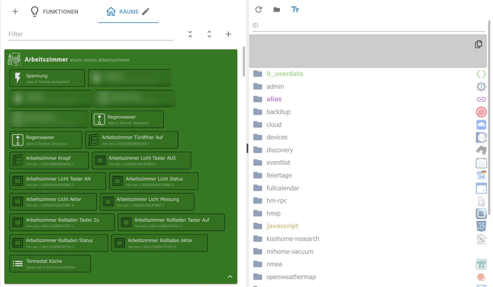

# Tab Categories

Categories organize data points by **room** and **function** . A data point can belong to both: the ceiling light in the living room belongs to the room _"living room"_ and the function _"light"_ .

This tab was formerly called **"Enumerations** ". Internally, the objects are still called...`enum.rooms.*` and`enum.functions.*` .

The benefit lies in everything that builds upon it: visualizations, voice control via Alexa or Google Home, and scripts accessing groups of devices through it. "Turn off the living room lights" only works if the room and its function are properly defined.

## functions

On the left are the categories with their associated data points, on the right the object tree. A data point is assigned by dragging it from the tree onto the desired category.

Above the list are a **filter** , buttons to expand and collapse all categories, and a **"+"** icon to create a new category. The **"+"** icon in the top left corner creates a top-level category.

## Rooms

The rooms work the same way. Using the pencil icon next to the tab name, you can change the name, icon, and color of a category. The color changes the entire group, making the list easier to read.

Rooms can be nested together: _the ground floor_ can contain _the living room_ and _kitchen_ .

A data point can also be assigned directly in the [Objects](/docs/admin/objects.md) tab via the _Space_ and _Function_ columns. Both methods modify the same objects.

!> Assignments belong at the **data point** , not at the channel or the device, otherwise the evaluating adapters will not know which value to switch.