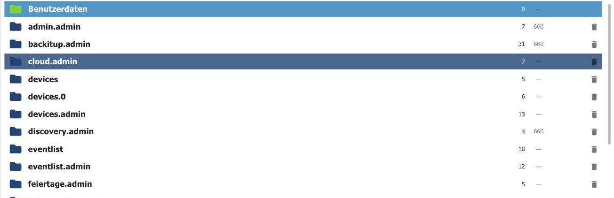

# Files tab

In addition to objects and states, ioBroker also manages files: icons, images, adapter configurations, and the pages of vis. This tab is the file manager for these.

Each adapter gets its own directory, usually `<adapter>.admin` for the files of its configuration interface. At the very top is **User data**
(`0_userdata.0`This is where your own files belong, such as images for a visualization.

To the right of each entry are the number of files contained and the access rights.

## The toolbar

| No. | function                                                                                     |
| --- | -------------------------------------------------------------------------------------------- |
| 1   | **Switch view** between list and tiles.                                                      |
| 2   | **Hide empty directories.**                                                                  |
| 3   | **Reload.**                                                                                  |
| 4   | **Create a new directory.**                                                                  |
| 5   | **Upload file**: also by dragging and dropping.                                              |
| 6   | **Toggle preview background**, so that images with a transparent background can be assessed. |

The directories of the adapters belong to the respective adapter. If it is updated, it will overwrite its files. Therefore, keep your own files in the appropriate directory.
**User data** They will be stored there.

Files can also be read and written from a script. How to do this is explained below.
[File storage](/docs/dev/filestorage.md).