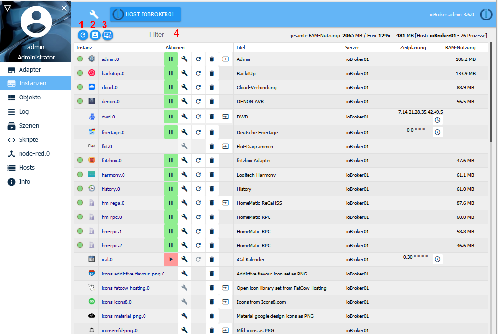

The instances already installed via the Adapter tab are listed here and can be configured accordingly.

## The title line
In the title bar there are icons for the most important processes. There is context help for each icon. Simply hold the mouse over the icon for a while. There is also information about the server's load.

The icons in detail:

### 1 - Refresh view
If newly created instances are not visible, clicking this icon will help update the state of the page.

### 2 - Enable administrator mode
When you select this icon, additional columns for configuring the instances are displayed (toggle function). For more information, see the Page content section.

### 3 - Show only instances of the selected host

In multi-host systems, the instances of all hosts are managed by the master's admin. The information on which host this instance is located is in the ***Server*** column.

If a host is selected in the header, this button can only display the instances installed there.

### 4 - Filter
In this field you can enter a term to filter or search for instances

## More information in the Instances window
The first numbers indicate the memory used by the instances so far and the remaining free memory in MB. After that, the free memory in %. The name of the ioBroker server and the number of running processes are in square brackets.

## The page content

The page displays the installed instances of the adapters in a table.

The table consists of the following columns:

### 1 - Condition
Here, the status of the instance is shown by a traffic light. You can get more information by hovering the mouse over the signal.

Not all instances have this traffic light. But this is no reason to panic. These are either time-controlled instances that only connect to the controller briefly and then immediately switch off again, or continue to run in the background, like vis, for example.

### 2 - Icon
This shows the icon that is used ioBroker-wide for this adapter

### 3 - Instance
This column contains the name of the instance. It consists of the name of the adapter and a number that is numbered consecutively in the order in which the instances are installed. The first instance receives the

0. This designation is the basis for naming the data points in ioBroker.

### 4 - activated
This is where the instance is started or stopped. The green pause symbol indicates that the adapter is running and can be paused by clicking on it, the red play symbol shows a stopped instance that can be started with a click.

### 5 - Configuration
Clicking this icon opens an adapter-specific configuration menu. The corresponding menus are described for the corresponding adapters.

### 6 - restart
Clicking on this icon will restart the corresponding instance

### 7 - Trash can
This icon deletes the corresponding instance. Other instances of the same adapter remain. The adapter itself also remains.

### 8 - Weblink
Behind this icon there is a link to the website of this instance. Either because this adapter has its own web interface (with a different port) or just a different path. In some cases this link also leads to help pages.

### 9 - Title
The name of the instance is specified here. This name can be changed according to your own wishes or needs. This is particularly useful if there are several instances of an adapter (with otherwise the same name). This would be the case with hm-rpc, for example, if there is one instance each for RF, Wired and CuxD.

### 10.) Time planning
For adapters that are started on a timer basis, you enter when the adapter should start here. This schedule is in the format of a cron job. To change it, click on the button with the three dots. An input window opens with lots of additional information and help.

### 11 - Restart
Using the clock icon you can also create a schedule for when this instance should be restarted.

This column is only visible in expert mode!

### 12 - Log Level
In this column, the respective log level for the instance can be adjusted. Debug, info, warn and error are available. By default, this value is set to info. If you have the impression that something is not running quite right, you can set it to debug. Then the log tab for this instance will also display debug information that can help to find an error. Conversely, you can also set this value higher so that the log is not so extensive.
This column is only visible in expert mode!

### 13 - RAM Limit
Here you can specify how much memory should be made available to the instance as a precaution. This amount of memory is then no longer available for other tasks and should not be set too high, especially on systems with little memory. If the instance temporarily needs more memory, the system will of course allocate it to it but will then immediately release it for the system again. During the time in which an instance needs more memory than has been reserved for it, the required memory is shown in red.

This column is only visible in expert mode!

### 14 - RAM usage
The actual memory used by the instance is displayed here. These values are updated regularly. After the update, these values appear briefly in green.