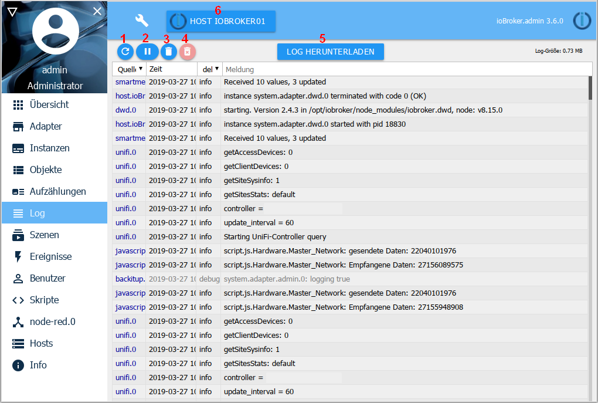
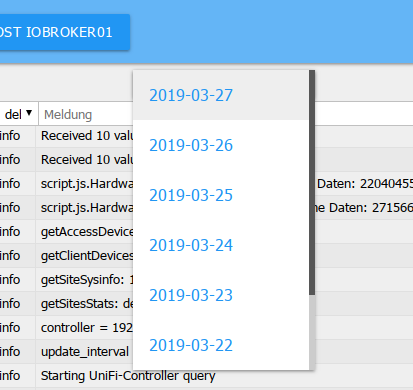
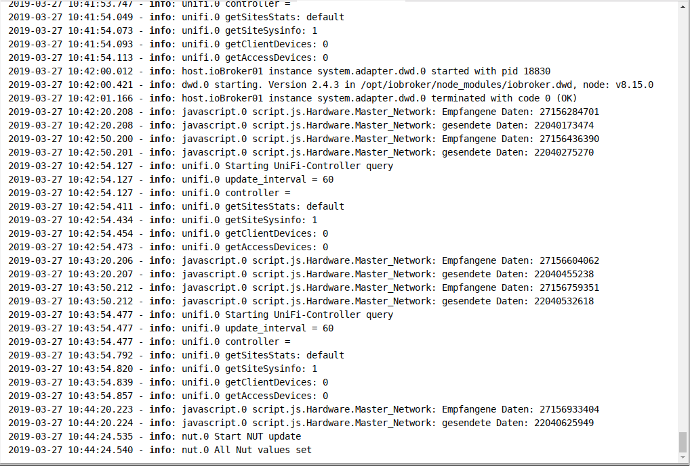
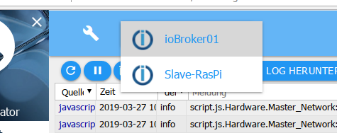
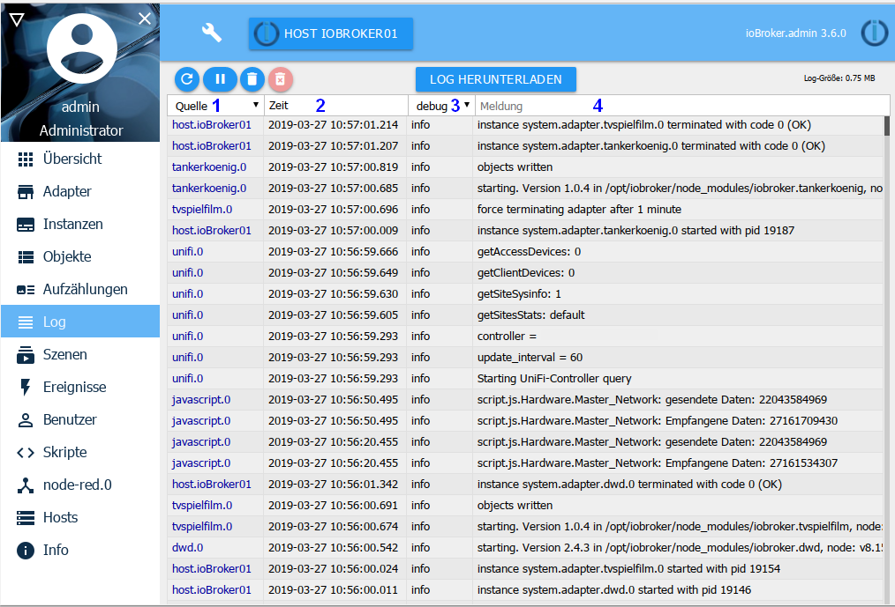
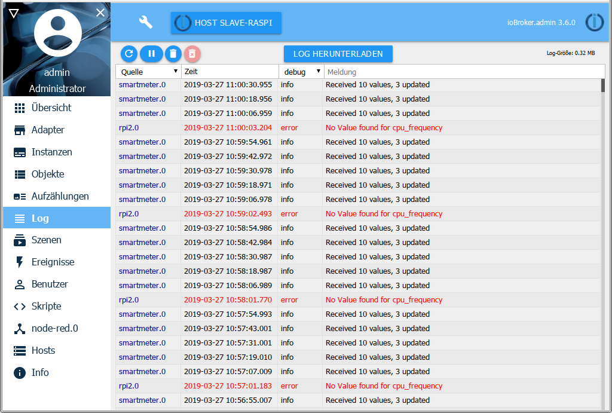

The system's messages are continuously output here. The latest message is at the top.

## The title line
in the title line there are icons for the most important processes. There is context help for each icon. To do this, simply hold the mouse on the icon for a while.

### 1 - update log
This button updates the list.

### 2 - Stop updating
If you click on this button, the constant updating of the list is stopped.
Instead of the pause icon, the number of new, non-displayed messages now appears.

### 3 - delete list
Clicking on this icon only deletes the list on the screen

### 4 - Clear the log on the host
By clicking on this icon, the entire log on the host is permanently deleted.

### 5 - Download log
With this button you can download a complete daily log of the last days from the directory / opt / iobroker / logs:

You get the following screen: 

Since lines are often cut off in the list in the log window, it is important to check here whether there is more information.

### 6 - host list
Only messages that come from the host set here are displayed in the log. In multihost environments you can set the host to be logged here.

## The page content

The existing objects are displayed in a table on the page.

Column headers 1 and 3 contain pull-down menus that serve as filter criteria, in column 4 a filter criterion can be freely entered

### 1 - source
With this pull-down menu, the messages can be filtered according to the logging instance. Only those instances for which there are entries on the page are displayed in the menu.

### 2 - time
The timestamp of the message is listed here. This column cannot be filtered.

### 3 - displayed log level
This menu can be used to set the severity of the message to be displayed. However, this is only a filter of the existing list.
In order to set the logging in a certain level for an instance, this must be set on the instance page.

Errors are shown in red:

If there is an error on any host, the label ***Log*** also appears in red in the menu bar.

### 4 - message
The respective message is displayed in this column, provided it fits into the column.
The rest will be cut off. With mouse-over you can still see the whole message.
To post in the forum, please download the log and copy the message out there.